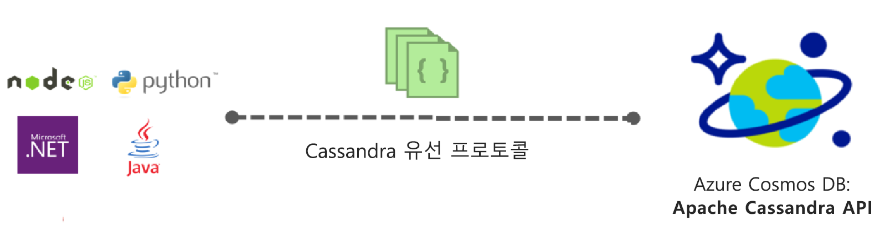
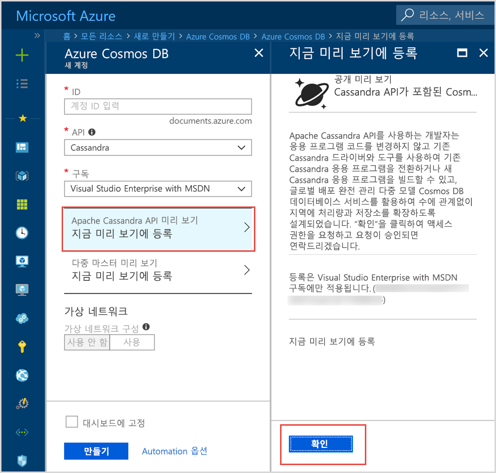

# Azure Cosmos DB 소개: Apache Cassandra API

Azure Cosmos DB는 다음과 같은 프리미엄 기능이 필요한, Apache Cassandra용으로 작성된 응용 프로그램을 위한 Cassandra API(미리 보기)를 제공합니다.

* [확장 가능한 저장소 크기 및 처리량](partition-data.md).
* [턴키 전역 배포](distribute-data-globally.md)
* 99번째 백분위수에서 1자리 밀리초 대기 시간
* [잘 정의된 5개의 일관성 수준](consistency-levels.md)
* 스키마 및 인덱스 관리를 다룰 필요가 없는 [자동 데이터 인덱싱](http://www.vldb.org/pvldb/vol8/p1668-shukla.pdf) 
* [업계 최고의 SLA](https://azure.microsoft.com/support/legal/sla/cosmos-db/)로 지원되는 고가용성 보장

## Azure Cosmos DB Apache Cassandra API란 무엇인가요?

Azure Cosmos DB는 Apache Cassandra API를 사용하여 [Apache Cassandra](https://cassandra.apache.org/)용으로 작성된 앱의 데이터 저장소로 사용할 수 있습니다. 이는 기존의 [CQLv4와 호환되는 Apache 라이선스 드라이버](https://cassandra.apache.org/doc/latest/getting_started/drivers.html?highlight=driver)를 사용하면 Cassandra용으로 작성된 응용 프로그램이 Azure Cosmos DB Cassandra API와 통신할 수 있음을 의미합니다. 많은 경우 연결 문자열을 변경하는 것만으로 Apache Cassandra를 사용하는 것에서 Azure Cosmos DB의 Apache Cassandra API를 사용하는 것으로 전환할 수 있습니다. 이 기능을 사용하면 친숙한 기술과 도구를 Cassandra API에 계속 사용하면서 Azure Cosmos DB의 전역 배포 및 [업계 최고의 포괄적 SLA](https://azure.microsoft.com/support/legal/sla/cosmos-db)로 Azure 클라우드에서 Cassandra API 데이터베이스 응용 프로그램을 쉽게 빌드하고 실행할 수 있습니다.

Cassandra API를 사용하면 이미 익숙한 Cassandra 쿼리 언어 기반 도구(예: CQLSH) 및 Cassandra 클라이언트 드라이버를 사용하여 Azure Cosmos DB에 저장된 데이터와 상호 작용할 수 있습니다. 수석 엔지니어링 매니저인 Kirill Gavrylyuk이 진행하는 Microsoft Mechanics 비디오에서 자세히 알아보세요.

> [!VIDEO https://www.youtube.com/embed/1Sf4McGN1AQ]
>

## Azure Cosmos DB용 Apache Cassandra API를 사용하는 이점은 무엇인가요?

**운영 관리 없음**: 완전한 관리 서비스인 Azure Cosmos DB를 사용하면 Cassandra API 관리자는 OS, JVM, yaml 파일 및 해당 상호 연동에서 무수한 설정을 관리하고 모니터링하는 것에 대해 걱정할 필요가 없습니다. Azure Cosmos DB는 처리량, 대기 시간, 저장소 및 가용성, 구성 가능한 경고에 대한 모니터링을 제공합니다. 

**성능 관리**: Azure Cosmos DB는 백분위수 99를 위한 짧은 대기 시간의 읽기 및 쓰기를 제공하며 SLA로 이를 지원합니다. 사용자는 양호한 읽기 및 쓰기 SLA를 제공하기 위한 과도한 운영 오버헤드에 대해 걱정할 필요가 없습니다. 여기에는 일반적으로 일정 압축, 삭제 표식 관리, 블룸 필터 설정 및 복제본 지연이 포함됩니다. Azure Cosmos DB에서는 이러한 문제를 관리해야 할 필요가 없으므로 응용 프로그램 전달에 집중할 수 있습니다.

**자동 인덱싱**: Azure Cosmos DB는 Cassandra API 데이터베이스의 모든 테이블 열을 자동으로 인덱싱합니다. Azure Cosmos DB는 쿼리 속도를 높이기 위해 보조 인덱스를 만들 필요가 없습니다. Azure Cosmos DB는 일관된 자동 인덱싱을 수행하는 한편 대기 시간이 짧은 읽기 및 쓰기 환경을 제공합니다. 

**기존 코드 및 도구 사용 가능**: Azure Cosmos DB는 기존 SDK 및 도구와 유선 프로토콜 수준의 호환성을 제공합니다. 이 호환성을 사용하면 간단한 변경 사항이 있는 Azure Cosmos DB의 Cassandra API와 함께 기존 코드베이스를 사용할 수 있습니다.

**처리량 및 저장소 탄력성**: Azure Cosmos 플랫폼은 간단한 포털, PowerShell 또는 CLI 작업을 통해 지역 전체에서 처리량이 보장되는 탄력성을 제공합니다. 응용 프로그램 증가에 따라 탄력적으로 Azure Cosmos DB 테이블을 확장하고 원활하게 예측 가능한 성능을 얻을 수 있습니다. Azure Cosmos DB는 거의 무제한으로 저장소 크기를 확장할 수 있는 Cassandra API 테이블을 지원합니다. 

**전역 배포 및 가용성**: Azure Cosmos DB는 가용성을 보장하면서 사용자에게 짧은 대기 시간 환경을 제공하여 Azure 지역 전체에 데이터를 배포할 수 있는 기능을 제공합니다. Azure Cosmos DB는 한 지역 내에서는 99.99% 가용성을 제공하고 전체 지역에서는 작업 오버헤드 없이 99.999% 읽기 가용성을 제공합니다. Azure Cosmos DB는 30개 이상의 [Azure 지역](https://azure.microsoft.com/regions/services/)에서 사용할 수 있습니다. [데이터를 글로벌 배포](distribute-data-globally.md)에 대한 자세한 정보 

**일관성 선택**: Azure Cosmos DB는 일관성과 성능 간에 최적의 절충을 실현할 수 있도록 잘 정의된 5가지 일관성 수준 옵션을 제공합니다. 이러한 일관성 수준은 강력, 제한된 부실, 세션, 일관된 접두사 및 최종입니다. 이러한 잘 정의된 세부적인 일관성 수준을 통해 개발자는 일관성, 가용성 및 대기 시간 간에 타당한 절충을 수행할 수 있습니다. [일관성 수준을 사용하여 가용성 및 성능 최대화](consistency-levels.md)에서 자세히 알아보세요. 

**엔터프라이즈 등급**: 기본적으로 보안 및 호환성이 보장되는 Azure Cosmos DB는 사용자가 규정 준수 문제를 염려하지 않고 플랫폼을 사용할 수 있도록 [규정 준수 인증](https://www.microsoft.com/trustcenter)을 제공합니다. Azure Cosmos DB는 또한 휴식 및 작동 시 암호화, IP 방화벽, 제어 영역 활동에 대한 감사 로그를 제공합니다.  

## 지금 등록하십시오. 

Azure 구독이 이미 있는 경우 [Azure Portal](https://aka.ms/cosmosdb-cassandra-signup)에서 등록하여 Cassandra API(미리 보기) 프로그램에 참여할 수 있습니다.  Azure를 처음 사용하는 경우 12개월 동안 Azure Cosmos DB에 무료로 액세스할 수 있는 [평가판](https://azure.microsoft.com/free)에 등록하세요. 다음 단계를 완료하여 Cassandra API(미리 보기) 프로그램에 대한 액세스를 요청하세요.

1. [Azure Portal](https://portal.azure.com)에서 **리소스 만들기** > **데이터베이스** > **Azure Cosmos DB**를 클릭합니다. 

2. 새 계정 페이지의 API 상자에서 **Cassandra**를 선택합니다. 

3. **구독** 상자에서 이 계정에 사용할 Azure 구독을 선택합니다.

4. **지금 미리 보기 등록**을 클릭합니다.

    

3. 지금 미리 보기 등록 창에서 **확인**을 클릭합니다. 

    요청을 제출하고 나면 새 계정 창에서 상태가 **승인 보류 중**으로 변경됩니다. 

요청을 제출한 후에는 요청이 승인되었다는 전자 메일 알림을 기다립니다. 요청이 많기 때문에 알림은 1주일 내로 받을 수 있습니다. 요청을 완료하기 위해 지원 티켓을 만들 필요는 없습니다. 요청은 받은 순서대로 검토됩니다. 

## 시작하는 방법
미리 보기 프로그램에 가입한 후에는 Cassandra API 빠른 시작에 따라 Cassandra API를 사용하여 앱을 만듭니다.

* [빠른 시작: Node.js 및 Azure Cosmos DB를 이용해 Cassandra 웹앱을 빌드합니다.](create-cassandra-nodejs.md)
* [빠른 시작: Java 및 Azure Cosmos DB를 이용해 Cassandra 웹앱을 빌드합니다.](create-cassandra-java.md)
* [빠른 시작: .NET 및 Azure Cosmos DB를 이용해 Cassandra 웹앱을 빌드합니다.](create-cassandra-dotnet.md)
* [빠른 시작: Python 및 Azure Cosmos DB를 이용해 Cassandra 웹앱을 빌드합니다.](create-cassandra-python.md)

## 다음 단계

Azure Cosmos DB Cassandra API에 대한 정보는 전체 Azure Cosmos DB 설명서에 통합되어 있지만 여기서는 시작하기 위한 몇 가지 사항을 다룹니다.

* [빠른 시작](create-cassandra-nodejs.md)의 지침에 따라 Git 샘플을 사용하여 계정 및 새 앱을 만듭니다.
* [자습서](tutorial-develop-cassandra-java.md)의 지침에 따라 프로그래밍 방식으로 새 앱을 만듭니다.
* [Cassandra 데이터 가져오기 자습서](cassandra-import-data.md)의 지침에 따라 기존 데이터를 Azure Cosmos DB로 가져옵니다.
* [FAQ](faq.md#cassandra)를 읽습니다.
