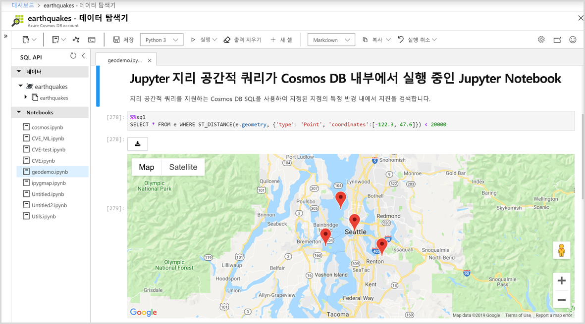

# Azure Cosmos DB에 기본 제공되는 Jupyter Notebook 지원

Jupyter Notebook은 라이브 코드, 수식, 시각화 및 내레이션 텍스트를 포함하는 문서를 만들고 공유할 수 있는 오픈 소스 웹 애플리케이션입니다. Azure Cosmos DB는 Cassandra, MongoDB, SQL, Gremlin 및 테이블과 같은 모든 API에 대하여 기본 제공되는 Jupyter Notebook을 지원합니다. 모든 Azure Cosmos DB API 및 데이터 모델에 대한 기본 제공 Notebook을 통해 대화형으로 쿼리를 실행할 수 있습니다. Jupyter Notebook은 Azure Cosmos 계정 내에서 실행되며, Jupyter Notebook을 통해 개발자는 데이터 탐색, 데이터 정리, 데이터 변환, 수치 시뮬레이션, 통계 모델링, 데이터 시각화 및 기계 학습을 수행할 수 있습니다.

Jupyter Notebook은 추가 명령을 지원하여 커널의 기능을 확장하는 매직 함수를 지원합니다. Cosmos 매직은 Jupyter Notebook에서 Python 커널의 기능을 확장하는 명령이기 때문에 Apache Spark 외에 Azure Cosmos SQL API 쿼리도 실행할 수 있습니다. 렌더링 명령과 통합된 풍부한 시각화 라이브러리를 사용하여 Python과 SQL API 쿼리를 쉽게 결합하여 데이터를 쿼리하고 시각화할 수 있습니다.
Azure Portal은 다음 이미지와 같이 Jupyter Notebook 환경을 Azure Cosmos 계정에 기본적으로 통합합니다.

## Jupyter Notebook의 이점

Jupyter Notebook은 원래 Python, R로 작성된 데이터 과학 애플리케이션용으로 개발되었지만 다음과 같은 다양한 종류의 프로젝트에 다양한 방식으로 사용될 수 있습니다.

* ***데이터 시각화:** Jupyter Notebook을 사용하면 일부 데이터 세트를 그래픽으로 렌더링하는 공유 노트북의 형태로 데이터를 시각화할 수 있습니다. Jupyter Notebook을 사용하면 시각화를 작성하여 공유할 수 있고, 공유 코드 및 데이터 세트에 대한 대화형 변경이 가능합니다.

* **코드 공유:** GitHub와 같은 서비스는 코드를 공유하는 방법을 제공하지만 대개 대화형이 아닙니다. Jupyter Notebook을 사용하면 코드를 살펴보고 실행할 수 있으며 결과를 Azure Portal에 직접 표시할 수 있습니다.

* **코드와 실시간 상호 작용:** Jupyter Notebook 코드는 동적입니다. 실시간으로 편집하고 증분 방식으로 다시 실행할 수 있습니다. Notebook에는 코드, 데모 또는 POC(개념 증명)의 입력 소스로 사용할 수 있는 사용자 정의 컨트롤(예: 슬라이더 또는 텍스트 입력 필드)도 포함할 수 있습니다.

* **코드 샘플 및 데이터 탐색 결과 문서화:** 코드 조각이 있고, Azure Cosmos DB에서 코드가 작동하는 방식을 라인 단위로 설명하면서 실시간 출력을 함께 포함하려면, Jupyter Notebook에 포함시키면 됩니다. 코드는 완전한 작동 상태로 유지됩니다. 문서화하면서 대화형 작업을 동시에 추가할 수 있습니다.

* **Cosmos 매직 명령:** Jupyter Notebook에서 Azure Cosmos DB에 대한 사용자 지정 매직 명령을 사용하여 대화형 컴퓨팅을 보다 쉽게 수행할 수 있습니다. 예를 들어 Notebook에서 직접 SQL API를 사용하여 Cosmos 컨테이너를 쿼리할 수 있는 %%sql 매직이 있습니다.

* **한 곳에 모두 있는 환경:** Jupyter Notebook은 코드, 서식 있는 텍스트, 이미지, 비디오, 애니메이션, 수학 방정식, 플롯, 지도, 대화형 그림, 위젯 및 그래픽 사용자 인터페이스를 단일 문서로 결합합니다.

## Jupyter Notebook의 구성 요소

Jupyter Notebook에는 여러 유형의 구성 요소가 포함될 수 있고, 각각은 개별 블록으로 구성됩니다.

* **텍스트 및 HTML:** HTML을 생성하기 위해 마크다운 구문에 주석이 달린 텍스트 또는 일반 텍스트를 언제든지 문서에 삽입할 수 있습니다. CSS 스타일링은 노트북을 생성하는 데 사용되는 템플릿에 추가되거나 인라인으로 포함될 수도 있습니다.

* **코드 및 출력:** Jupyter Notebook은 Python 코드를 지원합니다. 실행한 코드의 결과는 코드 블록 바로 뒤에 나타나며, 코드 블록을 원하는 순서대로 여러 번 실행할 수 있습니다.

* **시각화:** Matplotlib, Plotly 또는 Bokeh와 같은 모듈을 사용하여 코드에서 그래픽과 차트를 생성할 수 있습니다. 출력과 유사하게 이러한 시각화는 시각화를 생성하는 코드 옆에 인라인으로 나타납니다.

* **멀티미디어:** Jupyter Notebook은 웹 기술에 기반하기 때문에 웹 페이지에서 지원되는 모든 유형의 멀티미디어를 표시할 수 있습니다. 노트북에 HTML 요소로 포함하거나 `IPython.display` 모듈을 사용하여 프로그래밍 방식으로 생성할 수 있습니다.

* **데이터:** Azure Cosmos 컨테이너의 데이터와 쿼리 결과를 프로그래밍 방식으로 Jupyter Notebook에 가져올 수 있습니다. 예를 들어, Cosmos DB API 또는 기본적으로 제공되는 Apache Spark를 사용하여 데이터를 쿼리하도록 Notebook에 코드를 포함할 수 있습니다.

## 다음 단계

Azure Cosmos DB에 기본 제공되는 Jupyter 노트북을 시작하려면 다음 문서를 참조하세요.

* [Azure Cosmos 계정에서 Notebook 사용](enable-notebooks.md)
* [Notebook 기능 및 명령 사용](use-notebook-features-and-commands.md)

