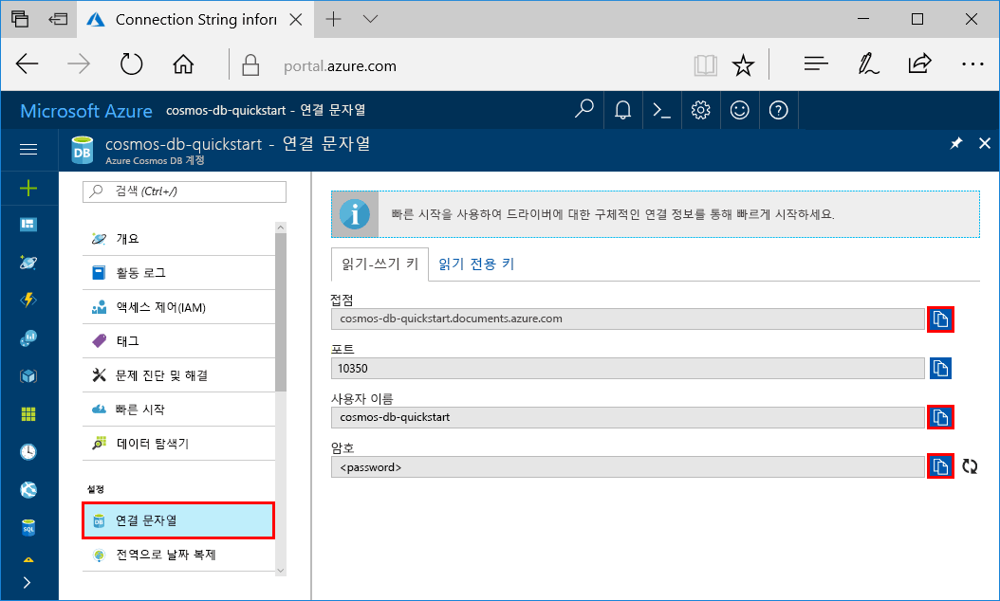
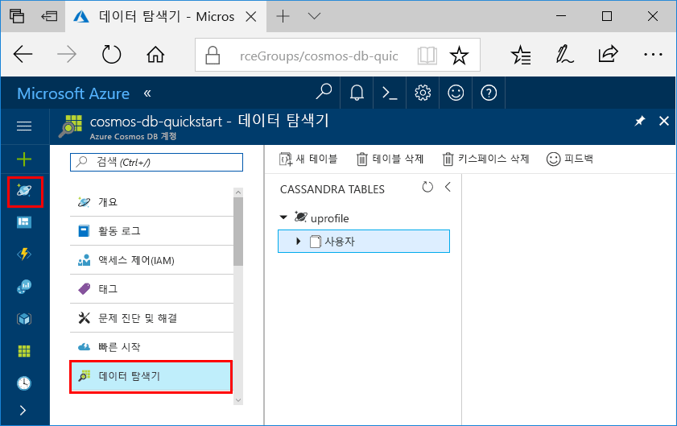

# <a name="quickstart-build-a-cassandra-app-with-net-sdk-and-azure-cosmos-db"></a>빠른 시작: .NET SDK 및 Azure Cosmos DB를 사용하여 Cassandra 앱 빌드

> [!div class="op_single_selector"]
> * [.NET](create-cassandra-dotnet.md)
> * [Java](create-cassandra-java.md)
> * [Node.JS](create-cassandra-nodejs.md)
> * [Python](create-cassandra-python.md)
>  

이 빠른 시작에서는 GitHub에서 예제를 복제하여 프로필 앱을 빌드하기 위해 .NET과 Azure Cosmos DB [Cassandra API](cassandra-introduction.md)를 사용하는 방법을 보여 줍니다. 또한 웹 기반 Azure Portal을 사용하여 Azure Cosmos DB 계정을 만드는 방법도 보여 줍니다.

Azure Cosmos DB는 전 세계에 배포된 Microsoft의 다중 모델 데이터베이스 서비스입니다. Azure Cosmos DB의 핵심인 전역 배포 및 수평적 크기 조정 기능의 이점을 활용하여 문서, 테이블, 키/값 및 그래프 데이터베이스를 빠르게 만들고 쿼리할 수 있습니다. 

## <a name="prerequisites"></a>필수 조건

[!INCLUDE [quickstarts-free-trial-note](../../includes/quickstarts-free-trial-note.md)] 또는 Azure 구독, 요금 및 약정 없이 [Azure Cosmos DB 평가판](https://azure.microsoft.com/try/cosmosdb/)을 사용할 수 있습니다.

또한 다음 항목도 필요합니다. 
* Visual Studio 2019가 아직 설치되지 않은 경우 **체험판** [Visual Studio 2019 Community Edition](https://www.visualstudio.com/downloads/)을 다운로드하고 사용할 수 있습니다. Visual Studio를 설치하는 동안 **Azure 개발**을 사용하도록 설정합니다.
* [Git](https://www.git-scm.com/)을 설치하여 예제를 복제합니다.

<a id="create-account"></a>
## <a name="create-a-database-account"></a>데이터베이스 계정 만들기

[!INCLUDE [cosmos-db-create-dbaccount-cassandra](../../includes/cosmos-db-create-dbaccount-cassandra.md)]


## <a name="clone-the-sample-application"></a>샘플 애플리케이션 복제

이제 코드 사용으로 전환해 보겠습니다. GitHub에서 Cassandra API 앱을 복제하고 연결 문자열을 설정한 다음 실행해 보겠습니다. 프로그래밍 방식으로 데이터를 사용하여 얼마나 쉽게 작업할 수 있는지 알게 될 것입니다. 

1. 명령 프롬프트를 엽니다. 이름이 `git-samples`인 새 폴더를 만듭니다. 그런 다음, 명령 프롬프트를 닫습니다.

    ```bash
    md "C:\git-samples"
    ```

2. Git Bash와 같은 Git 터미널 창을 열고, `cd` 명령을 사용하여 샘플 앱을 설치할 새 폴더로 변경합니다.

    ```bash
    cd "C:\git-samples"
    ```

3. 다음 명령을 실행하여 샘플 리포지토리를 복제합니다. 이 명령은 컴퓨터에서 샘플 앱의 복사본을 만듭니다.

    ```bash
    git clone https://github.com/Azure-Samples/azure-cosmos-db-cassandra-dotnet-getting-started.git
    ```

4. 그런 다음 Visual Studio에서 CassandraQuickStartSample 솔루션 파일을 엽니다. 

## <a name="review-the-code"></a>코드 검토

이 단계는 선택 사항입니다. 코드로 데이터베이스 리소스를 만드는 방법을 알아보려는 경우 다음 코드 조각을 검토할 수 있습니다. 이 코드 조각은 모두 `C:\git-samples\azure-cosmos-db-cassandra-dotnet-getting-started\CassandraQuickStartSample` 폴더에 설치된 `Program.cs` 파일에서 가져온 것입니다. 그렇지 않으면 [연결 문자열 업데이트](#update-your-connection-string)로 건너뛸 수 있습니다.

* Cassandra 클러스터 엔드포인트에 연결하여 세션을 초기화합니다. Azure Cosmos DB의 Cassandra API는 TLSv1.2만 지원합니다. 

  ```csharp
   var options = new Cassandra.SSLOptions(SslProtocols.Tls12, true, ValidateServerCertificate);
   options.SetHostNameResolver((ipAddress) => CassandraContactPoint);
   Cluster cluster = Cluster.Builder().WithCredentials(UserName, Password).WithPort(CassandraPort).AddContactPoint(CassandraContactPoint).WithSSL(options).Build();
   ISession session = cluster.Connect();
   ```

* 새 keyspace를 만듭니다.

    ```csharp
    session.Execute("CREATE KEYSPACE uprofile WITH REPLICATION = { 'class' : 'NetworkTopologyStrategy', 'datacenter1' : 1 };"); 
    ```

* 새 테이블을 만듭니다.

   ```csharp
  session.Execute("CREATE TABLE IF NOT EXISTS uprofile.user (user_id int PRIMARY KEY, user_name text, user_bcity text)");
   ```

* uprofile keyspace에 연결하는 새 세션과 함께 IMapper 개체를 사용하여 사용자 엔터티를 삽입합니다.

    ```csharp
    mapper.Insert<User>(new User(1, "LyubovK", "Dubai"));
    ```
    
* 모든 사용자 정보를 가져오기 위한 쿼리입니다.

    ```csharp
   foreach (User user in mapper.Fetch<User>("Select * from user"))
   {
      Console.WriteLine(user);
   }
    ```
    
* 단일 사용자 정보를 가져오기 위한 쿼리입니다.

    ```csharp
    mapper.FirstOrDefault<User>("Select * from user where user_id = ?", 3);
    ```

## <a name="update-your-connection-string"></a>연결 문자열 업데이트

이제 Azure Portal로 다시 이동하여 연결 문자열 정보를 가져와서 앱에 복사합니다. 연결 문자열 정보를 통해 앱이 호스트된 데이터베이스와 통신할 수 있습니다.

1. [Azure Portal](https://portal.azure.com/)에서 **연결 문자열**을 선택합니다.

    화면 오른쪽에 있는  단추를 사용하여 USERNAME 값을 복사합니다.

    

2. Visual Studio에서 Program.cs 파일을 엽니다. 

3. 포털의 USERNAME 값을 줄 13의 `<FILLME>`에 붙여넣습니다.

    이제 Program.cs의 줄 13은 다음과 같습니다. 

    `private const string UserName = "cosmos-db-quickstart";`

3. 포털로 돌아가서 PASSWORD 값을 복사합니다. 포털의 PASSWORD 값을 줄 14의 `<FILLME>`에 붙여넣습니다.

    이제 Program.cs의 줄 14는 다음과 같습니다. 

    `private const string Password = "2Ggkr662ifxz2Mg...==";`

4. 포털로 돌아가서 CONTACT POINT 값을 복사합니다. 포털의 CONTACT POINT 값을 줄 15의 `<FILLME>`에 붙여넣습니다.

    이제 Program.cs의 줄 15는 다음과 같습니다. 

    `private const string CassandraContactPoint = "cosmos-db-quickstarts.cassandra.cosmosdb.azure.com"; //  DnsName`

5. Program.cs 파일을 저장합니다.
    
## <a name="run-the-net-app"></a>.NET 앱 실행

1. Visual Studio에서 **도구** > **NuGet 패키지 관리자** > **패키지 관리자 콘솔**을 선택합니다.

2. 명령 프롬프트에서 다음 명령을 사용하여 .NET 드라이버의 NuGet 패키지를 설치합니다. 

    ```cmd
    Install-Package CassandraCSharpDriver
    ```
3. Ctrl+F5를 눌러 애플리케이션을 실행합니다. 앱이 콘솔 창에 표시됩니다. 

    

    프로그램 실행을 중지하고 콘솔 창을 닫으려면 CTRL+C를 누릅니다. 
    
4. Azure Portal에서 **데이터 탐색기**를 열어 이 새 데이터를 쿼리/수정/사용합니다.

    

## <a name="review-slas-in-the-azure-portal"></a>Azure Portal에서 SLA 검토

[!INCLUDE [cosmosdb-tutorial-review-slas](../../includes/cosmos-db-tutorial-review-slas.md)]

## <a name="clean-up-resources"></a>리소스 정리

[!INCLUDE [cosmosdb-delete-resource-group](../../includes/cosmos-db-delete-resource-group.md)]

## <a name="next-steps"></a>다음 단계

이 빠른 시작에서, Azure Cosmos DB 계정을 만들고, 데이터 탐색기를 사용하여 컨테이너를 만들고, 웹앱을 실행하는 방법을 알아보았습니다. 이제 사용자의 Cosmos DB 계정에 추가 데이터를 가져올 수 있습니다. 

> [!div class="nextstepaction"]
> [Azure Cosmos DB로 Cassandra 데이터 가져오기](cassandra-import-data.md)
