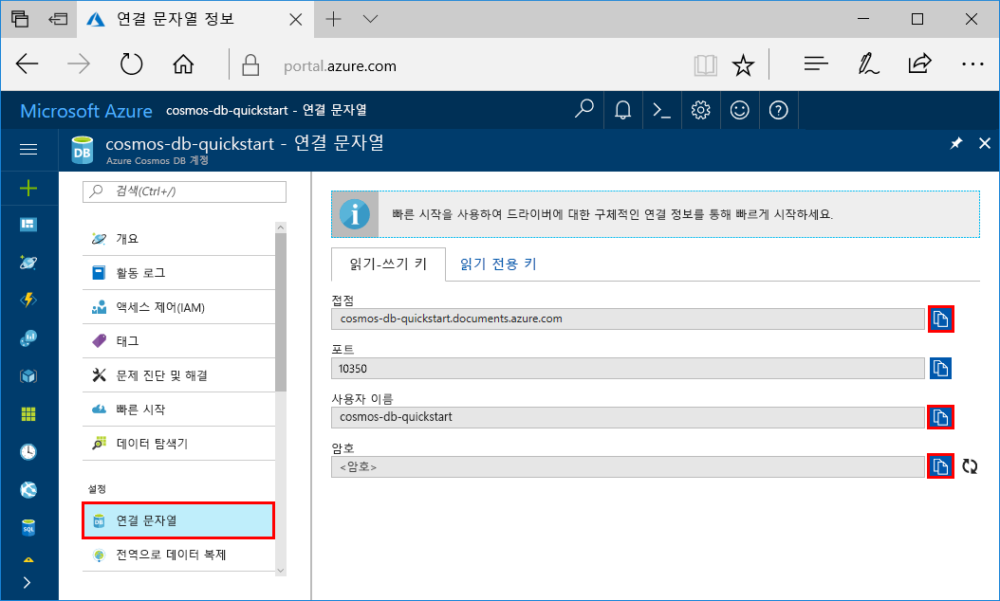
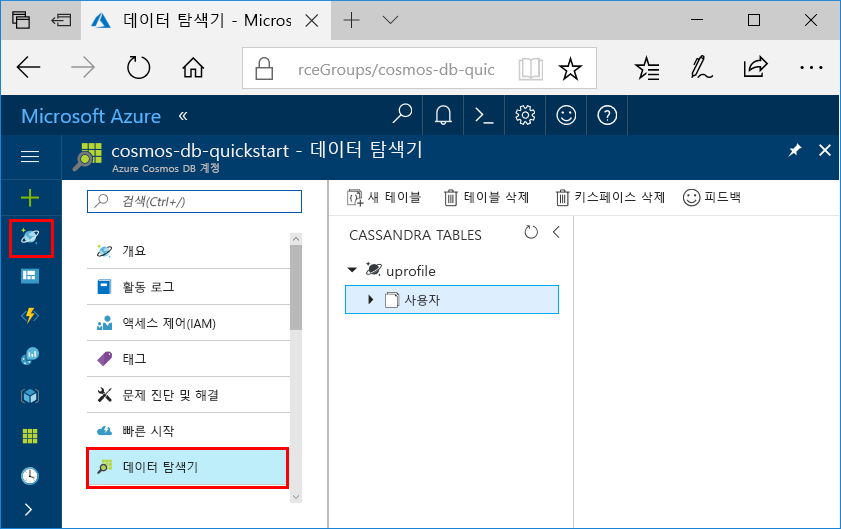

# <a name="quickstart-build-a-cassandra-app-with-java-sdk-and-azure-cosmos-db"></a>빠른 시작: Java SDK 및 Azure Cosmos DB를 사용하여 Cassandra 앱 빌드

> [!div class="op_single_selector"]
> * [.NET](create-cassandra-dotnet.md)
> * [Java](create-cassandra-java.md)
> * [Node.JS](create-cassandra-nodejs.md)
> * [Python](create-cassandra-python.md)
>  

이 빠른 시작은 GitHub에서 예제를 복제하여 프로필 앱을 빌드하기 위해 Java와 Azure Cosmos DB [Cassandra API](cassandra-introduction.md)를 사용하는 방법을 보여 줍니다. 또한 웹 기반 Azure Portal을 사용하여 Azure Cosmos DB 계정을 만드는 방법도 보여 줍니다.

Azure Cosmos DB는 전 세계에 배포된 Microsoft의 다중 모델 데이터베이스 서비스입니다. Azure Cosmos DB의 핵심인 전역 배포 및 수평적 크기 조정 기능의 이점을 활용하여 문서, 테이블, 키/값 및 그래프 데이터베이스를 빠르게 만들고 쿼리할 수 있습니다. 

## <a name="prerequisites"></a>필수 조건

[!INCLUDE [quickstarts-free-trial-note](../../includes/quickstarts-free-trial-note.md)] 또는 Azure 구독, 요금 및 약정 없이 [Azure Cosmos DB 평가판](https://azure.microsoft.com/try/cosmosdb/)을 사용할 수 있습니다.

또한 다음 항목도 필요합니다.

* [JDK(Java Development Kit) 버전 8](https://aka.ms/azure-jdks)
    * JAVA_HOME 환경 변수가 반드시 JDK가 설치된 폴더를 지정하도록 설정합니다.
* [Maven](https://maven.apache.org/) 이진 아카이브 [다운로드](https://maven.apache.org/download.cgi) 및 [설치](https://maven.apache.org/install.html)
    * Ubuntu에서 `apt-get install maven`을 실행하여 Maven을 실행할 수 있습니다.
* [Git](https://www.git-scm.com/)
    * Ubuntu에서 `sudo apt-get install git`를 실행하여 Git를 실행할 수 있습니다.

## <a name="create-a-database-account"></a>데이터베이스 계정 만들기

문서 데이터베이스를 만들려면 Azure Cosmos DB로 Cassandra 계정을 만들어야 합니다.

[!INCLUDE [cosmos-db-create-dbaccount-cassandra](../../includes/cosmos-db-create-dbaccount-cassandra.md)]

## <a name="clone-the-sample-application"></a>샘플 애플리케이션 복제

이제 코드 사용으로 전환해 보겠습니다. GitHub에서 Cassandra 앱을 복제하고 연결 문자열을 설정한 다음 실행해 보겠습니다. 프로그래밍 방식으로 데이터를 사용하여 얼마나 쉽게 작업할 수 있는지 알게 될 것입니다. 

1. 명령 프롬프트를 엽니다. 이름이 `git-samples`인 새 폴더를 만듭니다. 그런 다음, 명령 프롬프트를 닫습니다.

    ```bash
    md "C:\git-samples"
    ```

2. Git Bash와 같은 Git 터미널 창을 열고, `cd` 명령을 사용하여 샘플 앱을 설치할 새 폴더로 변경합니다.

    ```bash
    cd "C:\git-samples"
    ```

3. 다음 명령을 실행하여 샘플 리포지토리를 복제합니다. 이 명령은 컴퓨터에서 샘플 앱의 복사본을 만듭니다.

    ```bash
    git clone https://github.com/Azure-Samples/azure-cosmos-db-cassandra-java-getting-started.git
    ```

## <a name="review-the-code"></a>코드 검토

이 단계는 선택 사항입니다. 코드로 데이터베이스 리소스를 만드는 방법을 알아보려는 경우 다음 코드 조각을 검토할 수 있습니다. 그렇지 않으면 [연결 문자열 업데이트](#update-your-connection-string)로 건너뛸 수 있습니다. 이러한 코드 조각은 모두 `src/main/java/com/azure/cosmosdb/cassandra/util/CassandraUtils.java` 파일에서 가져옵니다.  

* Cassandra 호스트, 포트, 사용자 이름, 암호 및 SSL 옵션이 설정됩니다. 연결 문자열 정보는 Azure Portal의 연결 문자열 페이지에서 가져옵니다.

   ```java
   cluster = Cluster.builder().addContactPoint(cassandraHost).withPort(cassandraPort).withCredentials(cassandraUsername, cassandraPassword).withSSL(sslOptions).build();
   ```

* `cluster`가 Azure Cosmos DB Cassandra API에 연결되고 액세스할 세션을 반환합니다.

    ```java
    return cluster.connect();
    ```

다음 코드 조각은 `src/main/java/com/azure/cosmosdb/cassandra/repository/UserRepository.java` 파일에서 가져옵니다.

* 새 keyspace를 만듭니다.

    ```java
    public void createKeyspace() {
        final String query = "CREATE KEYSPACE IF NOT EXISTS uprofile WITH replication = {'class': 'SimpleStrategy', 'replication_factor': '3' } ";
        session.execute(query);
        LOGGER.info("Created keyspace 'uprofile'");
    }
    ```

* 새 테이블을 만듭니다.

   ```java
   public void createTable() {
        final String query = "CREATE TABLE IF NOT EXISTS uprofile.user (user_id int PRIMARY KEY, user_name text, user_bcity text)";
        session.execute(query);
        LOGGER.info("Created table 'user'");
   }
   ```

* 준비 문 개체를 사용하여 사용자 엔터티를 삽입합니다.

    ```java
    public PreparedStatement prepareInsertStatement() {
        final String insertStatement = "INSERT INTO  uprofile.user (user_id, user_name , user_bcity) VALUES (?,?,?)";
        return session.prepare(insertStatement);
    }

    public void insertUser(PreparedStatement statement, int id, String name, String city) {
        BoundStatement boundStatement = new BoundStatement(statement);
        session.execute(boundStatement.bind(id, name, city));
    }
    ```

* 모든 사용자 정보를 얻기 위한 쿼리입니다.

    ```java
   public void selectAllUsers() {
        final String query = "SELECT * FROM uprofile.user";
        List<Row> rows = session.execute(query).all();

        for (Row row : rows) {
            LOGGER.info("Obtained row: {} | {} | {} ", row.getInt("user_id"), row.getString("user_name"), row.getString("user_bcity"));
        }
    }
    ```

* 단일 사용자 정보를 가져오기 위한 쿼리입니다.

    ```java
    public void selectUser(int id) {
        final String query = "SELECT * FROM uprofile.user where user_id = 3";
        Row row = session.execute(query).one();

        LOGGER.info("Obtained row: {} | {} | {} ", row.getInt("user_id"), row.getString("user_name"), row.getString("user_bcity"));
    }
    ```

## <a name="update-your-connection-string"></a>연결 문자열 업데이트

이제 Azure Portal로 다시 이동하여 연결 문자열 정보를 가져와서 앱에 복사합니다. 연결 문자열 세부 정보를 통해 앱이 호스트된 데이터베이스와 통신할 수 있습니다.

1. [Azure Portal](https://portal.azure.com/)에서 **연결 문자열**을 선택합니다. 

    

2. 화면 오른쪽에 있는  단추를 사용하여 CONTACT POINT 값을 복사합니다.

3. `C:\git-samples\azure-cosmosdb-cassandra-java-getting-started\java-examples\src\main\resources` 폴더에서 `config.properties` 파일을 엽니다. 

3. 포털의 CONTACT POINT 값을 줄 2의 `<Cassandra endpoint host>`에 붙여넣습니다.

    config.properties의 줄 2가 다음과 비슷하게 보입니다. 

    `cassandra_host=cosmos-db-quickstart.cassandra.cosmosdb.azure.com`

3. 포털로 돌아가서 USERNAME 값을 복사합니다. 포털의 USERNAME 값을 줄 4의 `<cassandra endpoint username>`에 붙여넣습니다.

    config.properties의 줄 4가 다음과 유사하게 나타납니다. 

    `cassandra_username=cosmos-db-quickstart`

4. 포털로 돌아가서 PASSWORD 값을 복사합니다. 포털의 PASSWORD 값을 줄 5의 `<cassandra endpoint password>`에 붙여넣습니다.

    config.properties의 줄 5가 다음과 유사하게 나타납니다. 

    `cassandra_password=2Ggkr662ifxz2Mg...==`

5. 줄 6에서 특정 SSL 인증서를 사용하려면 `<SSL key store file location>`을 SSL 인증서의 위치로 바꿉니다. 값을 제공하지 않으면 <JAVA_HOME>/jre/lib/security/cacerts에 설치된 JDK 인증서가 사용됩니다. 

6. 특정 SSL 인증서를 사용하기 위해 줄 6을 변경한 경우 줄 7을 업데이트하여 해당 인증서의 암호를 사용합니다. 

7. `config.properties` 파일을 저장합니다.

## <a name="run-the-java-app"></a>Java 앱 실행

1. Git 터미널 창에서 `azure-cosmosdb-cassandra-java-getting-started\java-examples` 폴더로 `cd`합니다.

    ```git
    cd "C:\git-samples\azure-cosmosdb-cassandra-java-getting-started\java-examples"
    ```

2. Git 터미널 창에서 다음 명령을 사용하여 `cosmosdb-cassandra-examples.jar` 파일을 생성합니다.

    ```git
    mvn clean install
    ```

3. git 터미널 창에서 다음 명령을 실행하여 Java 애플리케이션을 시작합니다.

    ```git
    java -cp target/cosmosdb-cassandra-examples.jar com.azure.cosmosdb.cassandra.examples.UserProfile
    ```

    터미널 창에 키스페이스와 테이블이 작성되었다는 알림이 표시됩니다. 그런 다음, 테이블의 모든 사용자를 선택하여 반환하고 출력을 표시한 후 ID로 행을 선택하고 값을 표시합니다.  

    프로그램 실행을 중지하고 콘솔 창을 닫으려면 CTRL+C를 누릅니다.

4. Azure Portal에서 **데이터 탐색기**를 열어 이 새 데이터를 쿼리/수정/사용합니다. 

    

## <a name="review-slas-in-the-azure-portal"></a>Azure Portal에서 SLA 검토

[!INCLUDE [cosmosdb-tutorial-review-slas](../../includes/cosmos-db-tutorial-review-slas.md)]

## <a name="clean-up-resources"></a>리소스 정리

[!INCLUDE [cosmosdb-delete-resource-group](../../includes/cosmos-db-delete-resource-group.md)]

## <a name="next-steps"></a>다음 단계

이 빠른 시작에서는 데이터 탐색기를 사용하여 Azure Cosmos DB 계정, Cassandra 데이터베이스, 컨테이너를 만들고, 프로그래밍 방법으로 같은 작업을 수행하도록 앱을 실행하는 방법을 알아보았습니다. 이제 Azure Cosmos DB 컨테이너에 추가 데이터를 가져올 수 있습니다. 

> [!div class="nextstepaction"]
> [Azure Cosmos DB로 Cassandra 데이터 가져오기](cassandra-import-data.md)
