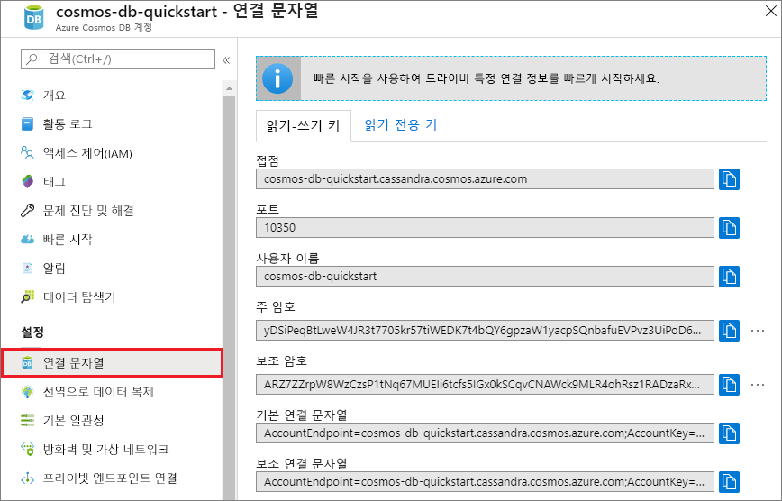
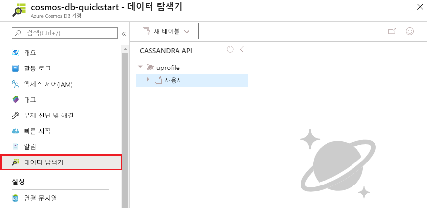

# <a name="quickstart-build-a-cassandra-app-with-python-and-azure-cosmos-db"></a>빠른 시작: Python 및 Azure Cosmos DB를 사용하여 Cassandra 앱 빌드

이 빠른 시작은 GitHub에서 예제를 복제하여 프로필 앱을 빌드하기 위해 Python과 Azure Cosmos DB [Cassandra API](cassandra-introduction.md)를 사용하는 방법을 보여줍니다. 이 빠른 시작에서는 또한 웹 기반 Azure Portal을 사용하여 Azure Cosmos DB 계정을 만드는 과정을 안내합니다.

Azure Cosmos DB는 전 세계에 배포된 Microsoft의 다중 모델 데이터베이스 서비스입니다. Azure Cosmos DB의 핵심인 전역 배포 및 수평적 크기 조정 기능의 이점을 활용하여 문서, 테이블, 키/값 및 그래프 데이터베이스를 빠르게 만들고 쿼리할 수 있습니다.   

## <a name="prerequisites"></a>필수 조건

[!INCLUDE [quickstarts-free-trial-note](../../includes/quickstarts-free-trial-note.md)] 또는 Azure 구독, 요금 및 약정 없이 [Azure Cosmos DB 평가판](https://azure.microsoft.com/try/cosmosdb/)을 사용할 수 있습니다.

Azure Cosmos DB Cassandra API 미리 보기 프로그램에 액세스합니다. 아직 액세스를 신청하지 않은 경우 [지금 등록하세요](cassandra-introduction.md#sign-up-now).

또한,
* [Python](https://www.python.org/downloads/) 버전 v2.7.14
* [Git](http://git-scm.com/)
* [Apache Cassandra용 Python 드라이버](https://github.com/datastax/python-driver)

## <a name="create-a-database-account"></a>데이터베이스 계정 만들기

문서 데이터베이스를 만들려면 Azure Cosmos DB로 Cassandra 계정을 만들어야 합니다.

[!INCLUDE [cosmos-db-create-dbaccount-cassandra](../../includes/cosmos-db-create-dbaccount-cassandra.md)]

## <a name="clone-the-sample-application"></a>샘플 응용 프로그램 복제

이제 github에서 Cassandra API 앱을 복제하고 연결 문자열을 설정한 다음 실행해 보겠습니다. 프로그래밍 방식으로 데이터를 사용하여 얼마나 쉽게 작업할 수 있는지 알게 될 것입니다. 

1. 명령 프롬프트를 git-samples라는 새 폴더를 만든 다음 명령 프롬프트를 닫습니다.

    ```bash
    md "C:\git-samples"
    ```

2. Git Bash와 같은 Git 터미널 창을 열고, `cd` 명령을 사용하여 샘플 앱을 설치할 새 폴더로 변경합니다.

    ```bash
    cd "C:\git-samples"
    ```

3. 다음 명령을 실행하여 샘플 리포지토리를 복제합니다. 이 명령은 컴퓨터에서 샘플 앱의 복사본을 만듭니다.

    ```bash
    git clone https://github.com/Azure-Samples/azure-cosmos-db-cassandra-python-getting-started.git
    ```

## <a name="review-the-code"></a>코드 검토

이 단계는 선택 사항입니다. 데이터베이스 리소스를 코드로 만드는 방법을 알아보려는 경우 다음 코드 조각을 검토할 수 있습니다. 코드 조각은 모두 pyquickstart.py 파일에서 가져옵니다. 그렇지 않으면 [연결 문자열 업데이트](#update-your-connection-string)로 건너뛸 수 있습니다. 

* 사용자 이름 및 암호는 Azure Portal에서 연결 문자열 페이지를 통해 설정됩니다. path\to\cert를 X509 인증서 경로로 바꿉니다.

   ```python
    ssl_opts = {
            'ca_certs': 'path\to\cert',
            'ssl_version': ssl.PROTOCOL_TLSv1_2
            }
    auth_provider = PlainTextAuthProvider( username=cfg.config['username'], password=cfg.config['password'])
    cluster = Cluster([cfg.config['contactPoint']], port = cfg.config['port'], auth_provider=auth_provider, ssl_options=ssl_opts)
    session = cluster.connect()
   
   ```

* `cluster`는 contactPoint 정보를 사용하여 초기화됩니다. contactPoint는 Azure Portal에서 검색됩니다.

    ```python
   cluster = Cluster([cfg.config['contactPoint']], port = cfg.config['port'], auth_provider=auth_provider)
    ```

* `cluster`는 Azure Cosmos DB Cassandra API에 연결됩니다.

    ```python
    session = cluster.connect()
    ```

* 새 keyspace가 생성됩니다.

    ```python
   session.execute('CREATE KEYSPACE IF NOT EXISTS uprofile WITH replication = {\'class\': \'NetworkTopologyStrategy\', \'datacenter1\' : \'1\' }')
    ```

* 새 테이블이 생성됩니다.

   ```
   session.execute('CREATE TABLE IF NOT EXISTS uprofile.user (user_id int PRIMARY KEY, user_name text, user_bcity text)');
   ```

* 키/값 엔터티가 삽입됩니다.

    ```Python
    insert_data = session.prepare("INSERT INTO  uprofile.user  (user_id, user_name , user_bcity) VALUES (?,?,?)")
    batch = BatchStatement()
    batch.add(insert_data, (1, 'LyubovK', 'Dubai'))
    batch.add(insert_data, (2, 'JiriK', 'Toronto'))
    batch.add(insert_data, (3, 'IvanH', 'Mumbai'))
    batch.add(insert_data, (4, 'YuliaT', 'Seattle'))
    ....
    session.execute(batch)
    ```

* 모든 키 값을 가져오는 쿼리입니다.

    ```Python
    rows = session.execute('SELECT * FROM uprofile.user')
    ```  
    
* 키 값을 가져오는 쿼리입니다.

    ```Python
    
    rows = session.execute('SELECT * FROM uprofile.user where user_id=1')
    ```  

## <a name="update-your-connection-string"></a>연결 문자열 업데이트

이제 Azure Portal로 다시 이동하여 연결 문자열 정보를 가져와서 앱에 복사합니다. 이를 통해 앱이 호스팅된 데이터베이스와 통신할 수 있게 됩니다.

1. [Azure Portal](http://portal.azure.com/)에서 **연결 문자열**을 클릭합니다. 

    화면 오른쪽에 있는  화면 오른쪽에 있는 단추를 사용하여 상위 값인 CONTACT POINT 값을 복사합니다.

    

2. `config.py` 파일을 엽니다. 

3. 포털의 CONTACT POINT 값을 줄 10의 `<FILLME>`에 붙여넣습니다.

    줄 10은 다음과 같이 보일 것입니다. 

    `'contactPoint': 'cosmos-db-quickstarts.cassandra.cosmosdb.azure.com:10350'`

4. 포털의 USERNAME 값을 복사하여 줄 6의 `<FILLME>`에 붙여넣습니다.

    줄 6은 다음과 같이 보일 것입니다. 

    `'username': 'cosmos-db-quickstart',`
    
5. 포털의 PASSWORD 값을 복사하여 줄 8의 `<FILLME>`에 붙여넣습니다.

    줄 8은 다음과 같이 보일 것입니다.

    `'password' = '2Ggkr662ifxz2Mg==`';`

6. config.py 파일을 저장합니다.
    
## <a name="use-the-x509-certificate"></a>X509 인증서 사용

1. Baltimore CyberTrust Root를 추가해야 하는 경우 일련 번호는 02:00:00:b9이고, SHA1 지문은 d4🇩🇪20:d0:5e:66:fc:53:fe:1a:50:88:2c:78:db:28:52:ca:e4:74입니다. https://cacert.omniroot.com/bc2025.crt에서 다운로드하고 확장명이 .cer인 로컬 파일에 저장할 수 있습니다.

2. pyquickstart.py를 열고 새 인증서를 가리키도록 'path\to\cert'를 변경합니다.

3. pyquickstart.py를 저장합니다.

## <a name="run-the-app"></a>앱 실행

1. git 터미널에서 cd 명령을 사용하여 azure-cosmos-db-cassandra-python-getting-started 폴더로 변경합니다. 

2. 다음 명령을 실행하여 필요한 모듈을 설치합니다.

    ```python
    python -m pip install cassandra-driver
    python -m pip install prettytable
    python -m pip install requests
    python -m pip install pyopenssl
    ```

2. 다음 명령을 실행하여 노드 응용 프로그램을 시작합니다.

    ```
    python pyquickstart.py
    ```

3. 명령줄에서 예상대로 결과가 나타나는지 확인하세요.

    프로그램 실행을 중지하고 콘솔 창을 닫으려면 CTRL + C를 누릅니다. 

    
    
    이제 Azure Portal에서 데이터 탐색기를 열어 쿼리를 보고 수정하고 이 새로운 데이터로 작업할 수 있습니다. 

    

## <a name="review-slas-in-the-azure-portal"></a>Azure Portal에서 SLA 검토

[!INCLUDE [cosmosdb-tutorial-review-slas](../../includes/cosmos-db-tutorial-review-slas.md)]

## <a name="clean-up-resources"></a>리소스 정리

[!INCLUDE [cosmosdb-delete-resource-group](../../includes/cosmos-db-delete-resource-group.md)]

## <a name="next-steps"></a>다음 단계

이 빠른 시작에서, Azure Cosmos DB 계정을 만들고, 데이터 탐색기를 사용하여 컨테이너를 만들고, 앱을 실행하는 방법을 알아보았습니다. 이제 사용자의 Cosmos DB 계정에 추가 데이터를 가져올 수 있습니다. 

> [!div class="nextstepaction"]
> [Azure Cosmos DB로 Cassandra 데이터 가져오기](cassandra-import-data.md)

