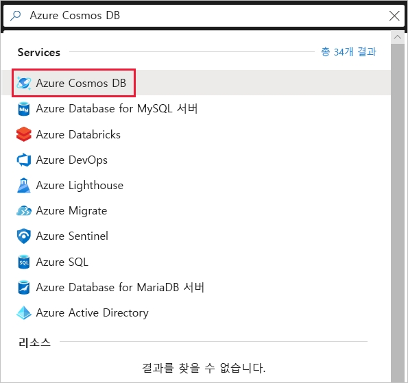
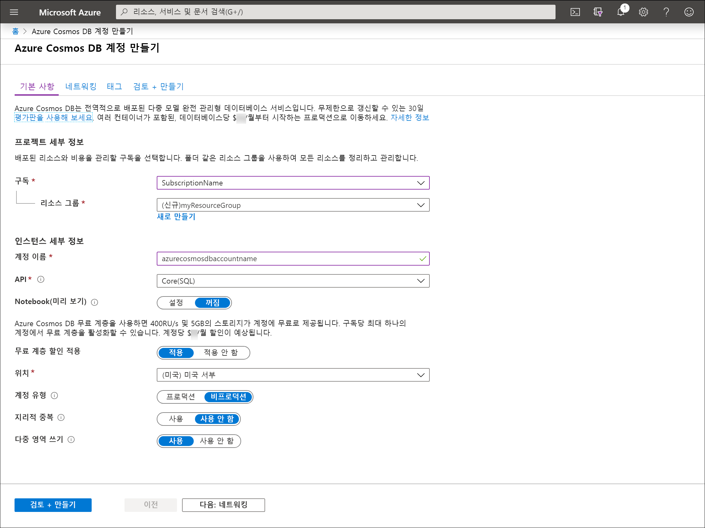
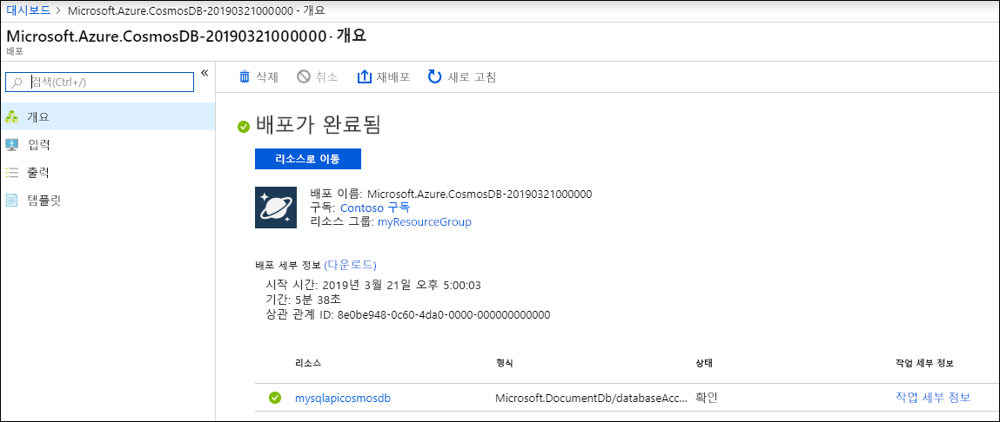

# <a name="quickstart-create-an-azure-cosmos-account-database-container-and-items-from-the-azure-portal"></a>빠른 시작: Azure Portal에서 Azure Cosmos 계정, 데이터베이스, 컨테이너 및 항목 만들기

> [!div class="op_single_selector"]
> * [Azure Portal](create-cosmosdb-resources-portal.md)
> * [.NET](create-sql-api-dotnet.md)
> * [Java](create-sql-api-java.md)
> * [Node.JS](create-sql-api-nodejs.md)
> * [Python](create-sql-api-python.md)
> * [Xamarin](create-sql-api-xamarin-dotnet.md)
>  

Azure Cosmos DB는 전 세계에 배포된 Microsoft의 다중 모델 데이터베이스 서비스입니다. Azure Cosmos DB를 사용하여 Azure Cosmos DB의 핵심인 글로벌 배포 및 수평적 크기 조정 기능의 이점을 활용하는 키/값 데이터베이스, 문서 데이터베이스 및 그래프 데이터베이스를 빠르게 만들고 쿼리할 수 있습니다. 

이 빠른 시작에서는 Azure Portal을 사용하여 Azure Cosmos DB [SQL API](sql-api-introduction.md) 계정, 문서 데이터베이스 및 컨테이너를 만들고 컨테이너에 데이터를 추가하는 방법을 보여줍니다. 

## <a name="prerequisites"></a>사전 요구 사항

Azure 구독 또는 Azure Cosmos DB 체험 계정
- [!INCLUDE [quickstarts-free-trial-note](../../includes/quickstarts-free-trial-note.md)] 

- [!INCLUDE [cosmos-db-emulator-docdb-api](../../includes/cosmos-db-emulator-docdb-api.md)]  

<a id="create-account"></a>
## <a name="create-an-azure-cosmos-db-account"></a>Azure Cosmos DB 계정 만들기

[Azure Portal](https://portal.azure.com/)로 이동하여 Azure Cosmos DB 계정을 만듭니다. **Azure Cosmos DB**를 검색하여 선택합니다.

   

1. **추가**를 선택합니다.
1. **Azure Cosmos DB 계정 만들기** 페이지에서 새 Azure Cosmos 계정에 대한 기본 설정을 입력합니다. 

    |설정|값|Description |
    |---|---|---|
    |Subscription|구독 이름|이 Azure Cosmos 계정에 사용하려는 Azure 구독을 선택합니다. |
    |리소스 그룹|리소스 그룹 이름|리소스 그룹을 선택하거나 **새로 만들기**를 선택한 후, 새 리소스 그룹에 고유한 이름을 입력합니다. |
    |계정 이름|고유한 이름|Azure Cosmos 계정을 식별하는 이름을 입력합니다. URI를 만들기 위해 제공하는 이름에 *documents.azure.com*이 추가되므로 고유한 이름을 사용합니다.<br><br>이름은 소문자, 숫자 및 하이픈(-) 문자만 포함할 수 있으며, 3~31자여야 합니다.|
    |API|만들 계정 형식|**Core(SQL)** 를 선택하여 문서 데이터베이스를 만들고 SQL 구문을 사용하여 쿼리합니다. <br><br>API는 만들 계정의 형식을 결정합니다. Azure Cosmos DB는 문서 데이터용 Core(SQL) 및 MongoDB, 그래프 데이터용 Gremlin, Azure Table 및 Cassandra, 이렇게 5가지 API를 제공합니다. 현재 각 API에 대한 별도의 계정을 만들어야 합니다. <br><br>[SQL API에 대한 자세한 정보](introduction.md)|
    |체험 계층 할인 적용|적용 또는 적용 안 함|Azure Cosmos DB 체험 계층을 사용하는 경우 처음에는 400RU/초 및 5GB의 스토리지가 계정에 무료로 제공됩니다. [체험 계층](https://azure.microsoft.com/pricing/details/cosmos-db/)에 대해 자세히 알아보세요.|
    |위치|사용자와 가장 가까운 지역|Azure Cosmos DB 계정을 호스트할 지리적 위치를 선택합니다. 데이터에 가장 빨리 액세스할 수 있도록 사용자와 가장 가까운 위치를 사용합니다.|
    |계정 유형|프로덕션 또는 비프로덕션|계정이 프로덕션 워크로드에 사용되는 경우 **프로덕션**을 선택합니다. 계정이 비프로덕션(예: 개발, 테스트, QA 또는 준비)에 사용되는 경우 **비프로덕션**을 선택합니다. 이는 포털 환경을 조정하지만 기본 Azure Cosmos DB 계정에는 영향을 주지 않는 Azure 리소스 태그 설정입니다. 이 값은 언제든지 변경할 수 있습니다.|


> [!NOTE]
> Azure 구독당 최대 1개의 체험 계층 Azure Cosmos DB 계정을 사용할 수 있으며 계정을 만들 때 옵트인해야 합니다. 체험 계층 할인을 적용하는 옵션이 표시되지 않으면 구독의 다른 계정에서 이미 체험 계층을 사용하도록 설정되었음을 의미합니다.
   
   

1. **검토 + 만들기**를 선택합니다. **네트워크** 및 **태그** 섹션은 건너뛰어도 됩니다.

1. 계정 설정을 검토한 다음, **만들기**를 선택합니다. 계정을 만드는 데 몇 분이 걸립니다. 포털 페이지에 **배포가 완료됨**이 표시되기를 기다립니다. 

    

1. **리소스로 이동**을 선택하여 Azure Cosmos DB 계정 페이지로 이동합니다. 

    

<a id="create-container-database"></a>
## <a name="add-a-database-and-a-container"></a>데이터베이스 및 컨테이너 추가 

Azure Portal에서 데이터 탐색기를 사용하여 데이터베이스와 컨테이너를 만들 수 있습니다. 

1.  Azure Cosmos DB 계정 페이지의 왼쪽 탐색 모음에서 **Data Explorer**를 선택한 다음, **새 컬렉션**을 선택합니다. 
    
    **컨테이너 추가** 창을 보려면 오른쪽으로 스크롤해야 할 수도 있습니다.
    
    
    
1.  **컨테이너 추가** 창에서 새 컨테이너의 설정을 입력합니다.
    
    |설정|제안 값|Description
    |---|---|---|
    |**데이터베이스 ID**|ToDoList|새 데이터베이스의 이름으로 *ToDoList*를 입력합니다. 데이터베이스 이름은 1~255자여야 하며, `/, \\, #, ?` 또는 후행 공백은 포함할 수 없습니다. **데이터베이스 처리량 프로비전** 옵션을 선택합니다. 그러면 데이터베이스에 프로비저닝된 처리량을 데이터베이스 내 모든 컨테이너가 공유할 수 있습니다. 이 옵션은 비용 절감에도 도움이 됩니다. |
    |**처리량**|400|처리량을 400 RU/s(초당 요청 단위)로 유지합니다. 대기 시간을 줄이면 나중에 처리량을 늘릴 수 있습니다.| 
    |**컨테이너 ID**|Items|새 컨테이너의 이름으로 *Items*를 입력합니다. 컨테이너 ID에는 데이터베이스 이름과 동일한 문자 요구 사항이 적용됩니다.|
    |**파티션 키**| /category| 이 문서에 설명된 샘플은 파티션 키로 */category*를 사용합니다.|

    
    이 예제의 경우 **고유 키**를 추가하지 마세요. 고유 키를 사용하면 분할 키당 하나 이상의 값의 고유성을 보장하여 데이터베이스에 데이터 무결성 레이어를 추가할 수 있습니다. 자세한 내용은 [Azure Cosmos DB의 고유 키](unique-keys.md)를 참조하세요.
    
1.  **확인**을 선택합니다. Data Explorer가 새 데이터베이스와 앞에서 만든 컨테이너를 표시합니다.

## <a name="add-data-to-your-database"></a>데이터베이스에 데이터 추가

데이터 탐색기를 사용하여 새 데이터베이스에 데이터를 추가합니다.

1. **Data Explorer**에서 **ToDoList** 데이터베이스를 확장하고 **Items** 컨테이너를 확장합니다. 다음으로, **항목**을 선택한 다음, **새 항목**을 선택합니다. 
   
   
   
1. 다음 구조를 **문서** 창 오른쪽의 문서에 추가합니다.

     ```json
     {
         "id": "1",
         "category": "personal",
         "name": "groceries",
         "description": "Pick up apples and strawberries.",
         "isComplete": false
     }
     ```

1. **저장**을 선택합니다.
   
   
   
1. **새 문서**를 다시 선택하고 고유한 `id`의 다른 문서를 만들고 저장한 다음, 원하는 다른 속성 및 값을 지정합니다. Azure Cosmos DB가 데이터에 어떠한 스키마도 적용하지 않으므로 해당 문서는 사용자가 원하는 어떠한 구조든 가질 수 있습니다.

## <a name="query-your-data"></a>데이터 쿼리

[!INCLUDE [cosmos-db-create-sql-api-query-data](../../includes/cosmos-db-create-sql-api-query-data.md)] 

## <a name="clean-up-resources"></a>리소스 정리

[!INCLUDE [cosmosdb-delete-resource-group](../../includes/cosmos-db-delete-resource-group.md)]

데이터베이스만 삭제하고 나중에 Azure Cosmos 계정을 사용하려면 다음 단계에 따라 데이터베이스를 삭제할 수 있습니다.

* Azure Cosmos 계정으로 이동합니다.
* **데이터 탐색기**를 열고, 마우스 오른쪽 단추로 삭제할 데이터베이스를 클릭하고, **데이터베이스 삭제**를 선택합니다.
* 데이터베이스 ID/데이터베이스 이름을 입력하여 삭제 작업을 확인합니다. 

## <a name="next-steps"></a>다음 단계

이 빠른 시작에서는 Azure Cosmos DB 계정을 만들고, 데이터 탐색기를 사용하여 데이터베이스 및 컨테이너를 만드는 방법을 알아보았습니다. 이제 사용자의 Azure Cosmos DB 계정에 추가 데이터를 가져올 수 있습니다. 

> [!div class="nextstepaction"]
> [Azure Cosmos DB로 데이터 가져오기](import-data.md)
