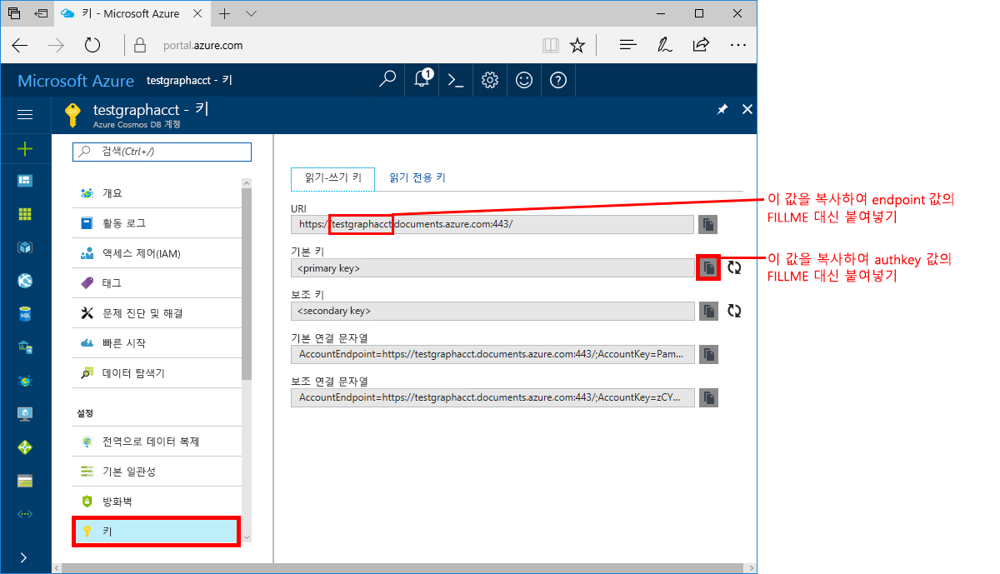

# <a name="azure-cosmos-db-build-a-net-application-using-the-graph-api"></a>Azure Cosmos DB: Graph API를 사용하여 .NET 응용 프로그램 빌드

Azure Cosmos DB는 전 세계에 배포된 Microsoft의 다중 모델 데이터베이스 서비스입니다. Azure Cosmos DB의 핵심인 전역 배포 및 수평적 크기 조정 기능의 이점을 활용하여 문서, 키/값 및 그래프 데이터베이스를 빠르게 만들고 쿼리할 수 있습니다. 

이 빠른 시작에서는 Azure Portal을 사용하여 Azure Cosmos DB 계정, 데이터베이스 및 그래프(컨테이너)를 만드는 방법을 보여 줍니다. 그런 다음, [Graph API](graph-sdk-dotnet.md)(미리 보기)에서 작성한 콘솔 앱을 빌드 및 실행합니다.  

## <a name="prerequisites"></a>필수 조건

Visual Studio 2017이 아직 설치되지 않은 경우 **체험판** [Visual Studio 2017 Community Edition](https://www.visualstudio.com/downloads/)을 다운로드하고 사용할 수 있습니다. Visual Studio를 설정하는 동안 **Azure 개발**을 사용할 수 있는지 확인합니다.

[!INCLUDE [quickstarts-free-trial-note](../../includes/quickstarts-free-trial-note.md)]

## <a name="create-a-database-account"></a>데이터베이스 계정 만들기

[!INCLUDE [cosmosdb-create-dbaccount-graph](../../includes/cosmosdb-create-dbaccount-graph.md)]

## <a name="add-a-graph"></a>그래프 추가

[!INCLUDE [cosmosdb-create-graph](../../includes/cosmosdb-create-graph.md)]

## <a name="add-sample-data"></a>샘플 데이터 추가

이제 데이터 탐색기를 사용하여 그래프에 데이터를 추가할 수 있습니다.

1. 데이터 탐색기에서 **sample-database**, **sample-graph**를 확장하고, **그래프**를 클릭한 다음 **새 꼭짓점** 및 **새 에지**를 클릭하여 그래프에 항목을 추가합니다. 데이터 탐색기에서는 처리량을 확장하고 컨테이너에 저장된 프로시저, 사용자 정의 함수 및 트리거를 추가할 수 있습니다.

    

2. 일부 항목을 추가하면 **필터 적용** 단추를 클릭하거나 **그래프**를 마우스 오른쪽 단추로 클릭하고 **새 그래프 쿼리**를 클릭하여 데이터의 시각적 그래프를 볼 수 있습니다. **스타일** 단추를 클릭하고 설정을 변경하여 데이터의 레이블 및 스타일을 지정한 방법을 변경할 수 있습니다. 다음과 같은 데이터 탐색기의 예제 그래프에서는 레이블, 색 및 표시되는 데이터를 모두 수정할 수 있습니다.

    

## <a name="clone-the-sample-application"></a>샘플 응용 프로그램 복제

이제 github에서 Graph API 앱을 복제하고 연결 문자열을 설정한 다음 실행해 보겠습니다. 프로그래밍 방식으로 데이터를 사용하여 얼마나 쉽게 작업할 수 있는지 알게 될 것입니다. 

1. git bash와 같은 git 터미널 창을 열고 `cd`를 수행하여 작업 디렉터리로 이동합니다.  

2. 다음 명령을 실행하여 샘플 리포지토리를 복제합니다. 

    ```bash
    git clone https://github.com/Azure-Samples/azure-cosmos-db-graph-dotnet-getting-started.git
    ```

3. 그런 다음 Visual Studio에서 솔루션을 엽니다. 

## <a name="review-the-code"></a>코드 검토

앱에서 어떤 상황이 발생하고 있는지 빠르게 살펴보겠습니다. Program.cs 파일을 열어 보면 이러한 코드 줄에서 Azure Cosmos DB 리소스를 만드는 것을 알 수 있습니다. 

* DocumentClient가 초기화됩니다. 미리 보기에서는 DocumentDB 클라이언트에 대한 그래프 확장 API를 추가했습니다. DocumentDB 클라이언트 및 리소스에서 분리된 독립 실행형 그래프 클라이언트에서 작업합니다.

    ```csharp
    using (DocumentClient client = new DocumentClient(
        new Uri(endpoint),
        authKey,
        new ConnectionPolicy { ConnectionMode = ConnectionMode.Direct, ConnectionProtocol = Protocol.Tcp }))
    ```

* 새 데이터베이스가 만들어집니다.

    ```csharp
    Database database = await client.CreateDatabaseIfNotExistsAsync(new Database { Id = "graphdb" });
    ```

* 새 그래프가 만들어집니다.

    ```csharp
    DocumentCollection graph = await client.CreateDocumentCollectionIfNotExistsAsync(
        UriFactory.CreateDatabaseUri("graphdb"),
        new DocumentCollection { Id = "graph" },
        new RequestOptions { OfferThroughput = 1000 });
    ```
* `CreateGremlinQuery` 메서드를 사용하여 일련의 Gremlin 단계를 실행합니다.

    ```csharp
    // The CreateGremlinQuery method extensions allow you to execute Gremlin queries and iterate
    // results asychronously
    IDocumentQuery<dynamic> query = client.CreateGremlinQuery<dynamic>(graph, "g.V().count()");
    while (query.HasMoreResults)
    {
        foreach (dynamic result in await query.ExecuteNextAsync())
        {
            Console.WriteLine($"\t {JsonConvert.SerializeObject(result)}");
        }
    }

    ```

## <a name="update-your-connection-string"></a>연결 문자열 업데이트

이제 Azure Portal로 다시 이동하여 연결 문자열 정보를 가져와서 앱에 복사합니다.

1. [Azure Portal](http://portal.azure.com/)의 Azure Cosmos DB 계정에서 왼쪽 탐색 영역의 **키**를 클릭한 다음 **읽기-쓰기 키**를 클릭합니다. 다음 단계에서 화면 오른쪽의 복사 단추를 사용하여 URI 및 기본 키를 `App.config` 파일에 복사하게 됩니다.

    

2. Visual Studio 2017에서 `App.config` 파일을 엽니다. 

3. 포털에서 URI 값을 복사(복사 단추 사용)한 후 이 값을 `App.config`의 끝점 키 값으로 만듭니다. 

    `<add key="Endpoint" value="FILLME.documents.azure.com:443" />`

4. 그 다음, 포털에서 사용자의 기본 키 값을 복사한 후 `App.config`에서 authKey 값으로 만듭니다. 

    `<add key="AuthKey" value="FILLME" />`

이제 Azure Cosmos DB와 통신하는 데 필요한 모든 정보로 앱이 업데이트되었습니다. 

## <a name="run-the-console-app"></a>콘솔 앱 실행

1. Visual Studio의 **솔루션 탐색기**에서 **GraphGetStarted** 프로젝트를 마우스 오른쪽 단추로 클릭한 다음 **NuGet 패키지 관리**를 클릭합니다. 

2. NuGet **찾아보기** 상자에서 *Microsoft.Azure.Graphs*를 입력하고 **시험판 포함** 상자를 확인합니다. 

3. 결과에서 **Microsoft.Azure.Graphs** 라이브러리를 설치합니다. 그러면 Azure Cosmos DB 그래프 확장 라이브러리 패키지 및 모든 종속성이 설치됩니다.

4. CTRL+F5를 눌러 응용 프로그램을 실행합니다.

   그래프에 추가된 꼭짓점 및 에지가 콘솔 창에 표시됩니다. 스크립트가 완료되면 ENTER 키를 두 번 클릭하여 콘솔 창을 닫습니다. 

## <a name="browse-using-the-data-explorer"></a>데이터 탐색기를 사용하여 찾아보기

이제 Azure Portal에서 데이터 탐색기로 돌아가고 새 그래프 데이터를 찾아 쿼리합니다.

* 데이터 탐색기에서 새 데이터베이스가 컬렉션 창에 나타납니다. **graphdb**, **graphcoll**를 확장하고 **그래프**를 클릭합니다.

    샘플 앱에 의해 생성된 데이터는 그래프 창에 표시됩니다.

## <a name="review-slas-in-the-azure-portal"></a>Azure Portal에서 SLA 검토

[!INCLUDE [cosmosdb-tutorial-review-slas](../../includes/cosmosdb-tutorial-review-slas.md)]

## <a name="clean-up-resources"></a>리소스 정리

이 앱을 계속 사용하지 않으려면 Azure Portal에서 다음 단계에 따라 이 빠른 시작에서 만든 리소스를 모두 삭제합니다. 

1. Azure Portal의 왼쪽 메뉴에서 **리소스 그룹**을 클릭한 다음 만든 리소스의 이름을 클릭합니다. 
2. 리소스 그룹 페이지에서 **삭제**를 클릭하고 텍스트 상자에서 삭제할 리소스의 이름을 입력한 다음 **삭제**를 클릭합니다.

## <a name="next-steps"></a>다음 단계

이 빠른 시작에서, Azure Cosmos DB 계정을 만들고, 데이터 탐색기를 사용하여 그래프를 만들고, 앱을 실행하는 방법을 알아보았습니다. 이제 Gremlin을 사용하여 더 복잡한 쿼리를 작성하고 강력한 그래프 순회 논리를 구현할 수 있습니다. 

> [!div class="nextstepaction"]
> [Gremlin을 사용하여 쿼리](tutorial-query-graph.md)


