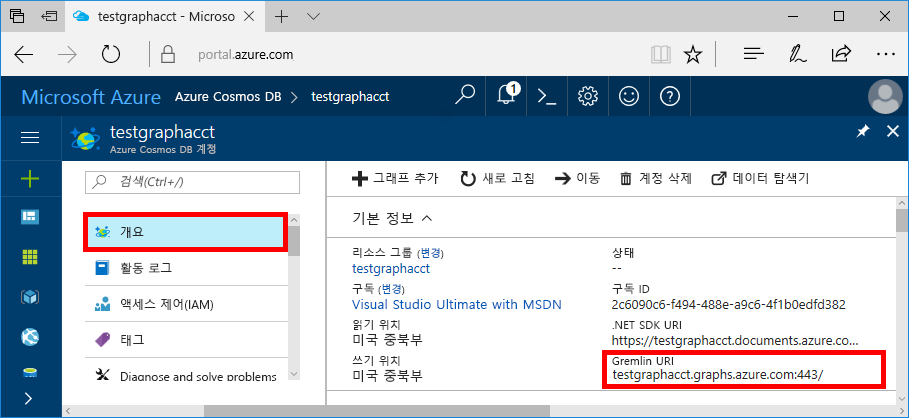
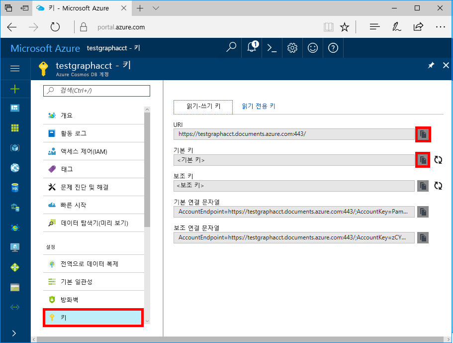

# <a name="quickstart-create-query-and-traverse-an-azure-cosmos-db-graph-database-using-the-gremlin-console"></a>빠른 시작: Gremlin 콘솔을 사용하여 Azure Cosmos DB 그래프 데이터베이스 만들기, 쿼리 및 트래버스

> [!div class="op_single_selector"]
> * [Gremlin 콘솔](create-graph-gremlin-console.md)
> * [.NET](create-graph-dotnet.md)
> * [Java](create-graph-java.md)
> * [Node.JS](create-graph-nodejs.md)
> * [Python](create-graph-python.md)
> * [PHP](create-graph-php.md)
>  

Azure Cosmos DB는 전 세계에 배포된 Microsoft의 다중 모델 데이터베이스 서비스입니다. Azure Cosmos DB의 핵심인 전역 배포 및 수평적 크기 조정 기능의 이점을 활용하여 문서, 키/값 및 그래프 데이터베이스를 빠르게 만들고 쿼리할 수 있습니다. 

이 빠른 시작에서는 Azure Portal을 사용하여 Azure Cosmos DB [Gremlin API](graph-introduction.md) 계정, 데이터베이스 및 그래프(컨테이너)를 만든 다음, [Apache TinkerPop](https://tinkerpop.apache.org)의 [Gremlin 콘솔](https://tinkerpop.apache.org/docs/current/reference/#gremlin-console)을 사용하여 Gremlin API 데이터로 작업하는 방법을 보여줍니다. 이 자습서에서는 꼭짓점 및 에지를 만들고 쿼리하며, 꼭짓점 속성을 업데이트하고, 꼭짓점을 쿼리하고, 그래프를 트래버스하고, 꼭짓점을 삭제합니다.


Gremlin 콘솔은 Groovy/Java 기반이며 Linux, Mac 및 Windows에서 실행됩니다. [Apache TinkerPop 사이트](https://tinkerpop.apache.org/downloads.html)에서 다운로드할 수 있습니다.

## <a name="prerequisites"></a>필수 조건

이 빠른 시작에서 Azure Cosmos DB 계정을 만들려면 Azure 구독이 있어야 합니다.

[!INCLUDE [quickstarts-free-trial-note](../../includes/quickstarts-free-trial-note.md)]

또한 [Gremlin 콘솔](https://tinkerpop.apache.org/)을 설치해야 합니다. 버전 3.2.5 이상을 사용합니다. (Windows에서 Gremlin 콘솔을 사용하려면 [Java 런타임](https://www.oracle.com/technetwork/java/javase/overview/index.html)을 설치해야 합니다.)

## <a name="create-a-database-account"></a>데이터베이스 계정 만들기

[!INCLUDE [cosmos-db-create-dbaccount-graph](../../includes/cosmos-db-create-dbaccount-graph.md)]

## <a name="add-a-graph"></a>그래프 추가

[!INCLUDE [cosmos-db-create-graph](../../includes/cosmos-db-create-graph.md)]

## <a id="ConnectAppService"></a>앱 서비스에 연결
1. Gremlin 콘솔을 시작하기 전에 `apache-tinkerpop-gremlin-console-3.2.5/conf` 디렉터리에서 remote-secure.yaml 구성 파일을 만들거나 수정합니다.
2. 다음 테이블에 정의된 대로 *호스트*, *포트*, *사용자 이름*, *암호*, *connectionPool* 및 *serializer* 구성을 입력합니다.

    설정|제안 값|설명
    ---|---|---
    호스트|[*account-name*.gremlin.cosmos.azure.com]|다음 스크린샷이 표시됩니다. 후행 :443/를 제거하고 대괄호로 묶은 Azure Portal의 개요 페이지에서 Gremlin URI 값입니다.
    포트|443|443으로 설정합니다.
    사용자 이름|*사용자 이름*|`/dbs/<db>/colls/<coll>` 양식의 리소스에서 `<db>`은 데이터베이스 이름이고 `<coll>`은 컬렉션 이름입니다.
    암호|*기본 키*| 아래에서 두 번째 스크린샷을 참조하세요. 기본 키 상자에 있는 Azure Portal의 키 페이지에서 검색할 수 있는 기본 키입니다. 상자의 왼쪽에서 복사 단추를 사용하여 값을 복사합니다.
    connectionPool|{enableSsl: true}|SSL에 대한 연결 풀 설정
    직렬 변환기|{ className: org.apache.tinkerpop.gremlin.<br>driver.ser.GraphSONMessageSerializerV1d0,<br> config: { serializeResultToString: true }}|이 값으로 설정하고 값에 붙여 넣을 때 `\n` 줄 바꿈을 삭제합니다.

    호스트 값의 경우 **개요** 페이지에서 **Gremlin URI** 값을 복사합니다. 

    암호 값의 경우 **키** 페이지의 **기본 키**를 복사합니다. 

remote-secure.yaml 파일은 다음과 같은 모양입니다.

```
hosts: [your_database_server.gremlin.cosmos.azure.com] 
port: 443
username: /dbs/your_database_account/colls/your_collection
password: your_primary_key
connectionPool: {
  enableSsl: true
}
serializer: { className: org.apache.tinkerpop.gremlin.driver.ser.GraphSONMessageSerializerV1d0, config: { serializeResultToString: true }}
```

호스트 매개 변수 값을 대괄호 [] 안으로 래핑해야 합니다. 

1. 터미널에서 `bin/gremlin.bat` 또는 `bin/gremlin.sh`를 실행하여 [Gremlin 콘솔](https://tinkerpop.apache.org/docs/3.2.5/tutorials/getting-started/)을 시작합니다.
1. 터미널에서 `:remote connect tinkerpop.server conf/remote-secure.yaml`을 실행하여 앱 서비스에 연결합니다.

    > [!TIP]
    > `No appenders could be found for logger` 오류가 발생하면 2단계에 설명된 대로 remote-secure.yaml 파일의 직렬 변환기 값을 업데이트했는지 확인합니다. 

1. 그런 다음, `:remote console`을 실행하여 모든 콘솔 명령을 원격 서버에 리디렉션합니다.

   > [!NOTE]
   > `:remote console` 명령을 실행하지 않지만 모든 콘솔 명령을 원격 서버로 리디렉션하려는 경우 `:>`가 포함된 명령에 접두사를 지정해야 합니다. 예를 들어 명령을 `:> g.V().count()`로 실행해야 합니다. 이 접두사는 명령의 일부로서 Azure Cosmos DB에서 Gremlin 콘솔을 사용할 때 중요합니다. 이 접두사를 생략하면 콘솔에서 명령을 로컬로, 종종 메모리 내 그래프에 대해 실행하도록 지시합니다. 이 접두사 `:>`를 사용하면 여기서는 Azure Cosmos DB(localhost 에뮬레이터 또는 Azure 인스턴스)에 대해 원격 명령을 실행하도록 콘솔에 지시합니다.

잘하셨습니다. 설정을 완료했으므로 콘솔 명령을 실행해 보겠습니다.

간단한 count () 명령을 사용해 보겠습니다. 프롬프트에서 콘솔에 다음을 입력합니다.

```
g.V().count()
```

## <a name="create-vertices-and-edges"></a>꼭짓점 및 에지 만들기

*Thomas*, *Mary Kay*, *Robin*, *Ben* 및 *Jack*이라는 5명의 사용자에 대한 꼭짓점을 추가함으로써 시작해 보겠습니다.

입력(Thomas):

```
g.addV('person').property('firstName', 'Thomas').property('lastName', 'Andersen').property('age', 44).property('userid', 1)
```

출력:

```
==>[id:796cdccc-2acd-4e58-a324-91d6f6f5ed6d,label:person,type:vertex,properties:[firstName:[[id:f02a749f-b67c-4016-850e-910242d68953,value:Thomas]],lastName:[[id:f5fa3126-8818-4fda-88b0-9bb55145ce5c,value:Andersen]],age:[[id:f6390f9c-e563-433e-acbf-25627628016e,value:44]],userid:[[id:796cdccc-2acd-4e58-a324-91d6f6f5ed6d|userid,value:1]]]]
```
입력(Mary Kay):

```
g.addV('person').property('firstName', 'Mary Kay').property('lastName', 'Andersen').property('age', 39).property('userid', 2)

```

출력:

```
==>[id:0ac9be25-a476-4a30-8da8-e79f0119ea5e,label:person,type:vertex,properties:[firstName:[[id:ea0604f8-14ee-4513-a48a-1734a1f28dc0,value:Mary Kay]],lastName:[[id:86d3bba5-fd60-4856-9396-c195ef7d7f4b,value:Andersen]],age:[[id:bc81b78d-30c4-4e03-8f40-50f72eb5f6da,value:39]],userid:[[id:0ac9be25-a476-4a30-8da8-e79f0119ea5e|userid,value:2]]]]

```

입력(Robin):

```
g.addV('person').property('firstName', 'Robin').property('lastName', 'Wakefield').property('userid', 3)
```

출력:

```
==>[id:8dc14d6a-8683-4a54-8d74-7eef1fb43a3e,label:person,type:vertex,properties:[firstName:[[id:ec65f078-7a43-4cbe-bc06-e50f2640dc4e,value:Robin]],lastName:[[id:a3937d07-0e88-45d3-a442-26fcdfb042ce,value:Wakefield]],userid:[[id:8dc14d6a-8683-4a54-8d74-7eef1fb43a3e|userid,value:3]]]]
```

입력(Ben):

```
g.addV('person').property('firstName', 'Ben').property('lastName', 'Miller').property('userid', 4)

```

출력:

```
==>[id:ee86b670-4d24-4966-9a39-30529284b66f,label:person,type:vertex,properties:[firstName:[[id:a632469b-30fc-4157-840c-b80260871e9a,value:Ben]],lastName:[[id:4a08d307-0719-47c6-84ae-1b0b06630928,value:Miller]],userid:[[id:ee86b670-4d24-4966-9a39-30529284b66f|userid,value:4]]]]
```

입력(Jack):

```
g.addV('person').property('firstName', 'Jack').property('lastName', 'Connor').property('userid', 5)
```

출력:

```
==>[id:4c835f2a-ea5b-43bb-9b6b-215488ad8469,label:person,type:vertex,properties:[firstName:[[id:4250824e-4b72-417f-af98-8034aa15559f,value:Jack]],lastName:[[id:44c1d5e1-a831-480a-bf94-5167d133549e,value:Connor]],userid:[[id:4c835f2a-ea5b-43bb-9b6b-215488ad8469|userid,value:5]]]]
```


다음으로, 사용자 간의 관계에 에지를 추가해 보겠습니다.

입력(Thomas -> Mary Kay):

```
g.V().hasLabel('person').has('firstName', 'Thomas').addE('knows').to(g.V().hasLabel('person').has('firstName', 'Mary Kay'))
```

출력:

```
==>[id:c12bf9fb-96a1-4cb7-a3f8-431e196e702f,label:knows,type:edge,inVLabel:person,outVLabel:person,inV:0d1fa428-780c-49a5-bd3a-a68d96391d5c,outV:1ce821c6-aa3d-4170-a0b7-d14d2a4d18c3]
```

입력(Thomas -> Robin):

```
g.V().hasLabel('person').has('firstName', 'Thomas').addE('knows').to(g.V().hasLabel('person').has('firstName', 'Robin'))
```

출력:

```
==>[id:58319bdd-1d3e-4f17-a106-0ddf18719d15,label:knows,type:edge,inVLabel:person,outVLabel:person,inV:3e324073-ccfc-4ae1-8675-d450858ca116,outV:1ce821c6-aa3d-4170-a0b7-d14d2a4d18c3]
```

입력(Robin -> Ben):

```
g.V().hasLabel('person').has('firstName', 'Robin').addE('knows').to(g.V().hasLabel('person').has('firstName', 'Ben'))
```

출력:

```
==>[id:889c4d3c-549e-4d35-bc21-a3d1bfa11e00,label:knows,type:edge,inVLabel:person,outVLabel:person,inV:40fd641d-546e-412a-abcc-58fe53891aab,outV:3e324073-ccfc-4ae1-8675-d450858ca116]
```

## <a name="update-a-vertex"></a>꼭짓점 업데이트

*45*세라는 나이로 *Thomas* 꼭짓점을 업데이트하겠습니다.

입력:
```
g.V().hasLabel('person').has('firstName', 'Thomas').property('age', 45)
```
출력:

```
==>[id:ae36f938-210e-445a-92df-519f2b64c8ec,label:person,type:vertex,properties:[firstName:[[id:872090b6-6a77-456a-9a55-a59141d4ebc2,value:Thomas]],lastName:[[id:7ee7a39a-a414-4127-89b4-870bc4ef99f3,value:Andersen]],age:[[id:a2a75d5a-ae70-4095-806d-a35abcbfe71d,value:45]]]]
```

## <a name="query-your-graph"></a>그래프 쿼리

이제 그래프에 대한 다양한 쿼리를 실행해 보겠습니다.

먼저 40세 이상인 사용자만을 반환하는 필터가 포함된 쿼리를 사용해 보겠습니다.

입력(필터 쿼리):

```
g.V().hasLabel('person').has('age', gt(40))
```

출력:

```
==>[id:ae36f938-210e-445a-92df-519f2b64c8ec,label:person,type:vertex,properties:[firstName:[[id:872090b6-6a77-456a-9a55-a59141d4ebc2,value:Thomas]],lastName:[[id:7ee7a39a-a414-4127-89b4-870bc4ef99f3,value:Andersen]],age:[[id:a2a75d5a-ae70-4095-806d-a35abcbfe71d,value:45]]]]
```

다음으로, 40세 이상인 사용자의 이름을 프로젝트하겠습니다.

입력(필터 + 프로젝션 쿼리):

```
g.V().hasLabel('person').has('age', gt(40)).values('firstName')
```

출력:

```
==>Thomas
```

## <a name="traverse-your-graph"></a>그래프 트래버스

Thomas의 친구를 모두 반환하는 그래프를 트래버스하겠습니다.

입력(Thomas의 친구):

```
g.V().hasLabel('person').has('firstName', 'Thomas').outE('knows').inV().hasLabel('person')
```

출력: 

```
==>[id:f04bc00b-cb56-46c4-a3bb-a5870c42f7ff,label:person,type:vertex,properties:[firstName:[[id:14feedec-b070-444e-b544-62be15c7167c,value:Mary Kay]],lastName:[[id:107ab421-7208-45d4-b969-bbc54481992a,value:Andersen]],age:[[id:4b08d6e4-58f5-45df-8e69-6b790b692e0a,value:39]]]]
==>[id:91605c63-4988-4b60-9a30-5144719ae326,label:person,type:vertex,properties:[firstName:[[id:f760e0e6-652a-481a-92b0-1767d9bf372e,value:Robin]],lastName:[[id:352a4caa-bad6-47e3-a7dc-90ff342cf870,value:Wakefield]]]]
```

다음으로 꼭짓점 다음 계층을 가져와 보겠습니다. Thomas의 친구의 친구를 모두 반환하는 그래프를 트래버스합니다.

입력(Thomas의 친구의 친구):

```
g.V().hasLabel('person').has('firstName', 'Thomas').outE('knows').inV().hasLabel('person').outE('knows').inV().hasLabel('person')
```
출력:

```
==>[id:a801a0cb-ee85-44ee-a502-271685ef212e,label:person,type:vertex,properties:[firstName:[[id:b9489902-d29a-4673-8c09-c2b3fe7f8b94,value:Ben]],lastName:[[id:e084f933-9a4b-4dbc-8273-f0171265cf1d,value:Miller]]]]
```

## <a name="drop-a-vertex"></a>꼭짓점 삭제

이제 그래프 데이터베이스에서 꼭짓점을 삭제하겠습니다.

입력(Jack 꼭짓점 삭제):

```
g.V().hasLabel('person').has('firstName', 'Jack').drop()
```

## <a name="clear-your-graph"></a>그래프 정리

마지막으로 모든 꼭짓점 및 에지의 데이터베이스를 정리해 보겠습니다.

입력:

```
g.E().drop()
g.V().drop()
```

축하합니다! 이 Azure Cosmos DB: Graph API 자습서를 완료했습니다.

## <a name="review-slas-in-the-azure-portal"></a>Azure Portal에서 SLA 검토

[!INCLUDE [cosmosdb-tutorial-review-slas](../../includes/cosmos-db-tutorial-review-slas.md)]

## <a name="clean-up-resources"></a>리소스 정리

[!INCLUDE [cosmosdb-delete-resource-group](../../includes/cosmos-db-delete-resource-group.md)]

## <a name="next-steps"></a>다음 단계

이 빠른 시작에서는 Cosmos DB Azure 계정을 만들고, 데이터 탐색기를 사용하여 그래프를 만들고, 꼭짓점과 에지를 만들고, Gremlin 콘솔을 사용하여 그래프를 트래버스하는 방법을 알아보았습니다. 이제 Gremlin을 사용하여 더 복잡한 쿼리를 작성하고 강력한 그래프 순회 논리를 구현할 수 있습니다. 

> [!div class="nextstepaction"]
> [Gremlin을 사용하여 쿼리](tutorial-query-graph.md)
