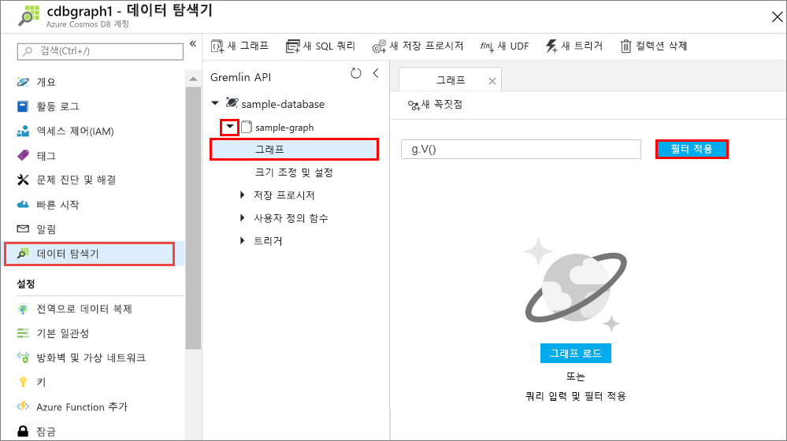
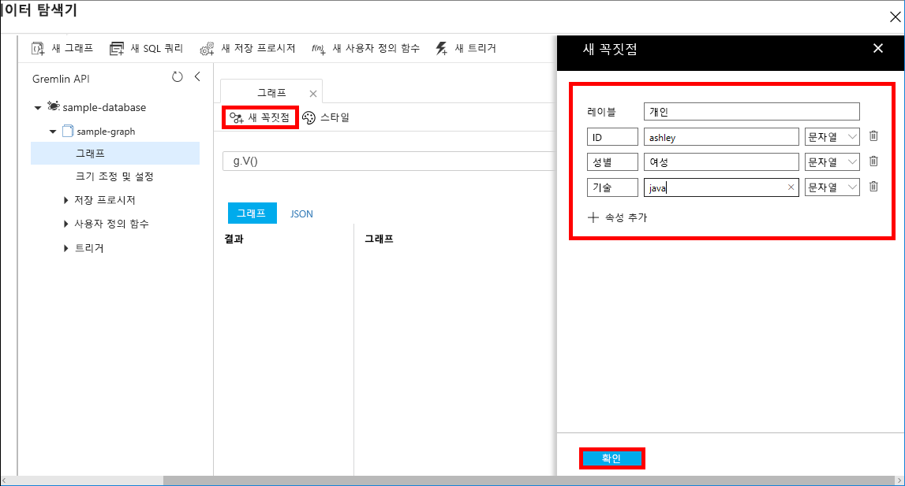
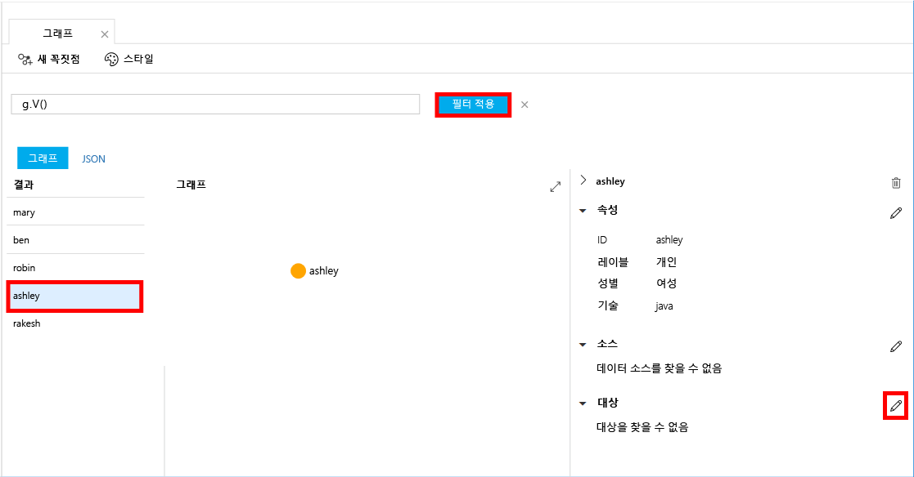
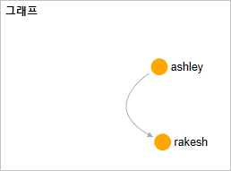

# <a name="quickstart-create-a-graph-database-in-azure-cosmos-db-using-the-java-sdk"></a>빠른 시작: Java SDK를 사용하여 Azure Cosmos DB에서 그래프 데이터베이스 만들기 

> [!div class="op_single_selector"]
> * [Gremlin 콘솔](create-graph-gremlin-console.md)
> * [.NET](create-graph-dotnet.md)
> * [Java](create-graph-java.md)
> * [Node.JS](create-graph-nodejs.md)
> * [Python](create-graph-python.md)
> * [PHP](create-graph-php.md)
>  

Azure Cosmos DB는 전 세계에 배포된 Microsoft의 다중 모델 데이터베이스 서비스입니다. Azure Cosmos DB를 사용하여 관리되는 문서, 테이블 및 그래프 데이터베이스를 신속하게 만들고 쿼리할 수 있습니다. 

이 빠른 시작은 Azure Cosmos DB용 Azure Portal 도구를 사용하여 간단한 그래프 데이터베이스를 만듭니다. 또한 이 빠른 시작은 OSS [Apache TinkerPop](https://tinkerpop.apache.org/) 드라이버를 사용하는 [Gremlin API](graph-introduction.md) 데이터베이스를 사용하여 Java 콘솔 앱을 빠르게 만드는 방법도 보여줍니다. 이 빠른 시작의 지침은 Java를 실행할 수 있는 모든 운영 체제에 적용될 수 있습니다. 이 빠른 시작을 통해 원하는 것이 무엇이든지 UI 또는 프로그래밍 방식으로 그래프를 만들고 수정하는 작업을 알아봅니다. 

## <a name="prerequisites"></a>필수 조건
[!INCLUDE [quickstarts-free-trial-note](../../includes/quickstarts-free-trial-note.md)]

또한,

* [JDK(Java Development Kit) 버전 8](https://aka.ms/azure-jdks)
    * JAVA_HOME 환경 변수가 반드시 JDK가 설치된 폴더를 지정하도록 설정합니다.
* [Maven](https://maven.apache.org/) 이진 아카이브 [다운로드](https://maven.apache.org/download.cgi) 및 [설치](https://maven.apache.org/install.html)
    * Ubuntu에서 `apt-get install maven`을 실행하여 Maven을 실행할 수 있습니다.
* [Git](https://www.git-scm.com/)
    * Ubuntu에서 `sudo apt-get install git`를 실행하여 Git를 실행할 수 있습니다.

## <a name="create-a-database-account"></a>데이터베이스 계정 만들기

그래프 데이터베이스를 만들려면 Azure Cosmos DB로 Gremlin(그래프) 데이터베이스 계정을 만들어야 합니다.

[!INCLUDE [cosmos-db-create-dbaccount-graph](../../includes/cosmos-db-create-dbaccount-graph.md)]

## <a name="add-a-graph"></a>그래프 추가

[!INCLUDE [cosmos-db-create-graph](../../includes/cosmos-db-create-graph.md)]

## <a name="clone-the-sample-application"></a>샘플 응용 프로그램 복제

이제 코드 사용으로 전환해 보겠습니다. GitHub에서 Gremlin API 앱을 복제하고, 연결 문자열을 설정하고, 실행해 보겠습니다. 프로그래밍 방식으로 데이터를 사용하여 얼마나 쉽게 작업할 수 있는지 알게 될 것입니다.  

1. 명령 프롬프트를 git-samples라는 새 폴더를 만든 다음 명령 프롬프트를 닫습니다.

    ```bash
    md "C:\git-samples"
    ```

2. Git Bash와 같은 Git 터미널 창을 열고, `cd` 명령을 사용하여 샘플 앱을 설치할 폴더를 변경합니다.  

    ```bash
    cd "C:\git-samples"
    ```

3. 다음 명령을 실행하여 샘플 리포지토리를 복제합니다. 이 명령은 컴퓨터에서 샘플 앱의 복사본을 만듭니다. 

    ```bash
    git clone https://github.com/Azure-Samples/azure-cosmos-db-graph-java-getting-started.git
    ```

## <a name="review-the-code"></a>코드 검토

이 단계는 선택 사항입니다. 데이터베이스 리소스를 코드로 만드는 방법을 알아보려는 경우 다음 코드 조각을 검토할 수 있습니다. 그렇지 않으면 [연결 문자열 업데이트](#update-your-connection-information)로 건너뛸 수 있습니다.

다음 코드 조각은 모두 C:\git-samples\azure-cosmos-db-graph-java-getting-started\src\GetStarted\Program.java 파일에서 가져온 것입니다.

* Gremlin `Client`는 C:\git-samples\azure-cosmos-db-graph-java-getting-started\src\remote.yaml 파일의 구성에서 초기화됩니다.

    ```java
    cluster = Cluster.build(new File("src/remote.yaml")).create();
    ...
    client = cluster.connect();
    ```

* `client.submit` 메서드를 사용하여 일련의 Gremlin 단계를 실행합니다.

    ```java
    ResultSet results = client.submit(gremlin);

    CompletableFuture<List<Result>> completableFutureResults = results.all();
    List<Result> resultList = completableFutureResults.get();

    for (Result result : resultList) {
        System.out.println(result.toString());
    }
    ```

## <a name="update-your-connection-information"></a>연결 정보 업데이트

이제 Azure Portal로 다시 이동하여 연결 정보를 가져와서 앱에 복사합니다. 이러한 설정을 사용하면 앱이 호스팅된 데이터베이스와 통신할 수 있게 됩니다.

1. [Azure Portal](https://portal.azure.com/)에서 **키**를 클릭합니다. 

    URI 값의 첫 번째 부분을 복사합니다.

    
2. src/remote.yaml 파일을 열고 `hosts: [$name$.graphs.azure.com]`의 `$name$`에 고유한 ID 값을 붙여넣습니다.

    이제 remote.yaml의 1줄이 다음과 비슷하게 표시됩니다. 

    `hosts: [test-graph.graphs.azure.com]`

3. `endpoint` 값에서 `graphs`를 `gremlin.cosmosdb`로 변경합니다. 2017년 12월 20일 이전에 그래프 데이터베이스 계정을 만든 경우 엔드포인트 값을 변경하지 말고 다음 단계를 진행합니다.

    엔드포인트 값은 이제 다음과 같이 표시됩니다.

    `"endpoint": "https://testgraphacct.gremlin.cosmosdb.azure.com:443/"`

4. Azure Portal에서 복사 단추를 사용하여 기본 키를 복사하고 `password: $masterKey$`의 `$masterKey$`에 붙여넣습니다.

    이제 remote.yaml의 4줄이 다음과 비슷하게 표시됩니다. 

    `password: 2Ggkr662ifxz2Mg==`

5. 다음에서 remote.yaml의 3줄을 변경합니다.

    `username: /dbs/$database$/colls/$collection$`

    to 

    `username: /dbs/sample-database/colls/sample-graph`

    샘플 데이터베이스 또는 그래프에 고유한 이름을 사용한 경우 값을 적절하게 업데이트합니다.

6. remote.yaml 파일을 저장합니다.

## <a name="run-the-console-app"></a>콘솔 앱 실행

1. git 터미널 창에서 azure-cosmos-db-graph-java-getting-started 폴더에 `cd`합니다.

    ```git
    cd "C:\git-samples\azure-cosmos-db-graph-java-getting-started"
    ```

2. git 터미널 창에서 다음 명령을 사용하여 필요한 Java 패키지를 설치합니다.

   ```
   mvn package
   ```

3. git 터미널 창에서 다음 명령을 사용하여 Java 응용 프로그램을 시작합니다.
    
    ```
    mvn exec:java -D exec.mainClass=GetStarted.Program
    ```

    그래프에 추가된 꼭짓점이 터미널 창에 표시됩니다. 
    
    시간 제한 오류가 발생하는 경우 [연결 정보 업데이트](#update-your-connection-information)에서 연결 정보를 올바르게 업데이트했는지 확인한 후 마지막 명령을 다시 실행해보세요. 
    
    프로그램이 중지되면 Enter 키를 누르고 인터넷 브라우저에서 Azure Portal로 다시 전환하세요. 

<a id="add-sample-data"></a>
## <a name="review-and-add-sample-data"></a>샘플 데이터 검토 및 추가

이제 데이터 탐색기로 다시 돌아가서 그래프에 추가된 꼭짓점을 확인하고 추가 데이터 지점을 추가할 수 있습니다.

1. **데이터 탐색기**를 클릭하고, **sample-graph**를 확장하고, **그래프**를 클릭한 다음 **필터 적용**을 클릭합니다. 

   

2. **결과** 목록에서 그래프에 추가된 새 사용자를 확인합니다. **ben**을 선택하고 해당 사용자가 robin에 연결되어 있는지 확인합니다. 끌어 놓아서 꼭짓점을 이동하고, 마우스 휠을 스크롤하여 확대 및 축소하고, 이중 화살표를 사용하여 그래프의 크기를 확장할 수 있습니다. 

   

3. 몇몇 새로운 사용자를 추가해 보겠습니다. **새 꼭짓점** 단추를 클릭하여 그래프에 데이터를 추가합니다.

   

4. 레이블 상자에 *사람*을 입력합니다.

5. **속성 추가**를 클릭하여 다음 속성 각각을 추가합니다. 그래프의 각 person에 대해 고유한 속성을 만들 수 있습니다. ID 키만 필요합니다.

    key|값|메모
    ----|----|----
    id|ashley|꼭짓점의 고유 식별자입니다. ID를 지정하지 않으면 사용자에 대해 하나 생성됩니다.
    gender|female| 
    tech | java | 

    > [!NOTE]
    > 이 빠른 시작에서는 분할되지 않은 컬렉션을 만듭니다. 그러나 컬렉션을 만드는 중 파티션 키를 지정하여 파티션된 컬렉션을 만드는 경우에는 각 새로운 꼭지점에 키로 파티션 키를 포함해야 합니다. 

6. **확인**을 클릭합니다. 화면 맨 아래에 **확인**이 보이도록 화면을 확장해야 합니다.

7. **새 꼭짓점**을 다시 클릭하고 새로운 추가 사용자를 추가합니다. 

8. *사람*이라는 레이블을 입력합니다.

9. **속성 추가**를 클릭하여 다음 속성 각각을 추가합니다.

    key|값|메모
    ----|----|----
    id|rakesh|꼭짓점의 고유 식별자입니다. ID를 지정하지 않으면 사용자에 대해 하나 생성됩니다.
    gender|male| 
    school|MIT| 

10. **확인**을 클릭합니다. 

11. 기본 `g.V()` 필터를 포함하는 **필터 적용** 단추를 클릭하여 그래프에 있는 모든 값을 표시합니다. 이제 **결과** 목록에 모든 사용자가 표시됩니다. 

    더 많은 데이터를 추가하면서 필터를 사용하여 결과를 한정할 수 있습니다. 기본적으로 데이터 탐색기는 `g.V()`를 사용하여 그래프에 있는 모든 꼭짓점을 검색합니다. `g.V().count()`와 같은 다른 [그래프 쿼리](tutorial-query-graph.md)를 변경하여 JSON 형식으로 그래프의 모든 꼭짓점 수를 반환할 수 있습니다. 필터를 변경한 경우 필터를 다시 `g.V()`로 변경하고 **필터 적용**을 클릭하여 모든 결과를 다시 표시합니다.

12. 이제 rakesh 및 ashley를 연결할 수 있습니다. **결과** 목록에서 **ashley**가 선택되었는지 확인한 다음, 오른쪽 하단의 **대상** 옆에 있는 을 클릭합니다. 하단을 보려면 창을 확장해야 할 수도 있습니다.

    

13. **대상** 상자에 *rakesh*를 입력하고 **에지 레이블** 상자에 *knows*를 입력한 다음, 확인란을 선택합니다.

    

14. 이제 결과 목록에서 **rakesh**를 선택하고 ashley와 rakesh가 연결되어 있는지 확인합니다. 

    

    이것으로 이 자습서의 리소스 만들기 단계를 마칩니다. 계속해서 그래프에 꼭짓점을 추가하거나, 기존 꼭짓점을 수정하거나, 쿼리를 변경할 수 있습니다. 이제 Azure Cosmos DB에서 제공하는 메트릭을 검토하고 리소스를 정리하겠습니다. 

## <a name="review-slas-in-the-azure-portal"></a>Azure Portal에서 SLA 검토

[!INCLUDE [cosmosdb-tutorial-review-slas](../../includes/cosmos-db-tutorial-review-slas.md)]

## <a name="clean-up-resources"></a>리소스 정리

[!INCLUDE [cosmosdb-delete-resource-group](../../includes/cosmos-db-delete-resource-group.md)]

## <a name="next-steps"></a>다음 단계

이 빠른 시작에서, Azure Cosmos DB 계정을 만들고, 데이터 탐색기를 사용하여 그래프를 만들고, 앱을 실행하는 방법을 알아보았습니다. 이제 Gremlin을 사용하여 더 복잡한 쿼리를 작성하고 강력한 그래프 순회 논리를 구현할 수 있습니다. 

> [!div class="nextstepaction"]
> [Gremlin을 사용하여 쿼리](tutorial-query-graph.md)

