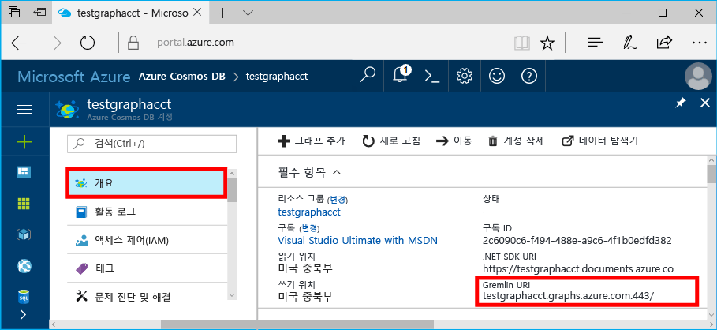

# <a name="azure-cosmos-db-create-a-graph-database-using-java-and-the-azure-portal"></a>Azure Cosmos DB: Java 및 Azure Portal을 사용하여 그래프 데이터베이스 만들기

Azure Cosmos DB는 전 세계에 배포된 Microsoft의 다중 모델 데이터베이스 서비스입니다. Azure Cosmos DB의 핵심인 전역 배포 및 수평적 크기 조정 기능의 이점을 활용하여 문서, 키/값 및 그래프 데이터베이스를 빠르게 만들고 쿼리할 수 있습니다. 

이 빠른 시작은 Azure Cosmos DB용 Azure Portal 도구를 사용하여 그래프 데이터베이스를 만듭니다. 또한 이 빠른 시작은 OSS [Gremlin Java](https://mvnrepository.com/artifact/org.apache.tinkerpop/gremlin-driver) 드라이버를 사용하는 그래프 데이터베이스를 사용하여 Java 콘솔 앱을 빠르게 만드는 방법도 보여줍니다. 이 빠른 시작의 지침은 Java를 실행할 수 있는 모든 운영 체제에 적용될 수 있습니다. 이 빠른 시작을 완료하면 원하는 것이 무엇이든지 UI 또는 프로그래밍 방식으로 그래프 리소스를 만들고 수정하는 작업을 익히게 될 것입니다. 

## <a name="prerequisites"></a>필수 조건

* [JDK(Java Development Kit) 1.7+](http://www.oracle.com/technetwork/java/javase/downloads/jdk8-downloads-2133151.html)
    * Ubuntu에서 `apt-get install default-jdk`를 실행하여 JDK를 설치합니다.
    * JAVA_HOME 환경 변수가 반드시 JDK가 설치된 폴더를 지정하도록 설정합니다.
* [Maven](http://maven.apache.org/) 이진 아카이브 [다운로드](http://maven.apache.org/download.cgi) 및 [설치](http://maven.apache.org/install.html)
    * Ubuntu에서 `apt-get install maven`을 실행하여 Maven을 실행할 수 있습니다.
* [Git](https://www.git-scm.com/)
    * Ubuntu에서 `sudo apt-get install git`를 실행하여 Git를 실행할 수 있습니다.

[!INCLUDE [quickstarts-free-trial-note](../../includes/quickstarts-free-trial-note.md)]

## <a name="create-a-database-account"></a>데이터베이스 계정 만들기

그래프 데이터베이스를 만들려면 Azure Cosmos DB로 Gremlin(그래프) 데이터베이스 계정을 만들어야 합니다.

[!INCLUDE [cosmos-db-create-dbaccount-graph](../../includes/cosmos-db-create-dbaccount-graph.md)]

## <a name="add-a-graph"></a>그래프 추가

이제 Azure Portal에서 데이터 탐색기 도구를 사용하여 그래프 데이터베이스를 만들 수 있습니다. 

1. Azure Portal의 왼쪽 탐색 메뉴에서 **데이터 탐색기(미리 보기)**를 클릭합니다. 
2. **데이터 탐색기(미리 보기)** 블레이드에서 **새 그래프**를 클릭한 후 다음 정보를 사용하여 페이지를 채웁니다.

    

    설정|제안 값|설명
    ---|---|---
    데이터베이스 ID|sample-database|새 데이터베이스에 대한 ID입니다. 데이터베이스 이름은 1~255자 사이여야 하며 `/ \ # ?` 또는 후행 공백을 포함할 수 없습니다.
    그래프 ID|sample-graph|새 그래프에 대한 ID입니다. 그래프 이름은 데이터베이스 ID와 동일한 문자 요구 사항을 갖습니다.
    저장소 용량| 10 GB|기본값을 그대로 둡니다. 데이터베이스의 저장소 용량입니다.
    처리량|400RU|기본값을 그대로 둡니다. 대기 시간을 단축하려면 나중에 처리량을 증가시킬 수 있습니다.
    RU/m|꺼짐|기본값을 그대로 둡니다. 나중에 까다로운 워크로드를 처리해야 할 때 [RU/m](request-units-per-minute.md) 기능을 켜도 됩니다.
    파티션 키|비워 둠|이 빠른 시작의 목적으로 파티션 키를 비워 둡니다.

3. 양식을 작성한 후 **확인**을 클릭합니다.

## <a name="clone-the-sample-application"></a>샘플 응용 프로그램 복제

이제 github에서 그래프 앱을 복제하고 연결 문자열을 설정한 다음 실행해 보겠습니다. 프로그래밍 방식으로 데이터를 사용하여 얼마나 쉽게 작업할 수 있는지 알게 될 것입니다. 

1. git bash와 같은 git 터미널 창을 열고 `cd`를 수행하여 작업 디렉터리로 이동합니다.  

2. 다음 명령을 실행하여 샘플 리포지토리를 복제합니다. 

    ```bash
    git clone https://github.com/Azure-Samples/azure-cosmos-db-graph-java-getting-started.git
    ```

## <a name="review-the-code"></a>코드 검토

앱에서 어떤 상황이 발생하고 있는지 빠르게 살펴보겠습니다. \src\GetStarted 폴더에서 `Program.java` 파일을 열고 이 코드 라인을 찾습니다. 

* Gremlin `Client`는 `src/remote.yaml`의 구성에서 초기화됩니다.

    ```java
    cluster = Cluster.build(new File("src/remote.yaml")).create();
    ...
    client = cluster.connect();
    ```

* `client.submit` 메서드를 사용하여 일련의 Gremlin 단계를 실행합니다.

    ```java
    ResultSet results = client.submit(gremlin);

    CompletableFuture<List<Result>> completableFutureResults = results.all();
    List<Result> resultList = completableFutureResults.get();

    for (Result result : resultList) {
        System.out.println(result.toString());
    }
    ```

## <a name="update-your-connection-string"></a>연결 문자열 업데이트

1. src/remote.yaml 파일을 엽니다. 

3. src/remote.yaml 파일에서 *호스트*, *사용자 이름* 및 *암호* 값을 작성합니다. 나머지 설정은 변경할 필요가 없습니다.

    설정|제안 값|설명
    ---|---|---
    호스트|[***.graphs.azure.com]|이 표 다음의 스크린샷을 참조하세요. 이 값은 후행 :443/를 제거하고 대괄호로 묶은 Azure Portal의 개요 페이지에서 Gremlin URI 값입니다.<br><br>https://를 제거하고 문서를 그래프로 변경하고 후행 :443/를 제거하면 URI 값을 사용하여 키 탭에서 이 값을 검색할 수도 있습니다.
    사용자 이름|/dbs/sample-database/colls/sample-graph|`/dbs/<db>/colls/<coll>` 양식의 리소스에서 `<db>`은 기존 데이터베이스 이름이고 `<coll>`은 기존 컬렉션 이름입니다.
    암호|*기본 마스터 키*|이 표 다음의 두 번째 스크린샷을 참조하세요. 이 값은 기본 키 상자에 있는 Azure Portal의 키 페이지에서 검색할 수 있는 기본 키입니다. 상자의 오른쪽에서 복사 단추를 사용하여 값을 복사합니다.

    호스트 값의 경우 **개요** 페이지에서 **Gremlin URI** 값을 복사합니다. 비어 있는 경우 키 블레이드에서 Gremlin URI 만들기에 대한 선행 표의 호스트 행에 있는 지침을 참조하세요.


    암호 값의 경우 **키** 블레이드의 **기본 키**를 복사합니다. 

## <a name="run-the-console-app"></a>콘솔 앱 실행

1. git 터미널 창에서 azure-cosmos-db-graph-java-getting-started 폴더에 `cd`합니다.

2. git 터미널 창에서 `mvn package`를 입력하여 필요한 Java 패키지를 설치합니다.

3. git 터미널 창에서 터미널 창의 `mvn exec:java -D exec.mainClass=GetStarted.Program`을 실행하여 Java 응용 프로그램을 시작합니다.

그래프에 추가된 꼭짓점이 터미널 창에 표시됩니다. 프로그램이 완료되면 인터넷 브라우저에서 Azure Portal로 다시 전환하세요. 

<a id="add-sample-data"></a>
## <a name="review-and-add-sample-data"></a>샘플 데이터 검토 및 추가

이제 데이터 탐색기로 다시 돌아가서 그래프에 추가된 꼭짓점을 확인하고 추가 데이터 지점을 추가할 수 있습니다.

1. 데이터 탐색기에서 **sample-database**/**sample-graph**를 확장하고 **그래프**를 클릭한 다음 **필터 적용**을 클릭합니다. 

   

2. **결과** 목록에서 그래프에 추가된 새 사용자를 확인합니다. **ben**을 선택하고 robin에 연결되어 있는지 확인합니다. 그래프 탐색기에서 꼭짓점을 이동하고 확대 및 축소하며 그래프 탐색기 표면의 크기를 확장할 수 있습니다. 

   

3. 데이터 탐색기를 사용하여 그래프에 몇몇 새로운 사용자를 추가해 보겠습니다. **새 꼭짓점** 단추를 클릭하여 그래프에 데이터를 추가합니다.

   

4. *person*의 레이블을 입력하고 다음 키 및 값을 입력하여 그래프에서 첫 번째 꼭짓점을 만듭니다. 그래프의 각 person에 대해 고유한 속성을 만들 수 있습니다. ID 키만 필요합니다.

    key|값|메모
    ----|----|----
    id|ashley|꼭짓점의 고유 식별자입니다. ID를 지정하지 않으면 사용자에 대해 하나 생성됩니다.
    gender|female| 
    tech | java | 

    > [!NOTE]
    > 이 빠른 시작에서는 파티션되지 않은 컬렉션을 만듭니다. 그러나 컬렉션을 만드는 중 파티션 키를 지정하여 파티션된 컬렉션을 만드는 경우에는 각 새로운 꼭지점에 키로 파티션 키를 포함해야 합니다.  

5. **확인**을 클릭합니다. 화면 맨 아래에 **확인**이 보이도록 화면을 확장해야 합니다.

6. **새 꼭짓점**을 다시 클릭하고 새로운 추가 사용자를 추가합니다. *person* 레이블을 입력하고 다음 키 및 값을 입력합니다.

    key|값|메모
    ----|----|----
    id|rakesh|꼭짓점의 고유 식별자입니다. ID를 지정하지 않으면 사용자에 대해 하나 생성됩니다.
    gender|male| 
    school|MIT| 

7. **확인**을 클릭합니다. 

8. 기본 `g.V()` 필터로 **필터 적용**를 클릭합니다. 이제 **결과** 목록에 모든 사용자가 표시됩니다. 더 많은 데이터를 추가하면서 필터를 사용하여 결과를 한정할 수 있습니다. 기본적으로, 데이터 탐색기에서는 `g.V()`를 사용하여 한 그래프의 모든 꼭짓점을 검색하지만 `g.V().count()`와 같은 다른 [그래프 쿼리](tutorial-query-graph.md)로 변경하여 JSON 형식의 그래프로 모든 꼭짓점의 갯수를 반환할 수 있습니다.

9. 이제 rakesh 및 ashley를 연결할 수 있습니다. **결과** 목록에서 **ashley**가 선택되어 있는지 확인한 다음 하단 오른쪽의 **대상** 옆의 편집 단추를 클릭합니다. **속성** 영역을 표시하려면 창을 확장해야 할 수도 있습니다.

   

10. **대상** 상자에 *rakesh*, **에지 레이블** 상자에 *knows*를 입력한 다음 확인란을 클릭합니다.

   

11. 이제 결과 목록에서 **rakesh**를 선택하고 ashley와 rakesh가 연결되어 있는지 확인합니다. 

   

    또한 서버 쪽 비즈니스 논리를 수행하고 처리량을 확장할 수 있도록 데이터 탐색기를 사용하여 저장 프로시저, UDF 및 트리거를 만들 수도 있습니다. 데이터 탐색기는 API에서 사용할 수 있는 모든 기본 제공 프로그래밍 방식 데이터 액세스를 표시하지만 Azure Portal의 데이터에도 쉽게 액세스할 수 있습니다.


## <a name="review-slas-in-the-azure-portal"></a>Azure Portal에서 SLA 검토

[!INCLUDE [cosmosdb-tutorial-review-slas](../../includes/cosmos-db-tutorial-review-slas.md)]

## <a name="clean-up-resources"></a>리소스 정리

이 앱을 계속 사용하지 않으려면 Azure Portal에서 다음 단계에 따라 이 빠른 시작에서 만든 리소스를 모두 삭제합니다. 

1. Azure Portal의 왼쪽 메뉴에서 **리소스 그룹**을 클릭한 다음 만든 리소스의 이름을 클릭합니다. 
2. 리소스 그룹 페이지에서 **삭제**를 클릭하고 텍스트 상자에서 삭제할 리소스의 이름을 입력한 다음 **삭제**를 클릭합니다.

## <a name="next-steps"></a>다음 단계

이 빠른 시작에서, Azure Cosmos DB 계정을 만들고, 데이터 탐색기를 사용하여 그래프를 만들고, 앱을 실행하는 방법을 알아보았습니다. 이제 Gremlin을 사용하여 더 복잡한 쿼리를 작성하고 강력한 그래프 순회 논리를 구현할 수 있습니다. 

> [!div class="nextstepaction"]
> [Gremlin을 사용하여 쿼리](tutorial-query-graph.md)


