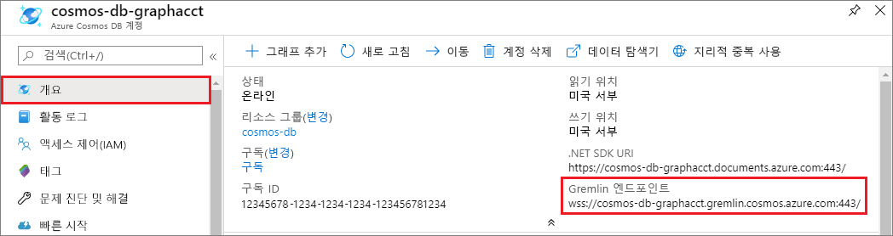
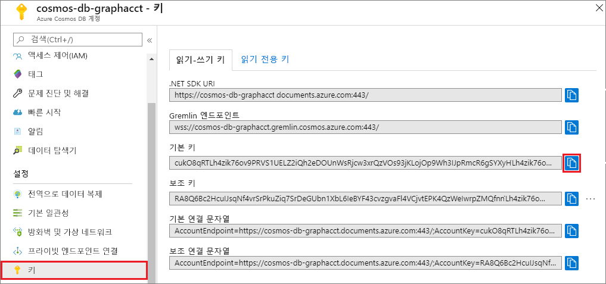

# <a name="quickstart-build-a-nodejs-application-by-using-azure-cosmos-db-gremlin-api-account"></a>빠른 시작: Azure Cosmos DB Gremlin API 계정을 사용하여 Node.js 애플리케이션 빌드

> [!div class="op_single_selector"]
> * [Gremlin 콘솔](create-graph-gremlin-console.md)
> * [.NET](create-graph-dotnet.md)
> * [Java](create-graph-java.md)
> * [Node.JS](create-graph-nodejs.md)
> * [Python](create-graph-python.md)
> * [PHP](create-graph-php.md)
>  

Azure Cosmos DB는 Microsoft에서 제공하는 전 세계로 분산된 다중 모델 데이터베이스 서비스입니다. Azure Cosmos DB의 핵심인 전역 배포 및 수평적 크기 조정 기능의 이점을 활용하여 문서, 키/값 및 그래프 데이터베이스를 빠르게 만들고 쿼리할 수 있습니다. 

이 빠른 시작에서는 Azure Portal을 사용하여 Azure Cosmos DB [Gremlin API](graph-introduction.md) 계정, 데이터베이스 및 그래프를 만드는 방법을 보여줍니다. 그런 다음 [Gremlin Node.js](https://www.npmjs.com/package/gremlin) 오픈 소스 드라이버를 사용하여 콘솔 앱을 빌드하고 실행합니다.

## <a name="prerequisites"></a>필수 조건

이 샘플을 실행하기 전에 다음 필수 조건이 있어야 합니다.
* [Node.js](https://nodejs.org/en/) 버전 v0.10.29 이상
* [Git](https://git-scm.com/)

[!INCLUDE [quickstarts-free-trial-note](../../includes/quickstarts-free-trial-note.md)]

## <a name="create-a-database-account"></a>데이터베이스 계정 만들기

[!INCLUDE [cosmos-db-create-dbaccount-graph](../../includes/cosmos-db-create-dbaccount-graph.md)]

## <a name="add-a-graph"></a>그래프 추가

[!INCLUDE [cosmos-db-create-graph](../../includes/cosmos-db-create-graph.md)]

## <a name="clone-the-sample-application"></a>샘플 응용 프로그램 복제

이제 GitHub에서 Gremlin API 앱을 복제하고, 연결 문자열을 설정하고, 실행해 보겠습니다. 프로그래밍 방식으로 데이터를 사용하여 얼마나 쉽게 작업할 수 있는지 알게 될 것입니다. 

1. 명령 프롬프트를 git-samples라는 새 폴더를 만든 다음 명령 프롬프트를 닫습니다.

    ```bash
    md "C:\git-samples"
    ```

2. Git Bash와 같은 Git 터미널 창을 열고, `cd` 명령을 사용하여 샘플 앱을 설치할 새 폴더로 변경합니다.

    ```bash
    cd "C:\git-samples"
    ```

3. 다음 명령을 실행하여 샘플 리포지토리를 복제합니다. 이 명령은 컴퓨터에서 샘플 앱의 복사본을 만듭니다.

    ```bash
    git clone https://github.com/Azure-Samples/azure-cosmos-db-graph-nodejs-getting-started.git
    ```

3. Visual Studio에서 솔루션 파일을 엽니다. 

## <a name="review-the-code"></a>코드 검토

이 단계는 선택 사항입니다. 데이터베이스 리소스를 코드로 만드는 방법을 알아보려는 경우 다음 코드 조각을 검토할 수 있습니다. 그렇지 않으면 [연결 문자열 업데이트](#update-your-connection-string)로 건너뛸 수 있습니다. 

다음 코드 조각은 모두 app.js 파일에서 가져옵니다.

* Gremlin 클라이언트가 만들어집니다.

    ```javascript
    const client = Gremlin.createClient(
        443, 
        config.endpoint, 
        { 
            "session": false, 
            "ssl": true, 
            "user": `/dbs/${config.database}/colls/${config.collection}`,
            "password": config.primaryKey
        });
    ```

  구성은 모두 `config.js`에 있으며 [다음 섹션](#update-your-connection-string)에서 편집할 내용입니다.

* 다른 Gremlin 작업을 실행할 일련의 함수가 정의됩니다. 다음은 그 중 하나입니다.

    ```javascript
    function addVertex1(callback)
    {
        console.log('Running Add Vertex1'); 
        client.execute("g.addV('person').property('id', 'thomas').property('firstName', 'Thomas').property('age', 44).property('userid', 1)", { }, (err, results) => {
          if (err) callback(console.error(err));
          console.log("Result: %s\n", JSON.stringify(results));
          callback(null)
        });
    }
    ```

* 각 함수는 Gremlin 쿼리 문자열 매개 변수로 `client.execute` 메서드를 실행합니다. 다음은 `g.V().count()`가 실행되는 예를 보여줍니다.

    ```javascript
    console.log('Running Count'); 
    client.execute("g.V().count()", { }, (err, results) => {
        if (err) return console.error(err);
        console.log(JSON.stringify(results));
        console.log();
    });
    ```

* 파일의 끝에는 모든 메서드가 `async.waterfall()` 메서드를 사용하여 호출됩니다. 그러면 하나씩 차례대로 실행됩니다.

    ```javascript
    try{
        async.waterfall([
            dropGraph,
            addVertex1,
            addVertex2,
            addEdge,
            countVertices
            ], finish);
    } catch(err) {
        console.log(err)
    }
    ```


## <a name="update-your-connection-string"></a>연결 문자열 업데이트

1. config.js 파일을 엽니다. 

2. config.js에서는 Azure Portal의 **개요** 페이지에 있는 **Gremlin URI** 값을 `config.endpoint` 키에 입력합니다. 

    `config.endpoint = "GRAPHENDPOINT";`

    

   **Gremlin URI** 값이 비어 있는 경우 포털의 **키** 페이지에서 값을 생성할 수 있습니다. **URI** 값을 사용하고, https://를 제거하고, 문서를 gremlin.cosmosdb로 변경합니다. 그래프 계정이 2017년 12월 20일 이전에 만들어진 경우 문서를 그래프로 변경합니다. 

   Gremlin 엔드포인트는 `mygraphdb.gremlin.cosmosdb.azure.com`과 같이(`https://mygraphdb.gremlin.cosmosdb.azure.com` 또는 `mygraphdb.gremlin.cosmosdb.azure.com:433`이 아님) 프로토콜/포트 번호가 없는 호스트 이름이어야 합니다.

3. config.js에서는 Azure Portal의 **키** 페이지에 있는 **기본 키** 값을 config.primaryKey 값에 입력합니다. 

    `config.primaryKey = "PRIMARYKEY";`

   

4. config.database 및 config.collection의 값에 데이터베이스 이름 및 그래프(컨테이너) 이름을 입력합니다. 

완성된 config.js 파일은 다음과 같은 모양입니다.

```javascript
var config = {}

// Note that this must not have HTTPS or the port number
config.endpoint = "testgraphacct.gremlin.cosmosdb.azure.com";
config.primaryKey = "Pams6e7LEUS7LJ2Qk0fjZf3eGo65JdMWHmyn65i52w8ozPX2oxY3iP0yu05t9v1WymAHNcMwPIqNAEv3XDFsEg==";
config.database = "graphdb"
config.collection = "Persons"

module.exports = config;
```

## <a name="run-the-console-app"></a>콘솔 앱 실행

1. 터미널 창을 열고 프로젝트에 포함된 package.json 파일의 설치 디렉터리로 변경합니다(`cd` 명령을 통해).

2. `npm install`을 실행하여 필요한 npm 모듈(`gremlin` 포함)을 설치합니다.

3. 터미널에서 `node app.js`을 실행하여 노드 응용 프로그램을 시작합니다.

## <a name="browse-with-data-explorer"></a>데이터 탐색기 검색

이제 Azure Portal의 [데이터 탐색기]로 다시 이동하여 새 그래프 데이터를 보고, 쿼리하고, 수정하고, 작업할 수 있습니다.

[데이터 탐색기]에서 새 데이터베이스가 **그래프** 창에 표시됩니다. 데이터베이스에 이어 컨테이너를 확장한 다음, **그래프**를 선택합니다.

**필터 적용**을 선택하면 샘플 앱에서 생성한 데이터가 **그래프** 탭 내의 다음 창에 표시됩니다.

`.has('firstName', 'Thomas')`로 `g.V()`를 완성하여 필터를 테스트해 보세요. 값은 대/소문자를 구분합니다.

## <a name="review-slas-in-the-azure-portal"></a>Azure Portal에서 SLA 검토

[!INCLUDE [cosmosdb-tutorial-review-slas](../../includes/cosmos-db-tutorial-review-slas.md)]

## <a name="clean-up-your-resources"></a>리소스 정리

[!INCLUDE [cosmosdb-delete-resource-group](../../includes/cosmos-db-delete-resource-group.md)]

## <a name="next-steps"></a>다음 단계

이 문서에서는 Azure Cosmos DB 계정을 만들고, 데이터 탐색기를 사용하여 그래프를 만들고, 앱을 실행하는 방법에 대해 알아보았습니다. 이제 Gremlin을 사용하여 더 복잡한 쿼리를 작성하고 강력한 그래프 순회 논리를 구현할 수 있습니다. 

> [!div class="nextstepaction"]
> [Gremlin을 사용하여 쿼리](tutorial-query-graph.md)
