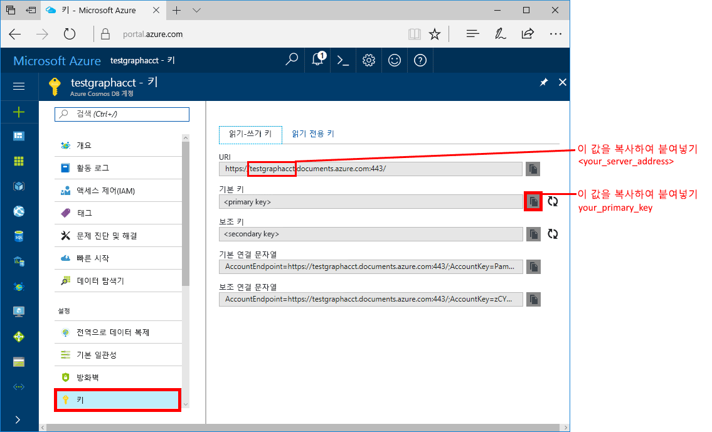
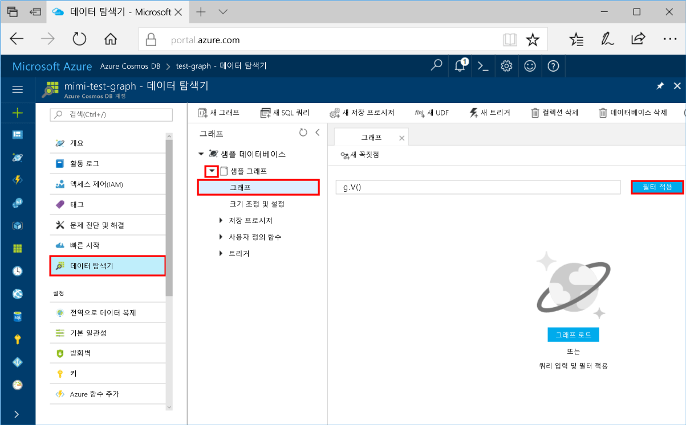
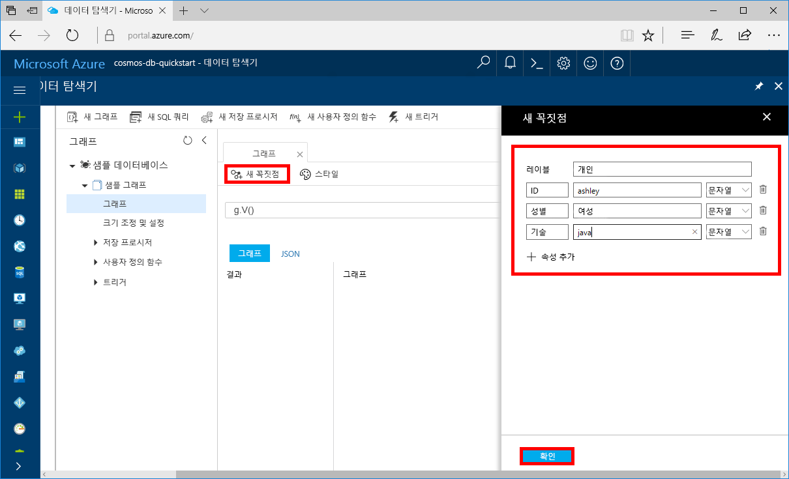
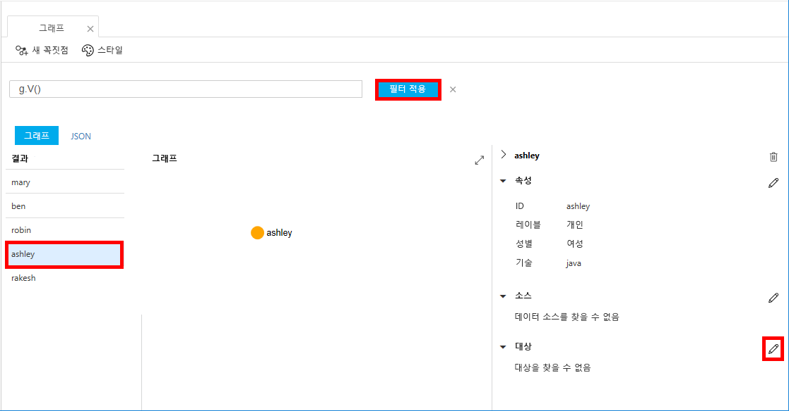
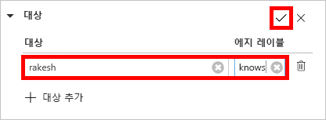

# <a name="azure-cosmos-db-create-a-graph-database-using-php-and-the-azure-portal"></a>Azure Cosmos DB는 PHP 및 Azure Portal을 사용하여 그래프 데이터베이스 만들기

> [!div class="op_single_selector"]
> * [Gremlin 콘솔](create-graph-gremlin-console.md)
> * [.NET](create-graph-dotnet.md)
> * [Java](create-graph-java.md)
> * [Node.JS](create-graph-nodejs.md)
> * [Python](create-graph-python.md)
> * [PHP](create-graph-php.md)
>  

이 빠른 시작은 GitHub에서 예제를 복제하여 콘솔 앱을 빌드하기 위해 PHP와 Azure Cosmos DB [Gremlin API](graph-introduction.md)를 사용하는 방법을 보여줍니다. 이 빠른 시작에서는 또한 웹 기반 Azure Portal을 사용하여 Azure Cosmos DB 계정을 만드는 과정을 안내합니다.   

Azure Cosmos DB는 전 세계에 배포된 Microsoft의 다중 모델 데이터베이스 서비스입니다. Azure Cosmos DB의 핵심인 전역 배포 및 수평적 크기 조정 기능의 이점을 활용하여 문서, 테이블, 키/값 및 그래프 데이터베이스를 빠르게 만들고 쿼리할 수 있습니다.  

## <a name="prerequisites"></a>필수 조건

[!INCLUDE [quickstarts-free-trial-note](../../includes/quickstarts-free-trial-note.md)] 또는 Azure 구독, 요금 및 약정 없이 [Azure Cosmos DB 평가판](https://azure.microsoft.com/try/cosmosdb/)을 사용할 수 있습니다.

또한,
* [PHP](https://php.net/) 5.6 이상
* [Composer](https://getcomposer.org/download/)

## <a name="create-a-database-account"></a>데이터베이스 계정 만들기

그래프 데이터베이스를 만들려면 Azure Cosmos DB로 Gremlin(그래프) 데이터베이스 계정을 만들어야 합니다.

[!INCLUDE [cosmos-db-create-dbaccount-graph](../../includes/cosmos-db-create-dbaccount-graph.md)]

## <a name="add-a-graph"></a>그래프 추가

[!INCLUDE [cosmos-db-create-graph](../../includes/cosmos-db-create-graph.md)]

## <a name="clone-the-sample-application"></a>샘플 응용 프로그램 복제

이제 코드 사용으로 전환해 보겠습니다. GitHub에서 Gremlin API 앱을 복제하고, 연결 문자열을 설정하고, 실행해 보겠습니다. 프로그래밍 방식으로 데이터를 사용하여 얼마나 쉽게 작업할 수 있는지 알게 될 것입니다.  

1. 명령 프롬프트를 git-samples라는 새 폴더를 만든 다음 명령 프롬프트를 닫습니다.

    ```bash
    md "C:\git-samples"
    ```

2. Git Bash와 같은 Git 터미널 창을 열고, `cd` 명령을 사용하여 샘플 앱을 설치할 폴더를 변경합니다.  

    ```bash
    cd "C:\git-samples"
    ```

3. 다음 명령을 실행하여 샘플 리포지토리를 복제합니다. 이 명령은 컴퓨터에서 샘플 앱의 복사본을 만듭니다. 

    ```bash
    git clone https://github.com/Azure-Samples/azure-cosmos-db-graph-php-getting-started.git
    ```

## <a name="review-the-code"></a>코드 검토

이 단계는 선택 사항입니다. 데이터베이스 리소스를 코드로 만드는 방법을 알아보려는 경우 다음 코드 조각을 검토할 수 있습니다. 코드 조각은 모두 C:\git-samples\azure-cosmos-db-graph-php-getting-started\ 폴더의 connect.php 파일에서 가져옵니다. 그렇지 않으면 [연결 문자열 업데이트](#update-your-connection-information)로 건너뛸 수 있습니다. 

* Gremlin `connection`은 `$db` 개체를 사용하여 `connect.php` 파일의 시작 부분에서 초기화됩니다.

    ```php
    $db = new Connection([
        'host' => '<your_server_address>.graphs.azure.com',
        'username' => '/dbs/<db>/colls/<coll>',
        'password' => 'your_primary_key'
        ,'port' => '443'

        // Required parameter
        ,'ssl' => TRUE
    ]);
    ```

* `$db->send($query);` 메서드를 사용하여 일련의 Gremlin 단계를 실행합니다.

    ```php
    $query = "g.V().drop()";
    ...
    $result = $db->send($query);
    $errors = array_filter($result);
    }
    ```

## <a name="update-your-connection-information"></a>연결 정보 업데이트

이제 Azure Portal로 다시 이동하여 연결 정보를 가져와서 앱에 복사합니다. 이러한 설정을 사용하면 앱이 호스팅된 데이터베이스와 통신할 수 있게 됩니다.

1. [Azure Portal](https://portal.azure.com/)에서 **키**를 클릭합니다. 

    URI 값의 첫 번째 부분을 복사합니다.

    
2. `connect.php` 파일을 열고 줄 8에서 URI 값을 `your_server_address`에 붙여넣습니다.

    연결 개체 초기화는 이제 다음 코드와 비슷하게 표시됩니다.

    ```php
    $db = new Connection([
        'host' => 'testgraphacct.graphs.azure.com',
        'username' => '/dbs/<db>/colls/<coll>',
        'password' => 'your_primary_key'
        ,'port' => '443'

        // Required parameter
        ,'ssl' => TRUE
    ]);
    ```

3. 그래프 데이터베이스 계정이 2017년 12월 20일 당일 및 그 이후에 만들어진 경우 호스트 이름에서 `graphs.azure.com`을 `gremlin.cosmosdb.azure.com`으로 변경합니다.

4. 연결 개체의 `username` 매개 변수를 자신의 데이터베이스 및 그래프 이름으로 변경합니다. 권장 값 `sample-database` 및 `sample-graph`를 사용한 경우 다음 코드와 같이 표시됩니다.

    `'username' => '/dbs/sample-database/colls/sample-graph'`

    전체 연결 개체는 이번에 다음 코드 조각과 같이 표시됩니다.

    ```php
    $db = new Connection([
        'host' => 'testgraphacct.graphs.azure.com',
        'username' => '/dbs/sample-database/colls/sample-graph',
        'password' => 'your_primary_key',
        'port' => '443'

        // Required parameter
        ,'ssl' => TRUE
    ]);
    ```

5. Azure Portal에서 복사 단추로 기본 키를 복사하여 암호 매개 변수의 `your_primary_key`에 붙여넣습니다.

    이제 연결 개체 초기화는 다음 코드와 비슷하게 표시됩니다.

    ```php
    $db = new Connection([
        'host' => 'testgraphacct.graphs.azure.com',
        'username' => '/dbs/sample-database/colls/sample-graph',
        'password' => '2Ggkr662ifxz2Mg==',
        'port' => '443'

        // Required parameter
        ,'ssl' => TRUE
    ]);
    ```

6. `connect.php` 파일을 저장합니다.

## <a name="run-the-console-app"></a>콘솔 앱 실행

1. git 터미널 창에서 azure-cosmos-db-graph-php-getting-started 폴더에 `cd`합니다.

    ```git
    cd "C:\git-samples\azure-cosmos-db-graph-php-getting-started"
    ```

2. git 터미널 창에서 다음 명령을 사용하여 필요한 PHP 종속성을 설치합니다.

   ```
   composer install
   ```

3. git 터미널 창에서 다음 명령을 사용하여 PHP 응용 프로그램을 시작합니다.
    
    ```
    php connect.php
    ```

    그래프에 추가된 꼭짓점이 터미널 창에 표시됩니다. 
    
    시간 제한 오류가 발생하는 경우 [연결 정보 업데이트](#update-your-connection-information)에서 연결 정보를 올바르게 업데이트했는지 확인한 후 마지막 명령을 다시 실행해보세요. 
    
    프로그램이 중지되면 Enter 키를 누르고 인터넷 브라우저에서 Azure Portal로 다시 전환하세요. 

<a id="add-sample-data"></a>
## <a name="review-and-add-sample-data"></a>샘플 데이터 검토 및 추가

이제 데이터 탐색기로 다시 돌아가서 그래프에 추가된 꼭짓점을 확인하고 추가 데이터 지점을 추가할 수 있습니다.

1. **데이터 탐색기**를 클릭하고, **sample-graph**를 확장하고, **그래프**를 클릭한 다음 **필터 적용**을 클릭합니다. 

   

2. **결과** 목록에서 그래프에 추가된 새 사용자를 확인합니다. **ben**을 선택하고 robin에 연결되어 있는지 확인합니다. 끌어 놓아서 꼭짓점을 이동하고, 마우스 휠을 스크롤하여 확대 및 축소하고, 이중 화살표를 사용하여 그래프의 크기를 확장할 수 있습니다. 

   

3. 몇몇 새로운 사용자를 추가해 보겠습니다. **새 꼭짓점** 단추를 클릭하여 그래프에 데이터를 추가합니다.

   

4. *사람*이라는 레이블을 입력합니다.

5. **속성 추가**를 클릭하여 다음 속성 각각을 추가합니다. 그래프의 각 person에 대해 고유한 속성을 만들 수 있습니다. ID 키만 필요합니다.

    key|값|메모
    ----|----|----
    id|ashley|꼭짓점의 고유 식별자입니다. ID를 지정하지 않으면 사용자에 대해 하나 생성됩니다.
    gender|female| 
    tech | java | 

    > [!NOTE]
    > 이 빠른 시작에서는 분할되지 않은 컬렉션을 만듭니다. 그러나 컬렉션을 만드는 중 파티션 키를 지정하여 파티션된 컬렉션을 만드는 경우에는 각 새로운 꼭지점에 키로 파티션 키를 포함해야 합니다.  

6. **확인**을 클릭합니다. 화면 맨 아래에 **확인**이 보이도록 화면을 확장해야 합니다.

7. **새 꼭짓점**을 다시 클릭하고 새로운 추가 사용자를 추가합니다. 

8. *사람*이라는 레이블을 입력합니다.

9. **속성 추가**를 클릭하여 다음 속성 각각을 추가합니다.

    key|값|메모
    ----|----|----
    id|rakesh|꼭짓점의 고유 식별자입니다. ID를 지정하지 않으면 사용자에 대해 하나 생성됩니다.
    gender|male| 
    school|MIT| 

10. **확인**을 클릭합니다. 

11. 기본 `g.V()` 필터를 포함하는 **필터 적용** 단추를 클릭하여 그래프에 있는 모든 값을 표시합니다. 이제 **결과** 목록에 모든 사용자가 표시됩니다. 

    더 많은 데이터를 추가하면서 필터를 사용하여 결과를 한정할 수 있습니다. 기본적으로 데이터 탐색기는 `g.V()`를 사용하여 그래프에 있는 모든 꼭짓점을 검색합니다. `g.V().count()`와 같은 다른 [그래프 쿼리](tutorial-query-graph.md)를 변경하여 JSON 형식으로 그래프의 모든 꼭짓점 수를 반환할 수 있습니다. 필터를 변경한 경우 필터를 다시 `g.V()`로 변경하고 **필터 적용**을 클릭하여 모든 결과를 다시 표시합니다.

12. 이제 rakesh 및 ashley를 연결할 수 있습니다. **결과** 목록에서 **ashley**가 선택되어 있는지 확인한 다음 하단 오른쪽의 **대상** 옆의 편집 단추를 클릭합니다. **속성** 영역을 표시하려면 창을 확장해야 할 수도 있습니다.

   

13. **대상** 상자에 *rakesh*를 입력하고 **에지 레이블** 상자에 *knows*를 입력한 다음 확인란을 선택합니다.

   

14. 이제 결과 목록에서 **rakesh**를 선택하고 ashley와 rakesh가 연결되어 있는지 확인합니다. 

   

   이것으로 이 빠른 시작의 리소스 만들기 단계를 마칩니다. 계속해서 그래프에 꼭짓점을 추가하거나, 기존 꼭짓점을 수정하거나, 쿼리를 변경할 수 있습니다. 이제 Azure Cosmos DB에서 제공하는 메트릭을 검토하고 리소스를 정리하겠습니다. 

## <a name="review-slas-in-the-azure-portal"></a>Azure Portal에서 SLA 검토

[!INCLUDE [cosmosdb-tutorial-review-slas](../../includes/cosmos-db-tutorial-review-slas.md)]

## <a name="clean-up-resources"></a>리소스 정리

[!INCLUDE [cosmosdb-delete-resource-group](../../includes/cosmos-db-delete-resource-group.md)]

## <a name="next-steps"></a>다음 단계

이 빠른 시작에서, Azure Cosmos DB 계정을 만들고, 데이터 탐색기를 사용하여 그래프를 만들고, 앱을 실행하는 방법을 알아보았습니다. 이제 Gremlin을 사용하여 더 복잡한 쿼리를 작성하고 강력한 그래프 순회 논리를 구현할 수 있습니다. 

> [!div class="nextstepaction"]
> [Gremlin을 사용하여 쿼리](tutorial-query-graph.md)

