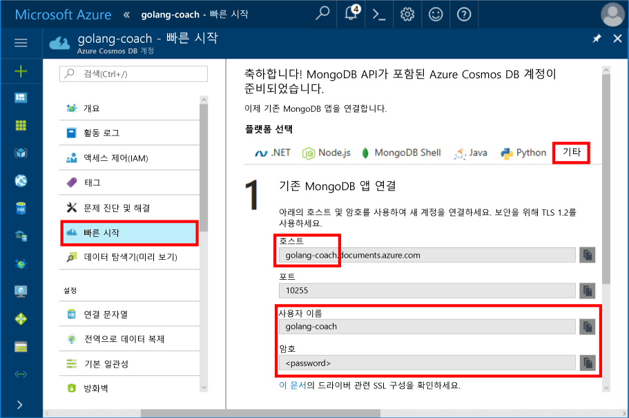
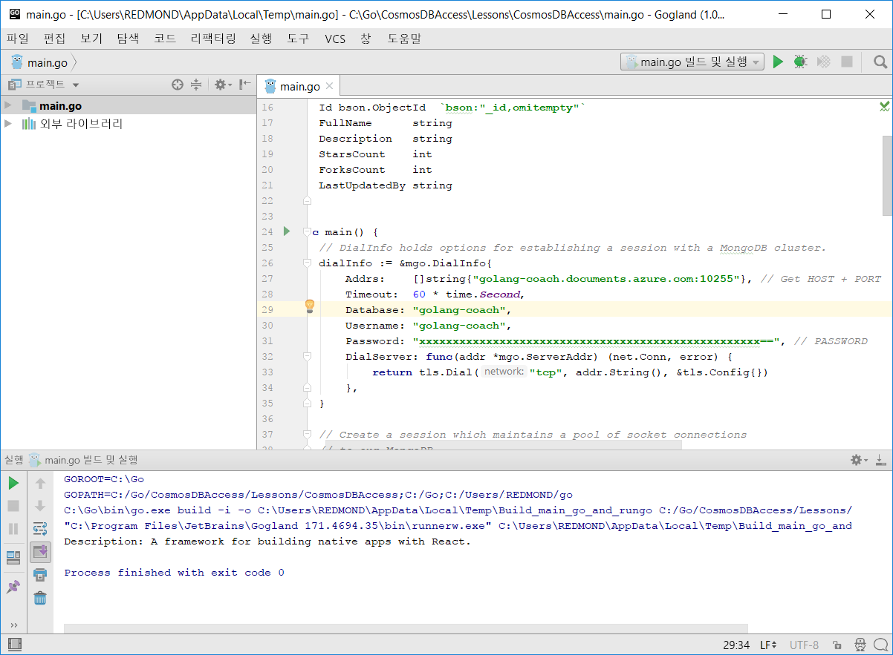
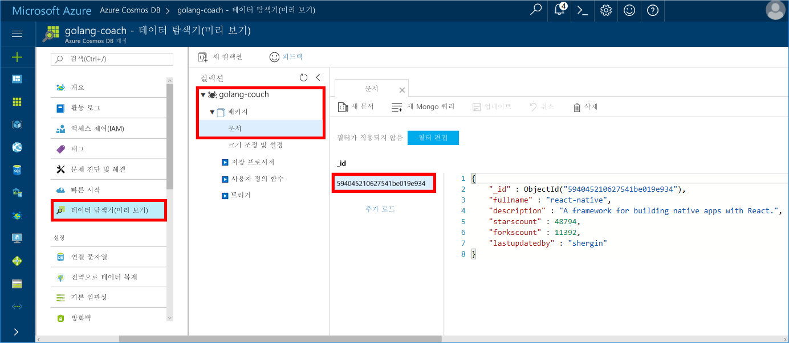

# <a name="build-a-console-app-using-azure-cosmos-dbs-api-for-mongodb-and-golang-sdk"></a>Azure Cosmos DB의 API for MongoDB 및 Golang SDK를 사용하여 콘솔 앱 빌드

> [!div class="op_single_selector"]
> * [.NET](create-mongodb-dotnet.md)
> * [Java](create-mongodb-java.md)
> * [Node.JS](create-mongodb-nodejs.md)
> * [Python](create-mongodb-flask.md)
> * [Xamarin](create-mongodb-xamarin.md)
> * [Golang](create-mongodb-golang.md)
>  

Azure Cosmos DB는 전 세계에 배포된 Microsoft의 다중 모델 데이터베이스 서비스입니다. Cosmos DB의 핵심인 글로벌 배포 및 수평적 크기 조정 기능의 이점을 활용하여 문서, 키/값 및 그래프 데이터베이스를 빠르게 만들고 쿼리할 수 있습니다.

이 빠른 시작에서는 Azure Cosmos DB의 API for MongoDB를 사용하여 [Golang](https://golang.org/)으로 작성된 기존 MongoDB 앱을 가져와서 Cosmos 데이터베이스에 연결하는 방법을 보여줍니다.

즉, Golang 애플리케이션은 MongoDB 클라이언트를 사용하여 연결한다는 사실만 알고 있습니다. Cosmos 데이터베이스에서 데이터가 저장되는 애플리케이션에 대해 투명합니다.

## <a name="prerequisites"></a>필수 조건

- Azure 구독. Azure 구독이 아직 없는 경우 시작하기 전에 [무료 계정](https://azure.microsoft.com/free) 을 만듭니다. 

  [!INCLUDE [cosmos-db-emulator-mongodb](../../includes/cosmos-db-emulator-mongodb.md)]

- [Go](https://golang.org/dl/) 및 [Go](https://golang.org/) 언어에 대한 기본 지식입니다.
- Jetbrains의 [GoLand](https://www.jetbrains.com/go/), Microsoft의 [Visual Studio Code](https://code.visualstudio.com/) 또는 [Atom](https://atom.io/)과 같은 IDE입니다. 이 자습서에서는 GoLand를 사용합니다.

<a id="create-account"></a>
## <a name="create-a-database-account"></a>데이터베이스 계정 만들기

[!INCLUDE [cosmos-db-create-dbaccount](../../includes/cosmos-db-create-dbaccount-mongodb.md)]

## <a name="clone-the-sample-application"></a>샘플 애플리케이션 복제

애플리케이션 예제를 복제하고 필요한 패키지를 설치합니다.

1. GOROOT\src 폴더 안에 CosmosDBSample이라는 폴더를 만듭니다(기본적으로 C:\Go\).
2. git bash와 같은 git 터미널 창을 사용하여 CosmosDBSample 폴더에 샘플 리포지토리를 복제하는 다음 명령을 실행합니다. 

    ```bash
    git clone https://github.com/Azure-Samples/azure-cosmos-db-mongodb-golang-getting-started.git
    ```
3.  다음 명령을 실행하여 mgo 패키지를 가져옵니다. 

    ```
    go get gopkg.in/mgo.v2
    ```

[mgo](https://labix.org/mgo) 드라이버는 표준 Go 코드를 따르는 매우 단순한 API하에서 풍부하고 충분한 테스트를 거쳐 엄선된 기능을 구현하는 [Go 언어](https://golang.org/)용 [MongoDB](https://www.mongodb.com/) 드라이버입니다.

<a id="connection-string"></a>

## <a name="update-your-connection-string"></a>연결 문자열 업데이트

이제 Azure Portal로 다시 이동하여 연결 문자열 정보를 가져와서 앱에 복사합니다.

1. 왼쪽 탐색 메뉴에서 **빠른 시작**을 클릭한 후 **기타**를 클릭하여 Go 애플리케이션에 필요한 연결 문자열 정보를 봅니다.

2. Goglang에서 GOROOT\CosmosDBSample 디렉터리의 main.go 파일을 열고 다음 스크린샷에 표시된 것처럼 Azure Portal의 연결 문자열 정보를 사용하여 코드의 다음 줄을 업데이트합니다. 

    데이터베이스 이름은 Azure Portal 연결 문자열 창의 **Host** 접두사 값입니다. 아래 이미지에 표시된 계정의 데이터베이스 이름은 golang-coach입니다.

    ```go
    Database: "The prefix of the Host value in the Azure portal",
    Username: "The Username in the Azure portal",
    Password: "The Password in the Azure portal",
    ```

    

3. main.go 파일을 저장합니다.

## <a name="review-the-code"></a>코드 검토

이 단계는 선택 사항입니다. 데이터베이스 리소스를 코드로 만드는 방법을 알아보려는 경우 다음 코드 조각을 검토할 수 있습니다. 그렇지 않으면 [앱 실행](#run-the-app)으로 넘어갈 수 있습니다. 

다음 코드 조각은 모두 main.go 파일에서 가져옵니다.

### <a name="connecting-the-go-app-to-cosmos-db"></a>Go 앱을 Cosmos DB에 연결

Azure Cosmos DB의 API for MongoDB는 SSL이 설정된 연결을 지원합니다. 연결하려면 [mgo.DialInfo](https://godoc.org/gopkg.in/mgo.v2#DialInfo)에서 **DialServer** 함수를 정의하고 [tls.*Dial*](https://golang.org/pkg/crypto/tls#Dial) 함수를 사용하여 연결을 수행해야 합니다.

다음 Golang 코드 조각은 Go 앱을 Azure Cosmos DB의 API for MongoDB와 연결합니다. *DialInfo* 클래스는 세션을 설정하는 옵션을 포함하고 있습니다.

```go
// DialInfo holds options for establishing a session.
dialInfo := &mgo.DialInfo{
    Addrs:    []string{"golang-couch.documents.azure.com:10255"}, // Get HOST + PORT
    Timeout:  60 * time.Second,
    Database: "database", // It can be anything
    Username: "username", // Username
    Password: "Azure database connect password from Azure Portal", // PASSWORD
    DialServer: func(addr *mgo.ServerAddr) (net.Conn, error) {
        return tls.Dial("tcp", addr.String(), &tls.Config{})
    },
}

// Create a session which maintains a pool of socket connections
// to Cosmos database (using Azure Cosmos DB's API for MongoDB).
session, err := mgo.DialWithInfo(dialInfo)

if err != nil {
    fmt.Printf("Can't connect, go error %v\n", err)
    os.Exit(1)
}

defer session.Close()

// SetSafe changes the session safety mode.
// If the safe parameter is nil, the session is put in unsafe mode, 
// and writes become fire-and-forget,
// without error checking. The unsafe mode is faster since operations won't hold on waiting for a confirmation.
// 
session.SetSafe(&mgo.Safe{})
```

**mgo.Dial()** 메서드는 SSL 연결이 없을 때 사용됩니다. SSL 연결을 위해서는 **mgo.DialWithInfo()** 메서드가 필요합니다.

**DialWIthInfo{}** 개체 인스턴스는 세션 개체를 만드는 데 사용됩니다. 세션이 설정되면 다음 코드 조각을 사용하여 컬렉션에 액세스할 수 있습니다.

```go
collection := session.DB("database").C("package")
```

<a id="create-document"></a>

### <a name="create-a-document"></a>문서 만들기

```go
// Model
type Package struct {
    Id bson.ObjectId  `bson:"_id,omitempty"`
    FullName      string
    Description   string
    StarsCount    int
    ForksCount    int
    LastUpdatedBy string
}

// insert Document in collection
err = collection.Insert(&Package{
    FullName:"react",
    Description:"A framework for building native apps with React.",
    ForksCount: 11392,
    StarsCount:48794,
    LastUpdatedBy:"shergin",

})

if err != nil {
    log.Fatal("Problem inserting data: ", err)
    return
}
```

### <a name="query-or-read-a-document"></a>문서 쿼리 또는 읽기

Cosmos DB는 각 컬렉션에 저장된 데이터에 대한 다양한 쿼리를 지원합니다. 다음 샘플 코드에서는 컬렉션에는 문서에 대해 실행할 수 있는 쿼리를 보여줍니다.

```go
// Get a Document from the collection
result := Package{}
err = collection.Find(bson.M{"fullname": "react"}).One(&result)
if err != nil {
    log.Fatal("Error finding record: ", err)
    return
}

fmt.Println("Description:", result.Description)
```


### <a name="update-a-document"></a>문서 업데이트

```go
// Update a document
updateQuery := bson.M{"_id": result.Id}
change := bson.M{"$set": bson.M{"fullname": "react-native"}}
err = collection.Update(updateQuery, change)
if err != nil {
    log.Fatal("Error updating record: ", err)
    return
}
```

### <a name="delete-a-document"></a>문서 삭제

Cosmos DB는 문서 삭제를 지원합니다.

```go
// Delete a document
query := bson.M{"_id": result.Id}
err = collection.Remove(query)
if err != nil {
   log.Fatal("Error deleting record: ", err)
   return
}
```
    
## <a name="run-the-app"></a>앱 실행

1. Golang에서 GOPATH(**파일**, **설정**, **Go**, **GOPATH**에 있음)에 gopkg가 설치된 위치(기본적으로 USERPROFILE\go)가 포함되어 있는지 확인합니다. 
2. 앱을 실행한 후 문서를 볼 수 있도록 문서를 삭제하는 줄(103-107번 줄)을 주석으로 처리합니다.
3. Golang에서 **실행**을 클릭한 다음, **'main.go 빌드 및 실행' 실행**을 클릭합니다.

    앱이 종료되고 [문서 만들기](#create-document)에서 만든 문서에 대한 설명이 표시됩니다.
    
    ```
    Description: A framework for building native apps with React.
    
    Process finished with exit code 0
    ```

    
    
## <a name="review-your-document-in-data-explorer"></a>데이터 탐색기에서 문서 검토

Azure Portal로 돌아가서 데이터 탐색기에서 문서를 확인합니다.

1. 왼쪽 탐색 메뉴에서 **데이터 탐색기(미리 보기)** 를 클릭하고 **golang-coach**, **package**를 확장한 후 **문서**를 클릭합니다. **문서** 탭에서 \_id를 클릭하면 오른쪽 창에 문서가 표시됩니다. 

    
    
2. 그러면 문서를 인라인으로 작업하고 **업데이트**를 클릭하여 저장할 수 있습니다. 또한 문서를 삭제하거나 새 문서 또는 쿼리를 만들 수 있습니다.

## <a name="review-slas-in-the-azure-portal"></a>Azure Portal에서 SLA 검토

[!INCLUDE [cosmosdb-tutorial-review-slas](../../includes/cosmos-db-tutorial-review-slas.md)]

## <a name="clean-up-resources"></a>리소스 정리

[!INCLUDE [cosmosdb-delete-resource-group](../../includes/cosmos-db-delete-resource-group.md)]

## <a name="next-steps"></a>다음 단계

이 빠른 시작에서는 Cosmos 계정을 만들고 Golang 앱을 실행하는 방법을 알아보았습니다. 이제 Cosmos 데이터베이스에 추가 데이터를 가져올 수 있습니다. 

> [!div class="nextstepaction"]
> [Azure Cosmos DB로 MongoDB 데이터 가져오기](mongodb-migrate.md)
