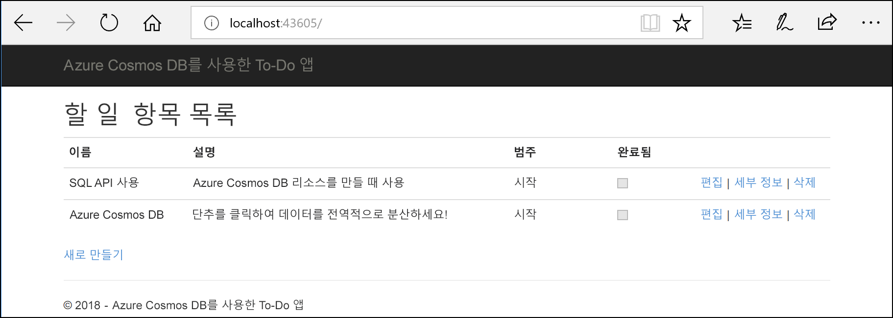
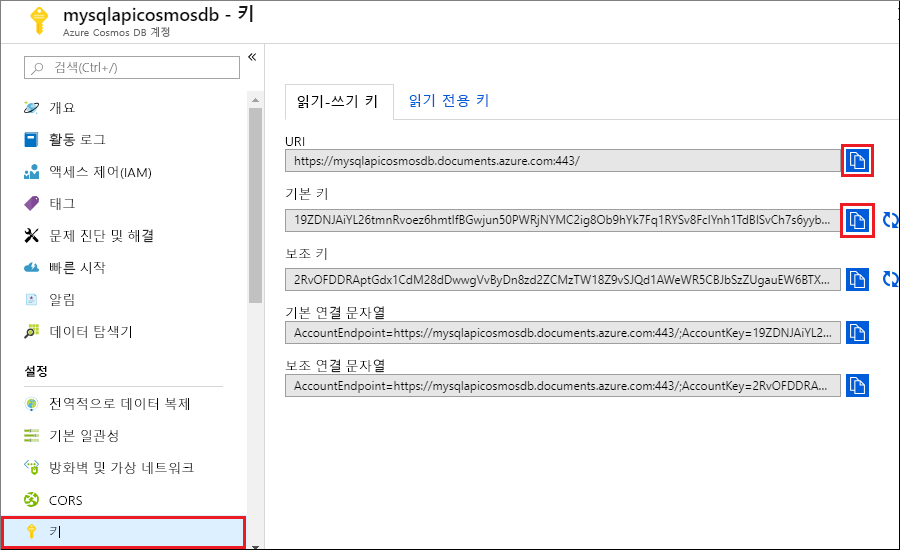
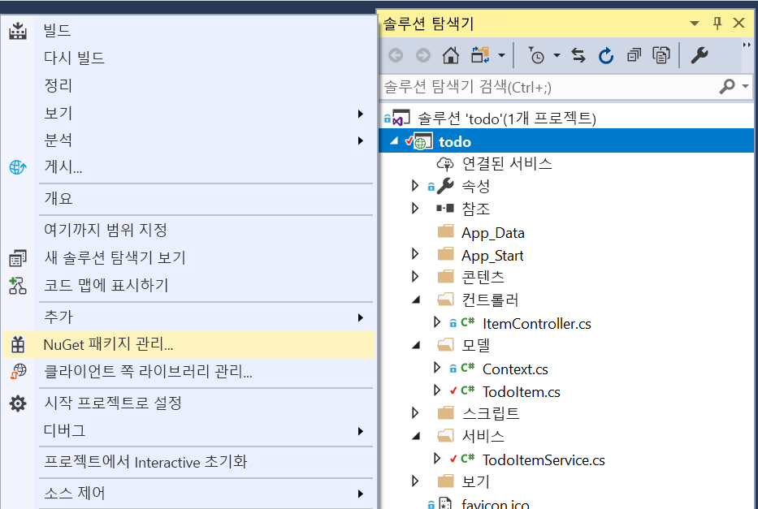

# <a name="quickstart-build-an-aspnet-web-app-using-azure-cosmos-db-sql-api-account"></a>빠른 시작: Azure Cosmos DB SQL API 계정을 사용하여 ASP.NET 웹앱 빌드

> [!div class="op_single_selector"]
> * [.NET(미리 보기)](create-sql-api-dotnet-preview.md)
> * [.NET](create-sql-api-dotnet.md)
> * [Java](create-sql-api-java.md)
> * [Node.JS](create-sql-api-nodejs.md)
> * [Python](create-sql-api-python.md)
> * [Xamarin](create-sql-api-xamarin-dotnet.md)
>  
> 

Azure Cosmos DB는 전역적으로 배포된 고가용성의 Microsoft의 다중 모델 데이터베이스 서비스입니다. Azure Cosmos DB의 핵심인 전역 배포 및 수평적 크기 조정 기능의 이점을 활용하여 문서, 키/값 및 그래프 데이터베이스를 빠르게 만들고 쿼리할 수 있습니다. 

이 빠른 시작에서는 Azure Portal을 사용하여 Azure Cosmos DB [SQL API](sql-api-introduction.md) 계정, 데이터베이스 및 컨테이너를 만드는 방법을 보여줍니다. 그런 다음, 아래 스크린샷과 같이 [SQL .NET API](sql-api-sdk-dotnet.md)에 작성된 ASP.NET 할 일 목록 웹앱을 빌드하고 배포합니다. 

이 빠른 시작에서는 Azure Cosmos DB .NET SDK 버전 3.0 이상을 사용합니다. 



## <a name="prerequisites"></a>필수 조건

Visual Studio 2019가 아직 설치되지 않은 경우 **체험판** [Visual Studio 2019 Community Edition](https://www.visualstudio.com/downloads/)을 다운로드하고 사용할 수 있습니다. Visual Studio를 설치하는 동안 **Azure 개발** 워크로드를 사용하도록 설정해야 합니다.

[!INCLUDE [quickstarts-free-trial-note](../../includes/quickstarts-free-trial-note.md)] 
[!INCLUDE [cosmos-db-emulator-docdb-api](../../includes/cosmos-db-emulator-docdb-api.md)]  

<a id="create-account"></a>
## <a name="create-a-database-account"></a>데이터베이스 계정 만들기

[!INCLUDE [cosmos-db-create-dbaccount-preview](../../includes/cosmos-db-create-dbaccount-preview.md)]

<a id="create-collection"></a>
## <a name="add-a-collection"></a>컬렉션 추가

[!INCLUDE [cosmos-db-create-collection-preview](../../includes/cosmos-db-create-collection-preview.md)]

<a id="add-sample-data"></a>
## <a name="add-sample-data"></a>샘플 데이터 추가

[!INCLUDE [cosmos-db-create-sql-api-add-sample-data](../../includes/cosmos-db-create-sql-api-add-sample-data.md)]

## <a name="query-your-data"></a>데이터 쿼리

[!INCLUDE [cosmos-db-create-sql-api-query-data](../../includes/cosmos-db-create-sql-api-query-data.md)]

## <a name="clone-the-sample-application"></a>샘플 응용 프로그램 복제

이제 코드 사용으로 전환해 보겠습니다. [GitHub에서 SQL API 앱](https://github.com/Azure-Samples/cosmos-dotnet-todo-app)을 복제하고 연결 문자열을 설정하고 실행해보겠습니다. 

1. 명령 프롬프트를 열고, git-samples라는 새 폴더를 만든 다음 명령 프롬프트를 닫습니다.

    ```bash
    md "C:\git-samples"
    ```

2. Git Bash와 같은 Git 터미널 창을 열고, `cd` 명령을 사용하여 샘플 앱을 설치할 새 폴더로 변경합니다.

    ```bash
    cd "C:\git-samples"
    ```

3. 다음 명령을 실행하여 샘플 리포지토리를 복제합니다. 이 명령은 컴퓨터에서 샘플 앱의 복사본을 만듭니다.

    ```bash
    git clone https://github.com/Azure-Samples/cosmos-dotnet-todo-app.git
    ```

4. Visual Studio에서 **todo.sln** 솔루션 파일을 엽니다. 

## <a name="review-the-code"></a>코드 검토

이 단계는 선택 사항입니다. 데이터베이스 리소스를 코드로 만드는 방법을 알아보려는 경우 다음 코드 조각을 검토할 수 있습니다. 그렇지 않으면 [연결 문자열 업데이트](#update-your-connection-string)로 건너뛸 수 있습니다. 

이전 버전의 .NET SDK에 익숙한 경우 '컬렉션' 및 '문서'라는 용어를 자주 들어 보셨을 것입니다. Azure Cosmos DB는 여러 API 모델을 지원하므로 .NET SDK 버전 3.0 이상에서는 일반 용어 '컨테이너' 및 '항목'을 사용합니다. 컨테이너는 컬렉션, 그래프 또는 테이블입니다. 항목은 문서, 에지/꼭짓점 또는 행이며, 컨테이너 내부의 콘텐츠입니다. [데이터베이스, 컨테이너 및 항목에 대해 알아봅니다.](databases-containers-items.md)

다음 코드 조각은 모두 ToDoItemService.cs 파일에서 가져옵니다.

* 68-69번 줄에서 CosmosClient가 초기화됩니다.

    ```csharp
    CosmosConfiguration config = new CosmosConfiguration(Endpoint, PrimaryKey);
    client = new CosmosClient(config);
    ```

* 71번 줄에서 새 데이터베이스가 만들어집니다.

    ```csharp
    CosmosDatabase database = await client.Databases.CreateDatabaseIfNotExistsAsync(DatabaseId);
    ```

* 파티션 키 "/category"를 사용하여 72번 줄에서 새 컨테이너가 만들어집니다.

    ```csharp
    CosmosContainer container = await database.Containers.CreateContainerIfNotExistsAsync(ContainerId, "/category");
    ```

## <a name="update-your-connection-string"></a>연결 문자열 업데이트

이제 Azure Portal로 다시 이동하여 연결 문자열 정보를 가져와서 앱에 복사합니다.

1. [Azure Portal](https://portal.azure.com/)의 Azure Cosmos DB 계정에서 왼쪽 탐색 영역의 **키**를 선택한 다음, **읽기-쓰기 키**를 선택합니다. 다음 단계에서 화면 오른쪽의 복사 단추를 사용하여 URI 및 기본 키를 web.config 파일에 복사하게 됩니다.

    

2. Visual Studio에서 **web.config** 파일을 엽니다. 

3. 포털에서 URI 값을 복사(복사 단추 사용)한 후 이 값을 web.config에서 ``endpoint`` 키 값으로 만듭니다. 

    `<add key="endpoint" value="FILLME" />`

4. 그런 다음, 포털에서 사용자의 기본 키 값을 복사하고 web.config의 ``primarykey`` 값으로 만듭니다. 

    `<add key="primaryKey" value="FILLME" />`
    
5. 그런 다음, 이전에 만든 데이터베이스 및 컨테이너의 이름과 일치하도록 데이터베이스 및 컨테이너 값을 업데이트합니다. 이제 Azure Cosmos DB와 통신하는 데 필요한 모든 정보로 앱이 업데이트되었습니다. 

    `<add key="database" value="Tasks" />`

    `<add key="container" value="Items" />`
    
## <a name="run-the-web-app"></a>웹앱 실행

1. **솔루션 탐색기**에서 Visual Studio 솔루션 아래에 있는 새 콘솔 애플리케이션 프로젝트를 마우스 오른쪽 단추로 클릭한 다음, **NuGet 패키지 관리...** 를 클릭합니다.
    
    
1. **NuGet** 탭에서 **찾아보기**를 클릭하고, 검색 상자에 **Microsoft.Azure.Cosmos**를 입력합니다.
1. 결과 내에서 **Microsoft.Azure.Cosmos**를 찾고 **설치**를 클릭합니다.
   Azure Cosmos DB SQL API 클라이언트 라이브러리의 패키지 ID는 [Microsoft Azure Cosmos DB Client Library](https://www.nuget.org/packages/Microsoft.Azure.Cosmos/)입니다.

   

    솔루션 변경 내용을 검토하는 메시지가 표시되면 **확인**을 클릭합니다. 라이선스 승인에 관한 메시지가 표시되면 **동의합니다.** 를 클릭합니다.

1. Ctrl + F5를 선택하여 응용 프로그램을 실행합니다. 앱이 브라우저에 표시됩니다. 

1. 브라우저에서 **새로 만들기**를 선택하고 Todo 앱에서 몇 가지 새 작업을 만듭니다. [샘플 데이터 추가](#add-sample-data)에서 만든 작업이 표시됩니다.

   

이제 데이터 탐색기로 돌아가서 이 새 데이터를 보고, 쿼리 및 수정하고 작업에 사용할 수 있습니다. 

## <a name="review-slas-in-the-azure-portal"></a>Azure Portal에서 SLA 검토

[!INCLUDE [cosmosdb-tutorial-review-slas](../../includes/cosmos-db-tutorial-review-slas.md)]

## <a name="clean-up-resources"></a>리소스 정리

[!INCLUDE [cosmosdb-delete-resource-group](../../includes/cosmos-db-delete-resource-group.md)]

## <a name="next-steps"></a>다음 단계

이 빠른 시작에서는 Azure Cosmos DB 계정을 만들고, 컨테이너를 만들고 데이터 탐색기를 사용하여 항목을 추가하고, 웹앱을 실행하는 방법을 알아보았습니다. 이제 사용자의 Cosmos DB 계정에 추가 데이터를 가져올 수 있습니다. 

> [!div class="nextstepaction"]
> [Azure Cosmos DB로 데이터 가져오기](import-data.md)


