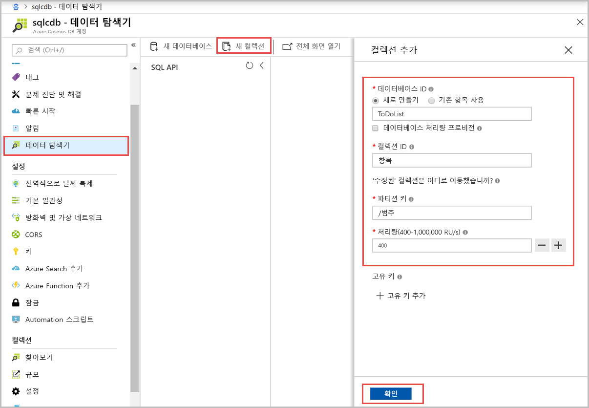
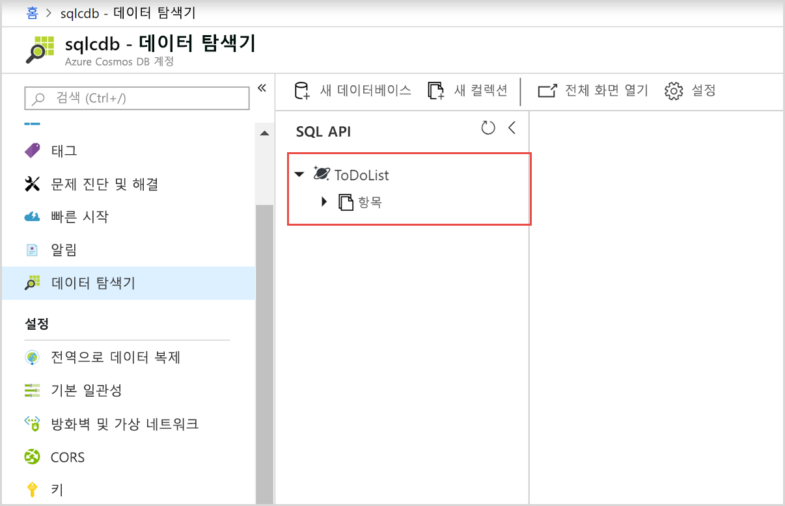
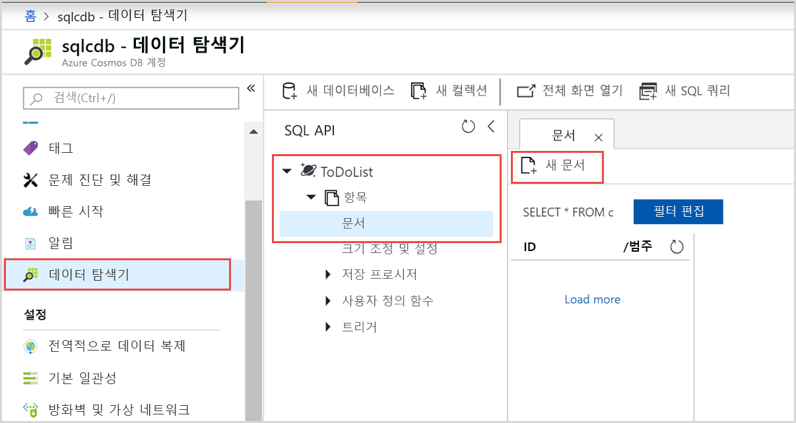
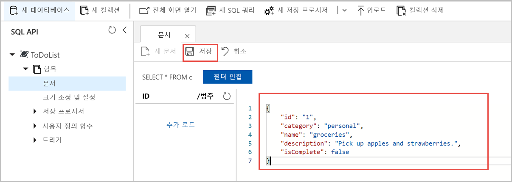
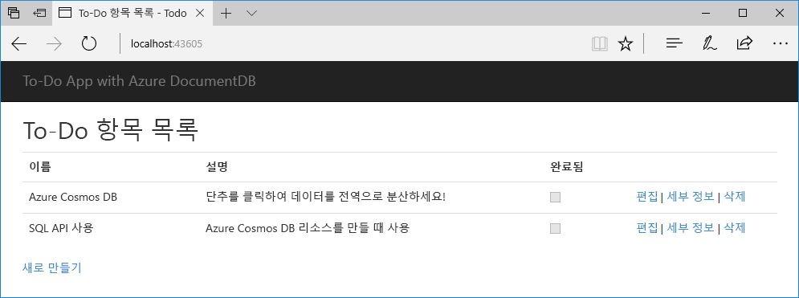

# <a name="quickstart-build-a-net-web-app-using-sql-api-account-in-azure-cosmos-db"></a>빠른 시작: Azure Cosmos DB의 SQL API 계정을 사용하여 .NET 웹앱 빌드

> [!div class="op_single_selector"]
> * [.NET](create-sql-api-dotnet.md)
> * [.NET(미리 보기)](create-sql-api-dotnet-preview.md)
> * [Java](create-sql-api-java.md)
> * [Node.JS](create-sql-api-nodejs.md)
> * [Python](create-sql-api-python.md)
> * [Xamarin](create-sql-api-xamarin-dotnet.md)
>  
> 

Azure Cosmos DB는 전 세계에 배포된 Microsoft의 다중 모델 데이터베이스 서비스입니다. Azure Cosmos DB를 사용하여 Azure Cosmos DB의 핵심인 글로벌 배포 및 수평적 크기 조정 기능의 이점을 활용하는 키/값 데이터베이스, 문서 데이터베이스 및 그래프 데이터베이스를 빠르게 만들고 쿼리할 수 있습니다. 

이 빠른 시작에서는 Azure Portal을 사용하여 Azure Cosmos DB [SQL API](sql-api-introduction.md) 계정, 문서 데이터베이스 및 컬렉션을 만들고 컬렉션에 데이터를 추가하는 방법을 보여줍니다. 그런 다음, [SQL .NET SDK](sql-api-sdk-dotnet.md) 웹앱을 사용하여 컬렉션에 더 많은 데이터를 추가합니다. 

이 빠른 시작에서는 Azure Portal에서 데이터 탐색기를 사용하여 데이터베이스 및 컬렉션을 만듭니다. 또한 .NET 샘플 코드를 사용하여 데이터베이스 및 컬렉션을 만들 수도 있습니다. 자세히 알아보려면 [.NET 코드 검토](#review-the-net-code)를 참조하세요. 

## <a name="prerequisites"></a>필수 조건

Azure 개발 워크플로가 설치된 Visual Studio 2019
- [Visual Studio 2019 Community Edition](https://www.visualstudio.com/downloads/) **평가판**을 다운로드하여 사용할 수 있습니다. Visual Studio를 설치하는 동안 **Azure 개발**을 사용하도록 설정합니다. 

Azure 구독 또는 Azure Cosmos DB 체험 계정
- [!INCLUDE [quickstarts-free-trial-note](../../includes/quickstarts-free-trial-note.md)] 
- [!INCLUDE [cosmos-db-emulator-docdb-api](../../includes/cosmos-db-emulator-docdb-api.md)]  

<a id="create-account"></a>
## <a name="create-an-azure-cosmos-db-account"></a>Azure Cosmos DB 계정 만들기

[!INCLUDE [cosmos-db-create-dbaccount](../../includes/cosmos-db-create-dbaccount.md)]

<a id="create-collection-database"></a>
## <a name="add-a-database-and-a-collection"></a>데이터베이스 및 컬렉션 추가 

Azure Portal에서 데이터 탐색기를 사용하여 데이터베이스 및 컬렉션을 만들 수 있습니다. 

1.  Azure Cosmos DB 계정 페이지의 왼쪽 탐색 모음에서 **데이터 탐색기**를 선택한 다음, **새 컬렉션**을 선택합니다. 
    
    **컬렉션 추가** 영역을 보려면 오른쪽으로 스크롤해야 할 수도 있습니다.
    
    
    
1.  **컬렉션 추가** 페이지에서 새 컬렉션에 대한 설정을 입력합니다.
    
    |설정|제안 값|설명
    |---|---|---|
    |**데이터베이스 ID**|ToDoList|새 데이터베이스의 이름으로 *ToDoList*를 입력합니다. 데이터베이스 이름은 1~255자여야 하며, `/, \\, #, ?` 또는 후행 공백은 포함할 수 없습니다.|
    |**컬렉션 ID**|Items|새 컬렉션의 이름으로 *Items*를 입력합니다. 컬렉션 ID에는 데이터베이스 이름과 동일한 문자 요구 사항이 적용됩니다.|
    |**파티션 키**| /category| 이 문서에 설명된 샘플은 파티션 키로 */category*를 사용합니다.|
    |**처리량**|400|처리량을 400 RU/s(초당 요청 단위)로 유지합니다. 대기 시간을 줄이면 나중에 처리량을 늘릴 수 있습니다.| 
    
    이 예제의 경우 **고유 키**를 추가하지 마세요. 고유 키를 사용하면 분할 키당 하나 이상의 값의 고유성을 보장하여 데이터베이스에 데이터 무결성 레이어를 추가할 수 있습니다. 자세한 내용은 [Azure Cosmos DB의 고유 키](unique-keys.md)를 참조하세요.
    
1.  **확인**을 선택합니다. 
    데이터 탐색기는 새 데이터베이스 및 컬렉션을 표시합니다.
    
    

## <a name="add-data-to-your-database"></a>데이터베이스에 데이터 추가

데이터 탐색기를 사용하여 새 데이터베이스에 데이터를 추가합니다.

1. **데이터 탐색기**에서 새 데이터는 **컬렉션** 창에 나타납니다. **ToDoList** 데이터베이스를 확장하고 **Items** 컬렉션을 확장하고 **문서**를 선택한 다음, **새 문서**를 선택합니다. 
   
   
   
1. 다음 구조를 **문서** 창 오른쪽의 문서에 추가합니다.

     ```json
     {
         "id": "1",
         "category": "personal",
         "name": "groceries",
         "description": "Pick up apples and strawberries.",
         "isComplete": false
     }
     ```

1. **저장**을 선택합니다.
   
   
   
1. **새 문서**를 다시 선택하고 고유한 `id`의 다른 문서를 만들고 저장한 다음, 원하는 다른 속성 및 값을 지정합니다. Azure Cosmos DB가 데이터에 어떠한 스키마도 적용하지 않으므로 해당 문서는 사용자가 원하는 어떠한 구조든 가질 수 있습니다.

## <a name="query-your-data"></a>데이터 쿼리

[!INCLUDE [cosmos-db-create-sql-api-query-data](../../includes/cosmos-db-create-sql-api-query-data.md)]

## <a name="use-the-net-web-app-to-manage-data"></a>.NET 웹앱을 사용하여 데이터 관리

Azure Cosmos DB 데이터를 프로그래밍 방식으로 작동하기가 얼마나 쉬운지 확인하기 위해 GitHub에서 샘플 SQL API .NET 웹앱을 복제하고 연결 문자열을 업데이트하고 앱을 실행하여 데이터를 업데이트합니다. 

또한 .NET 샘플 코드를 사용하여 데이터베이스 및 컬렉션을 만들 수도 있습니다. 자세히 알아보려면 [.NET 코드 검토](#review-the-net-code)를 참조하세요.

### <a name="clone-the-sample-app"></a>샘플 앱 복제

먼저 GitHub에서 C# [SQL API 앱](https://github.com/Azure-Samples/documentdb-dotnet-todo-app)을 복제합니다. 

1. Git 터미널 창(예: Git Bash)을 열고 *git-samples*라는 새 디렉터리를 만들고 해당 디렉터리로 변경합니다. 
   
   ```bash
   mkdir /c/git-samples/
   cd /c/git-samples/
   ```
   
1. 다음 명령을 실행하여 샘플 리포지토리를 복제하고 컴퓨터에 샘플 앱의 사본을 만듭니다.
   
   ```bash
   git clone https://github.com/Azure-Samples/documentdb-dotnet-todo-app.git
   ```

### <a name="update-the-connection-string"></a>연결 문자열 업데이트 

1. Visual Studio에서 복제한 앱의 *todo.sln* 파일을 탐색하고 엽니다. 

1. Visual Studio **솔루션 탐색기**에서 *web.config* 파일을 엽니다. 

1. Azure Portal로 다시 이동하고 연결 문자열 정보를 복사하여 *web.config*에 붙여넣습니다.
   
   1. Azure Cosmos DB 계정의 왼쪽 탐색 모음에서 **키**를 선택합니다.
      
      
      
   1. **읽기-쓰기 키** 아래에서 오른쪽의 복사 단추를 사용하여 **URI**를 복사하고 *web.config*의 `endpoint` 키에 붙여넣습니다. 예:  
      
      `<add key="endpoint" value="https://mysqlapicosmosdb.documents.azure.com:443/" />`
      
   1. **기본 키** 값을 복사하고 *web.config*의 `authKey` 키에 붙여넣습니다. 예: 
      
      `<add key="authKey" value="19ZDNJAiYL26tmnRvoez6hmtIfBGwjun50PWRjNYMC2ig8Ob9hYk7Fq1RYSv8FcIYnh1TdBISvCh7s6yyb0000==" />`

       
1. *web.config*의 데이터베이스 및 컬렉션 값이 이전에 만든 이름과 일치하는지 확인합니다. 

   ```csharp
   <add key="database" value="ToDoList"/>
   <add key="collection" value="Items"/>
   ```
 
1. *web.config*를 저장합니다. 이제 Azure Cosmos DB와 통신하는 데 필요한 모든 정보로 앱이 업데이트되었습니다.

### <a name="run-the-web-app"></a>웹앱 실행

1. Visual Studio의 **솔루션 탐색기**에서 **todo** 프로젝트를 마우스 오른쪽 단추로 클릭한 다음, **NuGet 패키지 관리**를 선택합니다. 

1. NuGet **찾아보기** 상자에 *DocumentDB*를 입력합니다.

1. 결과에서 **Microsoft.Azure.DocumentDB** 라이브러리를 아직 설치하지 않은 경우 지금 설치합니다. 그러면 [Microsoft.Azure.DocumentDB](https://www.nuget.org/packages/Microsoft.Azure.DocumentDB/) 패키지 및 모든 종속성이 설치됩니다.
   
   NuGet 패키지 관리자에서 일부 패키지가 솔루션에 없다는 메시지가 표시되면 **복원**을 선택하여 내부 소스에서 설치합니다. 

1. **Ctrl**+**F5**를 선택하여 브라우저에서 앱을 실행합니다. 

1. to-do 앱에서 **새로 만들기**를 선택하고 몇 가지 새 작업을 만듭니다.

   

Azure Portal에서 데이터 탐색기로 다시 이동하고 새 데이터를 사용하여 쿼리, 수정 및 작업할 수 있습니다. 

## <a name="review-the-net-code"></a>.NET 코드 검토

이 단계는 선택 사항입니다. 이 빠른 시작에서는 Azure Portal에서 데이터베이스 및 컬렉션을 만들고 .NET 샘플을 사용하여 샘플 데이터를 추가했습니다. .NET 샘플을 사용하여 데이터베이스 및 컬렉션을 만들 수도 있습니다. 코드에서 데이터베이스 리소스를 만드는 방법을 알아보려는 경우 다음 코드 조각을 검토합니다. 이 코드 조각은 모두 **todo** 프로젝트의 *DocumentDBRepository.cs* 파일에서 가져옵니다.

* 이 코드는 `DocumentClient`를 초기화합니다. 

    ```csharp
    client = new DocumentClient(new Uri(ConfigurationManager.AppSettings["endpoint"]), ConfigurationManager.AppSettings["authKey"]);
    ```

* 이 코드는 `CreateDatabaseAsync` 메서드를 사용하여 새 데이터베이스를 만듭니다.

    ```csharp
    await client.CreateDatabaseAsync(new Database { Id = DatabaseId });
    ```

* 다음 코드는 `CreateDocumentCollectionAsync` 메서드를 사용하여 새 컬렉션을 만듭니다.

    ```csharp
    private static async Task CreateCollectionIfNotExistsAsync(string partitionkey)
    {
       try
       {       
        await client.ReadDocumentCollectionAsync(UriFactory.CreateDocumentCollectionUri(DatabaseId, CollectionId), new RequestOptions { PartitionKey = new PartitionKey(partitionkey) });
       }
        catch (DocumentClientException e)
        {
           if (e.StatusCode == System.Net.HttpStatusCode.NotFound)
            {
                await client.CreateDocumentCollectionAsync(
                  UriFactory.CreateDatabaseUri(DatabaseId),
                   new DocumentCollection
                    {
                      Id = CollectionId,
                      PartitionKey = new PartitionKeyDefinition
                       {
                           Paths = new System.Collections.ObjectModel.Collection<string>(new List<string>() { partitionkey })
                        }
                    },
                      new RequestOptions { OfferThroughput = 400 });
            }
            else
            {
                throw;
            }
        }
    }
    ```

## <a name="clean-up-resources"></a>리소스 정리

[!INCLUDE [cosmosdb-delete-resource-group](../../includes/cosmos-db-delete-resource-group.md)]

## <a name="next-steps"></a>다음 단계

이 빠른 시작에서는 Azure Cosmos DB 계정을 만들고, 데이터 탐색기를 사용하여 데이터베이스 및 컬렉션을 만들고, .NET 웹앱을 실행하여 데이터를 업데이트하는 방법을 알아보았습니다. 이제 사용자의 Azure Cosmos DB 계정에 추가 데이터를 가져올 수 있습니다. 

> [!div class="nextstepaction"]
> [Azure Cosmos DB로 데이터 가져오기](import-data.md)

