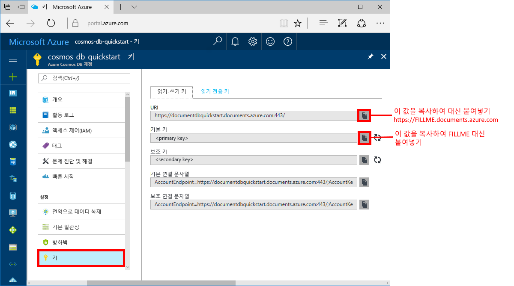

# <a name="azure-cosmos-db-create-a-document-database-using-java-and-the-azure-portal"></a>Azure Cosmos DB: Java 및 Azure Portal을 사용하여 문서 데이터베이스 만들기

Azure Cosmos DB는 전 세계에 배포된 Microsoft의 다중 모델 데이터베이스 서비스입니다. Azure Cosmos DB를 사용하여 관리되는 문서, 테이블 및 그래프 데이터베이스를 신속하게 만들고 쿼리할 수 있습니다.

이 빠른 시작은 Azure Cosmos DB [SQL API](sql-api-introduction.md)용 Azure Portal 도구를 사용하여 문서 데이터베이스를 만듭니다. 이 빠른 시작은 또한 [SQL Java API](sql-api-sdk-java.md)를 사용하여 Java 콘솔 앱을 빠르게 만드는 방법을 보여줍니다. 이 빠른 시작의 지침은 Java를 실행할 수 있는 모든 운영 체제에 적용될 수 있습니다. 이 빠른 시작을 완료하면 원하는 것이 무엇이든지 UI 또는 프로그래밍 방식으로 문서 데이터베이스 리소스를 만들고 수정하는 작업을 익히게 될 것입니다.

## <a name="prerequisites"></a>필수 조건

[!INCLUDE [quickstarts-free-trial-note](../../includes/quickstarts-free-trial-note.md)] 
[!INCLUDE [cosmos-db-emulator-docdb-api](../../includes/cosmos-db-emulator-docdb-api.md)]

또한, 

* [JDK(Java Development Kit) 1.7+](http://www.oracle.com/technetwork/java/javase/downloads/jdk8-downloads-2133151.html)
    * Ubuntu에서 `apt-get install default-jdk`를 실행하여 JDK를 설치합니다.
    * JAVA_HOME 환경 변수가 반드시 JDK가 설치된 폴더를 지정하도록 설정합니다.
* [Maven](http://maven.apache.org/) 이진 아카이브 [다운로드](http://maven.apache.org/download.cgi) 및 [설치](http://maven.apache.org/install.html)
    * Ubuntu에서 `apt-get install maven`을 실행하여 Maven을 실행할 수 있습니다.
* [Git](https://www.git-scm.com/)
    * Ubuntu에서 `sudo apt-get install git`를 실행하여 Git를 실행할 수 있습니다.

## <a name="create-a-database-account"></a>데이터베이스 계정 만들기

문서 데이터베이스를 만들기 전에 Azure Cosmos DB를 사용하여 SQL API 계정을 만들어야 합니다.

[!INCLUDE [cosmos-db-create-dbaccount](../../includes/cosmos-db-create-dbaccount.md)]

## <a name="add-a-collection"></a>컬렉션 추가

[!INCLUDE [cosmos-db-create-collection](../../includes/cosmos-db-create-collection.md)]

<a id="add-sample-data"></a>
## <a name="add-sample-data"></a>샘플 데이터 추가

[!INCLUDE [cosmos-db-create-sql-api-add-sample-data](../../includes/cosmos-db-create-sql-api-add-sample-data.md)]

## <a name="query-your-data"></a>데이터 쿼리

[!INCLUDE [cosmos-db-create-sql-api-query-data](../../includes/cosmos-db-create-sql-api-query-data.md)]

## <a name="clone-the-sample-application"></a>샘플 응용 프로그램 복제

이제 코드 사용으로 전환해 보겠습니다. GitHub에서 SQL API 앱을 복제하고 연결 문자열을 설정한 다음 실행해보겠습니다. 프로그래밍 방식으로 데이터를 사용하여 얼마나 쉽게 작업할 수 있는지 알게 될 것입니다. 

1. 명령 프롬프트를 git-samples라는 새 폴더를 만든 다음 명령 프롬프트를 닫습니다.

    ```bash
    md "C:\git-samples"
    ```

2. Git Bash와 같은 Git 터미널 창을 열고, `cd` 명령을 사용하여 샘플 앱을 설치할 새 폴더로 변경합니다. 

    ```bash
    cd "C:\git-samples"
    ```

3. 다음 명령을 실행하여 샘플 리포지토리를 복제합니다. 이 명령은 컴퓨터에서 샘플 앱의 복사본을 만듭니다.

    ```bash
    git clone https://github.com/Azure-Samples/azure-cosmos-db-documentdb-java-getting-started.git
    ```

## <a name="review-the-code"></a>코드 검토

이 단계는 옵션입니다. 데이터베이스 리소스를 코드로 만드는 방법을 알아보려는 경우 다음 코드 조각을 검토할 수 있습니다. 그렇지 않으면 [연결 문자열 업데이트](#update-your-connection-string)로 건너뛸 수 있습니다. 

다음 코드 조각은 모두 C:\git-samples\azure-cosmos-db-documentdb-java-getting-started\src\GetStarted\Program.java 파일에서 가져온 것입니다.

* `DocumentClient` 초기화 [DocumentClient](https://docs.microsoft.com/java/api/com.microsoft.azure.documentdb._document_client)에서는 Azure Cosmos DB 데이터베이스 서비스에 대한 클라이언트 쪽 논리적 표현을 제공합니다. 이 클라이언트는 서비스에 대한 요청을 구성하고 실행하는 데 사용됩니다. 이 코드의 `FILLME` 부분은 빠른 시작의 뒷부분에서 업데이트됩니다.

    ```java
    this.client = new DocumentClient("https://FILLME.documents.azure.com",
            "FILLME", 
            new ConnectionPolicy(),
            ConsistencyLevel.Session);
    ```

* [데이터베이스](https://docs.microsoft.com/java/api/com.microsoft.azure.documentdb._database) 생성

    ```java
    Database database = new Database();
    database.setId(databaseName);
    
    this.client.createDatabase(database, null);
    ```

* [DocumentCollection](https://docs.microsoft.com/java/api/com.microsoft.azure.documentdb._document_collection) 생성

    ```java
    DocumentCollection collectionInfo = new DocumentCollection();
    collectionInfo.setId(collectionName);

    ...

    this.client.createCollection(databaseLink, collectionInfo, requestOptions);
    ```

* [createDocument](https://docs.microsoft.com/java/api/com.microsoft.azure.documentdb._document_client.createdocument) 메서드를 사용하여 문서 생성

    ```java
    // Any Java object within your code can be serialized into JSON and written to Azure Cosmos DB
    Family andersenFamily = new Family();
    andersenFamily.setId("Andersen.1");
    andersenFamily.setLastName("Andersen");
    // More properties

    String collectionLink = String.format("/dbs/%s/colls/%s", databaseName, collectionName);
    this.client.createDocument(collectionLink, family, new RequestOptions(), true);
    ```

* JSON에 대한 SQL 쿼리는 [queryDocuments](https://docs.microsoft.com/java/api/com.microsoft.azure.documentdb._document_client.querydocuments) 메서드를 사용하여 수행됩니다.

    ```java
    FeedOptions queryOptions = new FeedOptions();
    queryOptions.setPageSize(-1);
    queryOptions.setEnableCrossPartitionQuery(true);

    String collectionLink = String.format("/dbs/%s/colls/%s", databaseName, collectionName);
    FeedResponse<Document> queryResults = this.client.queryDocuments(
        collectionLink,
        "SELECT * FROM Family WHERE Family.lastName = 'Andersen'", queryOptions);

    System.out.println("Running SQL query...");
    for (Document family : queryResults.getQueryIterable()) {
        System.out.println(String.format("\tRead %s", family));
    }
    ```    

## <a name="update-your-connection-string"></a>연결 문자열 업데이트

이제 Azure Portal로 다시 이동하여 연결 문자열 정보를 가져와서 앱에 복사합니다. 이를 통해 앱이 호스팅된 데이터베이스와 통신할 수 있게 됩니다.

1. [Azure Portal](http://portal.azure.com/)에서 **키**를 클릭합니다. 

    화면의 오른쪽에서 복사 단추를 사용하여 맨 위에 있는 URI 값을 복사합니다.

    

2. C:\git-samples\azure-cosmos-db-documentdb-java-getting-started\src\GetStarted 폴더에서 `Program.java` 파일을 엽니다. 

3. 포털의 URI 값을 45줄의 `https://FILLME.documents.azure.com`에 붙여넣습니다.

4. 포털로 돌아가서 스크린샷에 표시된 대로 기본 키 값을 복사합니다. 포털의 기본 키 값을 46줄의 `FILLME`에 붙여넣습니다.

    getStartedDemo 메서드는 이제 다음과 유사하게 표시됩니다. 
    
    ```java
    private void getStartedDemo() throws DocumentClientException, IOException {
        this.client = new DocumentClient("https://youraccountname.documents.azure.com:443/",
                "your-primary-key...RJhQrqQ5QQ==", 
                new ConnectionPolicy(),
                ConsistencyLevel.Session);
    ```

5. Program.java 파일을 저장합니다.

## <a name="run-the-app"></a>앱 실행

1. git 터미널 창에서 azure-cosmos-db-documentdb-java-getting-started 폴더에 `cd`합니다.

    ```git
    cd "C:\git-samples\azure-cosmos-db-documentdb-java-getting-started"
    ```

2. git 터미널 창에서 다음 명령을 사용하여 필요한 Java 패키지를 설치합니다.

    ```
    mvn package
    ```

3. git 터미널 창에서 다음 명령을 사용하여 Java 응용 프로그램을 시작합니다.

    ```
    mvn exec:java -D exec.mainClass=GetStarted.Program
    ```

    터미널 창은 FamilyDB 데이터베이스가 만들어졌다는 알림을 표시합니다. 
    
4. 데이터베이스를 만들려면 아무 키를 누른 다음, 또 다른 키를 눌러 컬렉션을 만듭니다. 

    프로그램이 끝나면 모든 리소스가 삭제되므로 브라우저에서 데이터 탐색기로 전환하여 FamilyDB 데이터베이스 및 FamilyCollection 컬렉션이 포함되어 있는지 확인합니다.

5. 콘솔 창으로 전환하고 아무 키를 눌러 첫 번째 문서를 만든 다음, 또 다른 키를 눌러 두 번째 문서를 만듭니다. 그리고 데이터 탐색기로 전환하여 문서를 살펴봅니다. 

6. 아무 키를 눌러 쿼리를 실행하고 콘솔 창에서 출력을 봅니다. 

7. 그 다음으로 키를 누르면 리소스가 삭제됩니다. 리소스를 유지하려면 콘솔 창에서 CTRL+C를 눌러 프로그램을 종료하면 됩니다. 유지할 생각이 없으면 요금이 발생하지 않도록 아무 키를 눌러 계정에서 리소스를 삭제합니다. 

    


## <a name="review-slas-in-the-azure-portal"></a>Azure Portal에서 SLA 검토

[!INCLUDE [cosmosdb-tutorial-review-slas](../../includes/cosmos-db-tutorial-review-slas.md)]

## <a name="clean-up-resources"></a>리소스 정리

[!INCLUDE [cosmosdb-delete-resource-group](../../includes/cosmos-db-delete-resource-group.md)]

## <a name="next-steps"></a>다음 단계

이 빠른 시작에서는 데이터 탐색기를 사용하여 Azure Cosmos DB 계정, 문서 데이터베이스, 컬렉션을 만들고, 프로그래밍 방법으로 같은 작업을 수행하도록 앱을 실행하는 방법을 알게 되었습니다. 이제 Azure Cosmos DB 컬렉션에 추가 데이터를 가져올 수 있습니다. 

> [!div class="nextstepaction"]
> [Azure Cosmos DB로 데이터 가져오기](import-data.md)


