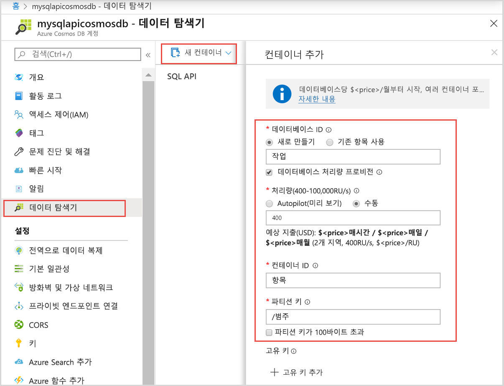

# <a name="quickstart-use-nodejs-to-connect-and-query-data-from-azure-cosmos-db-sql-api-account"></a>빠른 시작: Node.js를 사용하여 Azure Cosmos DB SQL API 계정에 연결하고 데이터 쿼리

> [!div class="op_single_selector"]
> - [.NET V3](create-sql-api-dotnet.md)
> - [.NET V4](create-sql-api-dotnet-V4.md)
> - [Java](create-sql-api-java.md)
> - [Node.JS](create-sql-api-nodejs.md)
> - [Python](create-sql-api-python.md)
> - [Xamarin](create-sql-api-xamarin-dotnet.md)

이 빠른 시작에서는 Azure Portal 및 GitHub에서 복제된 Node.js 앱을 사용하여 Azure Cosmos DB SQL API 계정을 만들고 관리합니다. Azure Cosmos DB는 글로벌 배포 및 수평적 크기 조정 기능을 사용하여 문서, 테이블, 키 값 및 그래프 데이터베이스를 빠르게 만들고 쿼리할 수 있는 다중 모델 데이터베이스 서비스입니다.

## <a name="prerequisites"></a>사전 요구 사항

- 활성 구독이 있는 Azure 계정. [체험 계정 만들기](https://azure.microsoft.com/free/?ref=microsoft.com&utm_source=microsoft.com&utm_medium=docs&utm_campaign=visualstudio) 또는 Azure 구독 없이 [무료로 Azure Cosmos DB를 사용](https://azure.microsoft.com/try/cosmosdb/)할 수 있습니다. URI가 `https://localhost:8081`이고 키가 `C2y6yDjf5/R+ob0N8A7Cgv30VRDJIWEHLM+4QDU5DE2nQ9nDuVTqobD4b8mGGyPMbIZnqyMsEcaGQy67XIw/Jw==`인 [Azure Cosmos DB 에뮬레이터](https://aka.ms/cosmosdb-emulator)를 사용할 수도 있습니다.
- [Node.js 6.0.0 이상](https://nodejs.org/).
- [Git](https://www.git-scm.com/downloads)

## <a name="create-an-azure-cosmos-account"></a>Azure Cosmos 계정 만들기

이 빠른 시작을 위해 [Azure Cosmos DB 체험](https://azure.microsoft.com/try/cosmosdb/) 옵션을 사용하여 Azure Cosmos 계정을 만들 수 있습니다.

1. [Azure Cosmos DB 체험](https://azure.microsoft.com/try/cosmosdb/) 페이지로 이동합니다.

1. **SQL** API 계정을 선택하고 **만들기**를 선택합니다. Microsoft 계정을 사용하여 로그인합니다.

1. 로그인이 성공하면 Azure Cosmos 계정이 준비되어야 합니다. **Azure Portal에서 열기**를 선택하여 새로 만든 계정을 엽니다.

"Azure Cosmos DB 체험" 옵션에는 Azure 구독이 필요하지 않으며, 30일의 제한된 기간 동안 Azure Cosmos 계정을 제공합니다. 더 오랜 기간 동안 Azure Cosmos 계정을 사용하려면 Azure 구독 내에서 [계정을 만들](create-cosmosdb-resources-portal.md#create-an-azure-cosmos-db-account)어야 합니다.

## <a name="add-a-container"></a>컨테이너 추가

이제 Azure Portal에서 Data Explorer 도구를 사용하여 데이터베이스 및 컨테이너를 만들 수 있습니다.

1. **Data Explorer** > **새 컨테이너**를 선택합니다.

   맨 오른쪽에 **컨테이너 추가** 영역이 표시되는데, 안 보이면 오른쪽으로 스크롤해야 합니다.

   

2. **컨테이너 추가** 페이지에서 새 컨테이너의 설정을 입력합니다.

   | 설정           | 제안 값 | Description                                                                                                                                                                                                                                                                                                                                                                           |
   | ----------------- | --------------- | ------------------------------------------------------------------------------------------------------------------------------------------------------------------------------------------------------------------------------------------------------------------------------------------------------------------------------------------------------------------------------------- |
   | **데이터베이스 ID**   | 작업           | 새 데이터베이스의 이름으로 _작업_을 입력합니다. 데이터베이스 이름은 1~255자여야 하며, `/, \\, #, ?` 또는 후행 공백은 포함할 수 없습니다. **데이터베이스 처리량 프로비전** 옵션을 선택합니다. 그러면 데이터베이스에 프로비저닝된 처리량을 데이터베이스 내 모든 컨테이너가 공유할 수 있습니다. 이 옵션은 비용 절감에도 도움이 됩니다. |
   | **처리량**    | 400             | 처리량을 400 RU/s(초당 요청 단위)로 유지합니다. 대기 시간을 줄이면 나중에 처리량을 늘릴 수 있습니다.                                                                                                                                                                                                                                                    |
   | **컨테이너 ID**  | Items           | 새 컨테이너의 이름으로 _Items_를 입력합니다. 컨테이너 ID에는 데이터베이스 이름과 동일한 문자 요구 사항이 적용됩니다.                                                                                                                                                                                                                                                               |
   | **파티션 키** | /category       | 이 문서에 설명된 샘플은 파티션 키로 _/category_를 사용합니다.                                                                                                                                                                                                                                                                                                           |

   앞의 설정 외에도, 필요에 따라 컨테이너의 **고유 키**를 추가할 수 있습니다. 이 예에서 필드는 비워 두겠습니다. 고유 키는 데이터베이스에 데이터 무결성 계층을 추가할 수 있는 기능을 개발자에게 제공합니다. 컨테이너를 만드는 동안 고유 키 정책을 만들면 파티션 키당 하나 이상의 값에 대한 고유성이 보장됩니다. 자세한 내용은 [Azure Cosmos DB의 고유 키](unique-keys.md) 문서를 참조하세요.

   **확인**을 선택합니다. Data Explorer에 새 데이터베이스와 컨테이너가 표시됩니다.

## <a name="add-sample-data"></a>샘플 데이터 추가

[!INCLUDE [cosmos-db-create-sql-api-add-sample-data](../../includes/cosmos-db-create-sql-api-add-sample-data.md)]

## <a name="query-your-data"></a>데이터 쿼리

[!INCLUDE [cosmos-db-create-sql-api-query-data](../../includes/cosmos-db-create-sql-api-query-data.md)]

## <a name="clone-the-sample-application"></a>샘플 애플리케이션 복제

이제 GitHub에서 Node.js 앱을 복제하고 연결 문자열을 설정한 다음, 실행해 보겠습니다.

1. 다음 명령을 실행하여 샘플 리포지토리를 복제합니다. 이 명령은 컴퓨터에서 샘플 앱의 복사본을 만듭니다.

   ```bash
   git clone https://github.com/Azure-Samples/azure-cosmos-db-sql-api-nodejs-getting-started.git
   ```

## <a name="review-the-code"></a>코드 검토

이 단계는 선택 사항입니다. Azure Cosmos 데이터베이스 리소스를 코드로 만드는 방법을 알아보려면 다음 코드 조각을 검토하면 됩니다. 그렇지 않으면 [연결 문자열 업데이트](#update-your-connection-string)로 건너뛸 수 있습니다.

이전 버전의 SQL JavaScript SDK에 익숙한 경우 _컬렉션_ 및 _문서_라는 용어를 자주 들어 보셨을 것입니다. Azure Cosmos DB가 [여러 API 모델](introduction.md)을 지원하므로 [JavaScript SDK 버전 2.0 이상](https://www.npmjs.com/package/@azure/cosmos)에서는 컬렉션, 그래프 또는 테이블을 가리키는 일반적인 용어인 _컨테이너_와 컨테이너의 콘텐츠를 설명하는 _항목_이라는 용어를 사용합니다.

Cosmos DB JavaScript SDK는 "@azure/cosmos"라고 하며 npm에서 설치할 수 있습니다.

```bash
npm install @azure/cosmos
```

다음 코드 조각은 모두 _app.js_ 파일에서 가져옵니다.

- `CosmosClient`는 `@azure/cosmos` npm 패키지에서 가져옵니다.

  ```javascript
  const CosmosClient = require("@azure/cosmos").CosmosClient;
  ```

- 새 `CosmosClient` 개체가 초기화되었습니다.

  ```javascript
  const client = new CosmosClient({ endpoint, key });
  ```

- "Tasks" 데이터베이스를 선택합니다.

  ```javascript
  const database = await client.databases(databaseId);
  ```

- "Items" 컨테이너/컬렉션을 선택합니다.

  ```javascript
  const container = await client.databases(containerId);
  ```

- "Items" 컨테이너의 모든 항목을 선택합니다.

  ```javascript
  // query to return all items
  const querySpec = {
    query: "SELECT * from c"
  };

  const { resources: results } = await container.items
    .query(querySpec)
    .fetchAll();
  ```

- 새 항목 만들기

  ```javascript
  const { resource: createdItem } = await container.items.create(newItem);
  ```

- 항목 업데이트

  ```javascript
  const { id, category } = createdItem;

  createdItem.isComplete = true;
  const { resource: itemToUpdate } = await container
    .item(id, category)
    .replace(itemToUpdate);
  ```

- 항목 삭제

  ```javascript
  const { resource: result } = await this.container.item(id, category).delete();
  ```

> [!NOTE]
> "Update" 및 "delete" 메서드에서는 `container.item()`을 호출하여 데이터베이스에서 항목을 선택해야 합니다. 전달된 두 개의 매개 변수는 항목의 ID와 항목의 파티션 키입니다. 이 경우 파티션 키는 "category" 필드의 값입니다.

## <a name="update-your-connection-string"></a>연결 문자열 업데이트

Azure Portal로 돌아가서 Azure Cosmos 계정의 연결 문자열 세부 정보를 가져옵니다. 앱이 데이터베이스에 연결할 수 있도록 연결 문자열을 앱에 복사합니다.

1. [Azure Portal](https://portal.azure.com/)의 Azure Cosmos DB 계정에서 왼쪽 탐색 영역의 **키**를 선택한 다음, **읽기-쓰기 키**를 선택합니다. 다음 단계에서 화면 오른쪽의 복사 단추를 사용하여 URI 및 기본 키를 _app.js_ 파일에 복사합니다.

   

2. _config.js_ 파일을 엽니다.

3. 포털에서 URI 값을 복사(복사 단추 사용)하고 이 값을 _config.js_에서 엔드포인트 키 값으로 만듭니다.

   `endpoint: "<Your Azure Cosmos account URI>"`

4. 그런 다음, 포털에서 사용자의 기본 키 값을 복사하고 _config.js_의 `config.key` 값으로 만듭니다. 이제 Azure Cosmos DB와 통신하는 데 필요한 모든 정보로 앱이 업데이트되었습니다.

   `key: "<Your Azure Cosmos account key>"`

## <a name="run-the-app"></a>앱 실행

1. 터미널에서 `npm install`을 실행하여 "@azure/cosmos" npm 패키지를 설치합니다.

2. 터미널에서 `node app.js`을 실행하여 노드 애플리케이션을 시작합니다.

3. 이 빠른 시작의 앞부분에서 만든 두 항목이 나열됩니다. 새 항목이 생성됩니다. 해당 항목의 "isComplete" 플래그는 "true"로 업데이트된 다음, 마지막으로 항목이 삭제됩니다.

이 샘플 애플리케이션을 계속 실험하거나 Data Explorer로 돌아가서 데이터를 수정 및 작업할 수 있습니다.

## <a name="review-slas-in-the-azure-portal"></a>Azure Portal에서 SLA 검토

[!INCLUDE [cosmosdb-tutorial-review-slas](../../includes/cosmos-db-tutorial-review-slas.md)]

## <a name="next-steps"></a>다음 단계

이 빠른 시작에서는 Azure Cosmos DB 계정을 만들고, 데이터 탐색기를 사용하여 컨테이너를 만들고, Node.js 앱을 실행하는 방법을 알아보았습니다. 이제 사용자의 Azure Cosmos DB 계정에 추가 데이터를 가져올 수 있습니다.

> [!div class="nextstepaction"]
> [azure cosmos db로 데이터 가져오기](import-data.md)
