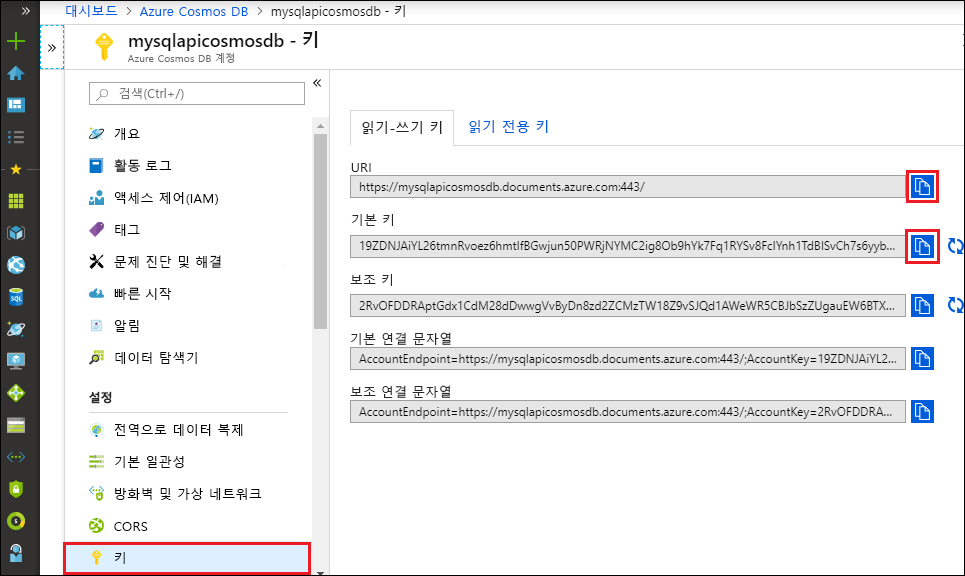

# <a name="quickstart-build-a-python-application-using-an-azure-cosmos-db-sql-api-account"></a>빠른 시작: Azure Cosmos DB SQL API 계정을 사용하여 Python 애플리케이션 빌드

> [!div class="op_single_selector"]
> * [.NET V3](create-sql-api-dotnet.md)
> * [.NET V4](create-sql-api-dotnet-V4.md)
> * [Java](create-sql-api-java.md)
> * [Node.JS](create-sql-api-nodejs.md)
> * [Python](create-sql-api-python.md)
> * [Xamarin](create-sql-api-xamarin-dotnet.md)

이 빠른 시작에서는 Azure Portal을 사용하여 Azure Cosmos DB [SQL API](sql-api-introduction.md) 계정, 문서 데이터베이스 및 컨테이너를 만드는 방법을 보여줍니다. 그런 다음, [SQL API](sql-api-sdk-python.md)용 Python SDK를 사용하여 빌드된 콘솔 앱을 빌드하고 실행합니다.

Azure Cosmos DB는 전 세계에 배포된 Microsoft의 다중 모델 데이터베이스 서비스입니다. 문서, 키/값, 넓은 열 및 그래프 데이터베이스를 신속하게 만들고 쿼리할 수 있습니다. 이러한 모든 작업은 Azure Cosmos DB의 분포와 규모의 이점을 활용합니다.

이 빠른 시작에서는 [Python SDK](https://pypi.org/project/azure-cosmos/#history) 버전 4를 사용합니다.

[!INCLUDE [quickstarts-free-trial-note](../../includes/quickstarts-free-trial-note.md)] [!INCLUDE [cosmos-db-emulator-docdb-api](../../includes/cosmos-db-emulator-docdb-api.md)]

## <a name="prerequisites"></a>필수 조건

* `PATH`에서 `python` 실행 파일을 사용할 수 있는 [Python 3.6 이상](https://www.python.org/downloads/)
* [Visual Studio Code](https://code.visualstudio.com/)
* [Visual Studio Code용 Python 확장](https://marketplace.visualstudio.com/items?itemName=ms-python.python#overview)

## <a name="create-a-database-account"></a>데이터베이스 계정 만들기

[!INCLUDE [cosmos-db-create-dbaccount](../../includes/cosmos-db-create-dbaccount.md)]

## <a name="add-a-container"></a>컨테이너 추가

[!INCLUDE [cosmos-db-create-collection](../../includes/cosmos-db-create-collection.md)]

## <a name="add-sample-data"></a>샘플 데이터 추가

[!INCLUDE [cosmos-db-create-sql-api-add-sample-data](../../includes/cosmos-db-create-sql-api-add-sample-data.md)]

## <a name="query-your-data"></a>데이터 쿼리

[!INCLUDE [cosmos-db-create-sql-api-query-data](../../includes/cosmos-db-create-sql-api-query-data.md)]

## <a name="clone-the-sample-application"></a>샘플 애플리케이션 복제

이제 GitHub에서 SQL API 앱을 복제하고, 연결 문자열을 설정하고, 실행해보겠습니다.

1. 명령 프롬프트를 열고, git-samples라는 새 폴더를 만든 다음 명령 프롬프트를 닫습니다.

    ```cmd
    md "git-samples"
    ```
   bash 프롬프트를 사용하는 경우에는 다음 명령을 대신 사용해야 합니다.

   ```bash
   mkdir "git-samples"
   ```

2. Git Bash와 같은 Git 터미널 창을 열고, `cd` 명령을 사용하여 샘플 앱을 설치할 새 폴더로 변경합니다.

    ```bash
    cd "git-samples"
    ```

3. 다음 명령을 실행하여 샘플 리포지토리를 복제합니다. 이 명령은 컴퓨터에서 샘플 앱의 복사본을 만듭니다. 

    ```bash
    git clone https://github.com/Azure-Samples/azure-cosmos-db-python-getting-started.git
    ```  

## <a name="update-your-connection-string"></a>연결 문자열 업데이트

이제 Azure Portal로 다시 이동하여 연결 문자열 정보를 가져와서 앱에 복사합니다.

1. [Azure Portal](https://portal.azure.com/)의 Azure Cosmos 계정에서 왼쪽 탐색 영역에 있는 **키**를 선택합니다. 다음 단계에서 화면 오른쪽의 복사 단추를 사용하여 **URI** 및 **기본 키**를 `cosmos_get_started.py` 파일에 복사하게 됩니다.

    

2. Visual Studio Code의 \git-samples\azure-cosmos-db-python-getting-started에서 `cosmos_get_started.py` 파일을 엽니다.

3. 복사 단추를 사용하여 포털에서 **URI** 값을 복사하고, 이 값을 ``cosmos_get_started.py``의 **endpoint** 변수 값으로 만듭니다. 

    `endpoint = 'https://FILLME.documents.azure.com',`

4. 그런 다음, 포털에서 **기본 키** 값을 복사하고, 이 값을 ``cosmos_get_started.py``의 **key** 값으로 만듭니다. 이제 Azure Cosmos DB와 통신하는 데 필요한 모든 정보로 앱이 업데이트되었습니다. 

    `key = 'FILLME'`

5. ``cosmos_get_started.py`` 파일을 저장합니다.

## <a name="review-the-code"></a>코드 검토

이 단계는 선택 사항입니다. 코드에서 만든 데이터베이스 리소스에 대해 알아보거나 [연결 문자열 업데이트](#update-your-connection-string)로 건너뜁니다.

다음 코드 조각은 모두 `cosmos_get_started.py` 파일에서 가져옵니다.

* CosmosClient가 초기화됩니다. [연결 문자열 업데이트](#update-your-connection-string) 섹션에서 설명한 대로 "endpoint" 및 "key" 값을 업데이트해야 합니다. 

    [!code-python[](~/azure-cosmos-db-python-getting-started/cosmos_get_started.py?name=create_cosmos_client)]

* 새 데이터베이스가 만들어집니다.

    [!code-python[](~/azure-cosmos-db-python-getting-started/cosmos_get_started.py?name=create_database_if_not_exists)]

* [프로비저닝된 처리량](request-units.md)이 400RU/초인 새 컨테이너가 만들어집니다. `lastName`을 [파티션 키](partitioning-overview.md#choose-partitionkey)로 선택합니다. 그러면 이 속성을 필터링하는 효율적인 쿼리를 수행할 수 있습니다. 

    [!code-python[](~/azure-cosmos-db-python-getting-started/cosmos_get_started.py?name=create_container_if_not_exists)]

* 일부 항목은 컨테이너에 추가됩니다. 컨테이너는 다양한 스키마를 포함할 수 있는 항목(JSON 문서)의 컬렉션입니다. ```get_[name]_family_item``` 도우미 메서드는 Azure Cosmos DB에 JSON 문서로 저장된 패밀리의 표현을 반환합니다.

    [!code-python[](~/azure-cosmos-db-python-getting-started/cosmos_get_started.py?name=create_item)]

* 포인트 읽기(키 값 조회)는 `read_item` 메서드를 사용하여 수행됩니다. 각 작업에 대한 [RU 요금](request-units.md)이 출력됩니다.
    [!code-python[](~/azure-cosmos-db-python-getting-started/cosmos_get_started.py?name=read_item)]

* 쿼리는 SQL 쿼리 구문을 사용하여 수행됩니다. WHERE 절에서 ```lastName```의 파티션 키 값을 사용하므로 Azure Cosmos DB에서 이 쿼리를 관련 파티션으로 효율적으로 라우팅하여 성능을 향상시킵니다.

    [!code-python[](~/azure-cosmos-db-python-getting-started/cosmos_get_started.py?name=query_items)]
   
## <a name="run-the-app"></a>앱 실행

1. Visual Studio Code에서 **보기** > **명령 팔레트**를 선택합니다. 

2. 프롬프트에서 **Python: Select Interpreter**를 입력한 다음, 사용할 Python 버전을 선택합니다.

    선택한 인터프리터를 나타내도록 Visual Studio Code의 바닥글이 업데이트됩니다. 

3. **보기** > **통합 터미널**을 선택하여 Visual Studio Code 통합 터미널을 엽니다.

4. 통합 터미널 창에서, azure-cosmos-db-python-getting-started 폴더를 실행 중인지 확인합니다. 이 폴더에 있지 않으면 다음 명령을 실행하여 샘플 폴더로 전환합니다. 

    ```cmd
    cd "\git-samples\azure-cosmos-db-python-getting-started"`
    ```

5. 다음 명령을 실행하여 azure-cosmos 패키지를 설치합니다. 

    ```python
    pip install --pre azure-cosmos
    ```

    azure-cosmos를 설치하려고 하면 액세스 거부 오류가 발생하는 경우 [관리자 권한으로 VS Code를 실행](https://stackoverflow.com/questions/37700536/visual-studio-code-terminal-how-to-run-a-command-with-administrator-rights)해야 합니다.

6. 다음 명령을 실행하여 샘플을 실행하고 새 문서를 만들어 Azure Cosmos DB에 저장합니다.

    ```python
    python cosmos_get_started.py
    ```

7. 새 항목이 만들어져 저장되었는지 확인하려면 Azure Portal에서 **Data Explorer** > **AzureSampleFamilyDatabase** > **항목**을 차례로 선택합니다. 만든 항목이 표시됩니다. 예를 들어 다음은 Andersen 제품군에 대한 JSON 문서 샘플입니다.

```json
{
    "id": "Andersen-1569479288379",
    "lastName": "Andersen",
    "district": "WA5",
    "parents": [
        {
            "familyName": null,
            "firstName": "Thomas"
        },
        {
            "familyName": null,
            "firstName": "Mary Kay"
        }
    ],
    "children": null,
    "address": {
        "state": "WA",
        "county": "King",
        "city": "Seattle"
    },
    "registered": true,
    "_rid": "8K5qAIYtZXeBhB4AAAAAAA==",
    "_self": "dbs/8K5qAA==/colls/8K5qAIYtZXc=/docs/8K5qAIYtZXeBhB4AAAAAAA==/",
    "_etag": "\"a3004d78-0000-0800-0000-5d8c5a780000\"",
    "_attachments": "attachments/",
    "_ts": 1569479288
}
```

## <a name="review-slas-in-the-azure-portal"></a>Azure Portal에서 SLA 검토

[!INCLUDE [cosmosdb-tutorial-review-slas](../../includes/cosmos-db-tutorial-review-slas.md)]

## <a name="clean-up-resources"></a>리소스 정리

[!INCLUDE [cosmosdb-delete-resource-group](../../includes/cosmos-db-delete-resource-group.md)]

## <a name="next-steps"></a>다음 단계

이 빠른 시작에서는 Azure Cosmos 계정을 만들고, Data Explorer를 사용하여 컨테이너를 만들고, 앱을 실행하는 방법을 알아보았습니다. 이제 사용자의 Cosmos DB 계정에 추가 데이터를 가져올 수 있습니다. 

> [!div class="nextstepaction"]
> [SQL API에 대한 Azure Cosmos DB로 데이터 가져오기](import-data.md)


