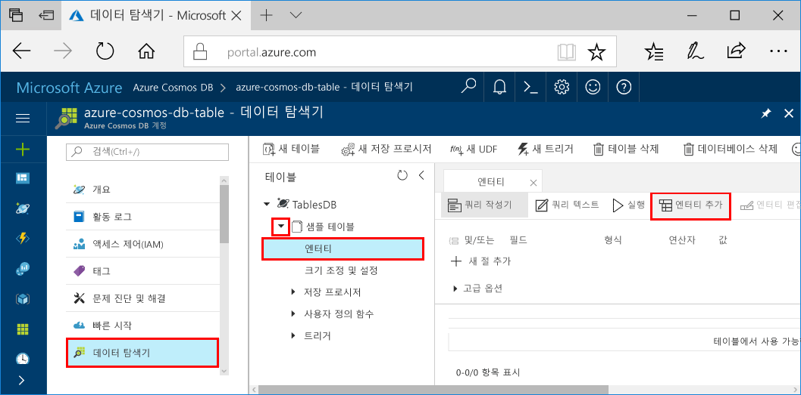
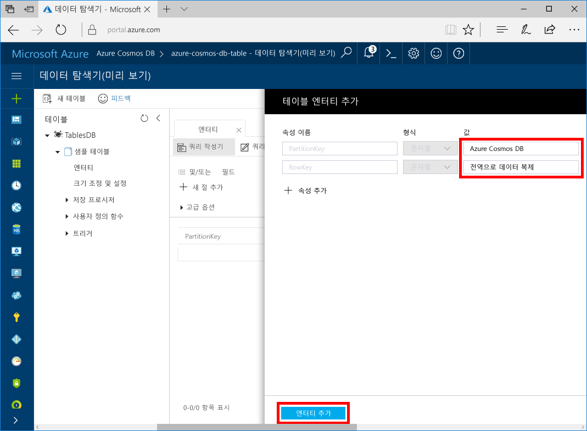

# Azure Cosmos DB: 테이블 API를 사용하여 .NET 응용 프로그램 빌드
<a id="azure-cosmos-db-build-a-net-application-using-the-table-api" class="xliff"></a>

Azure Cosmos DB는 전 세계에 배포된 Microsoft의 다중 모델 데이터베이스 서비스입니다. Azure Cosmos DB의 핵심인 전역 배포 및 수평적 크기 조정 기능의 이점을 활용하여 문서, 키/값 및 그래프 데이터베이스를 빠르게 만들고 쿼리할 수 있습니다. 

이 빠른 시작에서는 Azure Portal을 사용하여 Azure Cosmos DB 계정 및 해당 계정 내에서 테이블을 만드는 방법을 보여 줍니다. 그런 다음 엔터티를 삽입, 업데이트 및 삭제하는 코드를 작성하고, NuGet의 새로운 [Microsoft Azure Storage Premium Table](https://aka.ms/premiumtablenuget)(미리 보기) 패키지를 사용하여 일부 쿼리를 실행합니다. 이 라이브러리는 공용 [Microsoft Azure Storage SDK](https://www.nuget.org/packages/WindowsAzure.Storage)와 동일한 클래스 및 메서드 시그니처를 갖추고 있지만 [Table API](table-introduction.md)(미리 보기)를 사용하여 Azure Cosmos DB 계정에 연결할 수 있습니다. 

## 필수 조건
<a id="prerequisites" class="xliff"></a>

Visual Studio 2017이 아직 설치되지 않은 경우 **체험판** [Visual Studio 2017 Community Edition](https://www.visualstudio.com/downloads/)을 다운로드하고 사용할 수 있습니다. Visual Studio를 설정하는 동안 **Azure 개발**을 사용할 수 있는지 확인합니다.

[!INCLUDE [quickstarts-free-trial-note](../../includes/quickstarts-free-trial-note.md)]

## 데이터베이스 계정 만들기
<a id="create-a-database-account" class="xliff"></a>

[!INCLUDE [cosmos-db-create-dbaccount-table](../../includes/cosmos-db-create-dbaccount-table.md)]

## 테이블 추가
<a id="add-a-table" class="xliff"></a>

[!INCLUDE [cosmos-db-create-table](../../includes/cosmos-db-create-table.md)]

## 샘플 데이터 추가
<a id="add-sample-data" class="xliff"></a>

이제 데이터 탐색기(미리 보기)를 사용하여 새 테이블에 데이터를 추가할 수 있습니다.

1. 데이터 탐색기에서 **sample-table**, **엔터티**를 클릭한 다음 **엔터티 추가**를 클릭합니다.

   
2. 이제 PartitionKey 값 상자 및 RowKey 값 상자에 데이터를 추가하고 **엔터티 추가**를 클릭합니다.

   
  
    이제 테이블에 더 많은 엔터티를 추가하고 엔터티를 편집하거나 데이터 탐색기에서 데이터를 쿼리할 수 있습니다. 데이터 탐색기에서는 처리량을 확장하고 테이블에 저장된 프로시저, 사용자 정의 함수 및 트리거를 추가할 수 있습니다.

## 샘플 응용 프로그램 복제
<a id="clone-the-sample-application" class="xliff"></a>

이제 github에서 Table 앱을 복제하고 연결 문자열을 설정한 다음 실행해 보겠습니다. 프로그래밍 방식으로 데이터를 사용하여 얼마나 쉽게 작업할 수 있는지 알게 될 것입니다. 

1. git bash와 같은 git 터미널 창을 열고 `cd`를 수행하여 작업 디렉터리로 이동합니다.  

2. 다음 명령을 실행하여 샘플 리포지토리를 복제합니다. 

    ```bash
    git clone https://github.com/Azure-Samples/azure-cosmos-db-table-dotnet-getting-started.git
    ```

3. 그런 다음 Visual Studio에서 솔루션을 엽니다. 

## 코드 검토
<a id="review-the-code" class="xliff"></a>

앱에서 어떤 상황이 발생하고 있는지 빠르게 살펴보겠습니다. Program.cs 파일을 열어 보면 이러한 코드 줄에서 Azure Cosmos DB 리소스를 만드는 것을 알 수 있습니다. 

* CloudTableClient가 초기화됩니다.

    ```csharp
    CloudStorageAccount storageAccount = CloudStorageAccount.Parse(connectionString); 
    CloudTableClient tableClient = storageAccount.CreateCloudTableClient();
    ```

* 새 테이블이 존재하지 않는 경우 만들어집니다.

    ```csharp
    CloudTable table = tableClient.GetTableReference("people");
    table.CreateIfNotExists();
    ```

* 새 테이블 컨테이너가 만들어집니다. 이 코드는 일반적인 Azure Table Storage SDK와 매우 유사합니다. 

    ```csharp
    CustomerEntity item = new CustomerEntity()
                {
                    PartitionKey = Guid.NewGuid().ToString(),
                    RowKey = Guid.NewGuid().ToString(),
                    Email = $"{GetRandomString(6)}@contoso.com",
                    PhoneNumber = "425-555-0102",
                    Bio = GetRandomString(1000)
                };
    ```

## 연결 문자열 업데이트
<a id="update-your-connection-string" class="xliff"></a>

이제 연결 문자열 정보를 업데이트하면 앱이 Azure Cosmos DB과 통신할 수 있습니다. 

1. Visual Studio에서 app.config 파일을 엽니다. 

2. [Azure Portal](http://portal.azure.com/)에서 Azure Cosmos DB 왼쪽 탐색 메뉴에 있는 **연결 문자열**을 클릭합니다. 그런 다음 새 창에서 연결 문자열에 대한 복사 단추를 클릭합니다. 

    

3. app.config 파일에 값을 PremiumStorageConnectionString의 값으로 붙여 넣습니다. 

    `<add key="PremiumStorageConnectionString" 
        value="DefaultEndpointsProtocol=https;AccountName=MYSTORAGEACCOUNT;AccountKey=AUTHKEY;TableEndpoint=https://COSMOSDB.documents.azure.com" />`    

    StandardStorageConnectionString은 그대로 둘 수 있습니다.

이제 Azure Cosmos DB와 통신하는 데 필요한 모든 정보로 앱이 업데이트되었습니다. 

## 웹앱 실행
<a id="run-the-web-app" class="xliff"></a>

1. Visual Studio의 **솔루션 탐색기**에서 **PremiumTableGetStarted** 프로젝트를 마우스 오른쪽 단추로 클릭한 다음 **NuGet 패키지 관리**를 클릭합니다. 

2. NuGet **찾아보기** 상자에서 *WindowsAzure.Storage-PremiumTable*을 입력합니다.

3. **시험판 포함** 상자를 선택합니다. 

4. 결과에서 **WindowsAzure.Storage-PremiumTable** 라이브러리를 설치합니다. 그러면 Azure Cosmos DB 테이블 API 미리 보기 패키지 뿐만 아니라 모든 종속성도 설치됩니다. 이는 Azure 테이블 저장소에서 사용되는 Microsoft Azure Storage 패키지와 다른 NuGet 패키지입니다. 

5. CTRL+F5를 눌러 응용 프로그램을 실행합니다.

    콘솔 창은 추가되고, 검색되고, 쿼리되고, 교체되고, 테이블에서 삭제되는 데이터를 표시합니다. 스크립트가 완료되면 아무 키를 눌러 콘솔 창을 닫습니다. 
    
    

6. 데이터 탐색기에서 새 엔터티를 보려면 삭제되지 않도록 program.cs의 188-208 줄에 주석으로 처리한 다음 다시 실행합니다. 

    이제 데이터 탐색기로 돌아와서 **새로 고침**을 클릭하고 **사람** 테이블을 확장하고 **엔터티**를 클릭하면, 이 새 데이터로 작업할 수 있습니다. 

    

## Azure Portal에서 SLA 검토
<a id="review-slas-in-the-azure-portal" class="xliff"></a>

[!INCLUDE [cosmosdb-tutorial-review-slas](../../includes/cosmos-db-tutorial-review-slas.md)]

## 리소스 정리
<a id="clean-up-resources" class="xliff"></a>

이 앱을 계속 사용하지 않으려면 Azure Portal에서 다음 단계에 따라 이 빠른 시작에서 만든 리소스를 모두 삭제합니다. 

1. Azure Portal의 왼쪽 메뉴에서 **리소스 그룹**을 클릭한 다음 만든 리소스의 이름을 클릭합니다. 
2. 리소스 그룹 페이지에서 **삭제**를 클릭하고 텍스트 상자에서 삭제할 리소스의 이름을 입력한 다음 **삭제**를 클릭합니다.

## 다음 단계
<a id="next-steps" class="xliff"></a>

이 빠른 시작에서, Azure Cosmos DB 계정을 만들고, 데이터 탐색기를 사용하여 테이블을 만들고, 앱을 실행하는 방법을 알아보았습니다.  이제 테이블 API를 사용하여 데이터를 쿼리할 수 있습니다.  

> [!div class="nextstepaction"]
> [테이블 API를 사용하여 쿼리](tutorial-query-table.md)


