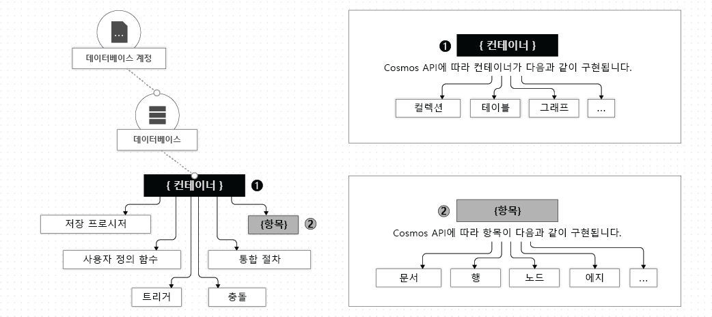

# 데이터베이스, 컨테이너 및 항목 작업

만든 후는 [Azure Cosmos 계정](account-overview.md) Azure 구독에서 관리할 수 있습니다 데이터 계정의 데이터베이스, 컨테이너 및 항목을 만들어 합니다. 이 문서에서는 데이터베이스, 컨테이너 및 항목의 각 엔터티에 대해 설명합니다. 다음 이미지는 Azure Cosmos 계정에서 다른 엔터티의 계층 구조를 보여줍니다.

## Azure Cosmos 데이터베이스

계정 아래에 하나 이상의 Azure Cosmos 데이터베이스를 만들 수 있습니다. 데이터베이스는 네임 스페이스와 비슷합니다. Azure Cosmos 컨테이너 집합에 대 한 관리 단위는 것입니다. 다음 표에서는 Azure Cosmos 데이터베이스가 다양한 API 관련 엔터티에 매핑되는 방법을 보여줍니다.

| **Azure Cosmos 엔터티** | **SQL API** | **Cassandra API** | **Azure Cosmos DB의 MongoDB API** | **Gremlin API** | **Table API** |
| --- | --- | --- | --- | --- | --- |
|Azure Cosmos 데이터베이스 | 데이터베이스 | Keyspace | 데이터베이스 | 데이터베이스 | 해당 없음 |

> [!NOTE]
> Table API 계정으로 첫 번째 테이블을 만들 때 기본 데이터베이스를 자동으로 만들어집니다 Azure Cosmos 계정 내에서.

### Azure Cosmos 데이터베이스에서 작업

다음과 같이 Azure Cosmos Api를 사용 하 여 Azure Cosmos 데이터베이스를 상호 작용할 수 있습니다.

| **작업** | **Azure CLI**|**SQL API** | **Cassandra API** | **Azure Cosmos DB의 MongoDB API** | **Gremlin API** | **Table API** |
| --- | --- | --- | --- | --- | --- | --- |
|모든 데이터베이스 열거| 예 | 예 | 예(데이터베이스가 keyspace에 매핑됨) | 예 | 해당 없음 | 해당 없음 |
|데이터베이스 읽기| 예 | 예 | 예(데이터베이스가 keyspace에 매핑됨) | 예 | 해당 없음 | 해당 없음 |
|새 데이터베이스 만들기| 예 | 예 | 예(데이터베이스가 keyspace에 매핑됨) | 예 | 해당 없음 | 해당 없음 |
|데이터베이스 업데이트| 예 | 예 | 예(데이터베이스가 keyspace에 매핑됨) | 예 | 해당 없음 | 해당 없음 |

## Azure Cosmos 컨테이너

Azure Cosmos 컨테이너는 프로 비전 된 처리량과 저장소 모두에 대 한 확장성 단위입니다. 컨테이너는 가로로 분할된 다음, 여러 지역에 걸쳐 복제됩니다. 컨테이너에 추가하는 항목과 컨테이너에 프로비저닝하는 처리량은 파티션 키에 따라 논리 파티션 세트에 자동으로 분산됩니다. 분할 및 파티션 키에 대 한 자세한 내용은 참조 하세요 [이](partition-data.md) 문서. 

Azure Cosmos 컨테이너를 만들 때 다음 모드 중 하나로 처리량을 구성합니다.

* **전용 프로비전된 처리량** 모드: 컨테이너에서 프로 비전 된 처리량은 해당 컨테이너에 대 한 단독으로 예약 되었습니다 및 Sla에서 지원 됩니다. 자세한 내용은 [Azure Cosmos 컨테이너에서 처리량을 프로비전하는 방법](how-to-provision-container-throughput.md)을 참조하세요.

* **공유 프로비전된 처리량** 모드: 이러한 컨테이너는 동일한 데이터베이스 (전용된 프로 비전 된 처리량을 사용 하 여 구성 된 이러한 컨테이너 제외)의 다른 컨테이너를 사용 하 여 프로 비전된 된 처리량을 공유 합니다. 즉, 데이터베이스에서 프로 비전된 된 처리량은 모든 "공유 처리량" 컨테이너 간에 공유 됩니다. 자세한 내용은 [Azure Cosmos 데이터베이스에서 프로비전된 처리량을 구성하는 방법](how-to-provision-database-throughput.md)을 참조하세요.

Azure Cosmos 컨테이너는 “공유” 또는 “전용” 프로비전된 처리량 모드로 컨테이너를 생성하든 관계없이 탄력적으로 확장할 수 있습니다.

Azure Cosmos 컨테이너는 스키마에 구애받지 않는 항목 컨테이너입니다. 컨테이너 내의 항목은 임의의 스키마가 있을 수 있습니다. 예를 들어, 사용자를 나타내는 항목을 자동차를 나타내는 항목에 추가할 수는 *동일한 컨테이너*합니다. 기본적으로 컨테이너에 추가하는 모든 항목은 명시적 인텍스나 스키마 관리 없이 자동으로 인덱싱됩니다. 구성 하 여 인덱싱 동작을 사용자 지정할 수 있습니다 합니다 [인덱싱 정책](index-overview.md) 컨테이너에서. 

설정할 수 있습니다 [Live TTL (Time To)](time-to-live.md) 또는 정상적으로 시스템에서 해당 항목을 제거 하려면 전체 컨테이너를 Azure Cosmos 컨테이너 내에서 선택한 항목입니다. Azure Cosmos DB는 만료 시 항목을 자동으로 삭제합니다. 또한 컨테이너에서 수행하는 쿼리가 고정된 범위 내에서 만료된 항목을 반환하지 않도록 보장합니다. 자세한 내용은 [컨테이너에 TTL을 구성하는 방법](how-to-time-to-live.md)을 참조하세요.

사용 하 여 [변경 피드](change-feed.md), 컨테이너의 논리 파티션 각각의 관리 되는 작업 로그를 구독할 수 있습니다. 변경 피드는 항목의 이전 및 이후 이미지와 함께 컨테이너에 수행된 모든 업데이트의 로그를 제공합니다. 참조 [변경 피드를 사용 하 여 반응 형 응용 프로그램을 빌드하는 방법을](serverless-computing-database.md)합니다. 또한 변경 피드는 컨테이너에서 정책을 사용 하 여 변경 피드에 보존 기간을 구성할 수 있습니다. 

등록할 수 있습니다 [저장된 프로시저, 트리거, 사용자 정의 함수 (Udf)](stored-procedures-triggers-udfs.md) 하 고 [프로시저 병합](how-to-manage-conflicts.md) Azure Cosmos 컨테이너를 사용 하 여 합니다. 

지정할 수는 [unique key 제약 조건을](unique-keys.md) Azure Cosmos 컨테이너에서. 고유 키 정책을 만들면 논리 파티션 키당 하나 이상의 값의 고유성을 보장합니다. 고유 키 정책을 사용하여 컨테이너가 생성되면 고유 키 제약 조건으로 지정된 값을 가진 새 항목 또는 업데이트된 항목을 생성할 수 없습니다. 자세한 내용은 [고유 키 제약 조건](unique-keys.md)을 참조하세요.

Azure Cosmos 컨테이너는 다음과 같이 API별 엔터티에 특화됩니다.

| **Azure Cosmos 엔터티** | **SQL API** | **Cassandra API** | **Azure Cosmos DB의 MongoDB API** | **Gremlin API** | **Table API** |
| --- | --- | --- | --- | --- | --- |
|Azure Cosmos 컨테이너 | 컬렉션 | 테이블 | 컬렉션 | 그래프 | 테이블 |

### Azure Cosmos 컨테이너의 속성

Azure Cosmos 컨테이너를 시스템에 정의 된 속성 집합이 있습니다. API 선택에 따라 일부는 직접 노출되지 않을 수 있습니다. 다음 표에서 시스템 정의 속성 목록입니다.

| **시스템 정의 속성** | **시스템 생성 되거나 사용자 구성 가능** | **목적** | **SQL API** | **Cassandra API** | **Azure Cosmos DB의 MongoDB API** | **Gremlin API** | **Table API** |
| --- | --- | --- | --- | --- | --- | --- | --- |
|_rid | 시스템 생성 | 컨테이너의 고유 식별자 | 예 | 아니오 | 아니요 | 아니요 | 아닙니다. |
|_etag | 시스템 생성 | 낙관적 동시성 제어에 사용되는 엔터티 태그 | 예 | 아니오 | 아니요 | 아니요 | 아닙니다. |
|_ts | 시스템 생성 | 컨테이너의 마지막 업데이트 타임스탬프 | 예 | 아니오 | 아니요 | 아니요 | 아닙니다. |
|_self | 시스템 생성 | 컨테이너의 주소 지정 가능 URI | 예 | 아니오 | 아니요 | 아니요 | 아닙니다. |
|id | 사용자 구성 가능 | 컨테이너의 사용자 정의 고유 이름 | 예 | 예 | 예 | 예 | 예 |
|indexingPolicy | 사용자 구성 가능 | 인덱스 경로, 인덱스 유형 및 인덱스 모드를 변경 하는 기능을 제공 합니다. | 예 | 아니오 | 아니요 | 아니요 | 예 |
|TimeToLive | 사용자 구성 가능 | 일정 기간이 지난 후 컨테이너에서 항목을 자동으로 삭제하는 기능을 제공합니다. 자세한 내용은 [Time To Live](time-to-live.md) 문서를 참조하세요. | 예 | 아니오 | 아니요 | 아니요 | 예 |
|changeFeedPolicy | 사용자 구성 가능 | 컨테이너의 항목에 대한 변경 내용을 읽는 데 사용됩니다. 자세한 내용은 참조는 [변경 피드](change-feed.md) 문서. | 예 | 아니오 | 아니요 | 아니요 | 예 |
|uniqueKeyPolicy | 사용자 구성 가능 | 논리 파티션 내에서 하나 이상의 값이 고유 하도록 보장 하는 데 사용 합니다. 자세한 내용은 참조는 [고유 키 제약 조건](unique-keys.md) 문서. | 예 | 아니오 | 아니요 | 아니요 | 예 |

### Azure Cosmos 컨테이너에서 작업

Azure Cosmos 컨테이너는 Azure Cosmos API를 사용하여 다음 작업을 지원합니다.

| **작업** | **Azure CLI** | **SQL API** | **Cassandra API** | **Azure Cosmos DB의 MongoDB API** | **Gremlin API** | **Table API** |
| --- | --- | --- | --- | --- | --- | --- |
| 데이터베이스에 컨테이너 열거 | 예 | 예 | 예 | 예 | 해당 없음 | 해당 없음 |
| 컨테이너 읽기 | 예 | 예 | 예 | 예 | 해당 없음 | 해당 없음 |
| 새 컨테이너 만들기 | 예 | 예 | 예 | 예 | 해당 없음 | 해당 없음 |
| 컨테이너 업데이트 | 예 | 예 | 예 | 예 | 해당 없음 | 해당 없음 |
| 컨테이너 삭제 | 예 | 예 | 예 | 예 | 해당 없음 | 해당 없음 |

## Azure Cosmos 항목

API 선택에 따라 Azure Cosmos 항목은 컬렉션의 문서, 테이블의 행 또는 그래프의 노드/에지 중 하나를 나타낼 수 있습니다. 다음 표에서는 Azure Cosmos 항목에 대한 API별 엔터티 간의 매핑을 보여줍니다.

| **Cosmos 엔터티** | **SQL API** | **Cassandra API** | **Azure Cosmos DB의 MongoDB API** | **Gremlin API** | **Table API** |
| --- | --- | --- | --- | --- | --- |
|Azure Cosmos 항목 | 문서 | 행 | 문서 | 노드 또는 Edge | 항목 |

### 항목의 속성

모든 Azure Cosmos 항목에는 다음과 같은 시스템 정의 속성이 있습니다. API 선택에 따라 일부는 직접 노출되지 않을 수 있습니다.

|**시스템 정의 속성** | **시스템 생성 되거나 사용자 구성 가능**| **목적** | **SQL API** | **Cassandra API** | **Azure Cosmos DB의 MongoDB API** | **Gremlin API** | **Table API** |
| --- | --- | --- | --- | --- | --- | --- | --- |
|_id | 시스템 생성 | 항목의 고유 식별자 | 예 | 아니오 | 아니요 | 아니요 | 아닙니다. |
|_etag | 시스템 생성 | 낙관적 동시성 제어에 사용되는 엔터티 태그 | 예 | 아니오 | 아니요 | 아니요 | 아닙니다. |
|_ts | 시스템 생성 | 항목의 마지막 업데이트의 타임 스탬프 | 예 | 아니오 | 아니요 | 아니요 | 아닙니다. |
|_self | 시스템 생성 | 항목의 주소 지정 가능 URI | 예 | 아니오 | 아니요 | 아니요 | 아닙니다. |
|id | 여기서는 | 논리 파티션 내의 사용자 정의 고유 이름. 사용자 ID를 지정 하지 않으면 시스템이 자동으로 생성 됩니다. | 예 | 예 | 예 | 예 | 예 |
|임의의 사용자 정의 속성 | 사용자 정의 | API 네이티브 표현에 표시되는 사용자 정의 속성(JSON, BSON, CQL 등) | 예 | 예 | 예 | 예 | 예 |

### 항목에 대한 작업

Azure Cosmos 항목은 Azure Cosmos API를 사용하여 수행할 수 있는 다음 작업을 지원합니다.

| **작업** | **Azure CLI** | **SQL API** | **Cassandra API** | **Azure Cosmos DB의 MongoDB API** | **Gremlin API** | **Table API** |
| --- | --- | --- | --- | --- | --- | --- |
| 삽입, 바꾸기, 삭제, Upsert, 읽기 | 아닙니다. | 예 | 예 | 예 | 예 | 예 |

## 다음 단계

이제 다음과 같은 개념을 알아보려면 진행할 수 있습니다.

* [Azure Cosmos 데이터베이스에서 프로 비전 된 처리량을 구성 하는 방법](how-to-provision-database-throughput.md)
* [Azure Cosmos 컨테이너에 프로 비전 된 처리량을 구성 하는 방법](how-to-provision-container-throughput.md)
* [논리 파티션](partition-data.md)
* [Azure Cosmos 컨테이너에 TTL을 구성하는 방법](how-to-time-to-live.md)
* [변경 피드를 사용하여 반응형 애플리케이션을 빌드하는 방법](change-feed.md)
* [Azure Cosmos 컨테이너에서 고유 키 제약 조건을 구성하는 방법](unique-keys.md)
