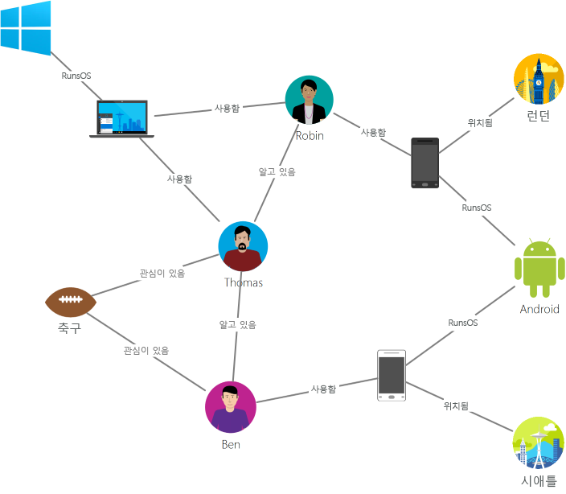
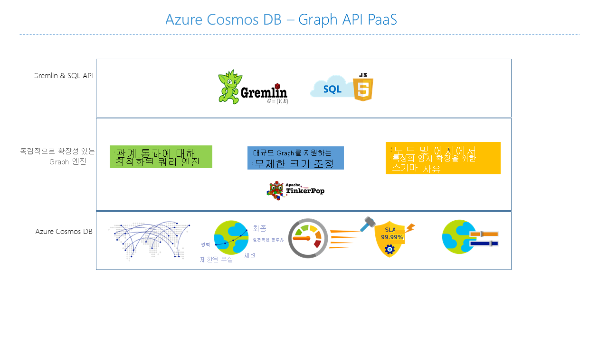

# Azure Cosmos DB 소개: Gremlin API

[Azure Cosmos DB](introduction.md)는 중요 업무용 애플리케이션에 사용할 수 있도록 Microsoft에서 제공하는 전역 분산 다중 모델 데이터베이스 서비스입니다. 또한 다중 모델 데이터베이스 방식이며 문서, 키-값, 그래프 및 열 형식 데이터 모델을 지원합니다. Azure Cosmos DB Gremlin API를 통해 그래프 데이터를 저장하고 사용합니다. Gremlin API는 그래프 데이터 모델링을 지원하고, 그래프 데이터를 따라 이동하기 위한 API를 제공합니다.

이 문서에서는 Azure Cosmos DB Gremlin API의 개요와 이 API를 사용하여 수십억 개의 꼭짓점 및 에지가 포함된 대량의 그래프를 저장하는 방법을 설명합니다. 밀리초 단위 대기 시간 내에 그래프를 쿼리하고 그래프 구조 및 스키마를 쉽게 발전시킬 수 있습니다. Azure Cosmos DB를 쿼리하려면 [Apache TinkerPop](https://tinkerpop.apache.org) 그래프 순회 언어나 [Gremlin](https://tinkerpop.apache.org/docs/current/reference/#graph-traversal-steps)을 사용합니다.

## 그래프 데이터베이스란?
실제 환경의 경우처럼 데이터는 자연스럽게 연결되어 있습니다. 기존의 데이터 모델링은 엔터티에 중점을 둡니다. 또한 대부분의 응용 프로그램에서는 기본적으로 엔터티 및 관계를 모두 모델링해야 합니다.

[그래프](http://mathworld.wolfram.com/Graph.html)는 [꼭짓점](http://mathworld.wolfram.com/GraphVertex.html) 및 [에지](http://mathworld.wolfram.com/GraphEdge.html)로 구성된 구조입니다. 꼭짓점 및 에지는 둘 다 임의 개수의 속성을 포함할 수 있습니다. 

* **꼭짓점** - 꼭짓점은 사람, 장소, 이벤트 등의 개별 개체를 나타냅니다. 

* **에지** - 에지는 꼭짓점 간의 관계를 나타냅니다. 예를 들어, 한 사용자가 다른 사용자를 알고 있으며, 이벤트에 관계되어 있고, 최근 한 위치에 있었을 수 있습니다. 

* **속성** -  속성은 꼭짓점 및 에지에 대한 정보를 나타냅니다. 예제 속성에는 이름 및 처리 기간이 있는 꼭짓점이 포함됩니다. 에지에는 타임스탬프 및/또는 가중치가 지정됩니다. 공식적으로 이 모델을 [속성 그래프](https://tinkerpop.apache.org/docs/current/reference/#intro)라고 합니다. Azure Cosmos DB는 속성 그래프 모델을 지원합니다.

예를 들어 다음 샘플 그래프는 사람, 모바일 장치, 관심 분야 및 운영 체제 간 관계를 보여줍니다.

그래프 데이터베이스를 사용하면 자연스럽고 효율적으로 그래프를 모델링하고 저장할 수 있으므로 다양한 시나리오에 유용합니다. 그래프 데이터베이스는 일반적으로 NoSQL 데이터베이스입니다. 사용 사례에 주로 스키마 유연성과 신속한 반복이 필요하기 때문입니다.

그래프 데이터베이스가 제공하는 빠른 순회 기능을 깊이 우선 검색, 너비 우선 검색, Dijkstra 알고리즘 등의 그래프 알고리즘과 조합하여 소셜 네트워킹, 콘텐츠 관리, 지리 공간, 권장 사항 등 다양한 도메인의 문제를 해결할 수 있습니다.

## Azure Cosmos DB 그래프 데이터베이스의 기능
 
Azure Cosmos DB는 전역 배포, 저장소 및 처리량의 탄력적인 확장, 자동 인덱싱 및 쿼리, 튜닝 가능한 일관성 수준을 제공하고 TinkerPop 표준을 지원하는 완전히 관리되는 그래프 데이터베이스입니다.

Azure Cosmos DB는 시중에 판매되는 다른 그래프 데이터베이스에 비해 다음과 같은 차별화된 기능을 제공합니다.

* 탄력적으로 확장 가능한 처리량 및 저장소

  실제 사용되는 그래프는 단일 서버의 용량을 초과하여 확장되어야 합니다. Azure Cosmos DB를 사용하면 여러 서버에 걸쳐 원활하게 그래프를 확장할 수 있습니다. 또한 액세스 패턴에 따라 그래프의 처리량을 독립적으로 확장할 수 있습니다. Azure Cosmos DB는 거의 무제한으로 저장소 크기 및 프로비전된 처리량을 확장할 수 있는 그래프 데이터베이스를 지원합니다.

* 다중 지역 복제

  Azure Cosmos DB는 사용자가 계정과 연결한 모든 지역에 그래프 데이터를 투명하게 복제합니다. 복제를 통해 데이터에 대한 전역 액세스가 필요한 애플리케이션을 개발할 수 있습니다. 일관성, 가용성, 성능 및 해당 보장 영역에서 절충을 이룰 수 있습니다. Azure Cosmos DB는 multi-homing API를 통해 투명한 지역 장애 조치(failover)를 제공합니다. 전 세계에서 탄력적으로 처리량 및 저장소를 확장할 수 있습니다.

* 익숙한 Gremlin 구문을 통한 빠른 쿼리 및 순회

  다른 유형의 꼭짓점 및 에지를 저장하고 익숙한 Gremlin 구문을 통해 이러한 문서를 쿼리합니다. Azure Cosmos DB는 동시성이 높고 잠금이 없으며 로그 구조화된 인덱싱 기술을 활용하여 모든 콘텐츠를 자동으로 인덱싱합니다. 이 기능을 통해 스키마 힌트, 보조 인덱스 또는 뷰를 지정할 필요 없이 풍부한 실시간 쿼리 및 순회를 사용할 수 있습니다. [Gremlin을 사용하여 그래프 쿼리](gremlin-support.md)에서 자세한 내용을 참조하세요.

* 완전히 관리

  Azure Cosmos DB는 데이터베이스 및 컴퓨터 리소스를 관리할 필요가 없습니다. 완전히 관리되는 Microsoft Azure 서비스의 경우 가상 머신을 관리하거나 소프트웨어를 배포 및 구성하거나 크기 조정을 관리하거나 복잡한 데이터 계층 업그레이드를 처리할 필요가 없습니다. 모든 그래프가 자동으로 백업되고 지역적 실패로부터 보호됩니다. 필요 시 쉽게 Azure Cosmos DB 계정을 추가하고 용량을 프로비전할 수 있으므로 데이터베이스 작동 및 관리 대신 애플리케이션에 집중할 수 있습니다.

* 자동 인덱싱

  Azure Cosmos DB는 기본적으로 그래프에서 노드 및 에지 내의 모든 속성을 자동으로 인덱싱하고 스키마 또는 보조 인덱스 생성을 예상하거나 요구하지 않습니다.

* Apache TinkerPop과의 호환성

  Azure Cosmos DB는 기본적으로 오픈 소스 Apache TinkerPop 표준을 지원하고 다른 TinkerPop 지원 그래프 시스템과 통합될 수 있습니다. 따라서 Titan 또는 Neo4j 등의 다른 그래프 데이터베이스에서 쉽게 마이그레이션하거나, Apache Spark GraphX와 같은 그래프 분석 프레임워크에서 Azure Cosmos DB를 사용할 수 있습니다.

* 튜닝 가능한 일관성 수준

  잘 정의된 5가지 일관성 수준에서 선택하여 일관성과 성능 간의 최적 절충을 실현합니다. 쿼리 및 읽기 작업에 대해 Azure Cosmos DB는 강력, 제한된 부실, 세션, 일관된 접두사, 최종의 5가지 일관성 수준을 제공합니다. 이러한 잘 정의된 세부적인 일관성 수준을 통해 일관성, 가용성 및 대기 시간 간에 적절한 절충을 이룰 수 있습니다. [Azure Cosmos DB의 튜닝 가능한 데이터 일관성 수준](consistency-levels.md)에서 자세히 알아봅니다.

Azure Cosmos DB는 동일한 컨테이너/데이터베이스 내에서 문서 및 그래프와 같은 여러 모델을 사용할 수도 있습니다. 문서 컨테이너를 사용하여 그래프 데이터를 문서와 나란히 저장할 수 있습니다. JSON에 대한 SQL 쿼리와 Gremlin 쿼리를 둘 다 사용하여 그래프와 동일한 데이터를 쿼리할 수 있습니다.

## 시작하기

Azure CLI(명령줄 인터페이스), Azure PowerShell 또는 Azure Portal을 사용하여 Azure Cosmos DB Gremlin API 계정을 만들고 액세스할 수 있습니다. 계정을 만들면 Gremlin에 대한 WebSocket 프런트 엔드를 제공하는 Gremlin API 서비스 엔드포인트(`https://<youraccount>.gremlin.cosmosdb.azure.com`)를 사용하여 해당 계정 내에서 그래프 데이터베이스에 액세스할 수 있습니다. 이 엔드포인트에 연결하고 Java, Node.js 또는 임의 Gremlin 클라이언트 드라이버에서 응용 프로그램을 빌드하도록 [Gremin 콘솔](https://tinkerpop.apache.org/docs/current/reference/#gremlin-console)과 같은 TinkerPop 호환 도구를 구성할 수 있습니다.

다음 표에서는 Azure Cosmos DB에 대해 사용할 수 있는 인기 있는 Gremlin 드라이버를 보여 줍니다.

| 다운로드 | 문서화 | 시작하기 | 지원되는 커넥터 버전 |
| --- | --- | --- | --- |
| [.NET](https://tinkerpop.apache.org/docs/3.3.1/reference/#gremlin-DotNet) | [GitHub의 Gremlin.NET](https://github.com/apache/tinkerpop/tree/master/gremlin-dotnet) | [.NET을 사용하여 그래프 만들기](create-graph-dotnet.md) | 3.4.0-RC2 |
| [Java](https://mvnrepository.com/artifact/com.tinkerpop.gremlin/gremlin-java) | [Gremlin JavaDoc](https://tinkerpop.apache.org/javadocs/current/full/) | [Java를 사용하여 그래프 만들기](create-graph-java.md) | 3.2.0+ |
| [Node.JS](https://www.npmjs.com/package/gremlin) | [Github의 Gremlin-JavaScript](https://github.com/jbmusso/gremlin-javascript) | [Node.js를 사용하여 그래프 만들기](create-graph-nodejs.md) | 2.6.0|
| [Python](https://tinkerpop.apache.org/docs/3.3.1/reference/#gremlin-python) | [Github의 Gremlin Python](https://github.com/apache/tinkerpop/tree/master/gremlin-python) | [Python을 사용하여 그래프 만들기](create-graph-python.md) | 3.2.7 |
| [PHP](https://packagist.org/packages/brightzone/gremlin-php) | [GitHub의 Gremlin-PHP](https://github.com/PommeVerte/gremlin-php) | [PHP를 사용하여 그래프 만들기](create-graph-php.md) | 3.1.0 |
| [Gremlin 콘솔](https://tinkerpop.apache.org/downloads.html) | [TinkerPop 문서](https://tinkerpop.apache.org/docs/current/reference/#gremlin-console) |  [Gremlin 콘솔을 사용하여 그래프 만들기](create-graph-gremlin-console.md) | 3.2.0 + |

## 그래프 데이터베이스 디자인 고려 사항

그래프 디자인 중 다른 꼭짓점 엔터티의 속성과 반대로 해당 꼭짓점으로 엔터티를 모델링하면 성능 및 비용에 영향을 줍니다. 이 결정에 대한 기본 드라이버는 데이터가 쿼리될 방법 및 모델 자체의 확장성에 의존합니다.

엔터티 모델링 방법을 계획하기 전에 다음 질문을 고려하세요.

* 내 쿼리 대부분의 꼭짓점으로 검색해야 하는 엔터티는 무엇인가요?

* 데이터 필터링을 위해 추가되는 그래프에 포함된 정보는 무엇인가요?

* 단지 다른 엔터티에 대한 연결이지만 해당 값이 검색되는 엔터티는 무엇인가요?

* 내 쿼리로 어떤 정보를 검색해야 하며, 이러한 정보가 파생하는 RU 요금이란 무엇인가요?

예를 들어, 다음 그래프 디자인을 가정합니다.

* 쿼리에 따라, District->Store 관계가 Store 꼭짓점을 필터링하는 데 고유하게 사용될 수 있습니다. 예를 들어, 쿼리가 “특정 구역에 속하는 모든 매장 획득” 형식인 경우를 가정해봅니다. 이 경우 자체 꼭짓점의 District 엔터티를 Store 꼭짓점의 속성으로 축소하는 것을 고려하는 것이 바람직합니다. 

* 이 방법은 각 Store 꼭짓점을 검색하는 비용이 한 번에 3개 그래프 개체(District, District->Store, Store)를 획득하는 것에서 단일 Store 꼭짓점으로 줄어든다는 이점이 있습니다. 이 경우 쿼리 성능이 향상될 뿐 아니라 쿼리당 비용도 절감될 수 있습니다.

* Store 꼭짓점은 2개의 다른 엔터티, Employee 및 Product에 연결되기 때문입니다. 이때 Store는 트래버스할 추가적인 가능성을 제공할 수 있으므로 필요한 꼭짓점으로 지정됩니다.  

## Gremlin API를 사용할 수 있는 시나리오
Azure Cosmos DB 그래프 지원을 사용할 수 있는 몇 가지 시나리오는 다음과 같습니다.

* 소셜 네트워크

  고객 및 다른 사람과의 상호 작용에 대한 데이터를 조합하여 개인 설정된 환경을 개발하거나, 고객 행동을 예측하거나, 관심 영역이 비슷한 다른 사람과 연결해줄 수 있습니다. Azure Cosmos DB를 사용하여 소셜 네트워크를 관리하고 고객 기본 설정 및 데이터를 추적할 수 있습니다.

* 추천 엔진

  이 시나리오는 소매 업계에서 일반적으로 사용됩니다. 제품, 사용자 및 사용자 상호 작용(예: 항목 구입, 검색, 등급 지정)에 대한 정보를 조합하여 사용자 지정된 추천을 작성할 수 있습니다. 대기 시간이 짧고, 탄력적으로 확장되고, 네이티브 그래프 지원을 제공하는 Azure Cosmos DB는 이러한 상호 작용을 모델링하는 데 이상적입니다.

* 지리 공간적

  원격 통신, 물류 및 여행 계획에서 사용되는 많은 애플리케이션은 하나의 영역 내에서 원하는 위치를 찾거나 두 위치 간에 가장 짧은/최적 경로를 찾아야 합니다. Azure Cosmos DB는 이러한 문제를 자연스럽게 해결합니다.

* 사물 인터넷

  IoT 장치 간의 네트워크 및 연결을 그래프로 모델링하여 장치 및 자산의 상태를 보다 잘 이해할 수 있습니다. 또한 한 네트워크 부분의 변경이 다른 부분에 어떤 영향을 미칠 수 있는지도 알 수 있습니다.

## 다음 단계
Azure Cosmos DB의 그래프 지원에 대해 자세히 알아보려면 다음을 참조하세요.

* [Azure Cosmos DB 그래프 자습서](create-graph-dotnet.md) 시작
* [Gremlin을 사용하여 Azure Cosmos DB에서 그래프를 쿼리](gremlin-support.md)하는 방법 알아보기
