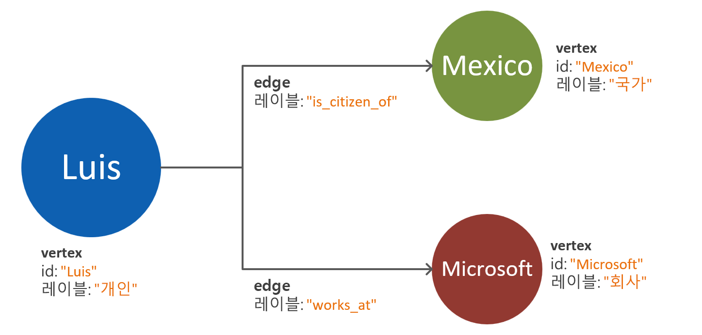
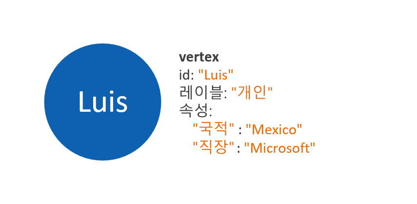
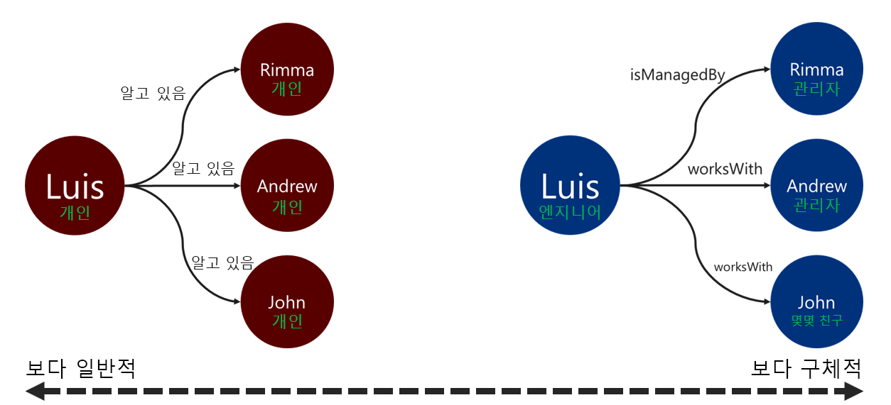

# Azure Cosmos DB Gremlin API에 대한 그래프 데이터 모델링

다음 문서는 그래프 데이터 모델링 권장 사항을 제공하도록 설계되었습니다. 이 단계는 데이터가 진화함에 따라 그래프 데이터베이스 시스템의 성능과 확장성을 보장하는 데 매우 중요합니다. 효율적인 데이터 모델은 대규모 그래프에서 특히 중요합니다.

## 요구 사항

이 가이드에 설명된 프로세스는 다음과 같은 가정을 기반으로 합니다.
 * 문제 공간의 **엔터티**가 식별되었습니다. 이러한 엔터티는 각 요청에 대해 원자 단위(_atomically_)로 소비됩니다. 즉, 데이터베이스 시스템은 여러 쿼리 요청에서 단일 엔터티의 데이터를 검색하도록 설계되지 않았습니다.
 * 데이터베이스 시스템에 대한 **읽기 및 쓰기 요구 사항**에 대한 이해가 있습니다. 이러한 요구 사항은 그래프 데이터 모델에 필요한 최적화를 안내합니다.
 * [Apache Tinkerpop 속성 그래프 표준](https://tinkerpop.apache.org/docs/current/reference/#graph-computing)의 원칙을 잘 이해하고 있습니다.

## 그래프 데이터베이스가 필요한 경우

그래프 데이터베이스 솔루션은 데이터 도메인의 엔터티 및 관계에 다음과 같은 특징이 있는 경우 최적으로 적용할 수 있습니다. 

* 엔터티가 기술적인 관계로 **밀접하게 연결**되어 있습니다. 이 시나리오의 이점은 관계가 스토리지에 유지된다는 사실입니다.
* **주기적인 관계** 또는 **자체 참조 엔터티**가 있습니다. 이 패턴은 관계형 데이터베이스나 문서 데이터베이스를 사용할 때 문제가 경우가 많습니다.
* 엔터티 간에 **동적으로 진화하는 관계**가 있습니다 이 패턴은 특히 여러 수준의 계층 구조나 트리 구조의 데이터에 적용할 수 있습니다.
* 엔터티 간에 **다대다** 관계가 있습니다.
* **엔터티와 관계 모두에 대한 쓰기 및 읽기 요구 사항**이 있습니다. 

위의 조건을 충족하면, 그래프 데이터베이스 접근 방식이 **쿼리 복잡성**, **데이터 모델 확장성** 및 **쿼리 성능**에 대한 이점을 누릴 가능성이 높습니다.

다음 단계는 분석 또는 트랜잭션 중에 어떤 용도로 그래프를 사용할지 결정하는 것입니다. 대량 계산 및 데이터 처리 워크로드에 그래프를 사용하려는 경우에는 [Cosmos DB Spark 커넥터](https://docs.microsoft.com/azure/cosmos-db/spark-connector)와 [GraphX 라이브러리](https://spark.apache.org/graphx/) 사용에 대해 살펴볼 가치가 있습니다. 

## 그래프 개체를 사용하는 방법

[Apache Tinkerpop 속성 그래프 표준](https://tinkerpop.apache.org/docs/current/reference/#graph-computing)은 **꼭짓점**과 **가장자리**라는 두 가지 유형의 개체를 정의합니다. 

다음은 그래프 개체의 속성에 대한 모범 사례입니다.

| Object | 속성 | Type | 메모 |
| --- | --- | --- |  --- |
| 꼭짓점 | ID | 문자열 | 파티션별로 고유하게 적용됩니다. 삽입 시 값이 제공되지 않으면 자동 생성된 GUID가 저장됩니다. |
| 꼭짓점 | label | 문자열 | 이 속성은 꼭짓점이 나타내는 엔터티 유형을 정의하는 데 사용됩니다. 값을 제공하지 않으면 기본값인 "꼭짓점"이 사용됩니다. |
| 꼭짓점 | properties | 문자열, 부울, 숫자 | 꼭짓점마다 키-값 쌍으로 저장된 별도의 속성 목록입니다. |
| 꼭짓점 | 파티션 키 | 문자열, 부울, 숫자 | 이 속성은 꼭짓점과 나가는 가장자리를 저장할 위치를 정의합니다. [그래프 분할](graph-partitioning.md)에 대해 자세히 읽어보세요. |
| Microsoft Edge | ID | 문자열 | 파티션별로 고유하게 적용됩니다. 기본적으로 자동 생성됩니다. 가장자리는 대개 ID로 고유하게 검색할 필요가 없습니다. |
| Microsoft Edge | label | 문자열 | 이 속성은 두 꼭짓점의 관계 유형을 정의하는 데 사용됩니다. |
| Microsoft Edge | properties | 문자열, 부울, 숫자 | 가장자리마다 키-값 쌍으로 저장된 별도의 속성 목록입니다. |

> [!NOTE]
> 가장자리 값은 원본 꼭짓점에 따라 자동으로 할당되기 때문에 가장자리에는 파티션 키 값이 필요하지 않습니다. 자세한 내용은 [그래프 분할](graph-partitioning.md) 문서를 참조하세요.

## 엔터티 및 관계 모델링 지침

다음은 Azure Cosmos DB Gremlin API 그래프 데이터베이스의 데이터 모델링 방식에 대한 지침입니다. 해당 지침은 데이터 도메인에 대한 기존 정의가 있고 그에 대한 쿼리가 있다고 가정합니다.

> [!NOTE]
> 아래에 설명된 단계는 권장 사항으로 제공됩니다. 최종 모델은 프로덕션이 준비되었다고 고려하기 전에 평가되고 테스트되어야 합니다. 또한 아래 권장 사항은 Azure Cosmos DB의 Gremlin API 구현에만 해당됩니다. 

### 속성 및 꼭짓점 모델링 

그래프 데이터 모델의 첫 번째 단계는 식별된 모든 엔터티를 **꼭짓점 개체**에 매핑하는 것입니다. 모든 엔터티를 꼭짓점에 일대일로 매핑하는 것은 초기 단계이며 변경되기 마련입니다.

한 가지 일반적인 함정은 단일 엔터티의 속성을 별도의 꼭짓점으로 매핑하는 것입니다. 동일한 엔터티가 두 가지 다른 방식으로 표현되는 아래 예제를 고려해보십시오.

* **꼭 짓 점 기반 속성**:이 방법에서 엔터티는 세 개의 개별 꼭지점과 두 개의 가장자리를 사용 하 여 해당 속성을 설명 합니다. 이 방식은 중복성을 줄일 수 있지만 모델 복잡성을 증가시킵니다. 모델 복잡성이 증가하면 대기 시간, 쿼리 복잡성 및 계산 비용이 추가될 수 있습니다. 이 모델은 분할에서 어려움을 보일 수도 있습니다.

* **속성 포함 꼭 짓 점**:이 방법은 키-값 쌍 목록을 사용 하 여 꼭 짓 점 내의 모든 엔터티 속성을 나타냅니다. 이 방식은 모델 복잡성을 줄여서 쿼리를 간소화하고 순회의 비용 효율을 높입니다.

> [!NOTE]
> 위의 예는 엔터티 속성을 구분하는 두 가지 방법의 비교만 보여주는 간소화된 그래프 모델을 보여줍니다.

**속성 포함 꼭짓점** 패턴은 일반적으로 뛰어난 성능과 확장 가능한 방식을 제공합니다. 새 그래프 데이터 모델에 대한 기본 방식은 이 패턴을 향해야 합니다.

하지만 속성에 대한 참조가 장점을 제공할 수 있는 시나리오가 있습니다. 예를 들어, 참조된 속성이 자주 업데이트되는 경우가 있습니다. 지속적으로 변경되는 속성을 나타내는 별도의 꼭짓점을 사용하면 업데이트에 필요한 쓰기 작업량이 최소화됩니다.

### 가장자리 방향을 사용하여 관계 모델링

꼭짓점이 모델링된 후에 가장자리를 추가하여 이들 간의 관계를 나타낼 수 있습니다. 평가해야 할 첫 번째 측면은 **관계의 방향**입니다. 

가장자리 개체에는 기본 방향이 있고, 그 뒤를 `out()` 또는 `outE()` 함수를 사용할 때 순회가 따릅니다. 이렇게 자연스러운 방향을 사용하면 효율적인 작업이 가능합니다. 모든 꼭짓점이 나가는 가장자리와 함께 저장되기 때문입니다. 

하지만 `in()` 함수를 사용하여 가장자리의 반대 방향으로 트래버스하면 파티션 간 쿼리가 항상 발생합니다. [그래프 분할](graph-partitioning.md)에 대해 자세히 알아보세요. `in()` 함수를 사용하여 지속적으로 트래버스해야 하는 경우 양방향에 가장자리를 추가하는 것이 좋습니다.

가장자리 방향은 `.addE()` Gremlin 단계에 `.to()` 또는 `.from()` 조건자를 사용하여 결정할 수 있습니다. 또는 [Gremlin API용 대량 실행기 라이브러리](bulk-executor-graph-dotnet.md)를 사용할 수 있습니다.

> [!NOTE]
> 가장자리 개체에는 기본적으로 방향이 있습니다.

### 관계 레이블 지정

설명이 포함된 관계 레이블을 사용하면 가장자리 확인 작업의 효율을 높일 수 있습니다. 이 패턴은 다음과 같은 방법으로 적용할 수 있습니다.
* 관계에 레이블을 지정할 때는 제네릭이 아닌 용어를 사용합니다.
* 원본 꼭짓점의 레이블을 관계 이름을 사용하여 대상 꼭짓점의 레이블과 연결합니다.

트래버서(traverser)가 가장자리를 필터링하는 데 사용하는 레이블이 구체적일수록 좋습니다. 이 결정은 쿼리 비용에도 상당한 영향을 줄 수 있습니다. 쿼리 비용은 [executionProfile 단계를 사용](graph-execution-profile.md)하여 언제든지 평가할 수 있습니다.

## 다음 단계: 
* 지원되는 [Gremlin 단계](gremlin-support.md) 목록을 확인합니다.
* 대규모 그래프를 처리하는 [그래프 데이터베이스 분할](graph-partitioning.md)에 대해 알아봅니다.
* [실행 프로필 단계](graph-execution-profile.md)를 사용하여 Gremlin 쿼리를 평가합니다.
