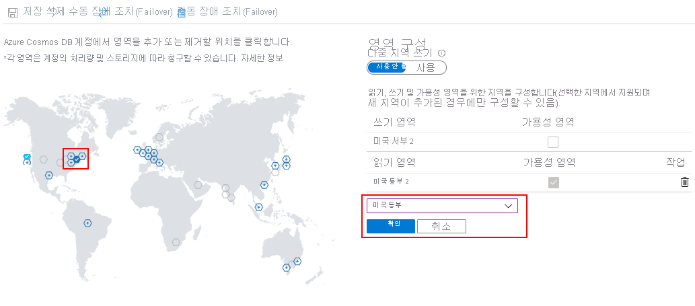

# <a name="manage-an-azure-cosmos-account"></a>Azure Cosmos 계정 관리

이 문서에서는 Azure Portal, Azure PowerShell, Azure CLI 및 Azure Resource Manager 템플릿을 사용하여 Azure Cosmos 계정에서 다양한 작업을 관리하는 방법을 설명합니다.

## <a name="create-an-account"></a>계정 만들기

### <a id="create-database-account-via-portal"></a>Azure Portal

[!INCLUDE [cosmos-db-create-dbaccount](../../includes/cosmos-db-create-dbaccount.md)]

### <a id="create-database-account-via-cli"></a>Azure CLI

```azurecli-interactive
# Create an account
$resourceGroupName = 'myResourceGroup'
$accountName = 'myaccountname' # must be lower case.

az cosmosdb create \
   --name $accountName \
   --resource-group $resourceGroupName \
   --kind GlobalDocumentDB \
   --default-consistency-level Session \
   --locations WestUS=0 EastUS=1 \
   --enable-multiple-write-locations true
```

### <a id="create-database-account-via-ps"></a>Azure PowerShell
```azurepowershell-interactive
# Create an Azure Cosmos Account for Core (SQL) API
$resourceGroupName = "myResourceGroup"
$location = "West US"
$accountName = "mycosmosaccount" # must be lower case.

$locations = @(
    @{ "locationName"="West US"; "failoverPriority"=0 },
    @{ "locationName"="East US"; "failoverPriority"=1 }
)

$consistencyPolicy = @{
    "defaultConsistencyLevel"="BoundedStaleness";
    "maxIntervalInSeconds"=300;
    "maxStalenessPrefix"=100000
}

$CosmosDBProperties = @{
    "databaseAccountOfferType"="Standard";
    "locations"=$locations;
    "consistencyPolicy"=$consistencyPolicy;
    "enableMultipleWriteLocations"="true"
}

New-AzResource -ResourceType "Microsoft.DocumentDb/databaseAccounts" `
    -ApiVersion "2015-04-08" -ResourceGroupName $resourceGroupName -Location $location `
    -Name $accountName -PropertyObject $CosmosDBProperties
```

### <a id="create-database-account-via-arm-template"></a>Azure Resource Manager 템플릿

이 Azure Resource Manager 템플릿은 일관성 수준, 자동 장애 조치(failover) 및 다중 마스터를 선택하기 위한 옵션 및 두 개의 지역으로 구성된 지원되는 API에 대한 Azure Cosmos DB 계정을 만듭니다. 이 템플릿을 배포하려면 추가 정보 페이지 [Azure Cosmos DB 계정 만들기](https://github.com/Azure/azure-quickstart-templates/tree/master/101-cosmosdb-create-multi-region-account)에서 Azure에 배포를 클릭합니다

## <a name="addremove-regions-from-your-database-account"></a>데이터베이스 계정에서 Azure 지역 추가/제거

### <a id="add-remove-regions-via-portal"></a>Azure Portal

1. [Azure 포털](https://portal.azure.com)에 로그인합니다. 

1. Azure Cosmos 계정으로 이동하고, **전역적으로 데이터 복제** 메뉴를 엽니다.

1. 지역을 추가하려면 지도에서 원하는 지역에 해당하는 **+** 레이블이 있는 육각형을 선택합니다. 또는, 지역을 추가하려면 **+ 지역 추가** 옵션을 선택하고 드롭다운 메뉴에서 Azure 지역을 선택합니다.

1. 지역을 제거하려면 확인 표시가 있는 파란색 육각형을 선택하여 맵에서 하나 이상의 지역을 지웁니다. 또는 오른쪽의 지역 옆에 있는 "휴지통"(🗑) 아이콘을 선택합니다.

1. 변경 내용을 저장하려면 **확인**을 선택합니다.

   

단일 지역 쓰기 모드에서는 쓰기 지역을 제거할 수 없습니다. 현재 쓰기 지역을 삭제하려면 먼저 다른 Azure 지역으로 장애 조치해야 합니다.

다중 지역 쓰기 모드에서는 하나 이상의 Azure 지역이 있으면 Azure 지역을 추가하거나 제거할 수 있습니다.

### <a id="add-remove-regions-via-cli"></a>Azure CLI

```azurecli-interactive
$resourceGroupName = 'myResourceGroup'
$accountName = 'myaccountname'

# Create an account with 1 region
az cosmosdb create --name $accountName --resource-group $resourceGroupName --locations westus=0

# Add a region
az cosmosdb update --name $accountName --resource-group $resourceGroupName --locations westus=0 eastus=1

# Remove a region
az cosmosdb update --name $accountName --resource-group $resourceGroupName --locations westus=0
```

### <a id="add-remove-regions-via-ps"></a>Azure PowerShell

```azurepowershell-interactive
# Create an account with 1 region
$resourceGroupName = "myResourceGroup"
$location = "West US"
$accountName = "mycosmosaccount" # must be lower case.

$locations = @( @{ "locationName"="West US"; "failoverPriority"=0 } )
$consistencyPolicy = @{ "defaultConsistencyLevel"="Session" }
$CosmosDBProperties = @{
    "databaseAccountOfferType"="Standard";
    "locations"=$locations;
    "consistencyPolicy"=$consistencyPolicy
}
New-AzResource -ResourceType "Microsoft.DocumentDb/databaseAccounts" `
    -ApiVersion "2015-04-08" -ResourceGroupName $resourceGroupName -Location $location `
    -Name $accountName -PropertyObject $CosmosDBProperties

# Add a region
$account = Get-AzResource -ResourceType "Microsoft.DocumentDb/databaseAccounts" `
    -ApiVersion "2015-04-08" -ResourceGroupName $resourceGroupName -Name $accountName

$locations = @( 
    @{ "locationName"="West US"; "failoverPriority"=0 },
    @{ "locationName"="East Us"; "failoverPriority"=1 } 
)

$account.Properties.locations = $locations
$CosmosDBProperties = $account.Properties

Set-AzResource -ResourceType "Microsoft.DocumentDb/databaseAccounts" `
    -ApiVersion "2015-04-08" -ResourceGroupName $resourceGroupName `
    -Name $accountName -PropertyObject $CosmosDBProperties

# Azure Resource Manager does not wait on the resource update
Write-Host "Confirm region added before continuing..."

# Remove a region
$account = Get-AzResource -ResourceType "Microsoft.DocumentDb/databaseAccounts" `
    -ApiVersion "2015-04-08" -ResourceGroupName $resourceGroupName -Name $accountName

$locations = @( @{ "locationName"="West US"; "failoverPriority"=0 } )

$account.Properties.locations = $locations
$CosmosDBProperties = $account.Properties

Set-AzResource -ResourceType "Microsoft.DocumentDb/databaseAccounts" `
    -ApiVersion "2015-04-08" -ResourceGroupName $resourceGroupName `
    -Name $accountName -PropertyObject $CosmosDBProperties
```

## <a id="configure-multiple-write-regions"></a>다중 쓰기 지역 구성

### <a id="configure-multiple-write-regions-portal"></a>Azure Portal

**전역적으로 데이터 복제** 탭을 열고 **사용**을 선택하여 다중 지역 쓰기를 사용하도록 설정합니다. 다중 지역 쓰기를 사용하도록 설정한 후에는 현재 계정에 있는 모든 읽기 지역이 읽기 및 쓰기 지역이 됩니다. 

> [!NOTE]
> 다중 지역 쓰기를 사용하도록 설정한 후에는 해제할 수 없습니다. 


이 기능에 대한 추가 질문은 askcosmosdb@microsoft.com 별칭을 참조하세요. 

### <a id="configure-multiple-write-regions-cli"></a>Azure CLI

```azurecli-interactive
$resourceGroupName = 'myResourceGroup'
$accountName = 'myaccountname'
az cosmosdb update --name $accountName --resource-group $resourceGroupName --enable-multiple-write-locations true
```

### <a id="configure-multiple-write-regions-ps"></a>Azure PowerShell

```azurepowershell-interactive
# Update an Azure Cosmos Account from single to multi-master

$account = Get-AzResource -ResourceType "Microsoft.DocumentDb/databaseAccounts" `
    -ApiVersion "2015-04-08" -ResourceGroupName $resourceGroupName -Name $accountName

$account.Properties.enableMultipleWriteLocations = "true"
$CosmosDBProperties = $account.Properties

Set-AzResource -ResourceType "Microsoft.DocumentDb/databaseAccounts" `
    -ApiVersion "2015-04-08" -ResourceGroupName $resourceGroupName `
    -Name $accountName -PropertyObject $CosmosDBProperties
```

### <a id="configure-multiple-write-regions-arm"></a>리소스 관리자 템플릿

계정 및 설정 `enableMultipleWriteLocations: true`를 생성하는 데 사용되는 Resource Manager 템플릿을 배포하면 단일 마스터에서 다중 마스터로 계정을 마이그레이션할 수 있습니다. 다음 Azure Resource Manager 템플릿은 단일 지역 및 다중 마스터가 활성화된 SQL API용 Azure Cosmos DB 계정을 배포할 최소 템플릿입니다.

```json
{
    "$schema": "https://schema.management.azure.com/schemas/2015-01-01/deploymentTemplate.json#",
    "contentVersion": "1.0.0.0",
    "parameters": {
        "name": {
            "type": "String"
        },
        "location": {
            "type": "String",
            "defaultValue": "[resourceGroup().location]"
        }
    },
    "resources": [
        {
            "type": "Microsoft.DocumentDb/databaseAccounts",
            "kind": "GlobalDocumentDB",
            "name": "[parameters('name')]",
            "apiVersion": "2015-04-08",
            "location": "[parameters('location')]",
            "tags": {},
            "properties": {
                "databaseAccountOfferType": "Standard",
                "consistencyPolicy": { "defaultConsistencyLevel": "Session" },
                "locations": [
                    {
                        "locationName": "[parameters('location')]",
                        "failoverPriority": 0
                    }
                ],
                "enableMultipleWriteLocations": true
            }
        }
    ]
}
```

## <a id="automatic-failover"></a>Azure Cosmos DB 계정에 자동 장애 조치 사용

자동 장애 조치(failover) 옵션을 통해 Azure Cosmos DB는 장애 조치(failover) 우선 순위가 가장 높은 지역으로 장애 조치(failover)할 수 있으며, 지역을 사용할 수 없는 경우 사용자 작업이 필요하지 않습니다. 자동 장애 조치(failover)를 사용하도록 설정한 경우 지역 우선 순위를 수정할 수 있습니다. 계정에는 자동 장애 조치(failover)를 사용하도록 설정하기 위해 두 개 이상의 지역이 있어야 합니다.

### <a id="enable-automatic-failover-via-portal"></a>Azure Portal

1. Azure Cosmos DB 계정에서 **글로벌로 데이터 복제** 창을 엽니다.

2. 창의 위쪽에서 **자동 장애 조치**를 선택합니다.

   ![[전역적으로 데이터 복제] 메뉴](./media/how-to-manage-database-account/replicate-data-globally.png)

3. **자동 장애 조치** 창에서 **자동 장애 조치 사용**을 **켜기**로 설정합니다. 

4. **저장**을 선택합니다.

   

### <a id="enable-automatic-failover-via-cli"></a>Azure CLI

```azurecli-interactive
# Enable automatic failover on an existing account
$resourceGroupName = 'myResourceGroup'
$accountName = 'myaccountname'

az cosmosdb update --name $accountName --resource-group $resourceGroupName --enable-automatic-failover true
```

### <a id="enable-automatic-failover-via-ps"></a>Azure PowerShell

```azurepowershell-interactive
$resourceGroupName = "myResourceGroup"
$accountName = "mycosmosaccount"

$account = Get-AzResource -ResourceType "Microsoft.DocumentDb/databaseAccounts" `
    -ApiVersion "2015-04-08" -ResourceGroupName $resourceGroupName `
    -Name $accountName

$account.Properties.enableAutomaticFailover="true";
$CosmosDBProperties = $account.Properties;

Set-AzResource -ResourceType "Microsoft.DocumentDb/databaseAccounts" `
    -ApiVersion "2015-04-08" -ResourceGroupName $resourceGroupName `
    -Name $accountName -PropertyObject $CosmosDBProperties
```

## <a name="set-failover-priorities-for-your-azure-cosmos-account"></a>Azure Cosmos 계정의 장애 조치(failover) 우선 순위 설정

Cosmos 계정이 자동 장애 조치(failover)에 대해 구성된 후에는 지역에 대한 장애 조치(failover) 우선 순위를 변경할 수 있습니다.

> [!IMPORTANT]
> 계정이 자동 장애 조치(failover)에 대해 구성된 경우에는 쓰기 지역(장애 조치 우선 순위 0)을 수정할 수 없습니다. 쓰기 지역을 변경하려면 자동 장애 조치(failover)를 사용하지 않도록 설정하고 수동 장애 조치(failover)를 수행해야 합니다.

### <a id="set-failover-priorities-via-portal"></a>Azure Portal

1. Azure Cosmos 계정에서 **전역적으로 데이터 복제** 창을 엽니다.

2. 창의 위쪽에서 **자동 장애 조치**를 선택합니다.

   ![[전역적으로 데이터 복제] 메뉴](./media/how-to-manage-database-account/replicate-data-globally.png)

3. **자동 장애 조치** 창에서 **자동 장애 조치 사용**을 **켜기**로 설정합니다.

4. 장애 조치 우선 순위를 수정하려면 마우스로 가리킬 때 나타나는 행 왼쪽의 점 세 개를 통해 읽기 지역을 끕니다.

5. **저장**을 선택합니다.

   

### <a id="set-failover-priorities-via-cli"></a>Azure CLI

```azurecli-interactive
# Assume region order is initially eastus=0 westus=1 southeastasia=2 on account creation
$resourceGroupName = 'myResourceGroup'
$accountName = 'myaccountname'

az cosmosdb failover-priority-change --name $accountName --resource-group $resourceGroupName --failover-policies eastus=0 southeastasia=1 westus=2
```

### <a id="set-failover-priorities-via-ps"></a>Azure PowerShell

```azurepowershell-interactive
# Assume account currently has regions with priority: West US = 0, East US = 1, Southeast Asia = 2
$resourceGroupName = "myResourceGroup"
$accountName = "myaccountname"

$failoverPolicies = @(
    @{ "locationName"="West US"; "failoverPriority"=0 },
    @{ "locationName"="Southeast Asia"; "failoverPriority"=1 },
    @{ "locationName"="East US"; "failoverPriority"=2 }
)

Invoke-AzResourceAction -Action failoverPriorityChange `
    -ResourceType "Microsoft.DocumentDb/databaseAccounts" -ApiVersion "2015-04-08" `
    -ResourceGroupName $resourceGroupName -Name $accountName -Parameters $failoverPolicies
```

## <a id="manual-failover"></a>Azure Cosmos 계정에서 수동 장애 조치(failover) 수행

> [!IMPORTANT]
> 이 작업이 성공하기 위해서는 수동 장애 조치(failover)에 대해 Azure Cosmos 계정을 구성해야 합니다.

수동 장애 조치(failover)를 수행하기 위한 프로세스에는 계정의 쓰기 지역(장애 조치 우선 순위 = 0)을 계정에 대해 구성된 다른 지역으로 변경하는 것이 포함됩니다.

> [!NOTE]
> 다중 마스터 계정은 수동으로 장애 조치(failover)할 수 없습니다. Azure Cosmos DB SDK를 사용하는 애플리케이션의 경우 SDK는 지역을 사용할 수 없게 되는 시기를 감지한 다음, SDK에서 멀티 호밍 API를 사용할 경우 다음 가장 가까운 지역으로 자동 리디렉션합니다.

### <a id="enable-manual-failover-via-portal"></a>Azure Portal

1. Azure Cosmos 계정으로 이동하고, **전역적으로 데이터 복제** 메뉴를 엽니다.

2. 메뉴의 위쪽에서 **수동 장애 조치**를 선택합니다.

   ![[전역적으로 데이터 복제] 메뉴](./media/how-to-manage-database-account/replicate-data-globally.png)

3. **수동 장애 조치** 메뉴에서 새 쓰기 지역을 선택합니다. 이 옵션이 쓰기 영역을 변경한다는 것을 알고 있음을 나타내는 확인란을 선택합니다.

4. 장애 조치를 트리거하려면 **확인**을 선택합니다.

   

### <a id="enable-manual-failover-via-cli"></a>Azure CLI

```azurecli-interactive
# Assume account currently has regions with priority: eastus=0 westus=1
# Change the priority order to trigger a failover of the write region
$resourceGroupName = 'myResourceGroup'
$accountName = 'myaccountname'

az cosmosdb update --name $accountName --resource-group $resourceGroupName --locations westus=0 eastus=1
```

### <a id="enable-manual-failover-via-ps"></a>Azure PowerShell

```azurepowershell-interactive
# Assume account currently has regions with priority: West US = 0, East US = 1
# Change the priority order to trigger a failover of the write region
$resourceGroupName = "myResourceGroup"
$accountName = "myaccountname"

$account = Get-AzResource -ResourceType "Microsoft.DocumentDb/databaseAccounts" `
    -ApiVersion "2015-04-08" -ResourceGroupName $resourceGroupName `
    -Name $accountName

$locations = @(
    @{ "locationName"="East US"; "failoverPriority"=0 },
    @{ "locationName"="West US"; "failoverPriority"=1 }
)

$account.Properties.locations=$locations;
$CosmosDBProperties = $account.Properties;

Set-AzResource -ResourceType "Microsoft.DocumentDb/databaseAccounts" `
    -ApiVersion "2015-04-08" -ResourceGroupName $resourceGroupName `
    -Name $accountName -PropertyObject $CosmosDBProperties
```

## <a name="next-steps"></a>다음 단계

데이터베이스 및 컨테이너와 함께 Azure Cosmos 계정을 관리하는 방법에 대한 자세한 내용 및 예제는 다음 문서를 읽어보세요.

* [Azure PowerShell을 사용하여 Azure Cosmos DB 관리](manage-with-powershell.md)
* [Azure CLI를 사용하여 Azure Cosmos DB 관리](manage-with-cli.md)
