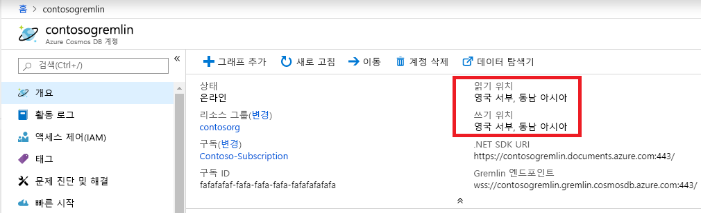

# <a name="regional-endpoints-for-azure-cosmos-db-graph-account"></a>Azure Cosmos DB 그래프 계정의 지역별 엔드포인트
Azure Cosmos DB 그래프 데이터베이스는 [전 세계에 분산](distribute-data-globally.md)되어 있으므로, 애플리케이션에서 여러 개의 읽기 엔드포인트를 사용할 수 있습니다. 여러 위치에서 쓰기 권한이 필요한 애플리케이션은 [다중 마스터](how-to-multi-master.md) 기능을 사용하도록 설정해야 합니다.

두 개 이상의 지역을 선택해야 하는 이유:
1. **수평적 읽기 확장성** - 애플리케이션 부하가 증가함에 따라 읽기 트래픽을 여러 Azure 지역으로 라우팅하는 것이 바람직할 수 있습니다.
2. **낮은 대기 시간** - 읽기 및 쓰기 트래픽을 가장 가까운 Azure 지역으로 라우팅하면 각 통과의 네트워크 대기 시간 오버헤드를 줄일 수 있습니다.

Cosmos DB 계정에 Azure Resource Manager 정책을 설정하면 **데이터 보존** 요구 사항을 충족할 수 있습니다. 고객이 Cosmos DB에서 데이터를 복제하는 지역을 제한할 수 있습니다.

## <a name="traffic-routing"></a>트래픽 라우팅

Cosmos DB 그래프 데이터베이스 엔진은 여러 지역에서 실행되고 있으며, 지역마다 여러 클러스터를 포함합니다. 각 클러스터에는 수백 개의 머신이 있습니다. Cosmos DB 그래프 계정 DNS CNAME *accountname.gremlin.cosmos.azure.com*은 클러스터의 DNS A 레코드로 확인됩니다. 부하 분산 장치의 단일 IP 주소는 내부 클러스터 토폴로지를 숨깁니다.

Cosmos DB 그래프 계정의 모든 지역에 대해 지역별 DNS CNAME 레코드가 만들어집니다. 지역별 엔드포인트의 형식은 *accountname-region.gremlin.cosmos.azure.com*입니다. 지역별 엔드포인트의 지역 세그먼트는 [Azure 지역](https://azure.microsoft.com/global-infrastructure/regions) 이름에서 모든 공백을 제거한 값입니다. 예를 들어 `"contoso"` 전역 데이터베이스 계정의 `"East US 2"` 지역에는 DNS CNAME *contoso-eastus2.gremlin.cosmos.azure.com*이 있어야 합니다.

TinkerPop Gremlin 클라이언트는 단일 서버에서 작동하도록 설계되었습니다. 애플리케이션은 읽기 및 쓰기 트래픽에 대해 전역 쓰기 가능 DNS CNAME을 사용할 수 있습니다. 지역 인식 애플리케이션은 읽기 트래픽에 대해 지역별 엔드포인트를 사용해야 합니다. 특정 지역이 쓰기를 허용하도록 구성된 경우에만 쓰기 트래픽에 대해 지역별 엔드포인트를 사용합니다. 

> [!NOTE]
> Cosmos DB 그래프 엔진은 트래픽을 쓰기 지역으로 프록시하여 읽기 지역의 쓰기 작업을 허용할 수 있습니다. 통과 대기 시간이 증가하고 나중에 제한될 수 있으므로 쓰기를 읽기 전용 지역으로 보내는 것은 바람직하지 않습니다.

전역 데이터베이스 계정 CNAME은 항상 유효한 쓰기 지역을 가리킵니다. 쓰기 지역의 서버 쪽 장애 조치(failover) 중에 Cosmos DB는 새 지역을 가리키도록 전역 데이터베이스 계정 CNAME을 업데이트합니다. 장애 조치 후에 애플리케이션이 트래픽 경로 전환을 처리할 수 없는 경우, 전역 데이터베이스 계정 DNS CNAME을 사용해야 합니다.

> [!NOTE]
> Cosmos DB는 호출자의 지리적 근접에 따라 트래픽을 라우팅하지 않습니다. 각 애플리케이션이 고유한 애플리케이션 요구에 따라 올바른 지역을 선택해야 합니다.

## <a name="portal-endpoint-discovery"></a>포털 엔드포인트 검색

Azure Cosmos DB 그래프 계정의 지역 목록을 가져오는 가장 간편한 방법은 Azure Portal의 개요 블레이드입니다. 지역이 자주 변경되지 않거나, 애플리케이션 구성을 통해 목록을 업데이트할 수 있는 애플리케이션에 효과적입니다.



아래 예제에서는 지역별 Gremlin 엔드포인트 액세스의 일반적인 원칙을 보여 줍니다. 애플리케이션이 트래픽을 보낼 지역 수와 인스턴스화할 해당 Gremlin 클라이언트 수를 고려해야 합니다.

```csharp
// Example value: Central US, West US and UK West. This can be found in the overview blade of you Azure Cosmos DB Gremlin Account. 
// Look for Write Locations in the overview blade. You can click to copy and paste.
string[] gremlinAccountRegions = new string[] {"Central US", "West US" ,"UK West"};
string gremlinAccountName = "PUT-COSMOSDB-ACCOUNT-NAME-HERE";
string gremlinAccountKey = "PUT-ACCOUNT-KEY-HERE";
string databaseName = "PUT-DATABASE-NAME-HERE";
string graphName = "PUT-GRAPH-NAME-HERE";

foreach (string gremlinAccountRegion in gremlinAccountRegions)
{
  // Convert preferred read location to the form "[acountname]-[region].gremlin.cosmos.azure.com".
  string regionalGremlinEndPoint = $"{gremlinAccountName}-{gremlinAccountRegion.ToLowerInvariant().Replace(" ", string.Empty)}.gremlin.cosmos.azure.com";

  GremlinServer regionalGremlinServer = new GremlinServer(
    hostname: regionalGremlinEndPoint, 
    port: 443,
    enableSsl: true,
    username: "/dbs/" + databaseName + "/colls/" + graphName,
    password: gremlinAccountKey);

  GremlinClient regionalGremlinClient = new GremlinClient(
    gremlinServer: regionalGremlinServer,
    graphSONReader: new GraphSON2Reader(),
    graphSONWriter: new GraphSON2Writer(),
    mimeType: GremlinClient.GraphSON2MimeType);
}
```

## <a name="sdk-endpoint-discovery"></a>SDK 엔드포인트 검색

애플리케이션은 [Azure Cosmos DB SDK](sql-api-sdk-dotnet.md)를 사용하여 그래프 계정의 읽기 및 쓰기 위치를 검색할 수 있습니다. 이러한 위치는 서버 쪽의 수동 재구성이나 자동 장애 조치(failover)를 통해 언제든지 변경될 수 있습니다.

TinkerPop Gremlin SDK에는 Cosmos DB 그래프 데이터베이스 계정 지역을 검색하기 위한 API가 없습니다. 런타임 엔드포인트 검색이 필요한 애플리케이션은 프로세스 공간에서 두 개의 개별 SDK를 호스트해야 합니다.

```csharp
// Depending on the version and the language of the SDK (.NET vs Java vs Python)
// the API to get readLocations and writeLocations may vary.
IDocumentClient documentClient = new DocumentClient(
    new Uri(cosmosUrl),
    cosmosPrimaryKey,
    connectionPolicy,
    consistencyLevel);

DatabaseAccount databaseAccount = await cosmosClient.GetDatabaseAccountAsync();

IEnumerable<DatabaseAccountLocation> writeLocations = databaseAccount.WritableLocations;
IEnumerable<DatabaseAccountLocation> readLocations = databaseAccount.ReadableLocations;

// Pick write or read locations to construct regional endpoints for.
foreach (string location in readLocations)
{
  // Convert preferred read location to the form "[acountname]-[region].gremlin.cosmos.azure.com".
  string regionalGremlinEndPoint = location
    .Replace("http:\/\/", string.Empty)
    .Replace("documents.azure.com:443/", "gremlin.cosmos.azure.com");
  
  // Use code from the previous sample to instantiate Gremlin client.
}
```

## <a name="next-steps"></a>다음 단계
* Azure Cosmos DB에서 [데이터베이스 계정 제어를 관리하는 방법](how-to-manage-database-account.md)
* Azure Cosmos DB의 [고가용성](high-availability.md)
* [Azure Cosmos DB를 사용한 전역 배포 - 기본적인 이해](global-dist-under-the-hood.md)
* Azure Cosmos DB에 대한 [Azure CLI 샘플](cli-samples.md)
