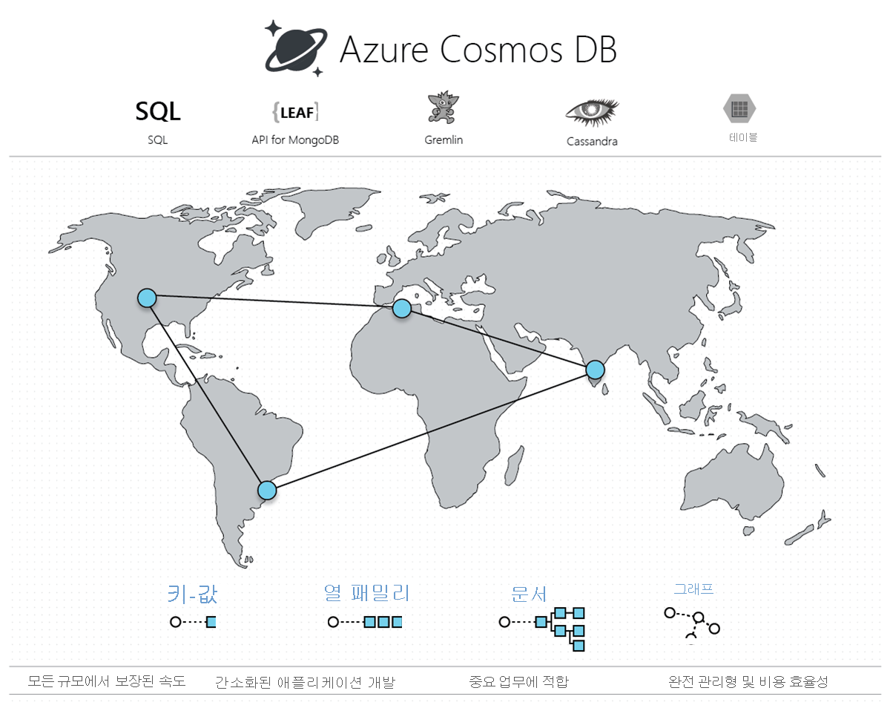

# Azure Cosmos DB 시작

오늘날의 애플리케이션은 응답성이 뛰어나며 항상 온라인을 유지해야 합니다. 짧은 대기 시간 및 고가용성을 이루려면 이러한 애플리케이션의 인스턴스를 해당 사용자에서 가까운 데이터 센터에 배포해야 합니다. 애플리케이션은 최고 사용 시간의 큰 변화에 실시간으로 응답하고, 계속 증가하는 데이터 볼륨을 저장하며, 사용자가 이 데이터를 밀리초 단위로 사용할 수 있도록 해야 합니다.

Azure Cosmos DB는 전 세계에 배포되는 Microsoft의 다중 모델 데이터베이스 서비스입니다. Cosmos DB에서 단추를 한 번만 클릭하면 전 세계의 수많은 Azure 지역에서 처리량과 스토리지의 크기를 탄력적이고 독립적으로 조정할 수 있습니다. SQL, MongoDB, Cassandra, Table 또는 Gremlin을 포함하여 선호하는 API를 사용하여 처리량과 스토리지의 크기를 탄력적으로 조정하고, 한 자릿수의 밀리초 단위로 빠르게 데이터에 액세스할 수 있는 이점을 활용합니다. Cosmos DB는 다른 데이터베이스 서비스에서 제공하지 않는 처리량, 대기 시간, 가용성 및 일관성 보장에 대한 포괄적인 [SLA(서비스 수준 계약)](https://aka.ms/acdbsla)를 제공합니다.

Azure 구독, 요금 및 약정 없이 [무료로 Azure Cosmos DB를 사용해 볼 수 있습니다](https://azure.microsoft.com/try/cosmosdb/).

> [!div class="nextstepaction"]
> [무료로 Azure Cosmos DB 사용해 보기](https://azure.microsoft.com/try/cosmosdb/)

## 주요 이점

### 턴키 글로벌 배포

Cosmos DB를 사용하면 전 세계적에서 응답성과 가용성이 높은 애플리케이션을 구축할 수 있습니다. Cosmos DB는 사용자가 있는 모든 위치에서 데이터를 투명하게 복제하므로 사용자는 가장 가까운 데이터의 복제본과 상호 작용할 수 있습니다.

Cosmos DB를 사용하면 언제든지 단추를 클릭하여 Cosmos 계정에서 Azure 지역을 추가하거나 제거할 수 있습니다. Cosmos DB는 Cosmos 계정과 연결된 모든 지역에 데이터를 원활하게 복제하는 한편, 서비스의 *multi-homing* 기능을 통해 애플리케이션의 고가용성을 계속 유지합니다. 자세한 내용은 [글로벌 배포](distribute-data-globally.md) 문서를 참조하세요.

### Always On

Cosmos DB는 Azure 인프라 및 [투명 다중 마스터 복제](global-dist-under-the-hood.md)와 긴밀하게 통합되므로 읽기 및 쓰기 모두에서 [99.999%의 고가용성](high-availability.md)을 제공합니다. 또한 Cosmos DB는 프로그래밍 방식으로(또는 포털을 통해) Cosmos 계정의 지역별 장애 조치를 호출할 수 있는 기능을 제공합니다. 이 기능을 사용하면 지역 재해 발생시 애플리케이션이 장애 조치되도록 설계할 수 있습니다.

### 전 세계의 처리량 및 스토리지에 대한 탄력적 확장성

투명한 수평 분할 및 다중 마스터 복제를 사용하도록 설계된 Cosmos DB는 전 세계의 모든 쓰기 및 읽기 작업에 대해 전례가 없는 탄력적 확장성을 제공합니다. 단일 API 호출을 통해 전 세계에 걸쳐 있는 수천에서 수억 개의 요청/초 단위로 탄력적으로 크기 조정할 수 있으며 필요한 처리량(및 스토리지)에 대한 요금만 지불하면 됩니다. 이 기능을 사용하면 최대 사용량을 초과하여 프로비전하지 않고도 워크로드에서 예기치 않은 스파이크를 처리할 수 있습니다. 자세한 내용은 [Cosmos DB에서 분할](partitioning-overview.md), [컨테이너 및 데이터베이스에 대한 처리량 프로비전](set-throughput.md) 및 [글로벌로 프로비저닝된 처리량 크기 조정](scaling-throughput.md)을 참조하세요.

### 전 세계적으로 99번째 백분위 수의 짧은 대기 시간 보장

Cosmos DB를 사용하면 응답성이 뛰어나고 세계적 규모의 애플리케이션을 구축할 수 있습니다. Cosmos DB는 새로운 다중 마스터 복제 프로토콜과 [쓰기에 최적화된 무제한 데이터베이스 엔진](index-policy.md)을 통해 전 세계의 읽기(인덱싱됨) 및 쓰기 작업 모두에 대해 99번째 백분위수에서 10밀리초 미만의 대기 시간을 보장합니다. 이 기능을 사용하면 지속적으로 데이터를 수집하고 응답성이 뛰어난 애플리케이션에 대해 매우 빠르게 쿼리할 수 있습니다.

### 정확하게 정의된 다중 일관성 선택 항목

Cosmos DB에서 글로벌로 분산된 애플리케이션을 구축할 때 [일관성, 가용성, 대기 시간, 처리량을 더 이상 극단적으로 절충](consistency-levels-tradeoffs.md)할 필요가 없습니다. Cosmos DB의 다중 마스터 복제 프로토콜은 글로벌로 분산된 애플리케이션에 짧은 대기 시간과 높은 가용성을 제공하는 직관적인 프로그래밍 모델을 위해 [잘 정의된 5가지 일관성 선택 항목](consistency-levels.md) - , 즉 *강력한 일관성*, *제한된 부실*, *세션 일관성*, *일관된 접두사* 및 *최종 일관성*을 제공하도록 신중하게 설계되었습니다.

### 스키마 또는 인덱스 관리 없음

데이터베이스 스키마와 인덱스를 애플리케이션 스키마와 동기화하여 유지하는 것은 전 세계적으로 배포된 애플리케이션에 특히 어려운 과제입니다. Cosmos DB를 사용하면 스키마 또는 인덱스 관리를 처리할 필요가 없습니다. 데이터베이스 엔진은 스키마와 완전히 관련이 없습니다.  스키마와 인덱스를 관리할 필요가 없으므로 스키마를 마이그레이션하는 동안 애플리케이션 가동 중지에 대해 걱정할 필요가 없습니다. Cosmos DB는 [모든 데이터를 자동으로 인덱싱](index-policy.md)하며, 쿼리를 빠르게 처리합니다.

### 엄격하게 테스트된(battle-tested) 데이터베이스 서비스

Cosmos DB는 Azure의 기본 서비스입니다. 거의 10년 동안 Cosmos DB는 Skype, Xbox, Office 365, Azure 및 다른 많은 애플리케이션을 포함하여 전 세계 규모의 다양한 중요 업무 애플리케이션용 Microsoft 제품에서 사용되어 왔습니다. 오늘날 Cosmos DB는 Azure에서 가장 빠르게 성장하고 있는 서비스 중 하나로, 읽기 및 쓰기 작업 모두에 대한 짧은 대기 시간과 높은 가용성을 위해 탄력적 크기 조정, 턴키 글로벌 배포, 다중 마스터 복제가 필요한 외부의 많은 고객과 중요 업무용 애플리케이션에서 사용하고 있습니다.

### 유비쿼터스 지역 현재 상태

Cosmos DB는 공용 클라우드, [Azure 중국 21Vianet](https://www.azure.cn/en-us/), Azure 독일, Azure Government, Azure Government DoD(국방부) 등 54개 이상의 지역을 포함하여 전 세계의 모든 Azure 지역에서 사용할 수 있습니다. [Azure Cosmos DB의 지역 현재 상태](regional-presence.md)를 참조하세요.

### 기본적인 엔터프라이즈 수준 보안

Cosmos DB는 [광범위한 규정 준수 표준](compliance.md)에 대한 인증을 받았습니다. 또한 Cosmos DB의 모든 데이터는 저장 및 이동 상태에서 암호화됩니다. Cosmos DB는 행 수준 권한 부여를 제공하고 엄격한 보안 표준을 준수합니다.

### 현저한 TCO 절감

Cosmos DB는 완전 관리형 서비스이므로 더 이상 복잡한 다중 데이터 센터 배포 및 데이터베이스 소프트웨어 업그레이드를 관리하고 운영하거나, 지원, 라이선스 또는 운영 비용을 지불하거나, 최대 워크로드에 대비하여 데이터베이스를 프로비저닝할 필요가 없습니다. 자세한 내용은 [Cosmos DB로 비용 최적화](total-cost-ownership.md)를 참조하세요.

### 업계 최고의 포괄적인 SLA

Cosmos DB는 99.999%의 고가용성, 99번째 백분위수의 대기 시간, 보증된 처리량 및 일관성을 포함하여 [업계 최고의 포괄적인 SLA](https://azure.microsoft.com/support/legal/sla/cosmos-db/)를 제공하는 최초의 유일한 서비스입니다.

### Spark를 사용하여 글로벌로 분산된 운영 분석

Cosmos DB에 저장된 데이터에 대해 [Spark](spark-connector.md)를 실행할 수 있습니다. 이 기능을 사용하면 Cosmos DB에 대해 직접 작동하는 트랜잭션 워크로드에 영향을 주지 않으면서 짧은 대기 시간의 운영 분석을 세계적 규모로 수행할 수 있습니다. 자세한 내용은 [글로벌로 분산된 운영 분석](lambda-architecture.md)을 참조하세요.

### 인기 있는 NoSQL API를 사용하여 Cosmos DB에서 애플리케이션 개발

Cosmos DB는 Cosmos 데이터베이스에 저장된 데이터를 사용하는 API에 대한 선택 항목을 제공합니다. 기본적으로 [SQL(코어 API)을 사용](how-to-sql-query.md)하여 Cosmos 데이터베이스를 쿼리할 수 있습니다. 또한 Cosmos DB는 [Cassandra](cassandra-introduction.md), [MongoDB](mongodb-introduction.md), [Gremlin](graph-introduction.md) 및 [Azure Table Storage](table-introduction.md)용 API도 구현합니다. 일반적으로 사용되는 NoSQL(예: MongoDB, Cassandra, Gremlin)용 클라이언트 드라이버 및 도구를 Cosmos 데이터베이스에 직접 연결할 수 있습니다. 일반적으로 사용되는 NoSQL API의 유선 프로토콜을 지원함에 따라 Cosmos DB에서 수행할 수 있는 작업은 다음과 같습니다.

* 애플리케이션 논리의 상당 부분을 유지하면서 애플리케이션을 Cosmos DB로 쉽게 마이그레이션합니다.
* 클라우드 공급업체와 관계없이 애플리케이션을 이식 가능한 상태로 계속 유지합니다.
* 일반적인 NoSQL API에 대한 업계 최고의 금융 지원 SLA를 통해 완전 관리형 클라우드 서비스를 얻습니다. 
* 필요에 따라 데이터베이스에 대한 프로비전된 처리량과 스토리지의 크기를 탄력적으로 조정하고 필요한 처리량과 스토리지에 대한 요금만 지불합니다. 이를 통해 상당한 비용을 절감할 수 있습니다.

## Azure Cosmos DB를 활용하는 솔루션

다양한 데이터에 대한 거의 실시간에 가까운 응답 시간을 통해 [전 세계 규모](distribute-data-globally.md)에서 대량의 데이터, 읽기 및 쓰기를 처리해야 하는 모든 [웹, 모바일, 게임 및 IoT 애플리케이션](use-cases.md)은 Cosmos DB에서 [보장하는 고가용성](https://azure.microsoft.com/support/legal/sla/cosmos-db/), 높은 처리량, 짧은 대기 시간 및 튜닝 가능한 일관성의 이점을 누릴 수 있습니다. Azure Cosmos DB를 [IoT 및 전자 통신 정보](use-cases.md#iot-and-telematics), [소매 및 마케팅](use-cases.md#retail-and-marketing), [게임](use-cases.md#gaming), [웹 및 모바일 애플리케이션](use-cases.md#web-and-mobile-applications)에 적용하는 방법에 대해 알아보세요.

## 다음 단계

Cosmos DB의 핵심 개념인 [턴키 글로벌 배포](distribute-data-globally.md), [분할](partitioning-overview.md) 및 [프로비저닝된 처리량](request-units.md)에 대해 자세히 알아봅니다.

다음 요약 설명서를 통해 Azure Cosmos DB를 시작해 보세요.

* [Azure Cosmos DB SQL API 시작](create-sql-api-dotnet.md)
* [Azure Cosmos DB의 MongoDB API 시작](create-mongodb-nodejs.md)
* [Azure Cosmos DB Cassandra API 시작](create-cassandra-dotnet.md)
* [Azure Cosmos DB Gremlin API 시작](create-graph-dotnet.md)
* [Azure Cosmos DB Table API 시작](create-table-dotnet.md)

> [!div class="nextstepaction"]
> [무료로 Azure Cosmos DB 사용해 보기](https://azure.microsoft.com/try/cosmosdb/)
