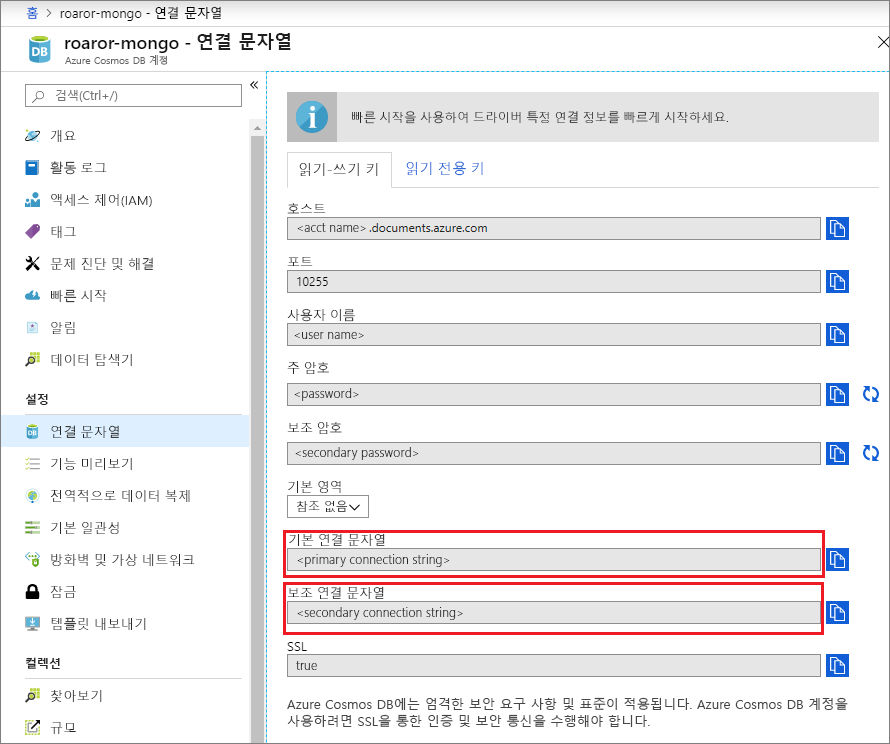
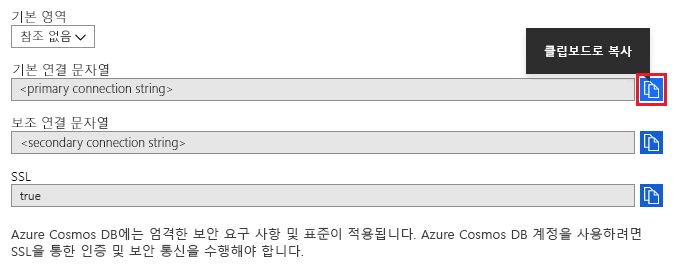
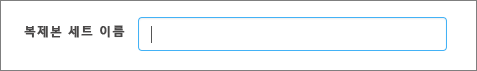

# Compass를 사용하여 Cosmos DB 계정에 연결합니다.

이 자습서에서는 Cosmos DB에서 데이터를 저장 및/또는 관리할 때 [MongoDB Compass](https://www.mongodb.com/products/compass)를 사용하는 방법을 보여 줍니다. 이 연습에서는 MongoDB용 Azure Cosmos DB API를 사용합니다. 사용 방법을 잘 모르는 사용자에게 Compass는 MongoDB용 GUI입니다. 일반적으로 데이터 관리와 함께 데이터를 시각화하고 임시 쿼리를 실행하는 데 사용됩니다. 

Cosmos DB는 전역적으로 배포된 Microsoft의 다중 모델 데이터베이스 서비스입니다. Cosmos DB의 핵심인 글로벌 배포 및 수평적 크기 조정 기능의 이점을 활용하여 문서, 키/값 및 그래프 데이터베이스를 빠르게 만들고 쿼리할 수 있습니다.

## 필수 조건 
Robo 3T를 사용하여 Cosmos DB 계정에 연결하려면 다음을 수행해야 합니다.

* [Compass](https://www.mongodb.com/download-center/compass?jmp=hero) 다운로드 및 설치
* Cosmos DB [연결 문자열](connect-mongodb-account.md) 정보 확보

## MongoDB용 Cosmos DB API에 연결 
Cosmos DB 계정을 Compass에 연결하려면 아래 단계를 따릅니다.

1. [여기](connect-mongodb-account.md)에 설명된 지침에 따라 Azure Cosmos DB의 MongoDB용 API로 구성된 Cosmos 계정에 대한 연결 정보를 검색합니다.

    

2. Cosmos DB에서 **기본/보조 연결 문자열** 옆에 있는 **클립보드로 복사**라는 단추를 클릭합니다. 이 단추를 클릭하면 전체 연결 문자열이 클립보드로 복사됩니다. 

    

3. 데스크톱/머신에서 Compass를 열고 **연결**, **연결 대상...** 을 차례로 클릭합니다. 

4. Compass는 클립보드에서 연결 문자열을 자동으로 검색하며 연결하는 데 이 연결 문자열을 사용할지 묻는 메시지를 표시합니다. 아래 스크린샷과 같이 **예**를 클릭합니다.

    

5. 위 단계에서 **예**를 클릭하면 연결 문자열의 세부 정보가 자동으로 채워집니다. **복제본 세트 이름** 필드에서 채워진 값을 제거하여 비어 있는지 확인합니다. 

    

6. 페이지 아래쪽에서 **연결**을 클릭합니다. 이제 Cosmos DB 계정 및 데이터베이스가 MongoDB Compass 내에 표시됩니다.

## 다음 단계

- Azure Cosmos DB의 MongoDB용 API와 함께 [Studio 3T를 사용](mongodb-mongochef.md)하는 방법을 알아봅니다.
- Azure Cosmos DB의 MongoDB용 API를 사용하여 MongoDB [샘플](mongodb-samples.md)을 살펴봅니다.