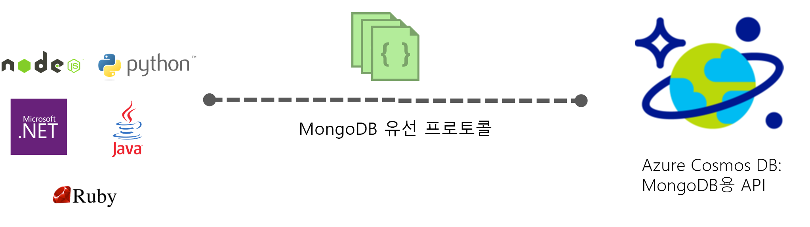

# Azure Cosmos DB 소개: MongoDB API

[Azure Cosmos DB](../cosmos-db/introduction.md)는 업무에 중요한 응용 프로그램에 대한 Microsoft의 전역 분산 다중 모델 데이터베이스 서비스입니다. Azure Cosmos DB는 [업계 최고의 SLA](https://azure.microsoft.com/support/legal/sla/cosmos-db/)로 지원되는 [턴키 전역 분산](distribute-data-globally.md), 전 세계적으로 [처리량 및 저장소의 탄력적인 확장](partition-data.md), 99번째 백분위수의 1자리 수 밀리초 크기 대기 시간, 보장된 고가용성을 제공합니다. Azure Cosmos DB는 사용자가 스키마 및 인덱스 관리를 처리하지 않아도 되도록 [데이터를 자동으로 인덱싱](https://www.vldb.org/pvldb/vol8/p1668-shukla.pdf)합니다. 또한 다중 모델 방식이며, 문서, 키-값, 그래프 및 열 형식 데이터 모델을 지원합니다. 

 

Azure Cosmos DB 데이터베이스는 [MongoDB](https://docs.mongodb.com/manual/introduction/)용으로 작성된 앱의 데이터 저장소로 사용할 수 있습니다. 이 기능은 MongoDB용으로 작성된 응용 프로그램에서 기존 [드라이버](https://docs.mongodb.org/ecosystem/drivers/)를 사용하여 Azure Cosmos DB와 통신하고 MongoDB 데이터베이스 대신 Azure Cosmos DB 데이터베이스를 사용할 수 있습니다. 대부분의 경우 연결 문자열만 변경하여 MongoDB에서 Azure Cosmos DB로 전환할 수 있습니다. 이 기능을 사용하면 MongoDB에서 친숙한 기술과 도구를 계속 사용하면서 Azure Cosmos DB 및 [포괄적인 업계 선도적 SLA](https://azure.microsoft.com/support/legal/sla/cosmos-db)를 통해 Azure 클라우드에서 전역 배포된 MongoDB 데이터베이스 애플리케이션을 쉽게 빌드하고 실행할 수 있습니다.

**MongoDB 호환성**: Azure Cosmos DB에서 MongoDB 유선 프로토콜을 구현하므로 기존 MongoDB 전문 지식, 애플리케이션 코드 및 도구를 사용할 수 있습니다. MongoDB를 사용하여 애플리케이션을 개발하고, 완벽하게 관리되고 전 세계적으로 배포되는 Azure Cosmos DB 서비스를 사용하여 프로덕션에 배포할 수 있습니다. 지원되는 버전에 대한 자세한 내용은 [MongoDB 프로토콜 지원](mongodb-feature-support.md#mongodb-protocol-support)을 참조하세요.

Azure Cosmos DB의 MongoDB API는 Azure Stream Analytics 같은 서비스의 직접적인 엔드포인트로 사용할 수 없습니다. MongoDB API는 기본 MongoDB와 동일한 [클라이언트 드라이버](https://docs.mongodb.org/ecosystem/drivers/)를 사용하기 때문입니다. Azure Stream Analytics와 통합하려면 Azure Cosmos DB의 MongoDB API에 데이터를 쓸 수 있는 미들웨어 서비스로 [Azure App Service](../app-service/app-service-web-overview.md) 또는 [Azure Functions Service](../azure-functions/functions-overview.md)를 사용하는 것이 좋습니다.

## MongoDB 응용 프로그램에 Azure Cosmos DB를 사용할 경우의 이점은 무엇인가요?

**탄력적으로 확장 가능한 처리량 및 스토리지:** MongoDB 데이터베이스를 쉽게 확장하거나 축소하여 애플리케이션 요구 사항이 충족됩니다. 데이터는 예측 가능한 짧은 대기 시간을 위해 SSD(반도체 드라이브)에 저장됩니다. Azure Cosmos DB는 거의 제한되지 않는 저장소 크기와 프로비전된 처리량으로 크기 조정할 수 있는 MongoDB 컬렉션을 지원합니다. 응용 프로그램 증가에 따라 탄력적으로 Azure Cosmos DB를 확장하고 원활하게 예측 가능한 성능을 얻을 수 있습니다. 

**다중 지역 복제:** Azure Cosmos DB는 MongoDB 계정과 연결한 모든 지역에 투명하게 데이터를 복제하여 해당 보증을 포함한 일관성, 가용성과 성능 사이의 균형을 제공하는 한편 데이터에 대한 전역 액세스를 필요로 하는 애플리케이션을 개발할 수 있도록 합니다. Azure Cosmos DB에서는 멀티 호밍 API를 사용하는 투명한 지역 장애 조치 및 전 세계에 걸쳐 처리량 및 저장소 크기를 탄력적으로 조정하는 기능을 제공합니다. [데이터를 글로벌 배포](distribute-data-globally.md)에 대한 자세한 정보

**서버 관리 없음**: MongoDB 데이터베이스를 관리하고 크기를 조정할 필요가 없습니다. Azure Cosmos DB는 완벽하게 관리되는 서비스이므로 인프라 또는 Virtual Machines를 직접 관리할 필요가 없습니다. Azure Cosmos DB는 30개 이상의 [Azure 지역](https://azure.microsoft.com/regions/services/)에서 사용할 수 있습니다.

**튜닝 가능한 일관성 수준:** Azure Cosmos DB는 다중 모델 API를 지원하기 때문에 일관성 설정은 계정 수준에서 적용되며 일관성 적용은 각 API에 의해 제어됩니다. MongoDB 3.6까지는 세션 일관성에 대한 개념이 없었으므로 MongoDB API 계정에서 세션 일관성을 사용하도록 설정하는 경우, 일관성은 MongoDB API를 사용할 때 최종으로 다운그레이드됩니다. MongoDB API 계정에 대해 읽기-사용자-쓰기 보장이 필요한 경우 계정에 대한 기본 일관성 수준이 강함 또는 제한된 부실로 설정되어야 합니다. [일관성 수준을 사용하여 가용성 및 성능 최대화](consistency-levels.md)에서 자세히 알아보세요.

| Azure Cosmos DB 기본 일관성 수준 |   Mongo API(3.4) |
|---|---|
|최종| 최종 |
|일관적인 접두사| 일관된 순서가 있는 최종 |
|세션| 일관된 순서가 있는 최종 |
|제한된 부실| 강력 |
| 강력 | 강력 |

**자동 인덱싱**: Azure Cosmos DB는 기본적으로 MongoDB 데이터베이스에 있는 문서 내의 모든 속성을 자동으로 인덱싱하고, 스키마 또는 보조 인덱스 생성을 기대하거나 요구하지 않습니다. 또한 고유 인덱스 기능을 통해 Azure Cosmos DB에서 이미 자동 인덱싱된 모든 문서 필드에 고유성 제약 조건을 적용할 수 있습니다.

**엔터프라이즈급**: Azure Cosmos DB는 로컬 및 하위 지역 장애에 대비하여 99.99% 가용성 및 데이터 보호 기능을 제공하기 위해 다중 로컬 복제본을 지원합니다. Azure Cosmos DB에는 엔터프라이즈급 [규정 준수 인증서](https://www.microsoft.com/trustcenter) 및 보안 기능이 있습니다. 

## 시작하는 방법

MongoDB 빠른 시작에 따라 Azure Cosmos DB 계정을 만들고, Azure Cosmos DB를 사용하도록 기존 MongoDB 애플리케이션을 마이그레이션하거나 새 MongoDB 애플리케이션을 빌드합니다.

* [기존 Node.js MongoDB 웹앱 마이그레이션](create-mongodb-nodejs.md)
* [.NET 및 Azure Portal에서 MongoDB API 웹앱 빌드](create-mongodb-dotnet.md)
* [Java 및 Azure Portal에서 MongoDB API 콘솔 앱 빌드](create-mongodb-java.md)

## 다음 단계

Azure Cosmos DB MongoDB API에 대한 정보는 전체 Azure Cosmos DB 설명서에 통합되어 있지만 여기서는 시작하기 위한 몇 가지 사항을 다룹니다.

* [MongoDB 계정에 연결](connect-mongodb-account.md) 자습서에 따라 계정 연결 문자열 정보를 가져오는 방법을 알아봅니다.
* [Azure Cosmos DB로 Studio 3T(MongoChef) 사용](mongodb-mongochef.md) 자습서를 따라 Studio 3T에서 Azure Cosmos DB 데이터베이스와 MongoDB 앱 간에 연결을 만드는 방법을 알아봅니다.
* [MongoDB에 대한 프로토콜 지원을 사용하여 데이터를 Azure Cosmos DB로 마이그레이션](mongodb-migrate.md) 자습서를 따라 데이터를 MongoDB API 데이터베이스로 가져옵니다.
* [Robomongo](mongodb-robomongo.md)를 사용하여 MongoDB API 계정에 연결합니다.
* [전역에 분산되는 앱에 대한 읽기 기본 설정을 구성](../cosmos-db/tutorial-global-distribution-mongodb.md)하는 방법을 알아봅니다.
