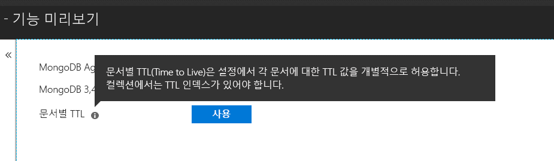

# <a name="expire-data-with-azure-cosmos-dbs-api-for-mongodb"></a>Azure Cosmos DB의 API for MongoDB를 사용하여 데이터 만료

TTL(Time to Live) 기능을 통해 자동으로 데이터를 만료시킬 수 있습니다. Azure Cosmos DB의 API for MongoDB는 Cosmos DB의 핵심 TTL 기능을 활용합니다. 전체 컬렉션에 기본 TTL 값을 설정하는 모드와 각 문서의 개별 TTL 값을 설정하는 두 가지 모드가 지원됩니다. Cosmos DB의 API for MongoDB에서 TTL 인덱스 및 문서별 TTL 값을 제어하는 논리는 [Cosmos DB와 동일합니다](../cosmos-db/mongodb-indexing.md).

## <a name="ttl-indexes"></a>TTL 인덱스
컬렉션 전체에서 TTL을 사용하려면 ["TTL index"(Time to Live 인덱스)](../cosmos-db/mongodb-indexing.md)를 만들어야 합니다. TTL 인덱스는 "expireAfterSeconds" 값을 가진 _ts 필드의 인덱스입니다.

예제:
```JavaScript
globaldb:PRIMARY> db.coll.createIndex({"_ts":1}, {expireAfterSeconds: 10})
{
        "_t" : "CreateIndexesResponse",
        "ok" : 1,
        "createdCollectionAutomatically" : true,
        "numIndexesBefore" : 1,
        "numIndexesAfter" : 4
}
```

위 예제의 명령은 TTL 기능을 사용하여 인덱스를 만듭니다. 인덱스가 만들어지면 데이터베이스는 마지막 10초 후에 수정되지 않은 컬렉션의 모든 문서를 자동으로 삭제합니다. 

> [!NOTE]
> **_ts**는 Cosmos DB 전용 필드이며 MongoDB 클라이언트에서 액세스할 수 없습니다. 문서의 마지막 수정의 타임스탬프를 포함하는 예약된(시스템) 속성입니다.
>
    
또한 C# 예제는 다음과 같습니다. 

```csharp
var options = new CreateIndexOptions {ExpireAfter = TimeSpan.FromSeconds(10)}; 
var field = new StringFieldDefinition<BsonDocument>("_ts"); 
var indexDefinition = new IndexKeysDefinitionBuilder<BsonDocument>().Ascending(field); 
await collection.Indexes.CreateOneAsync(indexDefinition, options); 
``` 

## <a name="set-time-to-live-value-for-a-document"></a>문서의 TTL(Time to live)을 설정합니다. 
문서별 TTL 값도 지원됩니다. 문서에 루트 수준 속성 "ttl"(소문자)이 포함되어야 하고, 위에서 설명했듯이 해당 컬렉션에 대한 TTL 인덱스를 만들어야 합니다. 문서에 설정된 TTL 값은 컬렉션의 TTL 값을 재정의합니다.

TTL 값은 int32여야 합니다. 또는 int32에 맞는 int64 또는 int32에 어울리고 소수 부분이 없는 더블이어야 합니다. 이러한 사양을 준수하지 않는 TTL 속성 값은 허용되기는 하지만 의미 있는 문서 TTL 값으로 취급되지 않습니다.

문서의 TTL 값은 선택 사항입니다. TTL 값이 없는 문서는 컬렉션에 삽입할 수 있습니다.  이 경우 컬렉션의 TTL 값이 적용됩니다. 

다음 문서는 TTL 값이 유효합니다. 문서가 삽입되면 문서 TTL 값이 컬렉션의 TTL 값을 재정의합니다. 따라서 문서가 20초 후 제거됩니다.   

```JavaScript 
globaldb:PRIMARY> db.coll.insert({id:1, location: "Paris", ttl: 20.0}) 
globaldb:PRIMARY> db.coll.insert({id:1, location: "Paris", ttl: NumberInt(20)}) 
globaldb:PRIMARY> db.coll.insert({id:1, location: "Paris", ttl: NumberLong(20)}) 
```

다음 문서는 TTL 값이 잘못되었습니다. 문서가 삽입되지만, 문서 TTL 값이 적용되지 않습니다. 따라서 컬렉션의 TTL 값 때문에 문서가 10초 후 제거됩니다. 

```JavaScript 
globaldb:PRIMARY> db.coll.insert({id:1, location: "Paris", ttl: 20.5}) //TTL value contains non-zero decimal part. 
globaldb:PRIMARY> db.coll.insert({id:1, location: "Paris", ttl: NumberLong(2147483649)}) //TTL value is greater than Int32.MaxValue (2,147,483,648). 
``` 

## <a name="how-to-activate-the-per-document-ttl-feature"></a>문서별 TTL이 기능을 활성화하는 방법

문서별 TTL 기능은 Azure Cosmos DB의 API for MongoDB로 활성화할 수 있습니다.

 

## <a name="next-steps"></a>다음 단계
* [TTL(Time To Live)을 사용하여 자동으로 Azure Cosmos DB의 데이터 만료](../cosmos-db/time-to-live.md)
* [Azure Cosmos DB의 API for MongoDB를 사용하여 구성된 Cosmos DB 인덱싱](../cosmos-db/mongodb-indexing.md)
