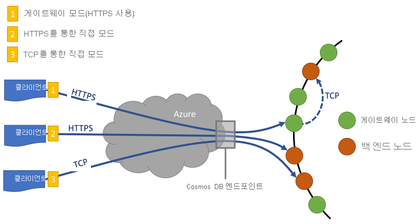

# <a name="performance-tips-for-azure-cosmos-db-and-net"></a>Azure Cosmos DB 및 .NET에 대한 성능 팁

> [!div class="op_single_selector"]
> * [비동기 Java](performance-tips-async-java.md)
> * [Java](performance-tips-java.md)
> * [.NET](performance-tips.md)
> 

Azure Cosmos DB는 보장된 대기 시간 및 처리량으로 매끄럽게 크기가 조정되는 빠르고 유연한 분산 데이터베이스입니다. Azure Cosmos DB를 사용하여 데이터베이스의 크기를 조정하기 위해 주요 아키텍처를 변경하거나 복잡한 코드를 작성할 필요는 없습니다. 규모를 확장 및 축소하는 방법이 API 호출을 하나 만드는 것만큼 쉽습니다. 자세한 내용은 [컨테이너 처리량을 프로비전하는 방법](how-to-provision-container-throughput.md) 또는 [데이터베이스 처리량을 프로비전하는 방법](how-to-provision-database-throughput.md)을 참조하세요. 그러나 네트워크 호출을 통해 Azure Cosmos DB에 액세스하기 때문에 [SQL .NET SDK](documentdb-sdk-dotnet.md)를 사용할 때 최대 성능을 얻기 위해 클라이언트 쪽에서 최적화 작업을 수행할 수 있습니다.

"내 데이터베이스 성능을 향상시키는 방법"을 물으면 다음 옵션을 고려합니다.

## <a name="networking"></a>네트워킹
<a id="direct-connection"></a>

1. **연결 정책: 직접 연결 모드 사용**

    클라이언트가 Azure Cosmos DB에 연결하는 방법은 특히 관찰되는 클라이언트 쪽 대기 시간 측면에서 성능에 중요한 영향을 미칩니다. 클라이언트 연결 정책, 즉 연결 ‘모드’와 연결 ‘프로토콜’을 구성하는 데 사용할 수 있는 두 가지 주요 구성 설정이 있습니다.  두 가지 사용 가능한 모드는 같습니다.

   * 게이트웨이 모드(기본값)
      
     게이트웨이 모드는 모든 SDK 플랫폼에서 지원되며 기본 구성입니다. 엄격한 방화벽으로 제한된 회사 네트워크 내에서 애플리케이션을 실행하는 경우, 표준 HTTPS 포트 및 단일 엔드포인트를 사용하기 때문에 게이트웨이 모드가 최상의 선택입니다. 그러나 게이트웨이 모드의 경우 성능 유지를 위해 Azure Cosmos DB에서 데이터를 읽거나 쓸 때마다 네트워크 홉이 추가됩니다. 이 때문에 직접 모드는 네트워크 홉이 적기 때문에 더 나은 성능을 제공합니다. 제한된 개수의 소켓 연결이 있는 환경에서 애플리케이션을 실행하는 경우(예: Azure Functions를 사용할 때 또는 사용량 플랜을 사용 중인 경우)에도 게이트웨이 연결 모드를 사용하는 것이 좋습니다. 

   * 직접 모드

     직접 모드는 TCP 및 HTTPS 프로토콜을 통한 연결을 지원합니다. 최신 버전의.NET SDK를 사용 하는 경우 직접 연결 모드는.NET Standard 2.0 및.NET framework에서 지원 됩니다. 직접 모드를 사용하는 경우 다음과 같이 두 가지 프로토콜 옵션을 사용할 수 있습니다.

     * TCP
     * HTTPS

     게이트웨이 모드를 사용하는 경우에는 Cosmos DB가 포트 443을 사용하고, Azure Cosmos DB의 API for MongoDB를 사용하는 경우에는 포트 10250, 10255 및 10256을 사용합니다. 포트 10250은 지역 복제 없이 기본 MongoDB 인스턴스에 매핑되고 포트 10255/10256은 지역 복제를 사용하여 MongoDB 인스턴스에 매핑됩니다. 직접 모드에서 TCP를 사용할 때는 Azure Cosmos DB에서 동적 TCP 포트를 사용하므로 게이트웨이 포트 외에 10000에서 20000 사이의 포트 범위가 열려 있는지 확인해야 합니다. 이러한 포트가 열려 있지 않은 경우 TCP를 사용하려고 하면 503 서비스를 사용할 수 없음 오류가 발생합니다. 다음 표에서는 다른 API에 사용할 수 있는 연결 모드 및 각 API에 사용할 수 있는 서비스 포트를 보여줍니다.

     |연결 모드  |지원되는 프로토콜  |지원되는 SDK  |API/서비스 포트  |
     |---------|---------|---------|---------|
     |게이트웨이  |   HTTPS    |  모든 SDK    |   SQL(443), Mongo(10250, 10255, 10256), Table(443), Cassandra(10350), Graph(443)    |
     |직접    |    HTTPS     |  .NET 및 Java SDK    |   10000-20,000개 범위 내의 포트    |
     |직접    |     TCP    |  .NET SDK    | 10000-20,000개 범위 내의 포트 |

     Azure Cosmos DB는 HTTPS를 통해 단순한 개방형 RESTful 프로그래밍 모델을 제공합니다. 또한 통신 모델이 RESTful이며 .NET 클라이언트 SDK를 통해 사용할 수 있는 효율적인 TCP 프로토콜도 제공합니다. 직접 TCP 및 HTTPS는 모두 초기 인증 및 암호화 트래픽에 SSL을 사용합니다. 최상의 성능을 위해 가능한 경우 TCP 프로토콜을 사용 합니다.

     연결 모드는 ConnectionPolicy 매개 변수로 DocumentClient 인스턴스를 생성하는 도중 구성됩니다. 직접 모드를 사용하는 경우 ConnectionPolicy 매개 변수 내에서 프로토콜을 설정할 수도 있습니다.

     ```csharp
     var serviceEndpoint = new Uri("https://contoso.documents.net");
     var authKey = "your authKey from the Azure portal";
     DocumentClient client = new DocumentClient(serviceEndpoint, authKey,
     new ConnectionPolicy
     {
        ConnectionMode = ConnectionMode.Direct,
        ConnectionProtocol = Protocol.Tcp
     });
     ```

     TCP는 직접 모드에서만 지원되기 때문에, 게이트웨이 모드를 사용하는 경우 게이트웨이와 통신하는 데 항상 HTTPS 프로토콜을 사용하고 ConnectionPolicy의 프로토콜 값은 무시됩니다.

     

2. **첫 번째 요청 시 시작 대기 시간을 피하기 위해 OpenAsync 호출**

    기본적으로 첫 번째 요청은 주소 라우팅 테이블을 가져와야 하기 때문에 대기 시간이 길어집니다. 첫 번째 요청에서 이 시작 대기 시간을 방지하려면 다음과 같이 초기화할 때 OpenAsync()를 한 번만 호출해야 합니다.

        await client.OpenAsync();
   <a id="same-region"></a>
3. **성능을 위해 동일한 Azure 지역에 클라이언트 배치**

    가능한 경우 Azure Cosmos DB를 호출하는 모든 애플리케이션을 Azure Cosmos DB 데이터베이스와 동일한 지역에 배치합니다. 대략적으로 비교한다면, 동일한 지역 내의 Azure Cosmos DB 호출은 1-2밀리초 내에 완료되지만 미국 서부와 동부 해안 간의 대기 시간은 50밀리초보다 큽니다. 클라이언트에서 Azure 데이터 센터 경계로 요청이 전달되는 경로에 따라 이러한 요청 간 대기 시간은 달라질 수 있습니다. 호출하는 애플리케이션이 프로비전된 Azure Cosmos DB 엔드포인트와 동일한 Azure 지역 내에 있도록 하면 가능한 최저 대기 시간을 얻을 수 있습니다. 사용 가능한 영역 목록은 [Azure 지역](https://azure.microsoft.com/regions/#services)을 참조하세요.

    
   <a id="increase-threads"></a>
4. **스레드/작업의 수 늘리기**

    Azure Cosmos DB 호출은 네트워크를 통해 수행되므로 클라이언트 애플리케이션이 요청 간에 대기하는 시간이 짧도록 요청의 병렬 처리 수준을 다양하게 지정해야 할 수 있습니다. 예를 들어 .NET의 [작업 병렬 라이브러리](https://msdn.microsoft.com//library/dd460717.aspx)를 사용하는 경우 Azure Cosmos DB를 읽거나 쓰는 작업을 대략 수백 개 만듭니다.

5. **가속화 된 네트워킹을 사용 하도록 설정**

   대기 시간 및 CPU 지터 줄이려면는 클라이언트 가상 컴퓨터는 가속화 된 네트워킹 사용 하도록 설정 하는 것이 좋습니다. 참조를 [가속 네트워킹을 사용 하 여 Windows 가상 컴퓨터를 만들](../virtual-network/create-vm-accelerated-networking-powershell.md) 또는 [가속 네트워킹을 사용 하 여 Linux 가상 머신 만들기](../virtual-network/create-vm-accelerated-networking-cli.md) 가속된 네트워킹을 사용 하는 문서입니다.


## <a name="sdk-usage"></a>SDK 사용
1. **최신 SDK 설치**

    Azure Cosmos DB SDK는 최상의 성능을 제공하기 위해 지속적으로 향상됩니다. [Azure Cosmos DB SDK](documentdb-sdk-dotnet.md) 페이지를 참조하여 최신 SDK를 확인하고 향상된 기능을 검토하세요.
2. **애플리케이션 수명 동안 singleton Azure Cosmos DB 클라이언트 사용**

    각 DocumentClient 인스턴스는 스레드로부터 안전하고 직접 모드에서 작동하는 경우 효율적인 연결 관리와 주소 캐싱을 수행합니다. DocumentClient에 의해 연결을 효율적으로 관리하고 성능을 개선하려면 애플리케이션 수명 동안 AppDomain당 DocumentClient의 단일 인스턴스를 사용하는 것이 좋습니다.

   <a id="max-connection"></a>
3. **Gateway 모드를 사용하는 경우 호스트당 System.Net MaxConnections 늘리기**

    게이트웨이 모드를 사용하는 경우 Azure Cosmos DB 요청은 HTTPS/REST를 통해 수행되며 호스트 이름 또는 IP 주소당 기본 연결 제한이 적용됩니다. 클라이언트 라이브러리가 Azure Cosmos DB에 대한 여러 동시 연결을 활용할 수 있도록 MaxConnections를 더 높은 값(100-1000)으로 설정해야 할 수도 있습니다. .NET SDK 1.8.0 이상에서 [ServicePointManager.DefaultConnectionLimit](https://msdn.microsoft.com/library/system.net.servicepointmanager.defaultconnectionlimit.aspx)의 기본값은 50이며, 이 값을 변경하려면 [Documents.Client.ConnectionPolicy.MaxConnectionLimit](https://msdn.microsoft.com/library/azure/microsoft.azure.documents.client.connectionpolicy.maxconnectionlimit.aspx)를 더 높은 값으로 설정할 수 있습니다.   
4. **분할된 컬렉션에 대한 병렬 쿼리 튜닝**

     SQL .NET SDK 버전 1.9.0 이상은 분할된 컬렉션을 병렬로 쿼리할 수 있는 병렬 쿼리를 지원합니다. 자세한 내용은 SDK 사용과 관련된 [코드 샘플](https://github.com/Azure/azure-documentdb-dotnet/blob/master/samples/code-samples/Queries/Program.cs)을 참조하세요. 병렬 쿼리는 해당 직렬 대응을 통해 쿼리 대기 시간 및 처리량을 개선하기 위해 설계되었습니다. 병렬 쿼리는 사용자가 사용자 지정 맞춤 요구 사항을 튜닝할 수 있는 다음과 같은 두 개의 매개 변수를 제공합니다. (a) MaxDegreeOfParallelism: 파티션의 최대 수를 제어한 다음 병렬로 쿼리될 수 있습니다. (b) MaxBufferedItemCount: 프리페치된 결과의 수를 제어합니다.

    (a) ***MaxDegreeOfParallelism 튜닝\:*** 여러 파티션을 병렬로 쿼리하여 병렬 쿼리가 작동합니다. 그러나 개별 분할된 수집의 데이터는 쿼리와 관련하여 순차적으로 가져옵니다. 따라서 MaxDegreeOfParallelism을 파티션 수로 설정하면 다른 모든 시스템 조건을 동일하게 유지하는 동시에 가장 성능이 뛰어난 쿼리를 달성할 수 있는 가능성을 극대화합니다. 파티션 수를 모르는 경우 MaxDegreeOfParallelism을 높게 설정할 수 있습니다. 그러면 시스템은 MaxDegreeOfParallelism의 최소값(사용자가 제공한 입력인 파티션 수)을 선택합니다.

    데이터가 쿼리와 관련하여 모든 파티션에 균등하게 분산되어 있는 경우 병렬 쿼리가 최고의 성능을 발휘한다는 것이 중요합니다. 쿼리에서 반환된 전체 또는 대부분의 데이터가 몇 개의 파티션(최악의 경우 하나의 파티션)에 집중되는 것처럼 분할된 컬렉션이 분할되는 경우 해당 파티션으로 인해 쿼리의 성능에는 장애가 발생합니다.

    (b) ***MaxBufferedItemCount 튜닝\:*** 결과의 현재 배치가 클라이언트에서 처리되는 반면 병렬 쿼리는 결과를 프리페치하도록 설계되었습니다. 프리페치는 쿼리의 전체 대기 시간 개선 사항에 도움이 됩니다. MaxBufferedItemCount는 프리페치된 결과의 수를 제한하는 매개 변수입니다. MaxBufferedItemCount를 반환된 결과의 예상 수(또는 더 높은 숫자)로 설정하면 쿼리가 프리페치의 최대 이점을 얻을 수 있습니다.

    프리페치는 MaxDegreeOfParallelism에 관계없이 동일한 방식으로 작동하고 여기에는 모든 파티션의 데이터에 대한 단일 버퍼가 있습니다.  
5. **서버 쪽 GC 켜기**

    경우에 따라 가비지 수집의 빈도를 줄이는 것이 도움이 될 수 있습니다. .NET에서 [gcServer](https://msdn.microsoft.com/library/ms229357.aspx) 를 true로 설정합니다.
6. **RetryAfter 간격으로 백오프 구현**

    성능 테스트 중에는 작은 비율의 요청이 제한될 때까지 로드를 늘려야 합니다. 제한될 경우 클라이언트 애플리케이션은 서버에서 지정한 재시도 간격 제한을 백오프해야 합니다. 백오프를 통해 재시도 간 기간을 최소화할 수 있습니다. 다시 시도 정책 지원은 SQL [.NET](sql-api-sdk-dotnet.md) 및 [Java](sql-api-sdk-java.md)의1.8.0 버전 이상, [Node.js](sql-api-sdk-node.md) 및 [Python](sql-api-sdk-python.md)의 1.9.0 버전 이상과 [.NET Core](sql-api-sdk-dotnet-core.md) SDK의 모든 지원 버전에 포함됩니다. 자세한 내용은 [RetryAfter](https://msdn.microsoft.com/library/microsoft.azure.documents.documentclientexception.retryafter.aspx)를 참조하세요.
    
    .NET SDK 버전 1.19 이상에서는 다음 샘플과 같이 추가 진단 정보를 기록하고 대기 시간 문제를 해결할 수 있는 메커니즘이 있습니다. 읽기 대기 시간이 더 긴 요청에 대한 진단 문자열을 기록할 수 있습니다. 캡처된 진단 문자열은 지정된 요청에 대해 429s를 관찰한 횟수를 이해하는 데 도움이 됩니다.
    ```csharp
    ResourceResponse<Document> readDocument = await this.readClient.ReadDocumentAsync(oldDocuments[i].SelfLink);
    readDocument.RequestDiagnosticsString 
    ```
    
7. **클라이언트 워크로드 규모 확장**

    높은 처리량 수준에서 테스트하는 경우(&gt;50,000 RU/s) 머신의 CPU 또는 네트워크 사용률이 최대화되므로 클라이언트 애플리케이션은 병목 상태가 될 수 있습니다. 이 시점에 도달하면 여러 서버에 걸쳐 클라이언트 애플리케이션을 확장하여 Azure Cosmos DB 계정을 계속 추가할 수 있습니다.
8. **짧은 읽기 대기 시간 동안 문서 URI 캐시**

    최상의 문서 읽기 성능이 필요할 때마다 문서 URI를 캐시합니다. 리소스를 만들 때 resourceid를 캐시하는 논리를 정의해야 합니다. Resourceid 기반 조회는 이름 기반 조회보다 빠르므로 이러한 값을 캐시하면 성능이 향상됩니다. 

   <a id="tune-page-size"></a>
1. **성능 향상을 위해 쿼리/읽기 피드에 맞게 페이지 크기 조정**

    읽기 피드 기능을 사용하여 대량의 문서 읽기를 수행하거나(예: ReadDocumentFeedAsync) 또는 SQL 쿼리를 실행하면, 결과 집합이 너무 큰 경우 결과가 분할되어 반환됩니다. 기본적으로, 100개의 항목 또는 1MB 단위(둘 중 먼저 도달하는 단위)로 결과가 반환됩니다.

    모든 적용 가능한 결과를 검색하는 데 필요한 네트워크 왕복 횟수를 줄이려면 [x-ms-max-item-count](https://docs.microsoft.com/rest/api/cosmos-db/common-cosmosdb-rest-request-headers) 요청 헤더를 사용하는 페이지 크기를 최대 1000으로 늘릴 수 있습니다. 사용자 인터페이스 또는 애플리케이션 API가 한 번에 10개의 결과만 반환하는 것처럼 몇 가지 결과만 표시해야 하는 경우, 읽기 및 쿼리에 사용되는 처리량을 줄이기 위해 페이지 크기를 10으로 줄일 수도 있습니다.

    또한 Azure Cosmos DB SDK를 사용하여 페이지 크기를 설정할 수도 있습니다.  예를 들면 다음과 같습니다.

        IQueryable<dynamic> authorResults = client.CreateDocumentQuery(documentCollection.SelfLink, "SELECT p.Author FROM Pages p WHERE p.Title = 'About Seattle'", new FeedOptions { MaxItemCount = 1000 });
10. **스레드/작업의 수 늘리기**

    네트워킹 섹션의 [스레드/작업의 수 늘리기](#increase-threads)를 참조하세요.

11. **64비트 호스트 처리 사용**

    SQL SDK는 SQL .NET SDK 버전 1.11.4 이상을 사용하는 경우 32비트 호스트 프로세스에서 작동합니다. 하지만 파티션 간 쿼리를 사용하는 경우 성능 향상을 위해 64비트 호스트를 처리하는 것이 좋습니다. 다음과 같은 유형의 애플리케이션에서는 32비트 호스트 프로세스를 기본값으로 사용하지만 64비트로 변경하려면 애플리케이션 유형에 따라 다음 단계를 따르세요.

    - 실행 가능한 애플리케이션의 경우 **프로젝트 속성** 창의 **빌드** 탭에서 **32비트 선호** 옵션의 선택을 취소하면 됩니다.

    - VSTest 기반 테스트 프로젝트의 경우 **Visual Studio 테스트** 메뉴 옵션에서 **테스트**->**테스트 설정**->**기본 프로세서 아키텍처 X64**를 선택하면 됩니다.

    - 로컬로 배포된 ASP.NET 웹 애플리케이션의 경우 **도구**->**옵션**->**프로젝트 및 솔루션**->**웹 프로세스**에서 **웹 사이트 및 프로젝트에 64비트 버전의 IIS Express 사용**을 선택하면 됩니다.

    - Azure에 배포된 ASP.NET 웹 애플리케이션에서는 Azure Portal의 **애플리케이션 설정**에서 **64비트 플랫폼**을 선택하면 됩니다.

## <a name="indexing-policy"></a>인덱싱 정책
 
1. **더 빠른 쓰기에 대한 인덱싱에서 사용하지 않는 경로 제외**

    Cosmos DB의 인덱싱 정책을 통해 인덱싱 경로(IndexingPolicy.IncludedPaths 및 IndexingPolicy.ExcludedPaths)를 활용하여 인덱싱에 포함하거나 제외할 문서 경로를 지정할 수도 있습니다. 인덱싱 비용이 인덱싱된 고유 경로 수와 직접 관련이 있기 때문에, 인덱싱 경로를 사용하면 사전에 알려진 쿼리 패턴의 시나리오에 대해 쓰기 성능을 향상시키고 인덱스 저장소를 낮출 수 있습니다.  예를 들어 다음 코드는 "*" 와일드카드를 사용하여 인덱싱에서 문서의 전체 섹션(하위 트리라고도 함)을 제외하는 방법을 보여 줍니다.

    ```csharp
    var collection = new DocumentCollection { Id = "excludedPathCollection" };
    collection.IndexingPolicy.IncludedPaths.Add(new IncludedPath { Path = "/*" });
    collection.IndexingPolicy.ExcludedPaths.Add(new ExcludedPath { Path = "/nonIndexedContent/*");
    collection = await client.CreateDocumentCollectionAsync(UriFactory.CreateDatabaseUri("db"), excluded);
    ```

    자세한 내용은 [Azure Cosmos DB 인덱싱 정책](index-policy.md)을 참조하세요.

## <a name="throughput"></a>처리량
<a id="measure-rus"></a>

1. **낮은 요청 단위/초 사용량 측정 및 튜닝**

    Azure Cosmos DB는 관계형 쿼리와 계층형 쿼리 등 다양한 데이터베이스 작업에 데이터베이스 컬렉션 내부의 문서에서 적용되는 UDF, 저장 프로시저 및 트리거를 제공합니다. 이러한 작업 각각과 관련된 비용은 작업을 완료하는 데 필요한 CPU, IO 및 메모리에 따라 달라집니다. 하드웨어 리소스를 고려하고 관리하는 대신 다양한 데이터베이스 작업을 수행하고 애플리케이션 요청을 처리하는 데 필요한 리소스의 단일 측정값으로 RU(요청 단위)를 고려할 수 있습니다.

    처리량은 각 컨테이너에 설정된 [요청 단위](request-units.md) 수에 따라 프로비전됩니다. 요청 단위 소비는 초당 비율로 평가됩니다. 해당 컨테이너에 프로비전된 요청 단위 비율을 초과하는 애플리케이션은 비율이 컨테이너에 프로비전된 수준 아래로 떨어질 때까지 제한됩니다. 애플리케이션에 더 높은 수준의 처리량이 필요한 경우 추가 요청 단위를 프로비전하여 처리량을 늘릴 수 있습니다. 

    쿼리의 복잡성은 작업에 사용되는 요청 단위의 양에 영향을 줍니다. 조건자의 수, 조건자의 특성, UDF 수 및 원본 데이터 집합의 크기는 모두 쿼리 작업의 비용에 영향을 줍니다.

    모든 작업(만들기, 업데이트 또는 삭제)에 대한 오버헤드를 측정하려면 [x-ms-request-charge](https://docs.microsoft.com/rest/api/cosmos-db/common-cosmosdb-rest-response-headers) 헤더(또는 .NET SDK의 ResourceResponse<T> 또는 FeedResponse<T>에 있는 동등한 RequestCharge 속성)를 검사하여 이 작업에 사용된 요청 단위 수를 측정합니다.

    ```csharp
    // Measure the performance (request units) of writes
    ResourceResponse<Document> response = await client.CreateDocumentAsync(collectionSelfLink, myDocument);
    Console.WriteLine("Insert of document consumed {0} request units", response.RequestCharge);
    // Measure the performance (request units) of queries
    IDocumentQuery<dynamic> queryable = client.CreateDocumentQuery(collectionSelfLink, queryString).AsDocumentQuery();
    while (queryable.HasMoreResults)
         {
              FeedResponse<dynamic> queryResponse = await queryable.ExecuteNextAsync<dynamic>();
              Console.WriteLine("Query batch consumed {0} request units", queryResponse.RequestCharge);
         }
    ```             

    이 헤더에서 반환된 요청 비용은 프로비전된 처리량(즉, 2000RU/초)의 일부입니다. 예를 들어, 앞의 쿼리가 1000개의 1KB 문서를 반환하는 경우 작업 비용은 1000이 됩니다. 따라서 1초 이내에 서버는 후속 요청의 속도를 제한하기 전에 이러한 두 가지 요청만 인식합니다. 자세한 내용은 [요청 단위](request-units.md)와 [요청 단위 계산기](https://www.documentdb.com/capacityplanner)를 참조하세요.
<a id="429"></a>
2. **너무 큰 속도 제한/요청 속도 처리**

    클라이언트가 계정에 대해 예약된 처리량을 초과하려 할 때도 서버의 성능이 저하되거나 예약된 수준 이상의 처리량이 사용되지 않습니다. 서버에서 RequestRateTooLarge(HTTP 상태 코드 429)를 사용하여 선제적으로 요청을 종료하고, 사용자가 요청을 다시 시도할 수 있을 때까지 기다려야 하는 시간을 밀리초 단위로 표시하는 [x-ms-retry-after-ms](https://docs.microsoft.com/rest/api/cosmos-db/common-cosmosdb-rest-response-headers) 헤더를 반환합니다.

        HTTP Status 429,
        Status Line: RequestRateTooLarge
        x-ms-retry-after-ms :100

    SDK는 이 응답을 암시적으로 모두 catch하고, server-specified retry-after 헤더를 준수하고 요청을 다시 시도합니다. 동시에 여러 클라이언트가 계정에 액세스하지만 않으면 다음 재시도가 성공할 것입니다.

    하나 이상의 클라이언트가 누적적으로 요청 속도를 계속 초과하여 작동하는 경우,클라이언트에 의해 현재 내부적으로 9로 설정된 기본 재시도 횟수는 충분하지 않을 수 있습니다. 이 경우 클라이언트는 애플리케이션에 상태 코드가 429인 DocumentClientException을 throw합니다. 기본 재시도 횟수는 ConnectionPolicy 인스턴스에서 RetryOptions를 설정하여 변경할 수 있습니다. 기본적으로, 요청이 계속 요청 속도 이상으로 작동하는 경우 상태 코드가 429인 DocumentClientException은 누적 대기 시간 30초 후에 반환됩니다. 현재 재시도 횟수가 최대 재시도 횟수보다 작은 경우에도 이러한 현상이 발생하기 때문에 기본값인 9 또는 사용자 정의 값으로 두세요.

    자동화된 재시도 동작은 대부분의 애플리케이션에 대한 복원력 및 유용성을 개선하는 데 도움이 되는 반면, 성능 벤치마크 수행 시 특히 대기 시간을 측정할 때 방해가 될 수 있습니다.  실험이 서버 제한에 도달하고 클라이언트 SDK를 자동으로 재시도하는 경우 클라이언트 관찰 대기 시간이 급증합니다. 성능 실험 중 대기 시간 급증을 방지하려면, 각 작업에 의해 반환된 비용을 측정하고 요청이 예약된 요청 속도 이하로 작동하고 있는지 확인합니다. 자세한 내용은 [요청 단위](request-units.md)를 참조하세요.
3. **처리량을 높이기 위해 문서 크기를 줄이도록 설계**

    주어진 작업의 요청 비용(예: 요청 처리 비용)는 문서 크기와 직접 관련이 있습니다. 큰 문서에서 작업하는 경우 작은 문서 작업에 비해 비용이 많이 듭니다.

## <a name="next-steps"></a>다음 단계
몇 개의 클라이언트 컴퓨터에서 고성능 시나리오에 대한 Azure Cosmos DB를 평가하는 데 사용된 애플리케이션 예제는 [Azure Cosmos DB를 사용한 성능 및 규모 테스트](performance-testing.md)를 참조하세요.

또는 확장성 및 고성능을 위한 애플리케이션 설계 방법에 대한 자세한 내용은 [Azure Cosmos DB의 분할 및 크기 조정](partition-data.md)을 참조하세요.
