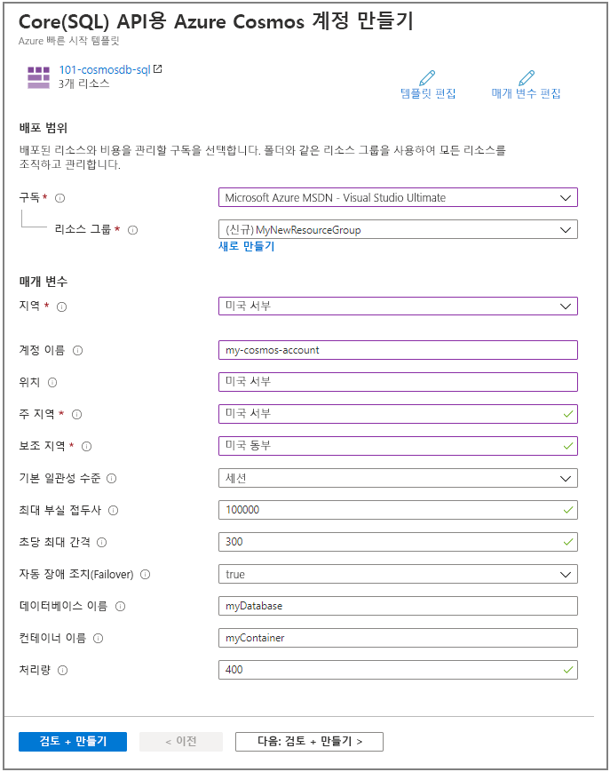
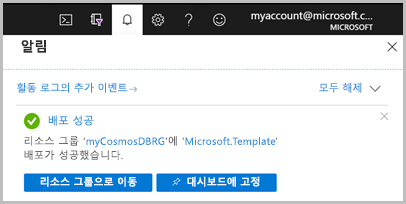

# <a name="quickstart-create-an-azure-cosmos-db-and-a-container-by-using-azure-resource-manager-template"></a>빠른 시작: Azure Resource Manager 템플릿을 사용하여 Azure Cosmos DB 및 컨테이너 만들기

Azure Cosmos DB는 전 세계에 배포된 Microsoft의 다중 모델 데이터베이스 서비스입니다. Azure Cosmos DB를 사용하여 키/값 데이터베이스, 문서 데이터베이스 및 그래프 데이터베이스를 빠르게 만들고 쿼리할 수 있습니다. 이 빠른 시작에서는 Resource Manager 템플릿을 배포하여 Azure Cosmos 데이터베이스와 해당 데이터베이스 내에 컨테이너를 만드는 프로세스에 대해 중점적으로 설명합니다. 데이터는 나중에 이 컨테이너에 저장할 수 있습니다.

[!INCLUDE [About Azure Resource Manager](../../includes/resource-manager-quickstart-introduction.md)]

Azure 구독이 아직 없는 경우 시작하기 전에 [체험 계정](https://azure.microsoft.com/free/?WT.mc_id=A261C142F)을 만듭니다.

## <a name="prerequisites"></a>사전 요구 사항

Azure 구독 또는 Azure Cosmos DB 체험 계정

- [!INCLUDE [quickstarts-free-trial-note](../../includes/quickstarts-free-trial-note.md)]

- [!INCLUDE [cosmos-db-emulator-docdb-api](../../includes/cosmos-db-emulator-docdb-api.md)]

## <a name="create-an-azure-cosmos-account-database-container"></a>Azure Cosmos 계정, 데이터베이스 및 컨테이너 만들기

### <a name="review-the-template"></a>템플릿 검토

이 빠른 시작에 사용되는 템플릿은 [Azure 빠른 시작 템플릿](https://azure.microsoft.com/resources/templates/101-cosmosdb-create/)에서 나온 것입니다.

:::code language="json" source="~/quickstart-templates/101-cosmosdb-create/azuredeploy.json":::

템플릿에 정의된 세 가지 Azure 리소스는 다음과 같습니다.

* [Microsoft.DocumentDB/databaseAccounts](/azure/templates/microsoft.documentdb/databaseaccounts): Azure Cosmos 계정을 만듭니다.

* [Microsoft.DocumentDB/databaseAccounts/sqlDatabases](/azure/templates/microsoft.documentdb/databaseaccounts/sqldatabases): Azure Cosmos 데이터베이스를 만듭니다.

* [Microsoft.DocumentDB/databaseAccounts/sqlDatabases/containers](/azure/templates/microsoft.documentdb/databaseaccounts/sqldatabases/containers): Azure Cosmos 컨테이너를 만듭니다.

더 많은 Azure Cosmos DB 템플릿 샘플은 [빠른 시작 템플릿 갤러리](https://azure.microsoft.com/resources/templates/?resourceType=Microsoft.Documentdb)에서 찾을 수 있습니다.

### <a name="deploy-the-template"></a>템플릿 배포

1. 다음 이미지를 선택하고 Azure에 로그인하여 템플릿을 엽니다. 이 템플릿은 Azure Cosmos 계정, 데이터베이스 및 컨테이너를 만듭니다.

   [](https://portal.azure.com/#create/Microsoft.Template/uri/https%3A%2F%2Fraw.githubusercontent.com%2FAzure%2Fazure-quickstart-templates%2Fmaster%2F101-cosmosdb-create%2Fazuredeploy.json)

2. 다음 값을 선택하거나 입력합니다.

   

    지정되지 않은 경우 기본값을 사용하여 Azure Cosmos 리소스를 만듭니다.

    * **구독**: Azure 구독을 선택합니다.
    * **리소스 그룹**: **새로 만들기**를 선택하고 리소스 그룹에 고유한 이름을 입력한 다음, **확인**을 클릭합니다.
    * **위치**: 위치를 선택합니다.  예: **미국 중부**
    * **계정 이름**: Azure Cosmos 계정의 이름을 입력합니다. 전역적으로 고유해야 합니다.
    * **위치**: Azure Cosmos 계정을 만들려는 위치를 입력합니다. Azure Cosmos 계정은 리소스 그룹과 동일한 위치에 있을 수 있습니다.
    * **주 지역**: Azure Cosmos 계정의 주 복제본 지역입니다.
    * **보조 지역**: Azure Cosmos 계정의 보조 복제본 지역입니다.
    * **데이터베이스 이름**: Azure Cosmos 데이터베이스의 이름입니다.
    * **컨테이너 이름**: Azure Cosmos 컨테이너의 이름입니다.
    * **처리량**:  컨테이너의 처리량입니다. 최소 처리량 값은 400RU/s입니다.
    * **위에 명시된 사용 약관에 동의함**: 선택합니다.

3. **구매**를 선택합니다. Azure Cosmos 계정이 성공적으로 배포되면 알림을 받게 됩니다.

   

Azure Portal은 템플릿을 배포하는데 사용됩니다. Azure Portal 외에도 Azure PowerShell, Azure CLI 및 REST API를 사용할 수 있습니다. 다른 배포 방법을 알아보려면 [템플릿 배포](../azure-resource-manager/templates/deploy-powershell.md)를 참조하세요.

## <a name="validate-the-deployment"></a>배포 유효성 검사

Azure Portal을 사용하여 Azure Cosmos 계정, 데이터베이스 및 컨테이너를 확인하거나, 다음 Azure CLI 또는 Azure PowerShell 스크립트를 사용하여 만들어진 비밀을 나열할 수 있습니다.

# <a name="cli"></a>[CLI](#tab/CLI)

```azurecli-interactive
echo "Enter your Azure Cosmos account name:" &&
read cosmosAccountName &&
echo "Enter the resource group where the Azure Cosmos account exists:" &&
read resourcegroupName &&
az cosmosdb show -g $resourcegroupName -n $cosmosAccountName
```

# <a name="powershell"></a>[PowerShell](#tab/PowerShell)

```azurepowershell-interactive
$resourceGroupName = Read-Host -Prompt "Enter the resource group name where your Azure Cosmos account exists"
(Get-AzResource -ResourceType "Microsoft.DocumentDB/databaseAccounts" -ResourceGroupName $resourceGroupName).Name
 Write-Host "Press [ENTER] to continue..."
```

---

## <a name="clean-up-resources"></a>리소스 정리

후속 빠른 시작 및 자습서를 계속 진행하려는 경우 이러한 리소스를 그대로 유지하는 것이 좋습니다.
더 이상 필요하지 않은 경우 리소스 그룹을 삭제합니다. 그러면 해당 Azure Cosmos 계정 및 관련 리소스가 삭제됩니다. Azure CLI 또는 Azure PowerShell을 사용하여 리소스 그룹을 삭제하려면:

# <a name="cli"></a>[CLI](#tab/CLI)

```azurecli-interactive
echo "Enter the Resource Group name:" &&
read resourceGroupName &&
az group delete --name $resourceGroupName &&
echo "Press [ENTER] to continue ..."
```

# <a name="powershell"></a>[PowerShell](#tab/PowerShell)

```azurepowershell-interactive
$resourceGroupName = Read-Host -Prompt "Enter the Resource Group name"
Remove-AzResourceGroup -Name $resourceGroupName
Write-Host "Press [ENTER] to continue..."
```

---

## <a name="next-steps"></a>다음 단계

이 빠른 시작에서는 Azure Resource Manager 템플릿을 사용하여 Azure Cosmos 계정, 데이터베이스 및 컨테이너를 만들고 배포의 유효성을 검사했습니다. Azure Cosmos DB 및 Azure Resource Manager에 대해 자세히 알아보려면 아래 문서로 계속 진행하세요.

- [Azure Cosmos DB 개요](introduction.md) 참조
- [Azure Resource Manager](../azure-resource-manager/management/overview.md)에 대해 자세히 알아보기
- 다른 [Azure Cosmos DB Resource Manager 템플릿](resource-manager-samples.md) 가져오기