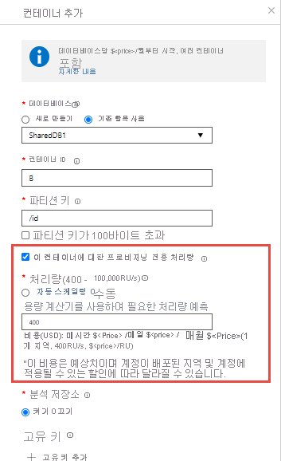

# 컨테이너 및 데이터베이스에 대한 처리량 프로비전

Azure Cosmos 데이터베이스는 컨테이너 세트의 관리 단위입니다. 데이터베이스는 스키마 제약 없는 컨테이너의 집합으로 구성됩니다. Azure Cosmos 컨테이너는 처리량과 스토리지 모두에 대한 확장성 단위입니다. 컨테이너는 Azure 지역 내에 있는 머신 세트에 수평적으로 분할되고 Azure Cosmos 계정과 연결된 모든 Azure 지역에 분산됩니다.

Azure Cosmos DB를 사용하면 다음 두 가지 세부 사항으로 처리량을 프로비전할 수 있습니다.
 
- Azure Cosmos 컨테이너
- Azure Cosmos 데이터베이스

## 컨테이너의 처리량 설정  

Azure Cosmos 컨테이너에 프로비전된 처리량은 해당 컨테이너에 대해 독점적으로 예약되어 있습니다. 컨테이너는 항상 프로비전된 처리량을 받습니다. 컨테이너에 프로비전된 처리량은 재정적으로 SLA의 지원을 받습니다. 컨테이너에서 처리량을 구성하는 방법에 대해 알아보려면 [Azure Cosmos 컨테이너의 프로비저닝 처리량을](how-to-provision-container-throughput.md)참조하십시오.

컨테이너에서 프로비저닝된 처리량을 설정하는 것이 가장 자주 사용되는 옵션입니다. [요청 단위(R)를](request-units.md)사용하여 처리량의 양을 프로비저닝하여 컨테이너에 대한 처리량을 탄력적으로 조정할 수 있습니다. 

컨테이너에 대해 프로비전된 처리량은 물리적 파티션 간에 균등하게 분산되며 논리 파티션을 실제 파티션 간에 균등하게 분산하는 양파티션 키를 가정하면 처리량도 모든 파티션에 균등하게 분배됩니다. 컨테이너의 논리 파티션입니다. 논리 파티션의 처리량을 선택적으로 지정할 수 없습니다. 컨테이너에 있는 하나 이상의 논리 파티션은 실제 파티션에서 호스트되므로, 실제 파티션은 컨테이너에 배타적으로 포함되고 컨테이너에서 프로비전된 처리량을 지원합니다. 

논리 파티션에서 실행되는 워크로드가 해당 논리 파티션에 할당된 처리량보다 더 많이 소비되는 경우 작업의 속도가 제한됩니다. 속도 제한이 발생하면 전체 컨테이너에 대해 프로비저닝된 처리량을 늘리거나 작업을 다시 시도할 수 있습니다. 분할에 대한 자세한 내용은 [논리 파티션](partition-data.md)을 참조하세요.

컨테이너 성능을 보장하려는 경우 컨테이너 세분성에서 처리량을 구성하는 것이 좋습니다.

다음 이미지는 실제 파티션이 컨테이너의 논리 파티션을 하나 이상 호스트하는 방법을 보여줍니다.

## 데이터베이스의 처리량 설정

Azure Cosmos 데이터베이스에서 처리량을 프로비전하면 처리량은 데이터베이스의 모든 컨테이너(공유 데이터베이스 컨테이너라고 함)에서 공유됩니다. 예외는 데이터베이스의 특정 컨테이너에 프로비저닝된 처리량을 지정한 경우입니다. 컨테이너 간에 데이터베이스 수준 프로비전된 처리량을 공유하는 것은 컴퓨터 클러스터에서 데이터베이스를 호스팅하는 경우와 유사합니다. 데이터베이스 내의 모든 컨테이너가 머신에 제공되는 리소스를 공유하므로 당연히 특정 컨테이너에 대한 예상 성능이 제공되지 않습니다. 데이터베이스에서 프로비저닝된 처리량을 구성하는 방법을 알아보려면 [Azure Cosmos 데이터베이스에서 프로비저닝된 처리량 구성을](how-to-provision-database-throughput.md)참조하십시오.

Azure Cosmos 데이터베이스에서 처리량을 설정하면 해당 데이터베이스에 대해 항상 프로비저닝된 처리량을 받을 수 있습니다. 데이터베이스 내 모든 컨테이너가 프로비전된 처리량을 공유하므로, Azure Cosmos DB는 해당 데이터베이스의 특정 컨테이너에 대해 예측 가능한 처리량을 보장하지 않습니다. 특정 컨테이너가 받을 수 있는 처리량은 다음 조건에 따라 다릅니다.

* 컨테이너 수
* 다양한 컨테이너에 대해 선택한 파티션 키
* 컨테이너의 다양한 논리 파티션에 분산되는 워크로드 

특정 컨테이너의 전용 처리량으로 지정하지 않고 여러 컨테이너 간에 처리량을 공유하려는 경우 데이터베이스의 처리량을 구성하는 것이 좋습니다. 

다음 예제에서는 데이터베이스 수준에서 처리량을 프로비전하는 것이 좋은 경우를 보여 줍니다.

* 데이터베이스에 프로비전된 처리량을 컨테이너 집합 간에 공유하는 방법은 다중 테넌트 애플리케이션에 유용합니다. 각 사용자를 고유한 Azure Cosmos 컨테이너로 나타낼 수 있습니다.

* 데이터베이스에 프로비전된 처리량을 컨테이너 세트 간에 공유하는 방법은 VM 클러스터에 호스트된 MongoDB, Cassandra 등의 NoSQL 데이터베이스를 마이그레이션하거나 온-프레미스 물리적 서버에서 Azure Cosmos DB로 마이그레이션하는 경우에 유용합니다. Azure Cosmos 데이터베이스에 구성된 프로비전된 처리량은 MongoDB 또는 Cassandra 클러스터의 컴퓨팅 용량과 논리적으로 상응하지만 더 비용 효과적이고 탄력적인 것으로 생각하면 됩니다.  

프로비저닝된 처리량이 있는 데이터베이스 내에서 생성된 모든 컨테이너는 [파티션 키로](partition-data.md)만들어야 합니다. 특정 시점에서 데이터베이스 내의 컨테이너에 할당된 처리량은 해당 컨테이너의 모든 논리 파티션에 분산됩니다. 데이터베이스에 구성된 프로비저닝된 처리량을 공유하는 컨테이너가 있는 경우 특정 컨테이너 또는 논리 파티션에 처리량을 선택적으로 적용할 수 없습니다. 

논리 파티션의 워크로드가 특정 논리 파티션에 할당된 처리량보다 많은 양을 사용하는 경우 작업 속도가 제한됩니다. 속도 제한이 발생하면 전체 데이터베이스에 대한 처리량을 늘리거나 작업을 다시 시도할 수 있습니다. 분할에 대한 자세한 내용은 [논리 파티션](partition-data.md)을 참조하세요.

공유 처리량 데이터베이스의 컨테이너는 해당 데이터베이스에 할당된 RU(S)를 공유합니다. 데이터베이스에 최소 400RU/s의 컨테이너를 최대 4개까지 가질 수 있습니다. 처음 네 개 이후의 새 컨테이너마다 최소 100RU/s가 추가로 필요합니다. 예를 들어 8개의 컨테이너가 있는 공유 처리량 데이터베이스가 있는 경우 데이터베이스의 최소 RU/s는 800RU/s가 됩니다.

> [!NOTE]
> 2020년 2월에는 공유 처리량 데이터베이스에 최대 25개의 컨테이너를 사용할 수 있는 변경 을 도입하여 컨테이너 간에 처리량을 더 잘 공유할 수 있습니다. 처음 25개의 컨테이너 후 데이터베이스의 공유 처리량과 는 별개의 [전용 처리량으로 프로비전된](#set-throughput-on-a-database-and-a-container)경우에만 데이터베이스에 컨테이너를 더 추가할 수 있습니다. 
Azure Cosmos DB 계정에 이미 >=25 컨테이너가 있는 공유 처리량 데이터베이스가 포함되어 있는 경우 동일한 Azure 구독의 계정 및 기타 모든 계정은 이 변경 에서 제외됩니다. 피드백이나 질문이 있으시면 [제품 지원에 문의하십시오.](https://portal.azure.com/?#blade/Microsoft_Azure_Support/HelpAndSupportBlade) 

워크로드에 데이터베이스의 모든 컬렉션을 삭제하고 다시 만드는 경우 컬렉션 을 만들기 전에 빈 데이터베이스를 삭제하고 새 데이터베이스를 다시 만드는 것이 좋습니다. 다음 이미지는 데이터베이스 내 여러 컨테이너에 속하는 하나 이상의 논리 파티션을 실제 파티션에 호스트할 수 있다는 것을 보여줍니다.

## 데이터베이스 및 컨테이너의 처리량 설정

두 모델을 결합할 수 있습니다. 데이터베이스와 컨테이너의 처리량을 둘 다 프로비전할 수 있습니다. 다음 예제는 Azure Cosmos 데이터베이스 및 컨테이너의 처리량을 프로비전하는 방법을 보여줍니다.

* *"K"* R의 프로비저닝된 처리량을 사용하여 *Z라는* Azure Cosmos 데이터베이스를 만들 수 있습니다. 
* 다음으로 데이터베이스 내에서 *A,* *B,* *C,* *D*및 *E라는* 5개의 컨테이너를 만듭니다. 컨테이너 B를 만들 **때이 컨테이너 옵션에 대 한 프로비저닝 전용 처리량을** 사용 하도록 설정 하 고 이 컨테이너에 프로비저닝된 처리량의 *"P"* 를 명시적으로 구성 해야 합니다. 데이터베이스 및 컨테이너를 만들 때만 공유 및 전용 처리량을 구성할 수 있습니다. 

   

* *"K"* RUs 처리량은 4개의 컨테이너 *A,* *C,* *D*및 *E에서*공유됩니다. *A,* *C,* *D*또는 *E에* 사용할 수 있는 정확한 처리량은 다양합니다. 각 개별 컨테이너의 처리량에 대한 SLA는 없습니다.
* *B라는* 컨테이너는 항상 *"P" R처리량을* 얻을 수 있습니다. SLA가 지원됩니다.

> [!NOTE]
> 프로비저닝된 처리량이 있는 컨테이너는 공유 데이터베이스 컨테이너로 변환할 수 없습니다. 반대로 공유 데이터베이스 컨테이너는 전용 처리량을 갖도록 변환할 수 없습니다.

## 데이터베이스 또는 컨테이너의 처리량 업데이트

Azure Cosmos 컨테이너 또는 데이터베이스를 만든 후 프로비저닝된 처리량을 업데이트할 수 있습니다. 데이터베이스 또는 컨테이너에서 구성할 수 있는 프로비저닝된 최대 처리량에는 제한이 없습니다. [프로비저닝된 최소 처리량은](concepts-limits.md#storage-and-throughput) 다음 요소에 따라 달라집니다. 

* 컨테이너에 저장하는 최대 데이터 크기
* 컨테이너에 프로비전한 최대 처리량
* 공유 처리량이 있는 데이터베이스에 있는 Azure Cosmos 컨테이너의 현재 수입니다. 

SDK를 사용하여 컨테이너 또는 데이터베이스의 최소 처리량을 프로그래밍 방식으로 검색하거나 Azure 포털에서 값을 볼 수 있습니다. .NET SDK를 사용하는 경우 [DocumentClient.ReplaceOfferAsync](https://docs.microsoft.com/dotnet/api/microsoft.azure.documents.client.documentclient.replaceofferasync?view=azure-dotnet) 방법을 사용하면 프로비저닝된 처리량 값을 확장할 수 있습니다. Java SDK를 사용하는 경우 [RequestOptions.setOfferThroughput](sql-api-java-samples.md#offer-examples) 메서드를 사용하면 프로비저닝된 처리량 값을 확장할 수 있습니다. 

.NET SDK를 사용하는 경우 [DocumentClient.ReadOfferAsync](https://docs.microsoft.com/dotnet/api/microsoft.azure.documents.client.documentclient.readofferasync?view=azure-dotnet) 메서드를 사용하면 컨테이너 또는 데이터베이스의 최소 처리량을 검색할 수 있습니다. 

언제든지 컨테이너 또는 데이터베이스의 프로비저닝된 처리량을 조정할 수 있습니다. 처리량을 늘리기 위해 스케일 작업을 수행하면 시스템 작업으로 인해 필요한 리소스를 프로비전하는 데 시간이 더 오래 걸릴 수 있습니다. Azure 포털에서 또는 SDK를 프로그래밍 방식으로 사용하여 축척 작업의 상태를 확인할 수 있습니다. .Net SDK를 사용하는 경우 `DocumentClient.ReadOfferAsync` 메서드를 사용하여 배율 작업 상태를 얻을 수 있습니다.

## 모델 비교

|**매개 변수**  |**데이터베이스에 프로비전된 처리량**  |**컨테이너에 프로비전된 처리량**|
|---------|---------|---------|
|최소 RU |400(처음 네 개의 컨테이너 후 각 추가 컨테이너에는 초당 최소 100RU가 필요합니다.) |400|
|컨테이너당 최소 RU|100|400|
|최대 RU|데이터베이스에서 무제한|컨테이너에서 무제한|
|특정 컨테이너에 할당 또는 제공되는 RU|보장되지 않습니다. 지정된 컨테이너에 할당되는 RU는 속성에 따라 다릅니다. 속성은 처리량, 워크로드 분산 및 컨테이너 수를 공유하는 컨테이너 파티션 키의 선택 항목일 수 있습니다. |컨테이너에 구성된 모든 RU는 컨테이너에만 배타적으로 예약됩니다.|
|컨테이너의 최대 스토리지|무제한.|무제한.|
|컨테이너의 논리 파티션당 최대 처리량|10K RU|10K RU|
|컨테이너의 논리 파티션당 최대 스토리지(데이터 + 인덱스)|20GB|20GB|

## 다음 단계

* [논리 파티션에](partition-data.md)대해 자세히 알아봅니다.
* [Azure Cosmos 컨테이너의 처리량을 프로비전](how-to-provision-container-throughput.md)하는 방법을 알아봅니다.
* [Azure Cosmos 데이터베이스의 처리량을 프로비전](how-to-provision-database-throughput.md)하는 방법을 알아봅니다.

