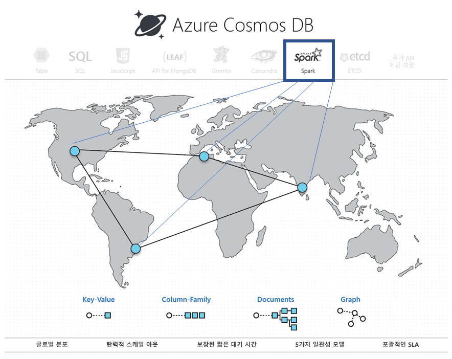

# Apache Spark를 사용하는 Azure Cosmos DB의 기본 제공 운영 분석(preview) 

Azure Cosmos DB에 기본 제공되는 Apache Spark 지원을 사용하면 Azure Cosmos 계정에 저장된 데이터를 Apache Spark에서 분석할 수 있습니다. 전역적으로 분산된 Cosmos 데이터베이스에서 직접 Apache Spark 작업을 실행할 수 있도록 기본 지원이 제공됩니다. 이러한 기능이 있으면 개발자, 데이터 엔지니어 및 데이터 과학자는 유연하고 확장 가능한 고성능 데이터 플랫폼인 Azure Cosmos DB를 사용하여 **OLTP 및 OLAP/HTAP** 워크로드를 모두 실행할 수 있습니다. 

Spark 컴퓨팅은 Azure Cosmos 계정과 관련된 모든 Azure 지역에서 자동으로 제공됩니다. Spark 작업은 Azure Cosmos DB의 다중 마스터 기능을 사용하며, 각 지역의 로컬 복제본에 대해 쓰거나 쿼리할 수 있습니다. 

> [!NOTE]
> Azure Cosmos DB에 기본 제공되는 Apache Spark 지원은 현재 제한된 미리 보기입니다. 미리 보기에 가입하려면 [미리 보기 가입 페이지](https://portal.azure.com/?feature.customportal=false#create/Microsoft.DocumentDB)로 이동합니다. 

Azure Cosmos DB에서 지원하는 Apache Spark는 다음과 같은 이점이 있습니다.

* 지리적으로 분산된 사용자 및 데이터에 대한 인사이트를 가장 빠르게 얻을 수 있습니다.

* 솔루션 아키텍처를 간소화하고 [TCO(총 소유 비용)](total-cost-ownership.md)를 낮출 수 있습니다. 시스템의 데이터 처리 구성 요소 숫자가 최소화되므로 구성 요소 간의 불필요한 데이터 이동을 방지할 수 있습니다.

* 모든 데이터를 관리할 수 있는 [보안](secure-access-to-data.md), [규정 준수](compliance.md) 및 감사 경계를 만듭니다.

* 엄격한 SLA가 보장되는 "무중단" 또는 [고가용성](high-availability.md) 최종 사용자 분석을 제공합니다.

 
Azure Cosmos DB의 Apache Spark 지원을 사용하면 AI 및 딥 러닝 모델, 예측 분석, 추천, IoT, 고객 360, 사기 탐지, 텍스트 감정, 클릭 동향 분석 등의 솔루션을 빌드하고 배포할 수 있습니다. 이러한 솔루션은 Azure Cosmos DB 데이터에 대해 직접 작동합니다.

데이터베이스 서비스 밖으로 나가거나 컴퓨팅 리소스를 추가할 필요 없이 Azure Cosmos DB에서 ETL 작업의 일괄 처리 및 스트리밍을 설정할 수 있습니다. ETL 작업을 수행해야 할 때 컴퓨팅 환경을 탄력적으로 확장했다가 작업을 마친 후 다시 축소할 수 있습니다.

Azure Cosmos DB에서 지원하는 Apache Spark는 기본적으로 Apache Spark 런타임에서 Machine Learning 지원을 제공합니다. 이 런타임에는 Spark MLLib, Microsoft Machine Learning for Spark, Azure Machine Learning 및 Cognitive Services가 포함되어 있습니다. 이러한 기능을 사용하면 데이터 과학자, 데이터 엔지니어 및 데이터 분석가는 훨씬 짧은 시간 내에 훨씬 적은 비용으로 Azure Cosmos DB 내에서 바로 기계 학습 모델을 빌드하여 운영할 수 있습니다.

## 주요 이점

### 전역적으로 분산되어 대기 시간이 짧은 운영 분석 및 AI

전역적으로 분산된 Azure Cosmos 데이터베이스의 Apache Spark를 사용하면 전 세계의 모든 데이터에 대한 인사이트를 신속하게 얻을 수 있습니다. Azure Cosmos DB는 다음과 같은 세 가지 핵심 기술을 통해 탄력적 크기에서 **전역적으로 분산되어 대기 시간이 짧은 운영 분석**을 가능하게 해줍니다.

* Azure Cosmos 데이터베이스가 전역적으로 분산되어 있으므로 모든 데이터는 데이터 생산자(예: 사용자)가 있는 위치에서 로컬로 수집됩니다. 쿼리는 데이터 생산자 및 소비자가 전 세계 어디에 있든, 이들과 가장 가까운 로컬 복제본에 대해 수행됩니다. 

* 모든 분석 쿼리는 불필요한 데이터 이동 없이 데이터 파티션 내에 저장된 인덱싱된 데이터에 대해 직접 실행됩니다. 

* Spark는 Azure Cosmos DB와 함께 배치되므로 중간 변환 및 데이터 이동이 거의 발생하지 않으며, 따라서 성능과 확장성이 우수합니다.

### Apache Spark를 위한 통합 서버리스 환경

다중 모델 데이터베이스인 Azure Cosmos DB는 키-값, 문서, 그래프, 열 패밀리 데이터 모델이 포함된 **Apache Spark를 위한 통합 서버리스 환경**을 제공하여 지원 범위를 OSS API까지 확장하고 있습니다. 동일한 기본 데이터에서 작동하는 MongoDB, Cassandra, Gremlin, Etcd 및 SQL API를 사용하여 다양한 데이터 모델을 지원합니다. 

Azure Cosmos DB에서 지원하는 Apache Spark가 있으면 Scala, Python, Java로 작성된 애플리케이션을 기본적으로 지원할 수 있으며, 긴밀하게 통합된 여러 SQL용 라이브러리를 사용할 수 있습니다. 이러한 라이브러리로는 ([Spark SQL](https://spark.apache.org/sql/)), 기계 학습(Spark [MLlib](https://spark.apache.org/mllib/)), 스트림 처리([Spark Structured Streaming](https://spark.apache.org/streaming/)) 및 그래프 처리(Spark [GraphFrames]( https://docs.databricks.com/spark/latest/graph-analysis/graphframes/user-guide-python.html))가 있습니다. 이러한 도구를 사용하면 Apache Spark를 다양한 사용 사례에 보다 쉽게 활용할 수 있습니다. 고객은 Spark 또는 Spark 클러스터를 관리할 필요가 없습니다. 익숙한 분석용 Apache Spark API 및 **Jupyter Notebook**과 SQL API 또는 동일한 기본 데이터에서 동시에 트랜잭션을 처리할 Cassandra 같은 OSS NoSQL API를 사용하면 됩니다.

### 스키마 또는 인덱스 관리 없음

기존의 분석 데이터베이스와는 달리, Azure Cosmos DB를 사용하면 데이터 엔지니어와 데이터 과학자는 더 이상 번거로운 스키마 및 인덱스 관리를 신경 쓸 필요가 없습니다. Azure Cosmos DB의 데이터베이스 엔진은 명시적인 스키마 또는 인덱스 관리가 필요 없으며, 수집하는 모든 데이터를 자동으로 인덱싱하여 Apache Spark 쿼리를 신속하게 처리할 수 있습니다. 

### 일관성 선택 항목

Apache Spark 작업은 Azure Cosmos 데이터베이스의 데이터 파티션에서 실행되므로 쿼리 시 [5가지 잘 정의된 일관성 선택 항목](consistency-levels.md)을 얻게 됩니다. 이러한 일관성 모델은 대기 시간 및 고가용성의 희생 없이 기계 학습 알고리즘의 가장 정확한 결과를 제공하는 엄격한 일관성을 유연하게 선택할 수 있습니다. 

### 포괄적인 SLA

Apache Spark 작업 시 별도의 Apache Spark 클러스터를 관리하는 오버헤드 없이 업계 최고 수준의 포괄적 [SLA](https://azure.microsoft.com/support/legal/sla/documentdb/v1_1/)(99.999)를 비롯한 Azure Cosmos DB의 이점을 누릴 수 있습니다. 이러한 SLA는 처리량, 99번째 백분위수의 대기 시간, 일관성 및 고가용성을 포함합니다. 

### 혼합 워크로드

Apache Spark를 Azure Cosmos DB에 통합하면 고객이 글로벌 규모로 클라우드 네이티브 애플리케이션을 빌드할 때 겪는 주요 고충 중 하나인 트랜잭션과 분석의 분리 문제를 해결할 수 있습니다. 

## 기본 제공 Jupyter Notebook 지원

Azure Cosmos DB는 Cassandra, MongoDB, SQL, Gremlin 및 테이블과 같은 모든 API에 대하여 기본 제공되는 Jupyter Notebook을 지원합니다. Jupyter Notebook은 Azure Cosmos 계정 내에서 실행되며, 개발자 환경을 향상시킵니다. 모든 Azure Cosmos DB API 및 데이터 모델에 대한 기본 제공 Notebook을 통해 대화형으로 쿼리를 실행할 수 있습니다. 또한 기계 학습 모델을 실행하고 Azure Cosmos 데이터베이스에 저장된 데이터를 분석할 수 있습니다. Jupyter Notebook 환경을 사용하면 다음 그림에 나온 것처럼 저장된 데이터를 분석하고, 기계 학습 모델을 학습하고, Azure Portal의 데이터에 대한 추론을 수행할 수 있습니다.

## 다음 단계

* Azure Cosmos DB의 이점에 대한 자세한 내용은 [개요](introduction.md) 문서를 참조하세요.
* [Azure Cosmos DB의 MongoDB API 시작](mongodb-introduction.md)
* [Azure Cosmos DB Cassandra API 시작](cassandra-introduction.md)
* [Azure Cosmos DB Gremlin API 시작](graph-introduction.md)
* [Azure Cosmos DB Table API 시작](table-introduction.md)

