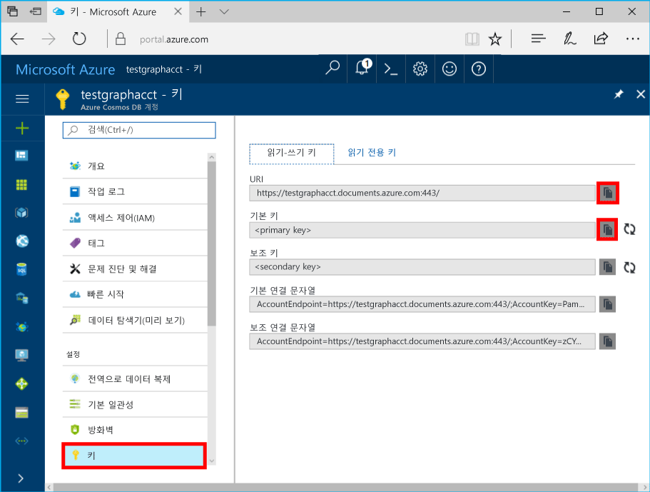

# <a name="azure-cosmos-db-develop-with-the-graph-api-in-net"></a>Azure Cosmos DB: .NET의 Graph API를 사용하여 개발
Azure Cosmos DB는 전 세계에 배포된 Microsoft의 다중 모델 데이터베이스 서비스입니다. Azure Cosmos DB의 핵심인 전역 배포 및 수평적 크기 조정 기능의 이점을 활용하여 문서, 키/값 및 그래프 데이터베이스를 빠르게 만들고 쿼리할 수 있습니다. 

이 자습서에서는 Azure Portal을 사용하여 Azure Cosmos DB 계정을 만드는 방법 및 그래프 데이터베이스와 컨테이너를 만드는 방법을 보여 줍니다. 그런 다음, 응용 프로그램에서 [Graph API](graph-sdk-dotnet.md)를 사용하여 4명으로 구성된 간단한 소셜 네트워크를 만든 다음 Gremlin을 사용하여 그래프를 트래버스하고 쿼리합니다.

이 자습서에서 다루는 작업은 다음과 같습니다.

> [!div class="checklist"]
> * Azure Cosmos DB 계정 만들기 
> * 그래프 데이터베이스 및 컨테이너 만들기
> * .NET 개체로 꼭짓점 및 가장자리 직렬화
> * 꼭짓점 및 가장자리 추가
> * Gremlin을 사용하여 그래프 쿼리

## <a name="graphs-in-azure-cosmos-db"></a>Azure Cosmos DB의 그래프
Azure Cosmos DB를 사용하여 [Microsoft.Azure.Graphs](graph-sdk-dotnet.md) 라이브러리를 사용하는 그래프를 작성, 업데이트 및 쿼리할 수 있습니다. Microsoft.Azure.Graph 라이브러리는 Gremlin 쿼리를 실행하기 위해 `DocumentClient` 클래스를 기반으로 하는 `CreateGremlinQuery<T>` 단일 확장 메서드를 제공합니다.

Gremlin은 쓰기 작업(DML)과 쿼리 및 순회 작업을 지원하는 함수형 프로그래밍 언어입니다. 이 문서에서는 몇 가지 예제를 적용하여 Gremlin을 시작합니다. Azure Cosmos DB에서 사용할 수 있는 Gremlin 기능에 대한 자세한 연습은 [Gremlin 쿼리](gremlin-support.md)를 참조하세요. 

## <a name="prerequisites"></a>필수 조건
다음 항목이 있는지 확인합니다.

* 활성 Azure 계정. 계정이 없는 경우 [무료 계정](https://azure.microsoft.com/free/)에 등록할 수 있습니다. 
    * 또는 이 자습서에 [로컬 에뮬레이터](local-emulator.md)를 사용할 수 있습니다.
* [Visual Studio](http://www.visualstudio.com/).

## <a name="create-database-account"></a>데이터베이스 계정 만들기

Azure Portal에서 Azure Cosmos DB 계정을 만들어 보겠습니다.  

> [!TIP]
> * Azure Cosmos DB 계정이 이미 있나요? 그렇다면 [Visual Studio 솔루션 설치](#SetupVS)로 건너뜁니다.
> * Azure Cosmos DB 에뮬레이터를 사용하는 경우 [Azure Cosmos DB 에뮬레이터](local-emulator.md)의 단계에 따라 에뮬레이터를 설치하고 [Visual Studio 솔루션 설치](#SetupVS)로 건너뜁니다. 
>
> 

[!INCLUDE [cosmos-db-create-dbaccount-graph](../../includes/cosmos-db-create-dbaccount-graph.md)]

## <a id="SetupVS"></a>Visual Studio 솔루션 설치
1. 컴퓨터에서 **Visual Studio**를 엽니다.
2. **파일** 메뉴에서 **새로 만들기**와 **프로젝트**를 차례로 선택합니다.
3. **새 프로젝트** 대화 상자에서 **템플릿** / **Visual C#** / **콘솔 앱(.NET Framework)**을 선택하고, 프로젝트 이름을 지정한 다음, **확인**을 클릭합니다.
4. **솔루션 탐색기**에서 Visual Studio 솔루션 아래에 있는 새 콘솔 응용 프로그램을 마우스 오른쪽 단추로 클릭한 다음 **NuGet 패키지 관리...**를 클릭합니다.
5. **NuGet** 탭에서 **찾아보기**를 클릭하고 검색 상자에서 **Microsoft.Azure.Graphs**를 입력하고 **시험판 버전 포함**을 선택합니다. .
6. 결과 내에서 **Microsoft.Azure.Graphs**를 찾고 **설치**를 클릭합니다.
   
   솔루션 변경 내용을 검토하는 메시지가 표시되면 **확인**을 클릭합니다. 라이선스 승인에 관한 메시지가 표시되면 **동의합니다.**를 클릭합니다.
   
    `Microsoft.Azure.Graphs` 라이브러리는 Gremlin 작업을 실행하기 위한 `CreateGremlinQuery<T>` 단일 확장 메서드를 제공합니다. Gremlin은 쓰기 작업(DML)과 쿼리 및 순회 작업을 지원하는 함수형 프로그래밍 언어입니다. 이 문서에서는 몇 가지 예제를 적용하여 Gremlin을 시작합니다. [Gremlin 쿼리](gremlin-support.md)에는 Azure Cosmos DB의 Gremlin 기능에 대한 자세한 연습이 있습니다.

## <a id="add-references"></a>앱 연결

응용 프로그램에 이 두 상수와 *client* 변수를 추가합니다. 

```csharp
string endpoint = ConfigurationManager.AppSettings["Endpoint"]; 
string authKey = ConfigurationManager.AppSettings["AuthKey"]; 
``` 
다음으로 [Azure Portal](https://portal.azure.com)로 다시 이동하여 끝점 URL과 기본 키를 검색합니다. 끝점 URL과 기본 키는 응용 프로그램에서 연결할 위치를 식별하고 Azure Cosmos DB에서 응용 프로그램의 연결을 신뢰하는 데 필요합니다. 

Azure Portal에서 Azure Cosmos DB 계정으로 이동하고 **키**를 클릭한 다음 **읽기-쓰기 키**를 클릭합니다. 

포털에서 URI를 복사하고 `Endpoint` 끝점 속성 위에 붙여넣습니다. 그런 다음 포털에서 기본 키를 복사하고 `AuthKey` 속성 위에 붙여넣습니다. 

 
 
## <a id="instantiate"></a>DocumentClient 인스턴스화 
다음으로 **DocumentClient**의 새 인스턴스를 만듭니다.  

```csharp 
DocumentClient client = new DocumentClient(new Uri(endpoint), authKey); 
``` 

## <a id="create-database"></a>데이터베이스 만들기 

이제 [SQL .NET SDK](sql-api-sdk-dotnet.md)에서 **DocumentClient** 클래스의 [CreateDatabaseAsync](https://msdn.microsoft.com/library/azure/microsoft.azure.documents.client.documentclient.createdatabaseasync.aspx) 메서드 또는 [CreateDatabaseIfNotExistsAsync](https://msdn.microsoft.com/library/microsoft.azure.documents.client.documentclient.createdatabaseifnotexistsasync.aspx) 메서드를 사용하여 Azure Cosmos DB [데이터베이스](sql-api-resources.md#databases)를 만듭니다.  

```csharp 
Database database = await client.CreateDatabaseIfNotExistsAsync(new Database { Id = "graphdb" }); 
``` 
 
## <a name="create-a-graph"></a>그래프 만들기 

다음으로 **DocumentClient** 클래스의 [CreateDocumentCollectionAsync](https://msdn.microsoft.com/library/azure/microsoft.azure.documents.client.documentclient.createdocumentcollectionasync.aspx) 메서드 또는 [CreateDocumentCollectionIfNotExistsAsync](https://msdn.microsoft.com/library/microsoft.azure.documents.client.documentclient.createdocumentcollectionifnotexistsasync.aspx) 메서드를 사용하여 그래프 컨테이너를 만듭니다. 컬렉션은 그래프 엔터티의 컨테이너입니다. 

```csharp 
DocumentCollection graph = await client.CreateDocumentCollectionIfNotExistsAsync( 
    UriFactory.CreateDatabaseUri("graphdb"), 
    new DocumentCollection { Id = "graphcollz" }, 
    new RequestOptions { OfferThroughput = 1000 }); 
``` 

## <a id="serializing"></a>.NET 개체로 꼭짓점 및 가장자리 직렬화
Azure Cosmos DB는 꼭짓점, 가장자리 및 속성에 대한 JSON 스키마를 정의하는 [GraphSON 통신 형식](gremlin-support.md)을 사용합니다. Azure Cosmos DB .NET SDK에는 JSON.NET이 종속성으로 포함되어 있어 GraphSON을 코드에서 사용할 수 있는 .NET 개체로 직렬화/역직렬화할 수 있습니다.

예를 들어 4명의 사람으로 구성된 포함된 간단한 소셜 네트워크로 작업해 보겠습니다. `Person` 꼭짓점을 만들고, 이 꼭짓점들 간의 `Knows` 관계를 추가한 다음, 그래프를 쿼리하고 순회하여 "친구의 친구" 관계를 찾는 방법을 살펴봅니다. 

`Microsoft.Azure.Graphs.Elements` 네임스페이스는 잘 정의된 .NET 개체에 대한 GraphSON 응답을 역직렬화하기 위해 `Vertex`, `Edge`, `Property` 및 `VertexProperty` 클래스를 제공합니다.

## <a name="run-gremlin-using-creategremlinquery"></a>CreateGremlinQuery를 사용하여 Gremlin 실행
Gremlin은 SQL과 마찬가지로 읽기, 쓰기 및 쿼리 작업을 지원합니다. 예를 들어 다음 코드 조각에서는 `CreateGremlinQuery<T>`를 사용하여 꼭짓점과 가장자리를 만들고 몇 가지 샘플 쿼리를 수행하며, `ExecuteNextAsync`와 HasMoreResults를 사용하여 이러한 결과를 비동기적으로 반복하는 방법을 보여 줍니다.

```cs
Dictionary<string, string> gremlinQueries = new Dictionary<string, string>
{
    { "Cleanup",        "g.V().drop()" },
    { "AddVertex 1",    "g.addV('person').property('id', 'thomas').property('firstName', 'Thomas').property('age', 44)" },
    { "AddVertex 2",    "g.addV('person').property('id', 'mary').property('firstName', 'Mary').property('lastName', 'Andersen').property('age', 39)" },
    { "AddVertex 3",    "g.addV('person').property('id', 'ben').property('firstName', 'Ben').property('lastName', 'Miller')" },
    { "AddVertex 4",    "g.addV('person').property('id', 'robin').property('firstName', 'Robin').property('lastName', 'Wakefield')" },
    { "AddEdge 1",      "g.V('thomas').addE('knows').to(g.V('mary'))" },
    { "AddEdge 2",      "g.V('thomas').addE('knows').to(g.V('ben'))" },
    { "AddEdge 3",      "g.V('ben').addE('knows').to(g.V('robin'))" },
    { "UpdateVertex",   "g.V('thomas').property('age', 44)" },
    { "CountVertices",  "g.V().count()" },
    { "Filter Range",   "g.V().hasLabel('person').has('age', gt(40))" },
    { "Project",        "g.V().hasLabel('person').values('firstName')" },
    { "Sort",           "g.V().hasLabel('person').order().by('firstName', decr)" },
    { "Traverse",       "g.V('thomas').outE('knows').inV().hasLabel('person')" },
    { "Traverse 2x",    "g.V('thomas').outE('knows').inV().hasLabel('person').outE('knows').inV().hasLabel('person')" },
    { "Loop",           "g.V('thomas').repeat(out()).until(has('id', 'robin')).path()" },
    { "DropEdge",       "g.V('thomas').outE('knows').where(inV().has('id', 'mary')).drop()" },
    { "CountEdges",     "g.E().count()" },
    { "DropVertex",     "g.V('thomas').drop()" },
};

foreach (KeyValuePair<string, string> gremlinQuery in gremlinQueries)
{
    Console.WriteLine($"Running {gremlinQuery.Key}: {gremlinQuery.Value}");

    // The CreateGremlinQuery method extensions allow you to execute Gremlin queries and iterate
    // results asychronously
    IDocumentQuery<dynamic> query = client.CreateGremlinQuery<dynamic>(graph, gremlinQuery.Value);
    while (query.HasMoreResults)
    {
        foreach (dynamic result in await query.ExecuteNextAsync())
        {
            Console.WriteLine($"\t {JsonConvert.SerializeObject(result)}");
        }
    }

    Console.WriteLine();
}
```

## <a name="add-vertices-and-edges"></a>꼭짓점 및 가장자리 추가

이전 섹션에서 자세히 설명한 Gremlin 문을 살펴보겠습니다. 먼저 Gremlin의 `addV` 메서드를 사용하는 몇 가지 꼭짓점이 있습니다. 예를 들어 다음 코드 조각에서는 이름, 성 및 나이에 대한 속성이 있는 "Person" 형식의 "Thomas Andersen" 꼭짓점을 만듭니다.

```cs
// Create a vertex
IDocumentQuery<Vertex> createVertexQuery = client.CreateGremlinQuery<Vertex>(
    graphCollection, 
    "g.addV('person').property('firstName', 'Thomas')");

while (createVertexQuery.HasMoreResults)
{
    Vertex thomas = (await create.ExecuteNextAsync<Vertex>()).First();
}
```

그런 다음 Gremlin의 `addE` 메서드를 사용하여 이 꼭짓점 사이에 몇 개의 가장자리를 만듭니다. 

```cs
// Add a "knows" edge
IDocumentQuery<Edge> createEdgeQuery = client.CreateGremlinQuery<Edge>(
    graphCollection, 
    "g.V('thomas').addE('knows').to(g.V('mary'))");

while (create.HasMoreResults)
{
    Edge thomasKnowsMaryEdge = (await create.ExecuteNextAsync<Edge>()).First();
}
```

Gremlin의 `properties` 단계를 사용하여 기존 꼭짓점을 업데이트할 수 있습니다. 예제의 나머지 부분에서는 `HasMoreResults`과 `ExecuteNextAsync`를 통해 쿼리를 실행하는 호출을 건너뜁니다.

```cs
// Update a vertex
client.CreateGremlinQuery<Vertex>(
    graphCollection, 
    "g.V('thomas').property('age', 45)");
```

Gremlin의 `drop` 단계를 사용하여 가장자리와 꼭짓점을 제거할 수 있습니다. 다음은 꼭짓점과 가장자리를 삭제하는 방법을 보여 주는 코드 조각입니다. 꼭짓점을 제거하면 연결된 가장자리에 대한 계단식 삭제가 수행됩니다.

```cs
// Drop an edge
client.CreateGremlinQuery(graphCollection, "g.E('thomasKnowsRobin').drop()");

// Drop a vertex
client.CreateGremlinQuery(graphCollection, "g.V('robin').drop()");
```

## <a name="query-the-graph"></a>그래프 쿼리

Gremlin을 사용하여 쿼리와 순회도 수행할 수 있습니다. 예를 들어 다음 코드 조각에서는 그래프의 꼭짓점 수를 계산하는 방법을 보여 줍니다.

```cs
// Run a query to count vertices
IDocumentQuery<int> countQuery = client.CreateGremlinQuery<int>(graphCollection, "g.V().count()");
```
Gremlin의 `has` 및 `hasLabel` 단계를 사용하여 필터링을 수행하고, `and`, `or` 및 `not`으로 필터를 결합하여 더 복잡한 필터를 만들 수 있습니다.

```cs
// Run a query with filter
IDocumentQuery<Vertex> personsByAge = client.CreateGremlinQuery<Vertex>(
  graphCollection, 
  "g.V().hasLabel('person').has('age', gt(40))");
```

`values` 단계를 사용하여 쿼리 결과에 특정 속성을 프로젝션할 수 있습니다.

```cs
// Run a query with projection
IDocumentQuery<string> firstNames = client.CreateGremlinQuery<string>(
  graphCollection, 
  $"g.V().hasLabel('person').values('firstName')");
```

지금까지 모든 데이터베이스에서 작동하는 쿼리 연산자만 보았습니다. 관련 가장자리와 꼭짓점으로 이동해야 할 때 그래프는 이 순회 작업에 빠르고 효율적입니다. Thomas의 친구들을 모두 찾아 보겠습니다. 이렇게 하려면 Gremlin의 `outE` 단계를 사용하여 Thomas의 모든 가장자리를 찾은(out-edge) 다음, Gremlin의 `inV` 단계를 사용하여 이러한 가장자리에서 꼭짓점으로 이동합니다(in-vertex).

```cs
// Run a traversal (find friends of Thomas)
IDocumentQuery<Vertex> friendsOfThomas = client.CreateGremlinQuery<Vertex>(
  graphCollection,
  "g.V('thomas').outE('knows').inV().hasLabel('person')");
```

다음 쿼리에서는 `outE`과 `inV`를 두 번 호출함으로써 홉을 두 번 수행하여 Thomas의 "친구의 친구"를 모두 찾습니다. 

```cs
// Run a traversal (find friends of friends of Thomas)
IDocumentQuery<Vertex> friendsOfFriendsOfThomas = client.CreateGremlinQuery<Vertex>(
  graphCollection,
  "g.V('thomas').outE('knows').inV().hasLabel('person').outE('knows').inV().hasLabel('person')");
```

Gremlin을 사용하여 필터 식을 혼합하고, `loop` 단계를 사용하여 루핑을 수행하고, `choose` 단계를 사용하여 조건부 탐색을 구현하는 등 더욱 복잡한 쿼리를 작성하고 강력한 그래프 순회 논리를 구현할 수 있습니다. [Gremlin 지원](gremlin-support.md)에서 수행할 수 있는 작업에 대해 자세히 알아보세요!

이것으로 끝이며, 이 Azure Cosmos DB 자습서를 완료했습니다! 

## <a name="clean-up-resources"></a>리소스 정리

이 응용 프로그램을 계속 사용하지 않으려면 Azure Portal에서 다음 단계에 따라 이 자습서에서 만든 리소스를 모두 삭제합니다.  

1. Azure Portal의 왼쪽 메뉴에서 **리소스 그룹**을 클릭한 다음 만든 리소스의 이름을 클릭합니다. 
2. 리소스 그룹 페이지에서 **삭제**를 클릭하고 텍스트 상자에서 삭제할 리소스의 이름을 입력한 다음 **삭제**를 클릭합니다.

## <a name="next-steps"></a>다음 단계

이 자습서에서는 다음을 수행했습니다.

> [!div class="checklist"]
> * Azure Cosmos DB 계정 만들기 
> * 그래프 데이터베이스 및 컨테이너 만들기
> * .NET 개체로 꼭짓점 및 가장자리 직렬화
> * 꼭짓점 및 가장자리 추가
> * Gremlin을 사용하여 그래프 쿼리

이제 Gremlin을 사용하여 더 복잡한 쿼리를 작성하고 강력한 그래프 순회 논리를 구현할 수 있습니다. 

> [!div class="nextstepaction"]
> [Gremlin을 사용하여 쿼리](tutorial-query-graph.md)
