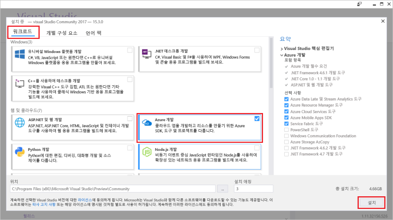

# <a name="create-an-azure-functions-http-trigger-with-an-azure-cosmos-db-input-binding"></a>Azure Cosmos DB 입력 바인딩을 사용하여 Azure Functions HTTP 트리거 만들기

Azure Cosmos DB는 스키마가 없고 서버를 사용하지 않으며 전 세계에 배포된 다중 모델 데이터베이스입니다. Azure Function은 요청 시 코드를 실행할 수 있으며 서버를 사용하지 않는 컴퓨팅 서비스입니다. 이 두 가지 Azure 서비스를 모두 가지고 있다면 컴퓨팅과 데이터베이스 요구에 대한 프로비전 및 서버 유지 관리를 걱정하지 않고 우수한 앱 만들기에 전념할 수 있게 해주는 서버 없는 아키텍처의 기초를 다진 것입니다.

이 자습서는 [.NET에 대한 Graph API 퀵 스타트](create-graph-dotnet.md)에서 만든 코드를 기반으로 합니다. 이 자습서에서는 [HTTP 트리거](../azure-functions/functions-bindings-http-webhook.md)를 포함하는 Azure Function을 추가합니다. HTTP 트리거는 Azure Cosmos DB [입력 바인딩](../azure-functions/functions-triggers-bindings.md)을 사용하여 퀵 스타트에서 만든 Graph 데이터베이스에서 데이터를 검색합니다. 이 특정 HTTP 트리거는 Azure Cosmos DB에서 데이터를 쿼리하지만 Azure Cosmos DB의 입력 바인딩을 사용하여 무엇이든 기능에 필요한 데이터 입력 값을 검색할 수 있습니다.

이 자습서에서 다루는 작업은 다음과 같습니다.

> [!div class="checklist"]
> * Azure Function 프로젝트 만들기 
> * HTTP 트리거 만들기
> * Azure 함수 게시
> * Azure Cosmos DB 데이터베이스에 Azure Function 연결

## <a name="prerequisites"></a>필수 조건

- [Visual Studio 2017 버전 15.3](https://www.visualstudio.com/vs/preview/)(**Azure 개발** 워크로드 포함)

    
    
- Visual Studio 2017 버전 15.3을 설치하거나 업그레이드한 후 Visual Studio 2017 tools for Azure Functions를 수동으로 업데이트해야 합니다. **확장 및 업데이트...** > **업데이트** > **Visual Studio Marketplace** > **Azure Functions 및 Web Jobs Tools** > **업데이트** 아래의 **도구** 메뉴에서 도구를 업데이트할 수 있습니다.

- [Graph API를 사용하여 .NET 응용 프로그램 만들기](tutorial-develop-graph-dotnet.md) 자습서를 완료하거나 [azure-cosmos-db-graph-dotnet-getting-started](https://github.com/Azure-Samples/azure-cosmos-db-graph-dotnet-getting-started) GitHub repo에서 예제 코드를 가져와서 프로젝트를 만듭니다.
 
## <a name="build-a-function-in-visual-studio"></a>Visual Studio에서 함수 빌드

1. **솔루션 탐색기**에서 솔루션 노드를 마우스 오른쪽 단추로 클릭하여 솔루션에 **Azure Functions** 프로젝트를 추가하고 **추** > **새 프로젝트**를 선택합니다. 대화 상자에서 **Azure Functions**를 선택하고 **PeopleDataFunctions**로 이름 지정합니다.

   

2. Azure Functions 프로젝트를 만든 후 수행할 몇 가지 NuGet 관련 업데이트 및 설치가 있습니다. 

    a. 최신 Functions SDK가 있는지 확인하려면 NuGet Manager를 사용하여 **Microsoft.NET.Sdk.Functions** 패키지를 업데이트합니다. **솔루션 탐색기**에서 프로젝트의 이름을 마우스 오른쪽 단추로 클릭하고 **NuGet 패키지 관리**를 선택합니다. **설치됨** 탭에서 Microsoft.NET.Sdk.Functions를 선택한 다음 **업데이트**를 클릭합니다.

   

    나. **찾아보기** 탭에서 **azure.graphs**를 입력하여 **Microsoft.Azure.Graphs** 패키지를 찾은 다음 **설치**를 클릭합니다. 이 패키지는 Graph API.NET 클라이언트 SDK를 포함합니다.

   

    다. **찾아보기** 탭에서 **mono.csharp**를 입력하여 **Mono.CSharp** 패키지를 찾은 다음 **설치**를 클릭합니다.

   

3. 이제 솔루션 탐색기는 아래 그림과 같이 설치한 패키지를 포함해야 합니다. 
   
   그런 다음 약간의 코드를 작성해야 하므로 새 **Azure Function** 항목을 프로젝트에 추가합니다. 

    a. **솔루션 탐색기**에서 프로젝트 노드를 마우스 오른쪽 단추로 클릭하고 **추가** > **새 항목**을 차례로 선택합니다.   
    나. **새 항목 추가** 대화 상자에서 **Visual C# 항목**을 선택하고 **Azure Function**을 선택하고 프로젝트 이름으로 **Search**를 입력한 다음 **추가**를 클릭합니다.  
 
   

4. Azure Function은 HTTP 요청에 응답하므로 여기서는 Http 트리거 템플릿이 적절합니다.
   
   **새 Azure Function** 상자에서 **Http 트리거**를 선택합니다. 이 Azure Function을 "널리 공개"하려고 하므로 **액세스 권한**을 누구나 액세스할 수 있는 **익명**으로 설정합니다. **확인**을 클릭합니다.

   

5. Azure Function 프로젝트에 Search.cs를 추가한 후 이 **using** 문을 복사하여 기존 using 문을 덮어씁니다.

   ```csharp
   using Microsoft.Azure.Documents;
   using Microsoft.Azure.Documents.Client;
   using Microsoft.Azure.Documents.Linq;
   using Microsoft.Azure.Graphs;
   using Microsoft.Azure.WebJobs;
   using Microsoft.Azure.WebJobs.Extensions.Http;
   using Microsoft.Azure.WebJobs.Host;
   using System;
   using System.Collections.Generic;
   using System.Configuration;
   using System.Linq;
   using System.Net;
   using System.Net.Http;
   using System.Threading.Tasks;
   ```

6. 그런 다음 Azure Function의 클래스 코드를 아래 코드로 바꿉니다. 이 코드는 Graph API를 사용하여 Azure Cosmos DB 데이터베이스에서 모든 사람을 검색하거나 `name` 쿼리 문자열 매개 변수로 식별한 특정인을 검색합니다.

   ```csharp
   public static class Search
   {
       static string endpoint = ConfigurationManager.AppSettings["Endpoint"];
       static string authKey = ConfigurationManager.AppSettings["AuthKey"];

       [FunctionName("Search")]
       public static async Task<HttpResponseMessage> Run(
           [HttpTrigger(AuthorizationLevel.Anonymous, "get", "post", Route = null)]HttpRequestMessage req,
           TraceWriter log)
       {
           log.Info("C# HTTP trigger function processed a request.");

           // the person objects are free-form in structure
           List<dynamic> results = new List<dynamic>();

           // open the client's connection
           using (DocumentClient client = new DocumentClient(
               new Uri(endpoint),
               authKey,
               new ConnectionPolicy
               {
                   ConnectionMode = ConnectionMode.Direct,
                   ConnectionProtocol = Protocol.Tcp
               }))
           {
               // get a reference to the database the console app created
               Database database = await client.CreateDatabaseIfNotExistsAsync(
                   new Database
                   {
                       Id = "graphdb"
                   });

               // get an instance of the database's graph
               DocumentCollection graph = await client.CreateDocumentCollectionIfNotExistsAsync(
                   UriFactory.CreateDatabaseUri("graphdb"),
                   new DocumentCollection { Id = "graphcollz" },
                   new RequestOptions { OfferThroughput = 1000 });

               // build a gremlin query based on the existence of a name parameter
               string name = req.GetQueryNameValuePairs()
                   .FirstOrDefault(q => string.Compare(q.Key, "name", true) == 0)
                   .Value;

               IDocumentQuery<dynamic> query = (!String.IsNullOrEmpty(name))
                   ? client.CreateGremlinQuery<dynamic>(graph, string.Format("g.V('{0}')", name))
                   : client.CreateGremlinQuery<dynamic>(graph, "g.V()");

               // iterate over all the results and add them to the list
               while (query.HasMoreResults)
                   foreach (dynamic result in await query.ExecuteNextAsync())
                       results.Add(result);
           }

           // return the list with an OK response
           return req.CreateResponse<List<dynamic>>(HttpStatusCode.OK, results);
       }
   }
   ```

   이 코드는 기본적으로 데이터베이스를 시드한 원본 콘솔 응용 프로그램에서와 같이 단순 쿼리를 사용하여 일치하는 레코드를 검색하는 연결 논리입니다.

## <a name="debug-the-azure-function-locally"></a>로컬로 Azure 함수 디버그

코드가 완료되었으므로 이제 Azure Function의 논리 디버깅 도구 및 에뮬레이터를 사용하여 코드를 로컬로 시험하여 테스트할 수 있습니다.

1. Azure Cosmos DB 연결 정보를 사용하여 로컬 실행에 적합하도록 구성해야 코드가 올바르게 실행됩니다. App.config 파일을 사용하여 원본 콘솔 응용 프로그램을 실행하도록 구성하는 것과 매우 유사한 방법으로 local.settings.json 파일을 사용하여 Azure Function을 로컬 실행에 적합하도록 구성할 수 있습니다.

    이렇게 하기 위해 다음 코드 줄을 local.settings.json에 추가한 후, 다음 이미지와 같이 GraphGetStarted 프로젝트의 App.Config 파일에서 끝점 및 AuthKey에 복사합니다.

   ```json
    "Endpoint": "",
    "AuthKey": ""
    ```

   

2. StartUp 프로젝트를 새 함수 앱으로 변경합니다. **솔루션 탐색기**에서 **PeopleDataFunctions**를 마우스 오른쪽 단추로 클릭하고 **StartUp 프로젝트로 설정**을 선택합니다.

3. **솔루션 탐색기**에서 **PeopleDataFunctions** 프로젝트의 **종속성**을 마우스 오른쪽 단추로 클릭한 다음 **참조 추가**를 클릭합니다. 목록에서 System.Configuration을 선택한 다음 **확인**을 클릭합니다.

3. 이제 앱을 실행하겠습니다. Azure Function 코드가 호스트되고 사용할 준비가 된 상태에서 F5를 눌러 로컬 디버깅 도구 func.exe를 시작합니다.

   func.exe에서 나온 초기 출력의 끝에서 Azure Function이 localhost:7071에 호스트되는 것을 알 수 있습니다. 이는 클라이언트에서 테스트하는 데 유용합니다.

   

4. Azure Function을 테스트하기 위해 Huachao Mao의 확장 [REST Client](https://marketplace.visualstudio.com/items?itemName=humao.rest-client)와 함께 [Visual Studio Code](http://code.visualstudio.com/)를 사용합니다. REST Client는 마우스 오른쪽 단추 한 번 클릭으로 로컬 또는 원격 HTTP 요청 기능을 제공합니다. 

    이렇게 하기 위해 test-function-locally.http라는 새 파일을 만들고 다음 코드를 추가합니다.

    ```http
    get http://localhost:7071/api/Search

    get http://localhost:7071/api/Search?name=ben
   ```

    이제 첫 번째 코드 줄을 마우스 오른쪽 단추로 클릭한 후 다음 이미지와 같이 **요청 보내기**를 선택합니다.

   

   로컬로 실행하는 Azure Function 헤더, JSON 본문 콘텐츠 등 모든 것에서 원시 HTTP 응답이 표시됩니다.

   

5. 이제 두 번째 코드 줄을 선택한 다음 **요청 보내기**를 선택합니다. 데이터베이스에 알려질 값과 함께 `name` 쿼리 문자열 매개 변수를 추가하여 Azure Function가 반환하는 결과를 필터링할 수 있습니다.

   

Azure Function의 유효성이 확인되고 올바르게 작동하는 것으로 보이게 된 후 마지막 단계는 Azure App Service에 게시하고 클라우드에서 실행하도록 구성하는 것입니다.

## <a name="publish-the-azure-function"></a>Azure 함수 게시

1. **솔루션 탐색기**에서 프로젝트를 마우스 오른쪽 단추로 클릭한 다음 **게시**를 선택합니다.

   

2. 이 함수를 클라우드에 게시하고 공개적으로 사용할 수 있는 시나리오에서 테스트할 준비가 되었습니다. **게시** 탭에서 **Azure 함수 앱**을 선택하고 **새로 만들기**를 선택하여 Azure 구독에서 Azure Function을 만든 다음 **게시**를 클릭합니다.

   

3. **게시** 대화 상자에서 다음을 수행합니다.
   
    a. **앱 이름**에서 함수에 고유 이름을 지정합니다.

    나. **구독**에서 사용할 Azure 구독을 선택합니다.
   
    다. **리소스 그룹**에서 새 리소스 그룹을 만들고 앱 이름과 같은 이름을 사용합니다.
   
    d. 서버를 사용하지 않는 Azure Function에 대해 종량제 청구 방법을 사용하려고 하므로, **앱 서비스 계획**에 대해 **새로 만들기**를 클릭하여 새 사용량 기반 App Service 계획을 만듭니다. **App Service 계획 구성** 페이지에서 기본값을 사용한 다음 **확인**을 클릭합니다.
   
    e. **저장소 계정**에 대해 역시 **새로 만들기**를 클릭하여 Azure Function에서 다른 기능의 실행을 트리거하기 위해 Blob, 테이블 또는 큐를 지원해야 하는 경우 사용할 새 저장소 계정을 만듭니다. **저장소 계정** 페이지에서 기본값을 사용한 다음 **확인**을 클릭합니다.

    f. 그런 다음 대화 상자에서 **만들기** 단추를 클릭하여 Azure 구독에서 모든 리소스를 만듭니다. Visual Studio가 다음에 Azure Function 코드를 게시할 때 사용하는 게시 프로필(단순한 XML 파일)을 다운로드합니다.

   

    이제 Visual Studio가 함수를 변경해서 다시 게시해야 하는 경우 사용할 수 있는 게시 페이지를 표시합니다. 이 페이지에 대해 아무 조치도 취할 필요가 없습니다.

4. Azure Function이 게시된 후 Azure Function에 대한 [Azure Portal](https://portal.azure.com/) 페이지로 이동할 수 있습니다. 거기서 Azure Function의 **응용 프로그램 설정**에 대한 링크를 볼 수 있습니다. 이 링크를 열고 실시간 Azure Function을 개인 데이터가 포함된 Azure Cosmos DB 데이터베이스 연결에 적합하도록 구성합니다.

   

5. 앞서 콘솔 응용 프로그램의 App.config 파일 및 Azure Function 앱의 local.settings.json 파일에서 했던 것과 같이 Azure Cosmos DB 데이터베이스에 대한 끝점 및 AuthKey를 게시된 함수에 추가해야 합니다. 이렇게 하면 키를 포함하는 구성 코드를 확인할 필요가 없으며, 소스 컨트롤에 저장하지 않고 포털에서 구성할 수 있습니다. 각 값을 추가하려면 **새 설정 추가** 단추를 클릭하고 **끝점** 및 app.config의 값을 추가한 다음 **새 설정 추가**를 다시 클릭하고 **AuthKey** 및 사용자 지정 값을 추가합니다. 값을 추가하고 저장한 후 설정은 다음과 같아야 합니다.

   

6. Azure Function이 Azure 구독에서 올바르게 구성된 후 Visual Studio Code REST Client 확장을 다시 사용하여 공개적으로 사용할 수 있는 Azure Function URL을 쿼리할 수 있습니다. 이 두 코드 줄을 test-function-locally.http에 추가한 다음 각 줄을 실행하여 이 함수를 테스트합니다. URL의 함수 이름을 사용자 함수의 이름으로 바꿉니다.

    ```json
    get https://peoplesearchfunction.azurewebsites.net/api/Search

    get https://peoplesearchfunction.azurewebsites.net/api/Search?name=thomas
    ```

    함수가 Azure Cosmos DB에서 검색한 데이터로 응답합니다.

    


## <a name="next-steps"></a>다음 단계

이 자습서에서는 다음을 수행했습니다.

> [!div class="checklist"]
> * Azure Function 프로젝트 만듦 
> * HTTP 트리거 만듦
> * Azure 함수 게시함
> * Azure Cosmos DB 데이터베이스에 함수를 연결함

이제 개념 섹션으로 진행하여 Cosmos DB에 대한 자세한 정보를 확인할 수 있습니다.

> [!div class="nextstepaction"]
> [글로벌 분포](distribute-data-globally.md) 

이 문서는 [Brady Gaster의 스키마 없는 및 서버를 사용하지 않는](http://www.bradygaster.com/category/%20Serverless%20&%20Schemaless) 블로그 시리즈를 기반으로 합니다. 시리즈의 추가 게시물을 보려면 그의 블로그를 방문하십시오.
