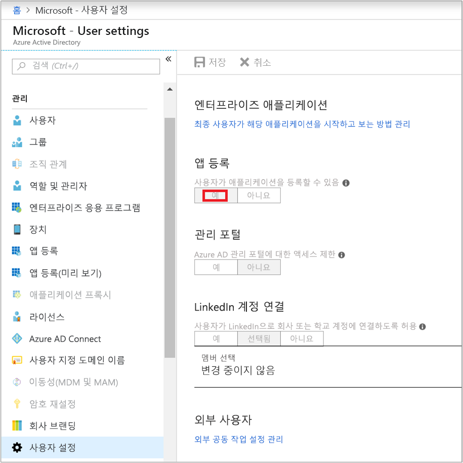
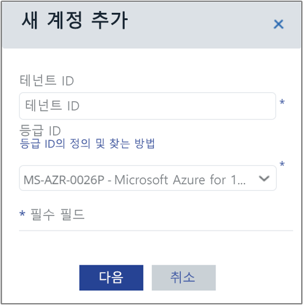
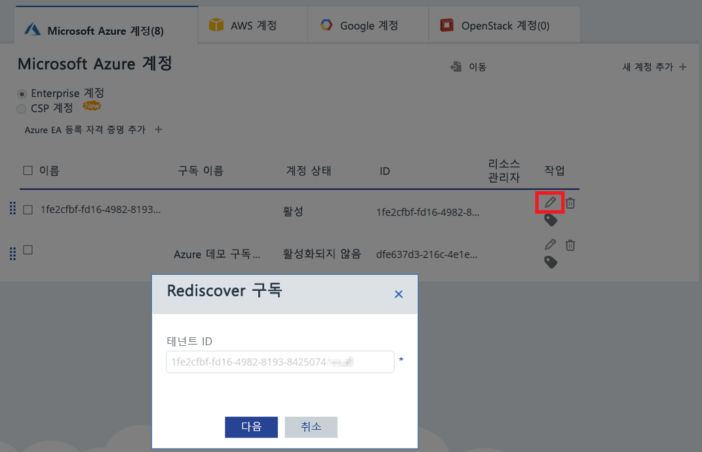

# <a name="activate-azure-subscriptions-and-accounts-with-cloudyn"></a>Cloudyn으로 Azure 구독 및 계정 활성화

Azure Resource Manager 자격 증명을 추가하거나 업데이트하면 Cloudyn이 Azure Tenant 내의 모든 계정 및 구독을 검색할 수 있습니다. 또한 가상 머신에서 Azure Diagnostics 확장을 사용하도록 설정하면 Cloudyn은 CPU와 메모리 같은 확장된 메트릭을 수집할 수 있습니다. 이 아티클에서는 Azure Resource Manager API를 사용하여 신규 및 기존 계정에 대한 액세스를 사용하도록 설정하는 방법을 설명합니다. 또한 일반적인 계정 문제를 해결하는 방법을 설명합니다.

구독이 _활성화되지_ 않으면 Cloudyn은 대부분의 Azure 구독 데이터에 액세스할 수 없습니다. Cloudyn이 액세스할 수 있도록 _활성화되지 않은_ 계정을 편집해야 합니다.

## <a name="required-azure-permissions"></a>필수 Azure 사용 권한

이 아티클에서 절차를 완료하려면 특정 사용 권한이 필요합니다. 사용자 또는 테넌트 관리자에게 다음 사용 권한이 모두 있어야 합니다.

- Azure AD 테넌트로 CloudynCollector 애플리케이션을 등록하는 사용 권한.
- 애플리케이션을 Azure 구독에서의 역할에 할당하는 기능.

Azure 구독에서 CloudynCollector 애플리케이션을 할당하려면 계정에 `Microsoft.Authorization/*/Write` 액세스 권한이 있어야 합니다. 이 작업에 대한 권한은 [소유자](../role-based-access-control/built-in-roles.md#owner) 역할 또는 [사용자 액세스 관리자](../role-based-access-control/built-in-roles.md#user-access-administrator) 역할을 통해 부여됩니다.

계정이 **참가자** 역할에 할당된 경우 애플리케이션을 할당할 적절한 사용 권한이 없습니다. Azure 구독에 CloudynCollector 애플리케이션을 할당하려고 하면 오류가 발생합니다.

### <a name="check-azure-active-directory-permissions"></a>Azure Active Directory 권한 확인

1. [Azure Portal](https://portal.azure.com)에 로그인합니다.
2. Azure Portal에서 **Azure Active Directory**를 선택합니다.
3. Azure Active Directory에서 **사용자 설정**을 선택합니다.
4. **앱 등록** 옵션을 확인합니다.
    - **예**로 설정되어 있으면, 관리자가 아닌 사용자가 AD 앱을 등록할 수 있습니다. 이 설정에서는 Azure AD 테넌트의 모든 사용자가 앱을 등록할 수 있습니다.  
    
    - **앱 등록** 옵션이 **아니요**로 설정되어 있다면, 테넌트 관리 사용자만이 Azure Active Directory 앱을 등록할 수 있습니다. 테넌트 관리자가 CloudynCollector 애플리케이션을 등록해야 합니다.


## <a name="add-an-account-or-update-a-subscription"></a>계정 추가 또는 구독 업데이트

계정 업데이트를 구독에 추가 하면 Azure 데이터에 대한 Cloudyn 액세스 권한을 부여합니다.

### <a name="add-a-new-account-subscription"></a>새 계정(구독)을 추가합니다.

1. Cloudyn 포털에서 오른쪽 위의 기어 기호를 클릭하고 **클라우드 계정**을 선택합니다.
2. **새 계정 추가**를 클릭하면 **새 계정 추가** 상자가 나타납니다. 필요한 정보를 입력합니다.  
    

### <a name="update-a-subscription"></a>구독 업데이트

1. 계정 관리에서 Cloudyn에 이미 있는 _활성화되지 않은_ 구독을 업데이트하려는 경우 부모 _테넌트 GUID_ 오른쪽에 있는 편집 연필 기호를 클릭합니다. 구독은 부모 테넌트 아래 그룹화되기 때문에 구독을 개별적으로 활성화하지 마십시오.
    
2. 필요한 경우 Tenant ID를 입력합니다. Tenant ID를 모를 경우 다음 단계를 사용하여 찾습니다.
    1. [Azure Portal](https://portal.azure.com)에 로그인합니다.
    2. Azure Portal에서 **Azure Active Directory**를 선택합니다.
    3. 테넌트 ID를 가져오려면 Azure AD 테넌트에 대한 **속성**을 선택합니다.
    4. 디렉터리 ID GUID를 복사합니다. 이 값은 테넌트 ID입니다.
    자세한 내용은 [테넌트 ID 가져오기](../active-directory/develop/howto-create-service-principal-portal.md#get-values-for-signing-in)를 참조하세요.
3. 필요한 경우 요율 ID를 선택합니다. 요율 ID를 모를 경우 다음 단계를 사용하여 찾습니다.
    1. Azure Portal의 오른쪽 위에서 사용자 정보를 클릭한 다음 **내 청구서 보기**를 클릭합니다.
    2. **대금 청구 계정** 아래에서 **구독**을 클릭합니다.
    3. **내 구독** 아래에서 구독을 선택합니다.
    4. 요율 ID가 **제공 ID** 아래에 표시됩니다. 구독에 대한 제안 ID를 복사합니다.
4. 새 계정 추가(또는 구독 편집) 상자에서 **저장**(또는 **다음**)을 클릭합니다. Azure Portal로 리디렉션됩니다.
5. 포털에 로그인합니다. Cloudyn Collector가 사용자의 Azure 계정에 액세스하도록 권한을 부여하려면 **Accept**를 클릭합니다.

    Cloudyn 계정 관리 페이지로 리디렉션되며 해당 구독이 **활성** 계정 상태로 업데이트됩니다. 리소스 관리자 열 아래에 녹색 확인 표시가 나타나야 합니다.

    하나 이상의 구독에 대해 녹색 확인 표시가 나타나지 않는다면 해당 구독에 대해 판독기 앱(CloudynCollector)을 만들 권한이 없는 것입니다. 구독에 대해 더 높은 권한이 있는 사용자가 이 프로세스를 반복해야 합니다.

프로세스를 안내하는 [Cloudyn를 사용하여 Azure Resource Manager에 연결](https://youtu.be/oCIwvfBB6kk) 비디오를 시청합니다.

>[!VIDEO https://www.youtube.com/embed/oCIwvfBB6kk?ecver=1]

## <a name="resolve-common-indirect-enterprise-set-up-problems"></a>간접 기업의 일반적인 설정 문제 해결

Cloudyn 포털을 처음 사용할 때 기업 계약 또는 CSP(클라우드 솔루션 공급자) 사용자의 경우 다음과 같은 메시지가 나타날 수 있습니다.

- *지정된 API 키가 최상위 수준 등록 키가 아닙니다*가 **Cloudyn 설정** 마법사에 표시됨.
- *직접 등록 – 아니요*가 기업 계약 포털에 표시됨.
- *지난 30일 간의 사용 데이터가 없습니다. 배포자에게 Azure 계정에 대해 표시를 사용하도록 설정했는지 문의하세요* - Cloudyn 포털에 표시

앞의 메시지는 재판매인 또는 CSP를 통해 Azure 기업계약을 구입했음을 나타냅니다. Cloudyn에서 데이터를 볼 수 있도록 재판매인 또는 CSP가 Azure 계정에 대해 _표시_를 사용하도록 설정해야 합니다.

다음은 문제를 해결하는 방법입니다.

1. 재판매인은 계정에 대해 _표시_를 사용하도록 설정해야 합니다. 지침은 [Indirect Customer Onboarding Guide](https://ea.azure.com/api/v3Help/v2IndirectCustomerOnboardingGuide)(간접 고객 온보딩 가이드)를 참조하세요.
2. Cloudyn에 사용할 기업 계약 키를 생성합니다. 지침은 [Azure Enterprise Agreement 등록 및 비용 데이터 보기](https://docs.microsoft.com/azure/cost-management/quick-register-ea)를 참조하세요.

Cloudyn을 설정하기 위해 Azure Enterprise Agreement API 키를 생성하려면 먼저 다음 지침에 따라 Azure Billing API를 사용하도록 설정해야 합니다.

- [기업 고객을 위한 보고 API 개요](../billing/billing-enterprise-api.md)
- **API에 대한 데이터 액세스 사용**의 [Microsoft Azure Enterprise Portal 보고 API](https://ea.azure.com/helpdocs/reportingAPI)

부서 관리자, 계정 소유자 및 엔터프라이즈 관리자에게 청구 API로 _요금 보기_ 권한을 부여해야 할 수도 있습니다.

Azure 서비스 관리자만 Cloudyn을 사용하도록 설정할 수 있습니다. 공동 관리자 권한이 충분하지 않습니다. 그러나 관리자 요구 사항을 해결할 수 있습니다. Azure Active Directory 관리자가 PowerShell 스크립트를 사용하여 **CloudynAzureCollector** 권한을 부여할 수 있도록 요청할 수 있습니다. 다음 스크립트에서는 Azure Active Directory 서비스 사용자인 **CloudynAzureCollector**를 등록할 수 있는 권한을 부여합니다.


```powershell
#THE SOFTWARE IS PROVIDED "AS IS", WITHOUT WARRANTY OF ANY KIND, EXPRESS OR IMPLIED, INCLUDING BUT NOT LIMITED TO THE WARRANTIES OF MERCHANTABILITY, FITNESS FOR A PARTICULAR PURPOSE AND NONINFRINGEMENT. IN NO EVENT SHALL THE AUTHORS OR COPYRIGHT HOLDERS BE LIABLE FOR ANY CLAIM, DAMAGES OR OTHER LIABILITY, WHETHER IN AN ACTION OF CONTRACT, TORT OR OTHERWISE, ARISING FROM, OUT OF OR IN CONNECTION WITH THE SOFTWARE OR THE USE OR OTHER DEALINGS IN THE SOFTWARE.

#Tenant - enter your tenant ID or Name
$tenant = "<ReplaceWithYourTenantID>"

#Cloudyn Collector application ID
$appId = "83e638ef-7885-479f-bbe8-9150acccdb3d"

#URL to activate the consent screen
$url = "https://login.windows.net/"+$tenant+"/oauth2/authorize?api-version=1&response_type=code&client_id="+$appId+"&redirect_uri=http%3A%2F%2Flocalhost%3A8080%2FCloudynJava&prompt=consent"

#Choose your browser, the default is Internet Explorer

#Chrome
#[System.Diagnostics.Process]::Start("chrome.exe", "--incognito $url")

#Firefox
#[System.Diagnostics.Process]::Start("firefox.exe","-private-window $url" )

#IExplorer
[System.Diagnostics.Process]::Start("iexplore.exe","$url -private" )

```

## <a name="next-steps"></a>다음 단계

- Cloudyn에 대한 첫 번째 자습서를 아직 완료하지 않은 경우 [사용량 및 비용 검토](tutorial-review-usage.md)에서 읽어 보세요.
