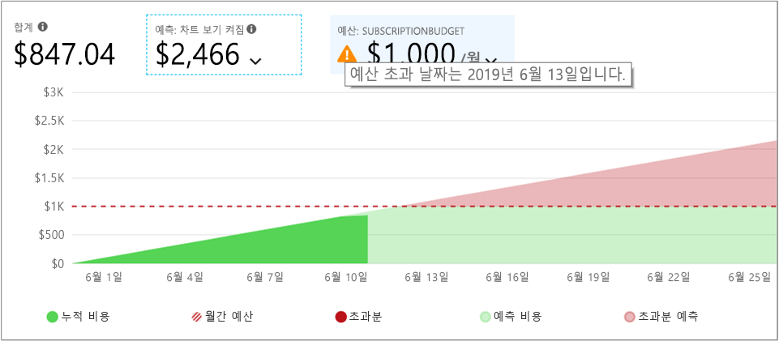
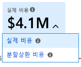
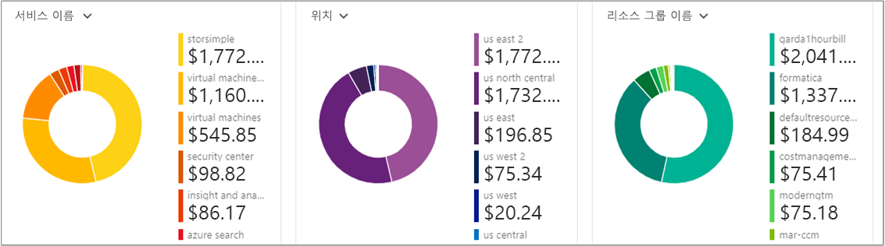

# <a name="quickstart-explore-and-analyze-costs-with-cost-analysis"></a>빠른 시작: 비용 분석을 사용하여 비용 탐색 및 분석

Azure 비용을 적절히 제어하고 최적화하려면 먼저 조직 내의 어디에서 비용이 발생했는지를 이해해야 합니다. 어떤 환경 및 시스템 지원에서 어느 정도의 서비스 비용을 발생하는지를 아는 것도 유용합니다. 조직 지출 패턴을 정확히 파악하려면 전체 비용 스펙트럼을 확인하는 기능이 반드시 필요합니다. 지출 패턴을 사용하면 예산 등의 비용을 제어하는 메커니즘을 적용할 수 있습니다.

이 빠른 시작에서는 비용 분석을 사용하여 조직 비용을 탐색하고 분석합니다. 조직별로 집계된 비용을 확인하면 시간별로 비용 발생 영역을 파악하고 지출 추세를 파악할 수 있습니다. 시간별로 누적된 비용을 확인하면 일정 예산기준으로 한 월/분기/년 단위 비용 추세를 예측할 수 있습니다. 예산을 설정해 두면 재정 제약 조건을 준수하는 데 도움이 됩니다. 그리고 일별 또는 월별 비용을 확인하여 불규칙한 지출을 파악하는 데 예산을 사용할 수 있습니다. 또한 추가 분석을 위해 또는 외부 시스템에서 사용하기 위해 현재 보고서의 데이터를 다운로드할 수 있습니다.

이 빠른 시작에서 다음을 수행하는 방법을 알아봅니다.

- 비용 분석에서 비용 검토
- 비용 보기 사용자 지정
- 비용 분석 데이터 다운로드


## <a name="prerequisites"></a>필수 조건

비용 분석은 다양한 종류의 Azure 계정 유형을 지원합니다. 지원되는 계정 유형의 전체 목록을 보려면 [Cost Management 데이터 이해](understand-cost-mgt-data.md)를 참조하세요. 비용 데이터를 보려면 적어도 Azure 계정에 대한 읽기 권한이 필요합니다.

[EA(기업계약)](https://azure.microsoft.com/pricing/enterprise-agreement/) 고객은 비용 데이터를 보려면 적어도 다음 범위 중 하나 이상에 대한 읽기 권한이 필요합니다.

- 청구 계정
- department
- 등록 계정
- 관리 그룹
- Subscription
- Resource group

Azure Cost Management 데이터에 액세스하는 방법에 대한 자세한 내용은 [데이터에 대한 액세스 할당](assign-access-acm-data.md)을 참조하세요.

## <a name="sign-in-to-azure"></a>Azure에 로그인

- [https://portal.azure.com](https://portal.azure.com ) 에서 Azure Portal에 로그인합니다.

## <a name="review-costs-in-cost-analysis"></a>비용 분석에서 비용 검토

비용 분석에서 비용을 검토하려면 Azure Portal에서 범위를 열고, 메뉴에서 **비용 분석**을 선택합니다. 예를 들어, **구독**으로 이동하여 목록에서 구독을 선택한 다음, 메뉴에서 **비용 분석**을 선택합니다. **범위** 필을 사용하여 비용 분석에서 다른 범위로 전환합니다. 범위에 대한 자세한 내용은 [범위 이해 및 작업](understand-work-scopes.md)을 참조하세요.

선택한 범위는 Cost Management 전체에서 데이터 통합을 제공하고 비용 정보에 대한 액세스를 제어하는 데 사용됩니다. 범위를 사용할 때는 다중 범위가 선택되지 않습니다. 대신 다른 사용자가 롤업한 더 큰 범위를 선택한 다음, 필요한 중첩된 범위까지 필터링합니다. 이 방법은 일부 사용자가 중첩된 여러 범위를 포함하는 단일 부모 범위에 액세스할 수 없을 수도 있으므로 반드시 이해해야 합니다.

초기 비용 분석 보기에는 다음 영역에 포함됩니다.

**누적 비용 보기**: 미리 정의된 비용 분석 보기 구성을 나타냅니다. 각 보기에는 날짜 범위, 세분성, 그룹화 방법 및 필터 설정이 있습니다. 기본 보기에는 현재 청구 기간에 대한 누적 비용이 표시되지만 다른 기본 제공 보기로 변경할 수 있습니다. 자세한 내용은 [비용 보기 사용자 지정](#customize-cost-views)을 참조하세요.

**실제 비용**: 청구서에서 누적된 현재 월의 총 사용량 및 구매 비용을 보여 줍니다.

**예측**: 선택한 기간에 대한 예상 총 비용을 보여 줍니다. (예측은 미리 보기 상태입니다.)

**예산**: 선택한 범위에 대한 계획된 지출 한도(사용 가능한 경우)를 보여 줍니다.

**누적 세분성**: 청구 기간의 시작일부터 시작되는 총 일일 집계 비용을 보여 줍니다. 청구 계정 또는 구독용으로 [예산을 생성](tutorial-acm-create-budgets.md)한 후에는 예산을 기준으로 한 지출 추세를 빠르게 확인할 수 있습니다. 날짜 위로 마우스를 가져가면 해당일의 누적 비용을 확인할 수 있습니다.

**피벗(도넛형) 차트**: 공통 표준 속성 집합을 기준으로 총 비용이 구분되는 동적 피벗을 제공합니다. 이번 달의 가장 큰 비용부터 가장 작은 비용까지 표시됩니다. 언제든지 다른 피벗을 선택하여 피벗 차트를 변경할 수 있습니다. 기본적으로 비용은 서비스(요금 범주), 위치(지역) 및 하위 범위로 분류됩니다. 예를 들어 등록 계정은 청구 계정의 하위 범위로, 리소스 그룹은 구독의 하위 범위로, 리소스는 리소스 그룹의 하위 범위로 분류됩니다.


## <a name="customize-cost-views"></a>비용 보기 사용자 지정

비용 분석에는 가장 일반적인 목표에 맞게 최적화된 네 개의 기본 제공 보기가 있습니다.

보기 | 대답을 요구하는 질문
--- | ---
누적 비용 | 이번 달에 지금까지 얼마를 지출했나요? 예산을 벗어나지는 않나요?
일별 비용 | 지난 30일 동안 일별 비용이 증가했나요?
서비스별 비용 | 지난 3건의 청구서에서 월별 사용량이 어떻게 달라졌나요?
리소스별 비용 | 이번 달에 지금까지 비용이 가장 많은 리소스는 무엇인가요?


그러나 심층 분석이 필요한 경우가 많이 있습니다. 사용자 지정은 날짜 선택을 사용하여 페이지의 맨 위에서 시작됩니다.

기본적으로 비용 분석은 현재 월에 대한 데이터를 표시합니다. 일반적인 날짜 범위로 빠르게 전환하려면 날짜 선택기를 사용합니다. 예에는 최근 7일, 지난 달, 현재 연도 또는 사용자 지정 날짜 범위가 포함됩니다. 종량제 구독에는 현재 청구 기간 또는 마지막 청구서와 같이 역월에 바인딩되지 않은 청구 기간 기준의 날짜 범위도 포함됩니다. 메뉴 위쪽의 **<이전** 및 **다음>** 링크를 사용하여 각각 이전 기간 또는 다음 기간으로 이동합니다. 예를 들어 **<이전**은 **최근 7일**에서 **8-14일 전** 또는 **15-21일 전**으로 전환합니다.


비용 분석에는 기본적으로 **누적** 비용이 표시됩니다. 누적 비용에는 매일 발생하는 비용과 이전 일의 비용이 모두 포함되므로 계속 증가하는 일별 집계 비용이 표시됩니다. 이 보기는 선택한 시간 범위의 예산을 기준으로 한 비용 추세가 표시되도록 최적화됩니다.

예측 차트 보기를 사용하여 잠재적인 예산 위반을 식별합니다. 잠재적인 예산 위반이 있는 경우 예상되는 초과 지출이 빨간색으로 표시됩니다. 표시 기호도 차트에 표시됩니다. 마우스로 기호 위를 가리키면 예산 위반에 대한 예상 날짜가 표시됩니다.



매일 발생하는 비용이 표시되는 **일별** 보기도 있습니다. 일별 보기에는 비용 증가 추세가 표시되지 않습니다. 이 보기는 일별 비용 급증 또는 급감과 같은 불규칙한 비용 추세를 표시하기 위한 것입니다. 예산을 선택한 경우 일별 보기에는 일별 예산의 추정치도 표시됩니다.

일별 비용이 예상 일별 예산보다 계속 높으면 월별 예산을 초과할 것으로 예상할 수 있습니다. 예상 일별 예산은 좀 더 낮은 수준에서 예산을 시각화하는 데 도움이 되는 방법입니다. 일별 비용이 계속 바뀌는 경우에는 월별 예산에 일일 예산 추정치를 비교한 결과의 정확도가 떨어집니다.

지출 예측이 설정된 최근 지출에 대한 일별 보기는 다음과 같습니다.


지출 예측을 해제하면 미래 날짜에 대한 예상 지출이 표시되지 않습니다. 또한 지난 기간의 비용을 살펴볼 때 비용 예측에서 비용이 표시되지 않습니다.

일반적으로 8-12시간 이내에 사용된 리소스에 대한 데이터 또는 알림을 볼 수 있습니다.


비용을 세분화하고 상위 기여자를 식별하기 위한 **그룹화 방법** 공용 속성이 있습니다. 예를 들어 리소스 태그별로 그룹화하려면 그룹화하려는 태그 키를 선택합니다. 비용은 해당 태그가 적용되지 않는 리소스에 대한 추가 세그먼트를 포함하여 각 태그 값에 따라 세분화됩니다.

대부분의 [Azure 리소스는 태그 지정을 지원합니다](../azure-resource-manager/tag-support.md). 그렇지만 일부 태그는 Cost Management 및 청구에 사용할 수 없습니다. 또한 리소스 그룹 태그는 지원되지 않습니다. Cost Management는 태그가 리소스에 직접 적용된 날짜의 리소스 태그만 지원합니다. Azure 태그 정책을 사용하여 비용 데이터 가시성을 향상시키는 방법을 알아보려면 [Azure Cost Management를 사용하여 태그 정책을 검토하는 방법](https://www.youtube.com/watch?v=nHQYcYGKuyw) 비디오를 시청하세요.

현재 월에 대한 Azure 서비스 비용 보기는 다음과 같습니다.


기본적으로 비용 분석은 발생된 모든 사용량 및 구매 비용을 표시하며, 청구서에는 **실제 비용**이라고도 하는 비용이 표시됩니다. 실제 비용을 확인하면 청구서를 조정하는 데 유용합니다. 그렇지만 지출 변칙 및 기타 비용 변화를 주시할 때 구매 비용 급증에 놀랄 수도 있습니다. 예약 구매 비용으로 인한 급증을 완화하려면 **분할 상환 비용**으로 전환합니다. 



분할 상환 비용은 예약 구매를 일일 청크로 분할하여 예약 기간 동안 이 청크를 분산시킵니다. 예를 들어 1월 1일에 365달러의 구매가 표시되는 대신, 1월 1일부터 12월 31일까지 매일 1달러의 구매가 표시됩니다. 또한 이러한 비용은 기본 분할 상환 외에도 다시 할당되어 예약을 사용한 특정 리소스와 연결됩니다. 예를 들어 매일 1달러의 요금이 두 가상 머신 간에 분할되면 하루에 두 건의 0.50달러 요금이 표시됩니다. 예약의 일부가 당일에 활용되지 않으면 해당 가상 머신과 연결된 하나의 0.50달러 요금과 `UnusedReservation` 요금 유형의 다른 0.50달러 요금이 표시됩니다. 사용되지 않은 예약 비용은 분할 상환 비용을 볼 때만 표시됩니다.

비용 표시 방법의 변경으로 인해 실제 비용과 분할 상환 비용 보기에는 총 수가 다르게 표시됩니다. 일반적으로 분할 상환 비용을 확인하는 경우 예약 구매 월의 총 비용은 감소하지만, 예약 구매를 수행한 월 수는 증가합니다. 분할 상환은 예약 구매에만 사용할 수 있으며, 현재 Azure Marketplace 구매에는 적용되지 않습니다.

다음 이미지에는 리소스 그룹 이름이 표시되어 있습니다. 태그별로 그룹화하여 태그당 총 비용을 보거나, **리소스별 비용** 보기를 사용하여 특정 리소스에 대한 모든 태그를 볼 수 있습니다.


특정 특성별로 비용을 그룹화하는 경우 상위 10명의 비용 기여자가 가장 높은 기여자에서 가장 낮은 기여자 순으로 표시됩니다. 10명을 초과하는 경우 상위 9명의 비용 기여자에게는 나머지 모든 그룹을 결합한 **기타** 그룹이 표시됩니다. 태그로 그룹화할 경우 태그 키가 적용되지 않은 비용에 **태그 없음** 그룹이 표시될 수 있습니다. 태그가 없는 비용이 태그가 있는 비용보다 많은 경우에도 **태그 없음**은 항상 마지막에 있습니다. 10개 이상의 태그 값이 있는 경우 태그가 없는 비용은 **기타**에 포함됩니다. 테이블 뷰로 전환하고 세분성을 **없음**으로 변경하여 가장 높은 비용부터 가장 낮은 비용까지 순위가 매겨진 모든 값을 확인합니다.

클래식 가상 머신, 네트워킹 및 스토리지 리소스는 자세한 청구 데이터를 공유하지 않습니다. 이러한 리소스는 비용을 그룹화할 때 **클래식 서비스**로 병합됩니다.

기본 차트 아래의 피벗 차트는 선택된 기간 및 필터의 전체 비용에 대한 더 큰 그림을 보여주는 여러 그룹화를 표시합니다. 특정 속성이나 태그를 선택하여 차원별로 집계된 비용을 볼 수 있습니다.



모든 보기의 전체 데이터 세트를 볼 수 있습니다. 고객이 적용하는 선택 사항이나 필터에 따라 표시되는 데이터가 달라집니다. 전체 데이터 세트를 보려면 **차트 종류** 목록을 선택한 다음, **테이블** 보기를 선택합니다.


## <a name="understanding-grouping-and-filtering-options"></a>그룹화 및 필터링 옵션에 대한 이해

다음 표에는 가장 일반적인 그룹화 및 필터링 옵션과 함께 이러한 옵션을 사용해야 하는 경우가 나와 있습니다.

| 자산 | 사용하는 경우 |
| --- | --- |
| **청구 기간** | 청구서 월별 단위 비용을 분류합니다. 이 옵션은 달력 월에 바인딩되지 않는 종량제 및 개발/테스트 구독에 중요합니다. EA/MCA 계정은 동일한 목표를 달성하기 위해 날짜 선택 또는 월간 세분성에서 달력 월을 사용할 수 있습니다. |
| **요금 유형** | 사용량, 구매, 환불 및 사용되지 않은 예약 비용을 분류합니다. 예약 구매 및 환불은 작업 비용을 사용하는 경우에만 사용할 수 있으며, 분할 상환 비용에는 사용할 수 없습니다. 사용되지 않은 예약 비용은 분할 상환 비용을 확인하는 경우에만 사용할 수 있습니다. |
| **클라우드** | AWS 및 Azure별 비용을 분류합니다. AWS 비용은 관리 그룹, 외부 청구 계정 및 외부 구독에서만 사용할 수 있습니다. |
| **부서** / **청구서 섹션** | EA 부서 또는 MCA 청구서 섹션별 비용을 분류합니다. 이 옵션은 EA/MCA 청구 계정 및 MCA 청구 프로필에만 사용할 수 있습니다. |
| **등록 계정** | EA 계정 소유자별 비용을 분류합니다. 이 옵션은 EA 청구 계정 및 부서에만 사용할 수 있습니다. |
| **Frequency(빈도)** | 사용량 기반, 일회성 및 반복 비용을 분류합니다. |
| **미터** | Azure 사용량 미터별로 비용을 분류합니다. 이 옵션은 Azure 사용량에만 사용할 수 있습니다. 모든 구매 및 Marketplace 사용량은 **지정하지 않음** 또는 **할당되지 않음**으로 표시됩니다. |
| **게시자 유형** | AWS, Azure 및 Marketplace 비용을 분류합니다. |
| **예약** | 예약별 비용을 분류합니다. 예약이 포함되지 않은 사용량은 **지정하지 않음**으로 표시됩니다. |
| **리소스** | 리소스별 비용을 분류합니다. 모든 구매는 EA/PAYG 청구 계정 또는 MCA 청구서 프로필 수준에서 적용되므로 **지정하지 않음**으로 표시됩니다.  |
| **리소스 그룹** | 리소스 그룹별 비용을 분류합니다. 이 옵션은 비클래식 사용량에만 사용할 수 있습니다. 클래식 리소스 사용량은 **기타**로 표시되고, 구매는 **지정하지 않음**으로 표시됩니다. |
| **리소스 종류** | 리소스 종류별 비용을 분류합니다. 이 옵션은 비클래식 사용량에만 사용할 수 있습니다. 클래식 리소스 사용량은 **기타**로 표시되고, 구매는 **지정하지 않음**으로 표시됩니다. |
| **서비스 이름** 또는 **미터 범주** | Azure 서비스별 비용을 분류합니다. 이 옵션은 Azure 사용량에만 사용할 수 있습니다. 모든 구매 및 Marketplace 사용량은 **지정하지 않음** 또는 **할당되지 않음**으로 표시됩니다. |
| **서비스 계층** 또는 **미터 하위 범주** | Azure 사용량 미터 하위 범주별 비용을 분류합니다. 이 옵션은 Azure 사용량에만 사용할 수 있습니다. 모든 구매 및 Marketplace 사용량은 **지정하지 않음** 또는 **할당되지 않음**으로 표시됩니다. |
| **구독** | 구독별 비용을 분류합니다. 모든 구매는 **지정하지 않음**으로 표시됩니다. |
| **Tag** | 특정 태그 키에 대한 태그 값별 비용을 분류합니다. |

용어에 대한 자세한 내용은 [Azure 사용량 및 요금 파일에 사용되는 용어 이해](../billing/billing-understand-your-usage.md)를 참조하세요.


## <a name="saving-and-sharing-customized-views"></a>사용자 지정 보기 저장 및 공유

비용 분석을 Azure Portal 대시보드에 고정시키거나 비용 분석에 대한 링크를 복사하여 사용자 지정 보기를 저장하고 다른 사용자와 공유할 수 있습니다. 

비용 분석을 고정하려면 오른쪽 위 모서리에 있는 핀 아이콘을 선택합니다. 비용 분석이 고정되면 기본 차트 또는 테이블 보기만 저장합니다. 다른 사용자가 타일에 액세스할 수 있도록 대시보드를 공유합니다. 이는 대시보드 구성만 공유하며, 다른 사용자에게 기본 데이터에 대한 액세스 권한을 부여하지 않습니다. 비용에 대한 액세스 권한이 없지만 공유 대시보드에 대한 액세스은 있는 경우 “액세스 거부” 메시지가 표시됩니다.

비용 분석에 대한 링크를 공유하려면 블레이드 위쪽에 있는 **공유**를 선택합니다. 그러면 해당 특정 범위의 해당 특정 보기가 열리는 사용자 지정 URL이 표시됩니다. 비용에 대한 액세스 권한이 없고 이 URL이 없으면 "액세스 거부" 메시지가 표시됩니다. 

지원되는 각 범위의 비용에 대한 액세스 권한을 부여하는 방법을 자세히 알아보려면 [범위 이해 및 작업](understand-work-scopes.md)을 검토하세요.

## <a name="automation-and-offline-analysis"></a>자동화 및 오프라인 분석

추가 분석을 위해 데이터를 다운로드하거나, 사용자 고유의 데이터와 병합하거나, 사용자 고유의 시스템에 통합해야 하는 경우가 있습니다. Cost Management는 몇 가지 다른 옵션을 제공합니다. 처음에 비용 분석 내에서 제공되는 것과 같은 일시적인 개괄적 요약이 필요한 경우 필요한 보기를 작성합니다. 그런 다음, **내보내기**를 선택하고 **CSV로 데이터 다운로드** 또는 **Excel에 데이터 다운로드**를 선택하여 다운로드합니다. Excel 다운로드는 범위, 쿼리 구성, 총계 및 생성 날짜와 같이 다운로드를 생성하는 데 사용한 보기에 대한 추가 컨텍스트를 제공합니다.

집계되지 않은 전체 데이터 세트가 필요한 경우 청구 계정에서 해당 데이터 세트를 다운로드합니다. 그런 다음, 포털의 왼쪽 탐색 창에 있는 서비스 목록에서 **비용 관리 + 청구**로 이동합니다. 청구 계정(해당하는 경우)을 선택합니다. **사용량 + 요금**으로 이동한 후 원하는 청구 기간에 대해 **다운로드** 아이콘을 선택합니다.

비슷한 방법을 사용하여 비용 데이터 수신을 자동화합니다. 동적 필터링, 그룹화 및 집계를 통한 더 풍부한 분석을 위해 [쿼리 API](/rest/api/cost-management/query)를 사용하거나, 집계되지 않은 전체 데이터 세트에 대해 [UsageDetails API](/rest/api/consumption/usageDetails)를 사용합니다. 이러한 API의 GA(일반 공급) 버전은 2019-01-01입니다. 이러한 API 내에서 예약 및 Marketplace 구매의 미리 보기에 액세스하려면 **2019-04-01-preview**를 사용합니다. 

예를 들어, 다음은 요금 유형(사용량, 구매 또는 환불), 게시자 유형(Azure 또는 Marketplace), 리소스 그룹(구매의 경우 비어 있음) 및 예약(해당되지 않는 경우 비어 있음)별로 분류된 분할 상환 비용에 대한 집계 보기입니다.

```
POST https://management.azure.com/{scope}/providers/Microsoft.CostManagement/query?api-version=2019-04-01-preview
Content-Type: application/json
 
{
  "type": "AmortizedCost",
  "timeframe": "Custom",
  "timePeriod": { "from": "2019-04-01", "to": "2019-04-30" },
  "dataset": {
    "granularity": "None",
    "aggregation": {
      "totalCost": { "name": "PreTaxCost", "function": "Sum" }
    },
    "grouping": [
      { "type": "dimension", "name": "ChargeType" },
      { "type": "dimension", "name": "PublisherType" },
      { "type": "dimension", "name": "Frequency" },
      { "type": "dimension", "name": "ResourceGroup" },
      { "type": "dimension", "name": "SubscriptionName" },
      { "type": "dimension", "name": "SubscriptionId" },
      { "type": "dimension", "name": "ReservationName" },
      { "type": "dimension", "name": "ReservationId" },
    ]
  },
}
```

그리고 집계가 필요하지 않고 원시 데이터 세트 전체를 선호하는 경우 다음과 같습니다.

```
GET https://management.azure.com/{scope}/providers/Microsoft.Consumption/usageDetails?metric=AmortizedCost&$filter=properties/usageStart+ge+'2019-04-01'+AND+properties/usageEnd+le+'2019-04-30'&api-version=2019-04-01-preview
```

구매가 발생한 대로 표시하기 위해 실제 비용이 필요한 경우 **type**/**metric**을 **ActualCost**로 변경합니다. 이러한 API에 대한 자세한 내용은 [쿼리](/rest/api/cost-management/query) 및 [UsageDetails](/rest/api/consumption/usageDetails) API 설명서를 참조하세요. 게시된 문서는 GA 버전에 대한 것입니다. 그렇지만 새 type/metric 특성 및 변경된 속성 이름을 제외하고는 *2019-04-01-preview* API 버전에서 모두 동일하게 작동합니다. (아래의 속성 이름에 대해 자세히 읽어보세요.)
 
Cost Management API는 리소스 위의 모든 범주, Azure RBAC 액세스를 통한 리소스 그룹, 구독 및 관리 그룹, EA 포털 액세스를 통한 EA 청구 계정(등록), 부서 및 등록 계정 등에 작동합니다. 범위 ID를 결정하는 방법 또는 액세스를 관리하는 방법을 포함하여 범위에 대한 자세한 내용은 [범위 이해 및 작업](understand-work-scopes.md)에서 알아보세요.

## <a name="next-steps"></a>다음 단계

예산을 작성하고 관리하는 방법을 알아보려면 첫 번째 자습서를 진행하세요.

> [!div class="nextstepaction"]
> [예산 작성 및 관리](tutorial-acm-create-budgets.md)
