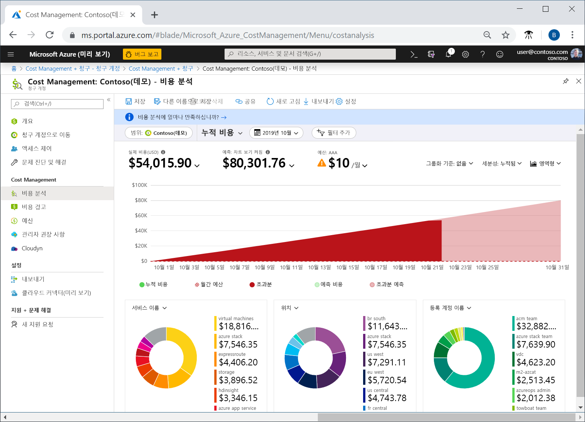
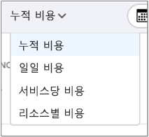
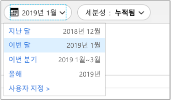
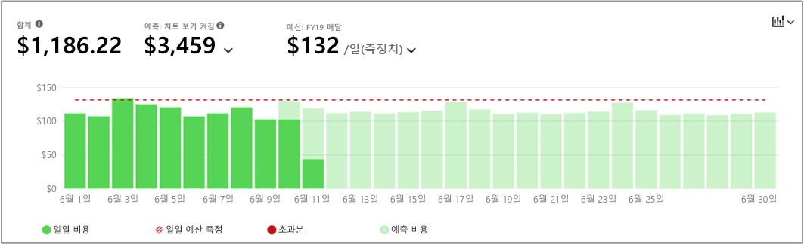
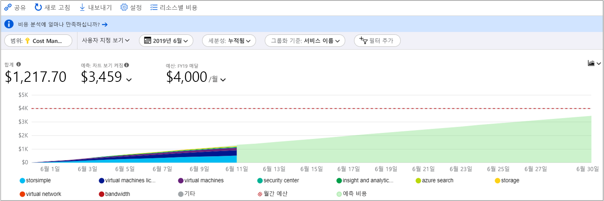
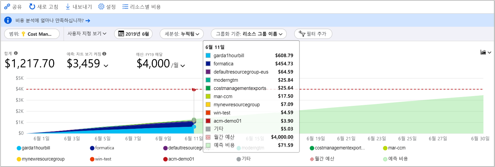
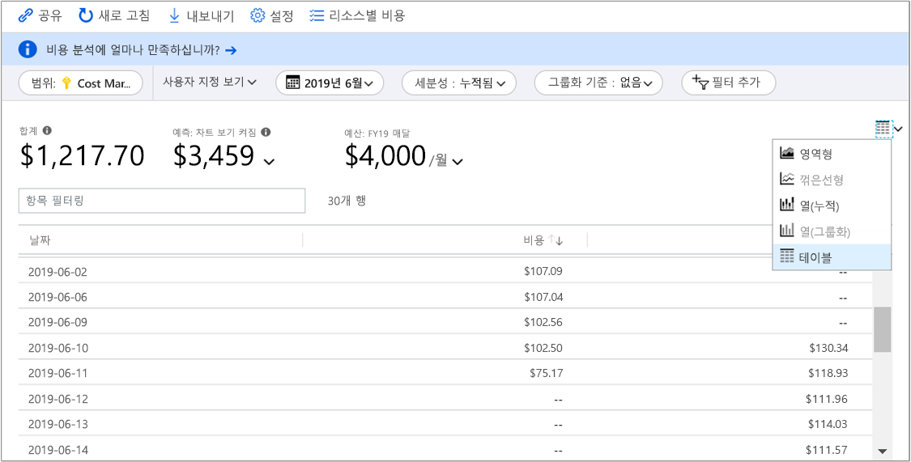

# 빠른 시작: 비용 분석을 사용하여 비용 탐색 및 분석

Azure 비용을 적절히 제어하고 최적화하려면 먼저 조직 내의 어디에서 비용이 발생했는지를 이해해야 합니다. 어떤 환경 및 시스템 지원에서 어느 정도의 서비스 비용을 발생하는지를 아는 것도 유용합니다. 조직 지출 패턴을 정확히 파악하려면 전체 비용 스펙트럼을 확인하는 기능이 반드시 필요합니다. 지출 패턴을 사용하면 예산 등의 비용을 제어하는 메커니즘을 적용할 수 있습니다.

이 빠른 시작에서는 비용 분석을 사용하여 조직 비용을 탐색하고 분석합니다. 조직별로 집계된 비용을 확인하면 시간별로 비용 발생 영역을 파악하고 지출 추세를 파악할 수 있습니다. 시간별로 누적된 비용을 확인하면 일정 예산기준으로 한 월/분기/년 단위 비용 추세를 예측할 수 있습니다. 예산을 설정해 두면 재정 제약 조건을 준수하는 데 도움이 됩니다. 그리고 일별 또는 월별 비용을 확인하여 불규칙한 지출을 파악하는 데 예산을 사용할 수 있습니다. 또한 추가 분석을 위해 또는 외부 시스템에서 사용하기 위해 현재 보고서의 데이터를 다운로드할 수 있습니다.

이 빠른 시작에서 다음을 수행하는 방법을 알아봅니다.

- 비용 분석에서 비용 검토
- 비용 보기 사용자 지정
- 비용 분석 데이터 다운로드

## 필수 조건

비용 분석은 다양한 종류의 Azure 계정 유형을 지원합니다. 지원되는 계정 유형의 전체 목록을 보려면 [Cost Management 데이터 이해](understand-cost-mgt-data.md)를 참조하세요. 비용 데이터를 보려면 적어도 Azure 계정에 대한 읽기 권한이 필요합니다.

[EA(기업계약)](https://azure.microsoft.com/pricing/enterprise-agreement/) 고객은 비용 데이터를 보려면 적어도 다음 범위 중 하나 이상에 대한 읽기 권한이 필요합니다.

- 청구 계정
- department
- 등록 계정
- 관리 그룹
- 구독
- 리소스 그룹

Cost Management 데이터에 액세스하는 방법에 대한 자세한 내용은 [데이터에 대한 액세스 할당](assign-access-acm-data.md)을 참조하세요.

## Azure에 로그인

- [https://portal.azure.com](https://portal.azure.com) 에서 Azure Portal에 로그인합니다.

## 비용 분석에서 비용 검토

비용 분석에서 비용을 검토하려면 Azure Portal에서 범위를 열고, 메뉴에서 **비용 분석**을 선택합니다. 예를 들어 **구독**으로 이동하여 목록에서 구독을 선택한 다음, 메뉴에서 **비용 분석**을 선택합니다. **범위** 필을 사용하여 비용 분석에서 다른 범위로 전환합니다. 범위에 대한 자세한 내용은 [범위 이해 및 작업](understand-work-scopes.md)을 참조하세요.

선택한 범위는 Cost Management 전체에서 데이터 통합을 제공하고 비용 정보에 대한 액세스를 제어하는 데 사용됩니다. 범위를 사용할 때는 다중 범위가 선택되지 않습니다. 대신 다른 사용자가 롤업한 더 큰 범위를 선택한 다음, 필요한 중첩된 범위까지 필터링합니다. 이 방법은 일부 사용자가 중첩된 여러 범위를 포함하는 단일 부모 범위에 액세스할 수 없을 수도 있으므로 반드시 이해해야 합니다.

초기 비용 분석 보기에는 다음 영역에 포함됩니다.

**합계** - 이번 달의 총 비용을 보여 줍니다.

**예산** – 선택한 범위에 대한 계획된 지출 한도(사용 가능한 경우)를 보여 줍니다.

**누적 비용** - 월의 시작부터 집계된 총 일일 지출을 보여 줍니다. 청구 계정 또는 구독용으로 [예산을 생성](tutorial-acm-create-budgets.md)한 후에는 예산을 기준으로 한 지출 추세를 빠르게 확인할 수 있습니다. 날짜 위로 마우스를 가져가면 해당일의 누적 비용을 확인할 수 있습니다.

**피벗(도넛형) 차트** – 공통 표준 속성 집합을 기준으로 총 비용이 구분되는 동적 피벗을 제공합니다. 이러한 차트는 현재 월 동안 가장 높은 비용에서 가장 낮은 비용 순으로 표시합니다. 언제든지 다른 피벗을 선택하여 피벗 차트를 변경할 수 있습니다. 기본적으로 비용은 서비스(요금 범주), 위치(지역) 및 하위 범위로 분류됩니다. 예를 들어 등록 계정은 청구 계정의 하위 범위로, 리소스 그룹은 구독의 하위 범위로, 리소스는 리소스 그룹의 하위 범위로 분류됩니다.

## 비용 보기 사용자 지정

비용 분석에는 가장 일반적인 목표에 맞게 최적화된 네 개의 기본 제공 보기가 있습니다.

보기 | 대답을 요구하는 질문
--- | ---
누적 비용 | 이번 달에 지금까지 얼마를 지출했나요? 예산을 벗어나지는 않나요?
일별 비용 | 지난 30일 동안 일별 비용이 증가했나요?
서비스별 비용 | 지난 3건의 청구서에서 월별 사용량이 어떻게 달라졌나요?
리소스별 비용 | 이번 달에 지금까지 비용이 가장 많은 리소스는 무엇인가요?

그러나 심층 분석이 필요한 경우가 많이 있습니다. 사용자 지정은 날짜 선택을 사용하여 페이지의 맨 위에서 시작됩니다.

기본적으로 비용 분석은 현재 월에 대한 데이터를 표시합니다. 일반적인 날짜 범위로 빠르게 전환하려면 날짜 선택기를 사용합니다. 몇 가지 예로 최근 7일, 지난 달, 현재 연도 또는 사용자 지정 날짜 범위가 있습니다. 종량제 구독에는 현재 청구 기간 또는 마지막 청구서와 같이 역월에 바인딩되지 않은 청구 기간 기준의 날짜 범위도 포함됩니다. 메뉴 위쪽의 **<이전** 및 **다음>** 링크를 사용하여 각각 이전 기간 또는 다음 기간으로 이동합니다. 예를 들어 **<이전**은 최근 7일에서 8-14일 전으로 전환한 다음, 15-21일 전으로 전환합니다.

비용 분석에는 기본적으로 **누적** 비용이 표시됩니다. 누적 비용에는 매일 발생하는 비용과 이전 일의 비용이 모두 포함되므로 계속 증가하는 일별 집계 비용이 표시됩니다. 이 보기는 선택한 시간 범위의 예산을 기준으로 한 비용 추세가 표시되도록 최적화됩니다.

매일 발생하는 비용이 표시되는 **일별** 보기도 있습니다. 일별 보기에는 비용 증가 추세가 표시되지 않습니다. 이 보기는 일별 비용 급증 또는 급감과 같은 불규칙한 비용 추세를 표시하기 위한 것입니다. 예산을 선택한 경우 일별 보기에는 일별 예산의 추정치도 표시됩니다. 일별 비용이 예상 일별 예산보다 계속 높으면 월별 예산을 초과할 것으로 예상할 수 있습니다. 예상 일별 예산은 좀 더 낮은 수준에서 예산을 시각화하는 데 도움이 되는 방법일 뿐입니다. 일별 비용이 계속 바뀌는 경우에는 월별 예산에 일일 예산 추정치를 비교한 결과의 정확도가 떨어집니다.

일반적으로 8-12시간 이내에 사용된 리소스에 대한 데이터 또는 알림을 볼 수 있습니다.

비용을 세분화하고 상위 기여자를 식별하기 위한 **그룹화 방법** 공용 속성이 있습니다. 예를 들어 리소스 태그별로 그룹화하려면 그룹화하려는 태그 키를 선택합니다. 비용은 해당 태그가 적용되지 않는 리소스에 대한 추가 세그먼트를 포함하여 각 태그 값에 따라 세분화됩니다.

대부분의 [Azure 리소스는 태그를 지원](../azure-resource-manager/tag-support.md)하지만, 일부 태그는 Cost Management 및 청구에 사용할 수 없습니다. 또한 리소스 그룹 태그는 지원되지 않습니다. Cost Management는 태그가 리소스에 직접 적용된 날짜의 리소스 태그만 지원합니다. Azure 태그 정책을 사용하여 비용 데이터 가시성을 향상시키는 방법을 알아보려면 [Azure Cost Management를 사용하여 태그 정책을 검토하는 방법](https://www.youtube.com/watch?v=nHQYcYGKuyw) 비디오를 시청하세요.

다음은 지난달의 비용을 보여 주는 Azure 서비스 비용 보기입니다.

기본 차트 아래의 피벗 차트는 선택된 기간 및 필터의 전체 비용에 대한 더 큰 그림을 보여주는 여러 그룹화를 표시합니다.s. 특정 속성이나 태그를 선택하여 차원별로 집계된 비용을 볼 수 있습니다.

위의 그림에는 리소스 그룹 이름이 표시되어 있습니다. 태그로 그룹화하여 태그당 총 비용을 볼 수는 있지만 어느 비용 분석 보기에서도 리소스 또는 리소스 그룹별로 모든 태그를 볼 수는 없습니다.

특정 특성별로 비용을 그룹화하는 경우 상위 10명의 비용 기여자가 가장 높은 기여자에서 가장 낮은 기여자 순으로 표시됩니다. 10명을 초과하면 상위 9명의 비용 기여자 및 나머지 모든 그룹이 함께 포함된 **기타** 그룹이 표시됩니다. 태그로 그룹화할 경우 태그 키가 적용되지 않은 비용에 **태그 없음** 그룹이 표시될 수 있습니다. 태그가 없는 비용이 태그가 있는 비용보다 많은 경우에도 **태그 없음**은 항상 마지막에 있습니다. 10개 이상의 태그 값이 있는 경우 태그가 없는 비용은 **기타**에 포함됩니다.

*클래식* 가상 머신, 네트워킹 및 스토리지 리소스는 자세한 청구 데이터를 공유하지 않습니다. 이러한 리소스는 비용을 그룹화할 때 **클래식 서비스**로 병합됩니다.

모든 보기의 전체 데이터 세트를 볼 수 있습니다. 고객이 적용하는 선택 사항이나 필터에 따라 표시되는 데이터가 달라집니다. 전체 데이터 세트를 보려면 **차트 종류** 목록을 클릭한 다음, **테이블** 보기를 클릭합니다.

## 비용 분석 데이터 다운로드

비용 분석에서 정보를 **다운로드**하여 현재 Azure Portal에 표시되는 모든 데이터에 대해 CSV 파일을 생성할 수 있습니다. 이 파일에는 적용하는 모든 필터나 그룹이 포함됩니다. 실제로 표시되지 않는 상단 총계 차트의 기본 데이터도 CSV 파일에 포함됩니다.

## 다음 단계

예산을 작성하고 관리하는 방법을 알아보려면 첫 번째 자습서를 진행하세요.

> [!div class="nextstepaction"]
> [예산 작성 및 관리](tutorial-acm-create-budgets.md)
