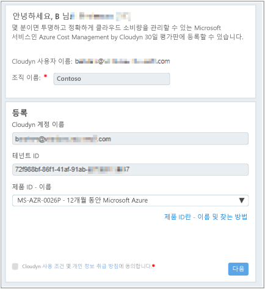
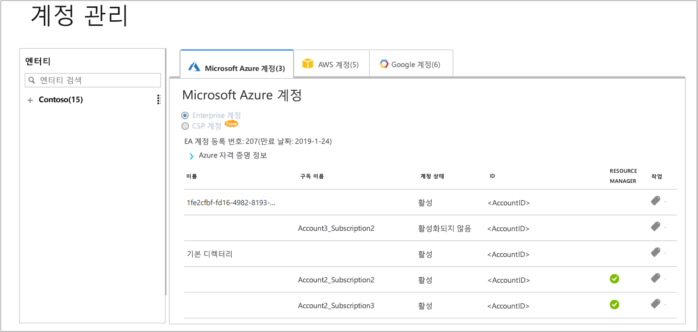

# 개별 Azure 구독 등록 및 비용 데이터 보기

Azure 구독을 사용하여 Azure Cost Management에 등록합니다. 등록하면 Cloudyn 포털에 액세스할 수 있습니다. 이 빠른 시작 정보에서는 Cloudyn 평가판 구독을 만들고 Cloudyn 포털에 로그인하는 데 필요한 등록 프로세스를 상세히 설명합니다. 또한 비용 데이터를 즉시 보기 시작하는 방법을 보여줍니다.

## Azure에 로그인

- Azure Portal ( http://portal.azure.com ) 에 로그인합니다.

## Azure Cost Management에 등록

1. Azure Portal의 서비스 목록에서 **Cost Management + 청구**를 클릭합니다.
2. **개요**에서 **Cost Management**를 클릭합니다.  
    
3. **Cost Management** 페이지에서 **Cost Management로 이동**을 클릭하여 새 창에 Cloudyn 등록 페이지를 엽니다.
4. Cloudyn 포털 평가판 등록 페이지에서 회사 이름을 입력하고 **Azure 개별 등록 소유자**를 선택하고 **다음**을 클릭합니다. 계정 이름 및 테넌트 ID를 형식에 자동으로 추가합니다.  
    
5. 구독에 연결된 **제품 ID - 이름**을 선택합니다. 구독에 대한 속도 ID가 무엇인지 잘 모르는 경우 Azure 청구서를 보고 **제품 ID**를 찾아볼 수 있습니다.
6. 사용 약관에 동의하면 정보의 유효성을 검사하고 **다음**을 클릭합니다.
7. **추가 데이터 수집** 페이지에서 **다음**을 클릭하여 Cloudyn이 Azure 리소스 데이터를 수집할 권한을 부여합니다. 수집되는 데이터에는 구독의 사용량, 성능, 청구 및 태그 데이터가 포함됩니다.  
    
8. 브라우저는 Cloudyn의 로그인 페이지로 이동합니다. Azure 구독 자격 증명으로 로그인합니다.
9. **Cloudyn으로 이동**을 클릭하여 Cloudyn 포털을 연 다음 **계정 관리** 페이지에서 Azure 구독 계정 정보가 표시됩니다.  
    

Azure 구독을 등록하는 방법에 대한 자습서 비디오를 시청하려면 [Azure Cost Management에서 사용할 디렉터리 GUID 및 비용 ID 찾기](https://youtu.be/PaRjnyaNGMI)를 참조하세요.

[!INCLUDE [cost-management-create-account-view-data](../../includes/cost-management-create-account-view-data.md)]

## 다음 단계

이 빠른 시작에서는 Azure 구독 정보를 사용하여 Cost Management에 등록했습니다. 또한 Cloudyn 포털에 로그인하여 비용 데이터 보기를 시작했습니다. Azure Cost Management에 대해 자세히 알아보려면 Cost Management의 자습서를 계속 진행하세요.

> [!div class="nextstepaction"]
> [사용량 및 비용 검토](./tutorial-review-usage.md)
