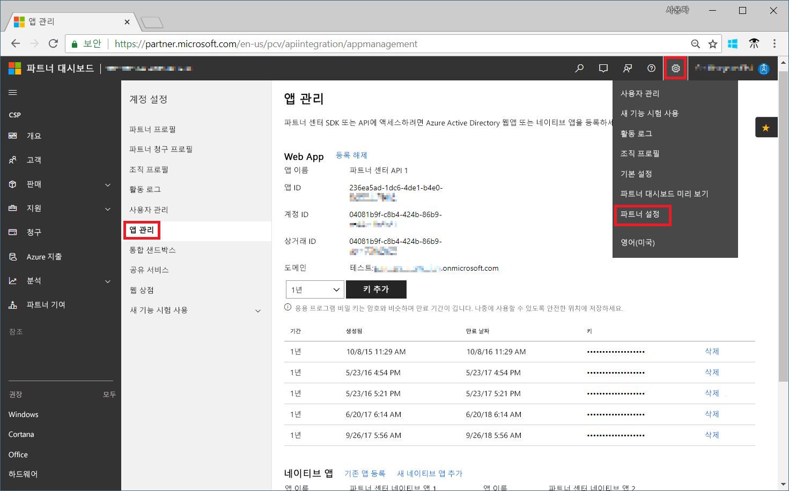
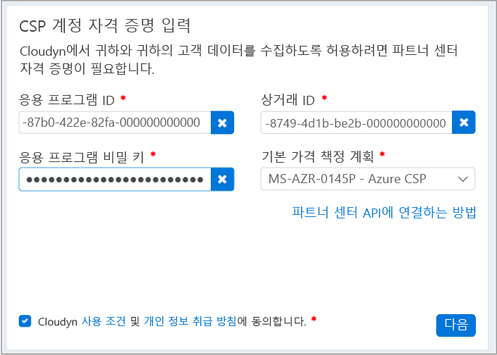

# CSP 파트너 프로그램에 등록 및 데이터 비용 보기

CSP 파트너인 사용자는 Cloudyn에서 개발한 Azure Cost Management에 등록할 수 있습니다. 등록하면 Cloudyn 포털에 액세스할 수 있습니다. 이 빠른 시작 정보에서는 Cloudyn 평가판 구독을 만들고 Cloudyn 포털에 로그인하는 데 필요한 등록 프로세스를 상세히 설명합니다. 또한 비용 데이터를 즉시 보기 시작하는 방법을 보여줍니다.

등록을 완료하려면 파트너 센터 API에 액세스할 수 있는 파트너 프로그램 관리자여야 합니다. 파트너 센터 API의 구성은 인증과 데이터 액세스에 필요합니다. 자세한 내용은 파트너 센터 API에 연결을 참조하세요.

## Azure에 로그인

- Azure Portal( http://portal.azure.com )에 로그인합니다.

## 평가판 등록 만들기

1. Azure Portal의 서비스 목록에서 **Cost Management + 청구**를 클릭합니다.
2. **개요**에서 **Cost Management**를 클릭합니다.  
    
3. **Cost Management** 페이지에서 **Cost Management로 이동**을 클릭하여 새 창에 Cloudyn 등록 페이지를 엽니다.
4. Cloudyn 포털 평가판 등록 페이지에서 회사 이름을 입력하고 **Microsoft CSP 파트너 프로그램 관리자**를 선택하고 **다음**을 클릭합니다.  
5. **응용 프로그램 ID**, **상거래 ID**, **응용 프로그램 비밀 키**를 입력하고 **기본 가격 책정 계획**을 선택합니다. 정보가 없는 경우 기본 관리자 계정을 사용하여 [https://partnercenter.microsoft.com](https://partnercenter.microsoft.com)에서 파트너 센터 포털에 로그인하고 다음 단계를 수행합니다.
  1. **대시보드** > **계정 설정** > **앱 관리**로 이동합니다.
  2. 이전에 Web App을 만든 경우 이 단계를 건너뜁니다. 그렇지 않으면 **Web App** 섹션에서 **새 웹앱 추가**를 클릭합니다.
  3. 웹 응용 프로그램에서 **앱 ID** GUID를 복사합니다.
  4. 웹 응용 프로그램에서 **상거래 ID** GUID를 복사합니다.
  5. 필요에 따라 키 유효 기간을 한 해 또는 두 해로 선택합니다. **키 추가**를 선택하고 비밀 키 값을 복사하고 저장합니다.  
    
  6. 등록 페이지로 돌아가서 정보를 붙여 넣습니다.  
      
6. 사용 약관에 동의한 다음 정보의 유효성을 검사합니다. **다음**을 클릭하여 Cloudyn에서 Azure 리소스 데이터를 수집할 권한을 부여합니다. 수집되는 데이터에는 구독의 사용량, 성능, 청구 및 태그 데이터가 포함됩니다.  
7. **기타 관련자 초대**에서 이메일 주소를 입력하여 사용자를 추가할 수 있습니다. 완료되면 **다음**을 클릭합니다. 모든 청구 데이터가 Cloudyn에 추가되려면 2시간 정도 소요됩니다.
8. **Cloudyn으로 이동**을 클릭하여 Cloudyn 포털을 연 다음 **클라우드 계정 관리** 페이지에서 등록된 CSP 계정 정보를 확인할 수 있습니다.

[!INCLUDE [cost-management-create-account-view-data](../../includes/cost-management-create-account-view-data.md)]

## 다음 단계

이 빠른 시작에서는 CSP 정보를 사용하여 Cost Management에 등록했습니다. 또한 Cloudyn 포털에 로그인하여 비용 데이터 보기를 시작했습니다. Cloudyn으로 Azure Cost Management에 대한 자세한 내용을 보려면 Cost Management의 자습서를 계속 진행하세요.

> [!div class="nextstepaction"]
> [비용 데이터 보기](./tutorial-review-usage.md)
