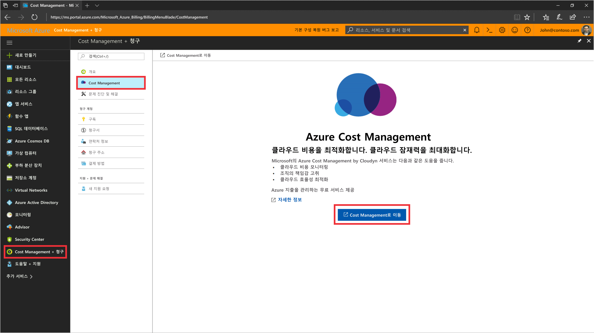
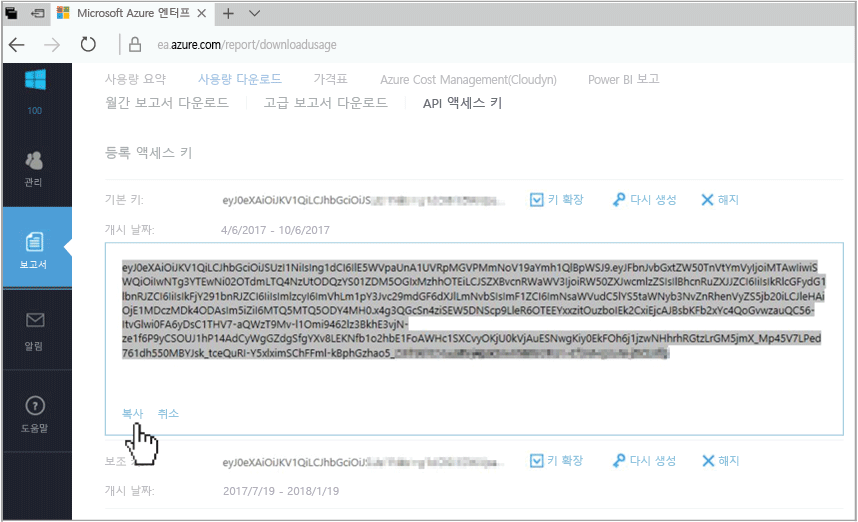
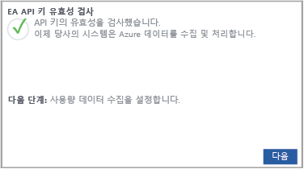

# Azure Enterprise Agreement 등록 및 비용 데이터 보기

Azure Enterprise Agreement를 사용하여 Azure Cost Management에 등록합니다. 등록하면 Cloudyn 포털에 액세스할 수 있습니다. 이 빠른 시작 정보에서는 Cloudyn 평가판 구독을 만들고 Cloudyn 포털에 로그인하는 데 필요한 등록 프로세스를 상세히 설명합니다. 또한 비용 데이터를 즉시 보기 시작하는 방법을 보여줍니다.

## Azure에 로그인

- Azure Portal ( http://portal.azure.com ) 에 로그인합니다.

## Azure Cost Management에 등록

1. Azure Portal의 서비스 목록에서 **Cost Management + 청구**를 클릭합니다.
2. **개요**에서 **Cost Management**를 클릭합니다.  
    
3. **비용 관리** 페이지에서 **비용 관리로 이동**을 선택하여 새 창에 Cloudyn 등록 페이지를 엽니다.
4. Cloudyn 포털 평가판 등록 페이지에서 회사 이름을 입력하고 **Azure Enterprise 등록 관리자**를 선택합니다.  
    
5. 엔터프라이즈 포털 등록 API 키를 입력합니다. 키가 없는 경우 [Enterprise Portal](https://ea.azure.com) 링크를 클릭하고 다음 단계를 수행합니다.
  1. Azure Enterprise 웹 사이트에 로그인하고 **보고서**, **API 액세스 키**를 차례로 클릭한 다음 기본 키를 복사합니다.  
    
  3. 등록 페이지로 돌아가 API 키에 붙여 넣습니다.
6. 사용 약관에 동의한 다음 키의 유효성을 검사합니다. **다음**을 클릭하여 Cloudyn이 Azure 리소스 데이터를 수집할 권한을 부여합니다. 수집되는 데이터에는 구독의 사용량, 성능, 청구 및 태그 데이터가 포함됩니다.  
    
7. **기타 관련자 초대**에서 이메일 주소를 입력하여 사용자를 추가할 수 있습니다. 완료되면 **다음**을 클릭합니다. Azure 등록의 규모에 따라 모든 청구 데이터가 Cloudyn에 추가되는 데 최대 24 시간이 걸릴 수 있습니다.
8. **Cloudyn으로 이동**을 클릭하여 Cloudyn 포털을 연 다음 **클라우드 계정 관리** 페이지에서 등록된 EA 계정 정보를 확인할 수 있습니다.

기업계약을 등록하는 방법에 대한 자습서 비디오를 시청하려면 [Azure Cost Management에서 사용할 EA 등록 ID 및 API 키를 찾는 방법](https://youtu.be/u_phLs_udig)을 참조하세요.

[!INCLUDE [cost-management-create-account-view-data](../../includes/cost-management-create-account-view-data.md)]

## 다음 단계

이 빠른 시작 정보에서는 Azure Enterprise Agreement 정보를 사용하여 비용 관리에 등록했습니다. 또한 Cloudyn 포털에 로그인하여 비용 데이터 보기를 시작했습니다. Azure Cost Management에 대해 자세히 알아보려면 Cost Management의 자습서를 계속 진행하세요.

> [!div class="nextstepaction"]
> [사용량 및 비용 검토](./tutorial-review-usage.md)
