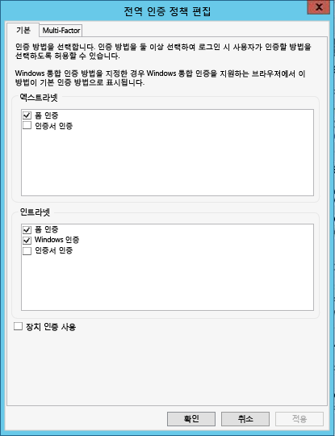
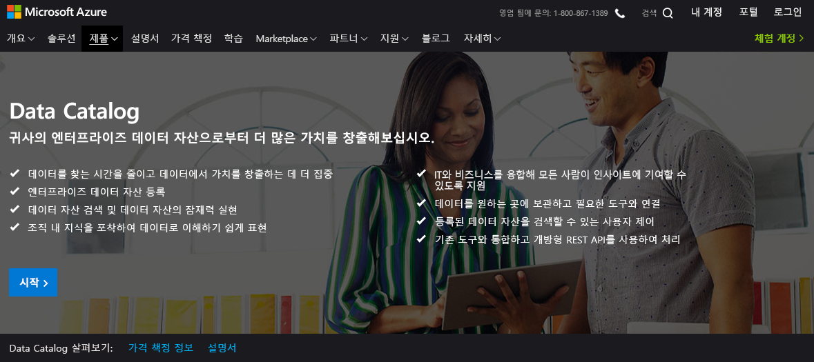
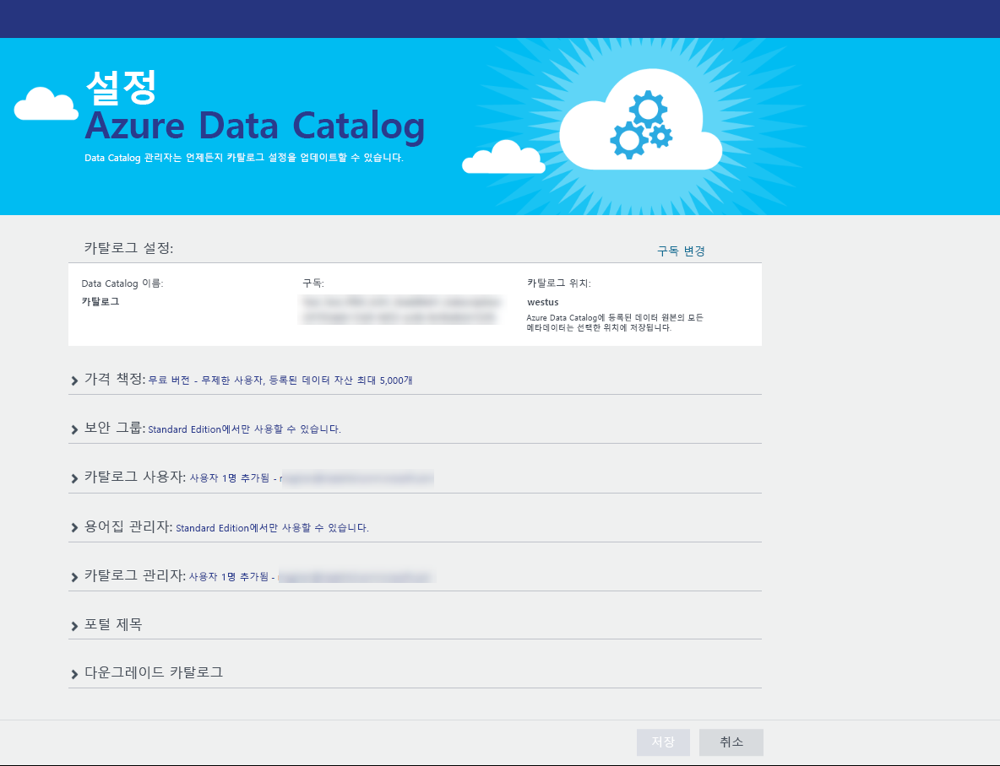
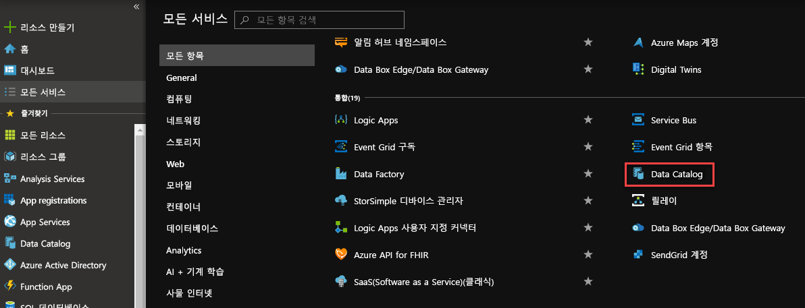
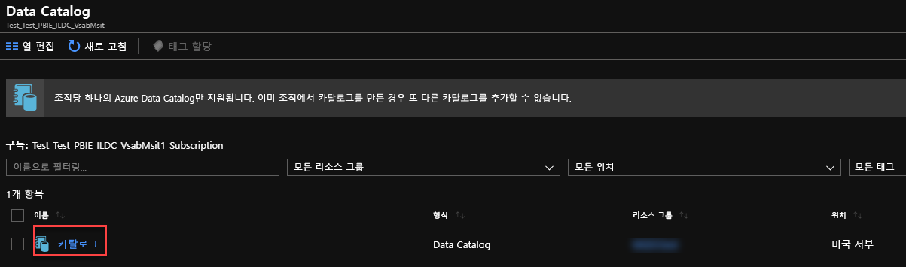
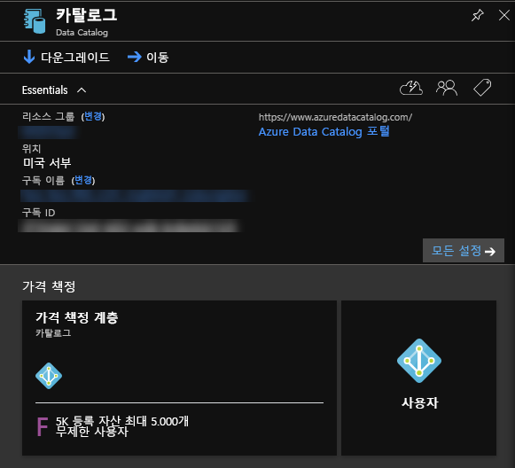
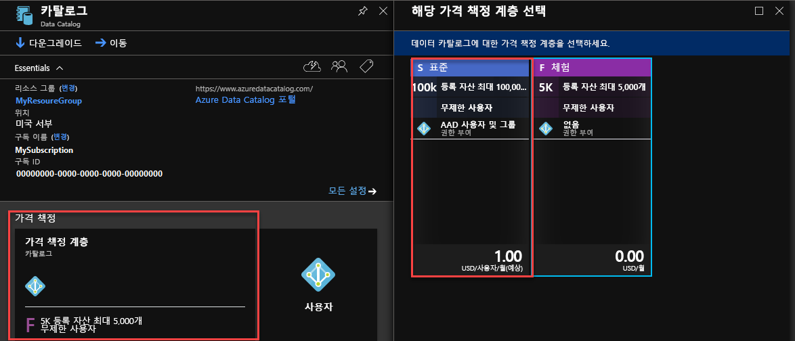

<properties
	pageTitle="데이터 카탈로그 시작 | Microsoft Azure"
	description="Azure Data Catalog의 시나리오 및 기능을 제공하는 종단간 자습서입니다."
	documentationCenter=""
	services="data-catalog"
	authors="steelanddata"
	manager=""
	editor=""
	tags=""/>
<tags
	ms.service="data-catalog"
	ms.devlang="NA"
	ms.topic="get-started-article"
	ms.tgt_pltfrm="NA"
	ms.workload="data-catalog"
	ms.date="09/20/2016"
	ms.author="spelluru"/>

# Azure 데이터 카탈로그 시작
Azure Data Catalog는 기업 데이터 자산의 등록 시스템 및 검색 시스템 역할을 하는 완전히 관리되는 클라우드 서비스입니다. 자세한 개요는 [Azure Data Catalog란](data-catalog-what-is-data-catalog.md)을 참조하세요.

이 자습서는 Azure Data Catalog를 시작하는 데 도움이 됩니다. 이 자습서에서는 다음 절차를 수행합니다.

| 절차 | 설명 |
| :--- | :---------- |
| [데이터 카탈로그 프로비전](#provision-data-catalog) | 이 절차에서는 Azure Data Catalog를 프로비전하거나 설정합니다. 카탈로그를 아직 설정하지 않은 경우에만 이 단계를 수행합니다. Azure 계정과 연결된 여러 구독이 있는 경우라도 조직(Microsoft Azure Active Directory 도메인)당 하나의 데이터 카탈로그만을 사용할 수 있습니다. |
| [데이터 자산 등록](#register-data-assets) | 이 절차에서는 AdventureWorks2014 샘플 데이터베이스의 데이터 자산을 데이터 카탈로그에 등록합니다. 등록의 목적은 데이터 원본에서 이름, 유형 및 위치와 같은 주요 구조적 메타데이터를 추출하고 카탈로그에 메타데이터를 복사하는 것입니다. 데이터 원본 및 데이터 자산은 있는 위치에 유지되지만 메타데이터는 보다 쉽게 검색 및 이해할 수 있도록 카탈로그를 통해 사용됩니다. |
| [데이터 자산 검색](#discover-data-assets) | 이 절차에서는 Azure Data Catalog 포털을 사용하여 이전 단계에서 등록된 데이터 자산을 검색합니다. Azure Data Catalog를 사용하여 데이터 원본이 등록되면 해당 메타데이터는 서비스로 인덱싱되어 사용자가 필요한 데이터를 쉽게 검색할 수 있습니다. |
| [데이터 자산에 주석 추가](#annotate-data-assets) | 이 절차에서는 데이터 자산에 대한 주석(설명, 태그, 설명서, 또는 전문가 같은 정보)을 제공합니다. 이 정보는 데이터 원본에서 추출된 메타데이터를 보완하여 더 많은 사람들에게 데이터 원본을 이해할 수 있도록 합니다. |
| [데이터 자산에 연결](#connect-to-data-assets) | 이 절차에서는 통합 클라이언트 도구(Excel 및 SQL Server 데이터 도구 등)와 통합되지 않은 도구(SQL Server Management Studio)에서 데이터 자산을 엽니다. |
| [데이터 자산 관리](#manage-data-assets) | 이 절차에서는 데이터 자산에 대한 보안을 설정합니다. 데이터 카탈로그는 사용자가 데이터 자체에 액세스할 권한을 주지 않습니다. 데이터 원본의 소유자가 데이터 액세스를 제어합니다.    Data Catalog를 사용하면 데이터 원본을 검색하고 카탈로그에 등록된 원본과 관련된 **메타데이터**를 볼 수 있습니다. 그러나 데이터 원본을 특정 사용자 또는 특정 그룹의 멤버에게만 표시해야 할 상황이 있을 수 있습니다. 이 시나리오의 경우 Data Catalog를 사용하여 카탈로그 내에서 등록된 데이터 자산의 소유권을 가져오고 소유한 자산의 표시 여부를 제어할 수 있습니다. |
| [데이터 자산 제거](#remove-data-assets) | 이 절차에서는 데이터 카탈로그에서 데이터 자산을 제거하는 방법을 알아봅니다. |  

## 자습서 필수 구성 요소

### Azure 구독
Azure Data Catalog를 설정하려면 Azure 구독의 소유자 또는 공동 소유자여야 합니다.

Azure 구독에서는 Azure 데이터 카탈로그와 같은 클라우드 서비스 리소스에 대한 액세스를 구성할 수 있습니다. 리소스 사용을 보고하고, 요금을 청구하고, 지불하는 방식을 제어할 수도 있습니다. 각 구독은 청구 및 지불 설정이 다를 수 있으므로 부서, 프로젝트, 지사 등에 따라 구독 및 계획이 다를 수 있습니다. 모든 클라우드 서비스는 구독에 속하고 Azure 데이터 카탈로그를 설정하기 전에 구독을 보유해야 합니다. 자세한 내용은 [계정, 구독 및 관리 역할 관리](../active-directory/active-directory-how-subscriptions-associated-directory.md)를 참조하세요.

구독이 없는 경우 몇 분 만에 무료 평가판 계정을 만들 수 있습니다. 자세한 내용은 [무료 평가판](https://azure.microsoft.com/pricing/free-trial/)을 참조하세요.

### Azure Active Directory
Azure Data Catalog를 설정하려면 Azure Active Directory(Azure AD) 사용자 계정으로 로그인해야 합니다. Azure 구독의 소유자 또는 공동 소유자여야 합니다.

Azure AD는 클라우드 및 온-프레미스 모두에서 비즈니스가 ID와 액세스를 쉽게 관리하는 방법을 제공합니다. 클라우드 및 온-프레미스 웹 응용 프로그램에 로그인하기 위해 단일 회사 또는 학교 계정을 사용할 수 있습니다. Azure Data Catalog는 로그인 인증에 Azure AD를 사용합니다. 자세히 알아보려면 [Azure Active Directory란](../active-directory/active-directory-whatis.md)을 참조하세요.

### Azure Active Directory 정책 구성

Azure Data Catalog 포털에 로그인할 수 있는 상황이 발생할 수 있지만, 데이터 원본 등록 도구에 로그인을 시도할 때 로그인하지 않도록 하는 오류 메시지가 발생합니다. 이 오류는 회사 네트워크에 있거나 회사 네트워크 외부에서 연결 시 발생할 수 있습니다.

등록 도구가 *폼 인증*을 사용하여 Azure Active Directory에 대한 사용자 로그인의 유효성 검사를 수행합니다. 로그인이 성공하려면 Azure Active Directory 관리자가 *전역 인증 정책*에서 폼 인증을 사용할 수 있도록 해야 합니다.

전역 인증 정책을 사용하면 다음 이미지에 나와 있는 것처럼 인트라넷 및 엑스트라넷 연결에 대해 개별 인증을 사용하도록 설정할 수 있습니다. 연결되어 있는 네트워크에 대해 폼 인증을 사용할 수 없는 경우 로그인 오류가 발생할 수 있습니다.

 

자세한 내용은 [인증 정책 구성](https://technet.microsoft.com/library/dn486781.aspx)을 참조하세요.

## 데이터 카탈로그 프로비전
조직(Azure Active Directory 도메인)당 하나의 데이터 카탈로그만 제공할 수 있습니다. 따라서 이 Azure Active Directory 도메인에 속한 Azure 구독의 소유자 또는 공동 소유자가 이미 카탈로그를 만든 경우 사용자는 여러 Azure 구독이 있어도 카탈로그를 다시 만들 수 없습니다. Azure Active Directory 도메인에서 사용자가 데이터 카탈로그를 만들었는지 여부를 테스트하려면 [Azure Data Catalog 홈 페이지](http://azuredatacatalog.com)로 이동하여 카탈로그가 표시되는지 확인합니다. 카탈로그가 이미 생성된 경우 다음 절차를 건너뛰고 다음 섹션으로 이동합니다.

1. [Data Catalog 서비스 페이지](https://azure.microsoft.com/services/data-catalog)로 이동하고 **시작**을 클릭합니다.

	
2. Azure 구독의 소유자 또는 공동 소유자인 사용자 계정을 사용하여 로그인합니다. 로그인하면 다음 페이지가 표시됩니다.

	
3. 데이터 카탈로그의 **이름**, 사용하려는 **구독** 및 카탈로그의 **위치**를 지정합니다.
4. **가격 책정**을 확장하고 Azure Data Catalog **버전**(무료 및 표준)을 선택합니다. 
5. **카탈로그 사용자**를 확장하고 **추가**를 클릭하여 데이터 카탈로그의 사용자를 추가합니다. 그러면 자동으로 이 그룹에 추가됩니다. 
6. **카탈로그 관리자**를 확장하고 **추가**를 클릭하여 데이터 카탈로그에 추가 관리자를 추가합니다. 그러면 자동으로 이 그룹에 추가됩니다. 
7. **카탈로그 만들기**를 클릭하여 조직의 데이터 카탈로그를 만듭니다. 데이터 카탈로그가 만들어지면 해당 데이터 카탈로그의 홈 페이지가 표시됩니다. 

### Azure 포털에서 데이터 카탈로그 찾기
1. 웹 브라우저의 별도 탭 또는 별도 웹 브라우저 창에서 [Azure Portal](https://portal.azure.com)로 이동하고 이전 단계에서 데이터 카탈로그를 만드는 데 사용한 동일한 계정으로 로그인합니다.
2. **찾아보기**를 선택한 다음 **Data Catalog**를 클릭합니다.

	 만든 데이터 카탈로그가 표시됩니다.

	
4.  만든 카탈로그를 클릭합니다. 포털에서 **Data Catalog** 블레이드가 표시됩니다.

	
5. 데이터 카탈로그의 속성을 보고 업데이트할 수 있습니다. 예를 들어 **가격 책정 계층**을 클릭하고 버전을 변경합니다.

	

### Adventure Works 샘플 데이터베이스
이 자습서에서는 SQL Server 데이터베이스 엔진용 AdventureWorks2014 샘플 데이터베이스에서 데이터 자산(테이블)을 등록하지만 사용자의 역할과 관련된 친밀한 데이터로 작업하는 것을 선호하는 경우 지원되는 모든 데이터 원본을 사용할 수 있습니다. 지원되는 데이터 원본 목록은 [지원되는 데이터 원본](data-catalog-dsr.md)을 참조하세요.

### Adventure Works 2014 OLTP 데이터베이스 설치
Adventure Works 데이터베이스는 제품, 판매 및 구매를 포함하는 가상의 자전거 제조업체(Adventure Works Cycles)에 대한 표준 온라인 트랜잭션 처리 시나리오를 지원합니다. 이 자습서에서는 제품에 대한 정보를 Azure Data Catalog에 등록합니다.

Adventure Works 샘플 데이터베이스를 설치하려면 다음을 수행합니다.

1. CodePlex에서 [Adventure Works 2014 Full Database Backup.zip](https://msftdbprodsamples.codeplex.com/downloads/get/880661)을 다운로드합니다.
2. 컴퓨터에서 데이터베이스를 복원하려면 [SQL Server Management Studio를 사용하여 데이터베이스 백업 복원](http://msdn.microsoft.com/library/ms177429.aspx)의 지침을 따르거나 다음 단계를 따릅니다.
	1. SQL Server Management Studio를 열고 SQL Server 데이터베이스 엔진에 연결합니다.
	2. **데이터베이스**를 마우스 오른쪽 단추로 클릭하고 **데이터베이스 복원**을 클릭합니다.
	3. **데이터베이스 복원** 아래에서 **원본**에 대해 **장치** 옵션을 선택하고 **찾아보기**를 클릭합니다.
	4. **백업 장치 선택** 아래에서 **추가**를 클릭합니다.
	5. **AdventureWorks2014.bak** 파일이 있는 폴더로 이동하여 파일을 선택하고 **확인**을 클릭하여 **백업 파일 찾기** 대화 상자를 닫습니다.
	6. **확인**을 클릭하여 **백업 장치 선택** 대화 상자를 닫습니다.
	7. **확인**을 클릭하여 **데이터베이스 복원** 대화 상자를 닫습니다.

이제 Azure Data Catalog를 사용하여 Adventure Works 샘플 데이터베이스의 데이터 자산을 등록할 수 있습니다.

## 데이터 자산 등록

이 연습에서는 등록 도구를 사용하여 Adventure Works 데이터베이스의 데이터 자산을 카탈로그에 등록합니다. 등록은 데이터 원본 및 포함된 자산에서 이름, 유형 및 위치와 같은 주요 구조적 메타데이터를 추출하고 카탈로그에 메타데이터를 복사하는 과정입니다. 데이터 원본 및 데이터 자산은 있는 위치에 유지되지만 메타데이터는 보다 쉽게 검색 및 이해할 수 있도록 카탈로그를 통해 사용됩니다.

### 데이터 원본 등록

1.	[Azure Data Catalog 홈 페이지](https://azuredatacatalog.com)로 이동하고 **데이터 게시**를 클릭합니다.

    

2.	**응용 프로그램 시작**을 클릭하여 컴퓨터에서 등록 도구를 다운로드, 설치 및 실행합니다.

    

3. **시작** 페이지에서 **로그인**을 클릭하고 자격 증명을 입력합니다.

	

4. **Microsoft Azure Data Catalog** 페이지에서 **SQL Server**와 **다음**을 클릭합니다.

    

5.	**AdventureWorks2014**에 대한 SQL Server 연결 속성을 입력(다음 예제 참조)하고 **연결**을 클릭합니다.

    

6.	데이터 자산의 메타데이터를 등록합니다. 이 예제에서는 AdventureWorks Production 네임스페이스에서 **Production/Product** 개체를 등록합니다.

	1. **서버 계층** 트리에서 **AdventureWorks2014**를 확장하고 **Production**을 클릭합니다.
	2. Ctrl 키를 누른 채 **Product**, **ProductCategory**, **ProductDescription** 및 **ProductPhoto**를 클릭하여 선택합니다.
	3. **선택 항목을 이동시키는 화살표**(**>**)를 클릭합니다. 이 작업으로 인해 선택한 모든 개체가 **등록할 개체** 목록으로 이동합니다.

    	
	4. **미리 보기 포함**을 선택하여 데이터의 스냅숏 미리 보기를 포함하도록 합니다. 스냅숏은 각 테이블에서 최대 20개의 레코드를 포함하고 카탈로그에 복사됩니다.
	5. **데이터 프로필 포함**을 선택하여 데이터 프로필에 대한 개체 통계의 스냅숏을 포함합니다(예: 열에 대한 최소값, 최대값 및 평균값, 행수).
	6. **태그 추가** 필드에 **Adventure Works, cycles**를 입력합니다. 이 작업은 데이터 자산에 대한 검색 태그를 추가합니다. 태그는 사용자가 등록된 데이터 원본을 찾을 수 있는 훌륭한 방법입니다.
	7. 이 데이터에 대한 **전문가**의 이름을 지정합니다(선택 사항).

    	

	8. **등록**을 클릭합니다. Azure 데이터 카탈로그는 선택한 개체를 등록합니다. 이 연습에서는 Adventure Works에서 선택한 개체가 등록됩니다. 등록 도구는 데이터 자산에서 메타데이터를 추출하고 데이터를 Azure Data Catalog 서비스로 복사합니다. 데이터는 현재 상주하는 위치에 남으면서 현재 시스템의 정책 및 관리자의 제어 하에 유지됩니다.

		

	9. 등록된 데이터 원본 개체를 보려면 **포털 보기**를 클릭합니다. Azure Data Catalog 포털의 그리드 보기에서 네 개의 테이블 및 데이터베이스가 모두 표시되는지 확인합니다.

    	

이 연습에서는 Adventure Works 샘플 데이터베이스에서 개체를 등록했으므로 조직 전체의 사용자가 쉽게 검색할 수 있습니다. 다음 연습에서는 등록된 데이터 자산을 검색하는 방법을 배웁니다.

## 데이터 자산 검색
Azure Data Catalog에서 검색은 검색 및 필터링이라는 두 가지 기본 메커니즘을 사용합니다.

검색은 직관적이고 강력하게 설계되어 있습니다. 기본적으로 검색 용어는 사용자가 제공한 주석을 포함하여 카탈로그의 모든 속성과 일치합니다.

필터링은 검색을 보완하도록 설계되었습니다. 전문가, 데이터 원본 유형, 개체 유형 및 태그와 같은 특정 특성을 선택하여 일치하는 데이터 자산을 볼 수 있으며 일치하는 자산으로 검색 결과를 제한할 수 있습니다.

검색 및 필터링 조합을 사용하여 Azure Data Catalog로 등록된 데이터 원본으로 빠르게 이동하여 필요한 데이터 자산을 검색할 수 있습니다.

이 연습에서는 Azure Data Catalog 포털을 사용하여 이전 연습에서 등록한 데이터 자산을 검색합니다. 검색 구문에 대한 자세한 내용은 [Data Catalog Search 구문 참조](https://msdn.microsoft.com/library/azure/mt267594.aspx)를 참조하세요.

다음은 카탈로그에서 데이터 자산을 검색하기 위한 몇 가지 예입니다.

### 기본 검색을 사용하여 데이터 자산 검색
기본 검색을 사용하면 하나 이상의 검색 용어를 사용하여 카탈로그를 검색할 수 있습니다. 결과는 지정된 하나 이상의 용어와 속성에 대해 일치하는 모든 자산입니다.

1. Azure Data Catalog 포털에서 **홈**을 클릭합니다. 웹 브라우저를 닫은 경우 [Azure Data Catalog 홈 페이지](https://www.azuredatacatalog.com)로 이동합니다.
2. 검색 상자에 `cycles`를 입력하고 **ENTER**를 누릅니다.

	
3. 결과에 네 개의 테이블 및 데이터베이스(AdventureWorks2014)가 모두 표시되는지 확인합니다. 다음 이미지와 같이 도구 모음에 있는 단추를 클릭하여 **그리드 보기** 및 **목록 보기** 간을 전환할 수 있습니다. **강조** 옵션이 **켜져** 있기 때문에 검색 키워드가 검색 결과에서 강조 표시됩니다. 검색 결과에서 **페이지당 결과** 수를 지정할 수도 있습니다.

	

	**검색** 패널은 왼쪽에, **속성** 패널은 오른쪽에 있습니다. **검색** 패널에서 검색 조건을 변경하고 결과를 필터링할 수 있습니다. **속성** 패널에는 그리드 또는 목록에서 선택한 개체의 속성이 표시됩니다.

4. 검색 결과에서 **상품**을 클릭합니다. **미리 보기**, **열**, **데이터 프로필** 및 **설명서** 탭을 클릭하거나 화살표를 클릭하여 아래쪽 창을 확장합니다.

	

	**미리 보기** 탭에 **상품** 테이블에 있는 데이터의 미리 보기가 표시됩니다.
5. **열** 탭을 클릭하여 데이터 자산에서 열에 대한 정보(예: **이름** 및 **데이터 형식**)를 찾습니다.
6. **데이터 프로필** 탭을 클릭하여 데이터 자산에서 데이터의 프로파일링(예: 행수, 데이터 크기 또는 열의 최소값)을 확인합니다.
7. 왼쪽에 있는 **필터**를 사용하여 결과를 필터링합니다. 예를 들어 **개체 유형**에 대한 **테이블**을 클릭하면 데이터베이스가 아닌 네 개의 테이블이 표시됩니다.

	

### 속성 범위로 데이터 자산 검색
속성 범위를 지정하면 검색 용어가 지정된 속성과 일치하는 데이터 자산을 검색하는 데 도움이 됩니다.

1. **필터**의 **개체 유형** 아래에 있는 **테이블** 필터를 지웁니다.
2. 검색 상자에 `tags:cycles`를 입력하고 **ENTER**를 누릅니다. 데이터 카탈로그를 검색하는 데 사용할 수 있는 모든 속성에 대해서는 [Data Catalog 검색 구문 참조](https://msdn.microsoft.com/library/azure/mt267594.aspx)를 참조하세요.
3. 결과에 네 개의 테이블 및 데이터베이스(AdventureWorks2014)가 모두 표시되는지 확인합니다.

	

### 검색 저장
1. **현재 검색** 섹션의 **검색** 창에서 검색 이름을 입력하고 **저장**을 클릭합니다.

	
2. 저장한 검색이 **저장된 검색** 아래에 표시되는지 확인합니다.

	
3. 저장된 검색에서 수행할 수 있는 작업 중 하나를 선택합니다(**이름 바꾸기**, **삭제**, **기본값으로 저장** 검색).

	

### 부울 연산자
부울 연산자를 사용하여 검색 범위를 넓히거나 좁힐 수 있습니다.

1. 검색 상자에 `tags:cycles AND objectType:table`를 입력하고 **ENTER**를 누릅니다.
2. 결과에 (데이터베이스가 아닌) 테이블만이 표시되는지 확인합니다.

	

### 괄호로 그룹화
괄호로 그룹화하여 특별히 부울 연산자와 함께 논리적 격리를 수행하도록 쿼리의 일부를 그룹화할 수 있습니다.

1. 검색 상자에 `name:product AND (tags:cycles AND objectType:table)`를 입력하고 **ENTER**를 누릅니다.
2. 검색 결과에 **상품** 테이블만이 표시되는지 확인합니다.

	

### 비교 연산자
비교 연산자를 사용하면 숫자 및 날짜 데이터 유형이 있는 속성에 대한 일치가 아닌 비교를 사용할 수 있습니다.

1. 검색 상자에 `lastRegisteredTime:>"06/09/2016"`를 입력합니다.
2. **개체 유형**에 있는 **테이블** 필터를 지웁니다.
3. **ENTER** 키를 누릅니다.
4. **Product**, **ProductCategory**, **ProductDescription**, **ProductPhoto** 테이블 및 검색 결과에 등록된 AdventureWorks2014 데이터베이스가 표시되는지 확인합니다.

	

데이터 자산을 검색하는 방법에 대한 자세한 내용은 [데이터 자산을 검색하는 방법](data-catalog-how-to-discover.md)을 참조하고 검색 구문은 [Data Catalog Search 구문 참조](https://msdn.microsoft.com/library/azure/mt267594.aspx)를 참조하세요.

## 데이터 자산에 주석 추가
이 연습에서는 Azure Data Catalog 포털을 사용하여 이전에 카탈로그에 등록된 데이터 자산에 주석을 추가(설명, 태그, 전문가 등의 정보)합니다. 주석은 등록하는 동안 데이터 원본에서 추출된 구조적 메타데이터를 보충 및 강화하며 데이터 자산을 보다 쉽게 검색하고 이해할 수 있도록 합니다.

이 연습에서는 단일 데이터 자산(ProductPhoto)에 주석을 지정합니다. ProductPhoto 데이터 자산에 친숙한 이름과 설명을 추가합니다.

1.  [Azure Data Catalog 홈 페이지](https://www.azuredatacatalog.com)로 이동하고 `tags:cycles`로 검색하여 등록한 데이터 자산을 찾습니다.
2. 검색 결과에서 **ProductPhoto**를 클릭합니다.
3. **식별 이름**에 **Product images**를 입력하고 **설명**에 **Product photos for marketing materials**를 입력합니다.

	

	**설명**은 선택한 데이터 자산을 사용하는 이유와 방법을 다른 사람이 검색하고 이해할 수 있도록 합니다. 더 많은 태그를 추가하고 열을 볼 수도 있습니다. 이제 카탈로그에 추가된 설명이 포함된 메타데이터를 사용하여 데이터 자산을 검색하기 위해 검색 및 필터링을 시도할 수 있습니다.

이 페이지에서 다음을 수행할 수도 있습니다.

- 데이터 자산에 대한 전문가를 추가합니다. **전문가** 영역에서 **추가**를 클릭합니다.
- 데이터 집합 수준에 태그를 추가합니다. **태그** 영역에서 **추가**를 클릭합니다. 태그는 사용자 태그 또는 용어집 태그일 수 있습니다. Data Catalog의 표준 버전에는 카탈로그 관리자가 중앙 비즈니스 분류를 정의하는 데 도움이 되는 비즈니스 용어집이 포함되어 있습니다. 그런 다음 카탈로그 사용자는 용어집 용어를 사용하여 데이터 자산에 주석을 추가할 수 있습니다. 자세한 내용은 [관리 태그 지정을 위해 비즈니스 용어집을 설정하는 방법](data-catalog-how-to-business-glossary.md)을 참조하세요.
- 열 수준에 태그를 추가합니다. 주석을 추가할 열의 **태그**에 있는 **추가**를 클릭합니다.
- 열 수준에 설명을 추가합니다. 열에 **설명**을 입력합니다. 데이터 원본에서 추출된 설명 메타데이터를 볼 수도 있습니다.
- 사용자에게 데이터 자산에 대한 액세스를 요청하는 방법을 보여주는 **액세스 요청** 정보를 추가합니다.

	

- **설명서** 탭을 선택하고 데이터 자산에 대한 설명서를 제공합니다. Azure Data Catalog 설명서를 사용하면 데이터 카탈로그를 콘텐츠 리포지토리로 사용하여 데이터 자산의 전체 설명을 만들 수 있습니다.

	

또한 여러 데이터 자산에 주석을 추가할 수도 있습니다. 예를 들어 등록된 데이터 자산을 모두 선택하고 이에 대한 전문가를 지정할 수 있습니다.

Azure Data Catalog는 주석에 대한 크라우드 소싱 접근 방식을 지원합니다. 모든 Azure Data Catalog 사용자가 태그(사용자 또는 용어집), 설명 및 기타 메타데이터를 추가할 수 있기 때문에 데이터 자산 및 사용에 대한 어떤 관점이 있는 사용자라면 누구나 해당 관점을 캡처하여 다른 사용자와 공유할 수 있습니다.

데이터 자산에 주석을 추가하는 방법에 대한 자세한 내용은 [데이터 자산에 주석을 추가하는 방법](data-catalog-how-to-annotate.md)을 참조하세요.

## 데이터 자산에 연결
이 연습에서는 연결 정보를 사용하여 통합 클라이언트 도구(Excel)와 통합되지 않은 도구(SQL Server Management Studio)에서 데이터 자산을 엽니다.

> [AZURE.NOTE] Azure Data Catalog를 통해 실제 데이터 원본에 액세스할 수 있는 것은 아닙니다. 단지 사용자가 더 쉽게 검색하고 이해하는 데 도움이 됩니다. 데이터 원본에 연결할 때 선택한 클라이언트 응용 프로그램은 Windows 자격 증명을 사용하거나 필요에 따라 자격 증명에 대한 메시지를 표시합니다. 이전에 데이터 원본에 대해 액세스가 허용되지 않은 경우 연결하기 전에 액세스가 허용되어야 합니다.

### Excel에서 데이터 자산에 연결

1. 검색 결과에서 **상품**을 선택합니다. 도구 모음에서 **다음으로 열기**를 클릭하고 **Excel**을 클릭합니다.

    
2. 다운로드 팝업 창에서 **열기**를 클릭합니다. 이 환경은 브라우저에 따라 다를 수 있습니다.

	
3. **Microsoft Excel 보안 공지** 창에서 **사용**을 클릭합니다.

	
4. **데이터 가져오기** 대화 상자에서 기본값을 유지하고 **확인**을 클릭합니다.

	
5. 데이터 원본을 Excel에서 봅니다.

    

이 연습에서는 Azure Data Catalog를 사용하여 검색된 데이터 자산에 연결했습니다. Azure Data Catalog 포털에서 **열기** 메뉴에 통합된 클라이언트 응용 프로그램을 사용하여 직접 연결할 수 있습니다. 자산 메타데이터에 포함된 연결 위치 정보를 사용하여 선택한 응용 프로그램과 연결할 수도 있습니다. 예를 들어 SQL Server Management Studio를 사용하여 AdventureWorks2014 데이터베이스에 연결하고 이 자습서에 등록된 데이터 자산의 데이터에 액세스할 수 있습니다.

1. **SQL Server Management Studio**를 엽니다.
2. **서버에 연결** 대화 상자에서 Azure Data Catalog 포털의 **속성** 창에 있는 서버 이름을 입력합니다.
3. 적절한 인증 및 자격 증명을 사용하여 데이터 자산에 액세스합니다. 액세스 권한이 없는 경우 **액세스 요청** 필드의 정보를 사용하여 가져옵니다.

	

**연결 문자열 보기**를 클릭하여 ADF.NET, ODBC 및 OLEDB 연결 문자열을 보고 응용 프로그램에서 사용하기 위해 클립보드로 복사합니다.

## 데이터 자산 관리
이 단계에서는 데이터 자산에 대한 보안을 설정하는 방법을 표시합니다. 데이터 카탈로그는 사용자가 데이터 자체에 액세스할 권한을 주지 않습니다. 데이터 원본의 소유자가 데이터 액세스를 제어합니다.

Data Catalog를 사용하여 데이터 원본을 검색하고 카탈로그에 등록된 원본과 관련된 메타데이터를 볼 수 있습니다. 그러나 데이터 원본을 특정 사용자 또는 특정 그룹의 구성원에게만 표시해야 할 상황이 있을 수 있습니다. 이 시나리오의 경우 Data Catalog를 사용하여 카탈로그 내에서 등록된 데이터 자산의 소유권을 가져온 다음 소유한 자산의 표시 유형을 제어할 수 있습니다.

> [AZURE.NOTE] 이 연습에서 설명하는 관리 기능은 Azure Data Catalog의 무료 버전에서 사용할 수 없으며 표준 버전에서만 사용할 수 있습니다. Azure Data Catalog에서 데이터 자산의 소유권을 가져오고, 공동 소유자를 데이터 자산에 추가하고, 데이터 자산의 표시 유형을 설정할 수 있습니다.

### 데이터 자산 소유권 가져오기 및 표시 유형 제한

1. [Azure Data Catalog 홈 페이지](https://www.azuredatacatalog.com)로 이동합니다. **검색** 텍스트 상자에 `tags:cycles`를 입력하고 **ENTER**를 누릅니다.
2. 결과 목록에서 항목을 클릭하고 도구 모음에서 **소유권 가져오기**를 클릭합니다.
3. **속성** 패널의 **관리** 섹션에서 **소유권 가져오기**를 클릭합니다.

	
4. 표시 유형을 제한하려면 **표시 유형** 섹션에서 **소유자 및 다음 사용자**를 선택하고 **추가**를 클릭합니다. 텍스트 상자에 사용자 전자 메일 주소를 입력하고 **ENTER**를 누릅니다.

    

## 데이터 자산 제거

이 연습에서는 Azure Data Catalog 포털을 사용하여 등록된 데이터 자산에서 미리 보기 데이터를 제거하고 해당 카탈로그에서 데이터 자산을 삭제합니다.

Azure Data Catalog에서 개별 자산을 삭제하거나 여러 자산을 삭제할 수 있습니다.

1. [Azure Data Catalog 홈 페이지](https://www.azuredatacatalog.com)로 이동합니다.
2. **검색** 텍스트 상자에 `tags:cycles`를 입력하고 **ENTER**를 클릭합니다.
3. 결과 목록에서 항목을 선택하고 다음 이미지처럼 도구 모음에 있는 **삭제**를 클릭합니다.

	

	그리드 보기를 사용하는 경우 다음 이미지처럼 확인란은 항목의 왼쪽에 있습니다.

	

	다음 이미지처럼 여러 데이터 자산을 선택하고 삭제할 수도 있습니다.

	

> [AZURE.NOTE] 카탈로그의 기본 동작을 통해 사용자는 모든 데이터 원본을 등록할 수 있으며 등록된 데이터 자산을 삭제할 수 있습니다. Azure Data Catalog의 표준 버전에 포함된 관리 기능은 자산의 소유권을 얻고, 자산을 검색할 수 있는 사람을 제한하며, 자산을 삭제할 수 있는 사람을 제한하는 추가 옵션을 제공합니다.

## 요약

이 자습서에서는 엔터프라이즈 데이터 자산 등록, 주석 추가, 검색, 관리를 비롯하여 Azure Data Catalog의 필수 기능을 살펴보았습니다. 이제 자습서를 완료했습니다. 시작할 시간입니다. 사용자 및 팀이 필요로 하는 데이터 원본을 등록하고, 카탈로그를 사용하도록 동료를 초대하여 시작할 수 있습니다.

## 참조

- [데이터 자산을 등록하는 방법](data-catalog-how-to-register.md)
- [데이터 자산을 검색하는 방법](data-catalog-how-to-discover.md)
- [데이터 자산에 주석을 추가하는 방법](data-catalog-how-to-annotate.md)
- [데이터 자산을 문서화하는 방법](data-catalog-how-to-documentation.md)
- [데이터 자산에 연결하는 방법](data-catalog-how-to-connect.md)
- [데이터 자산을 관리하는 방법](data-catalog-how-to-manage.md)

<!---HONumber=AcomDC_0921_2016-->