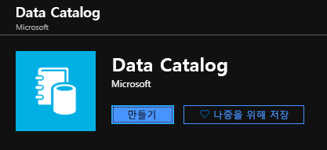
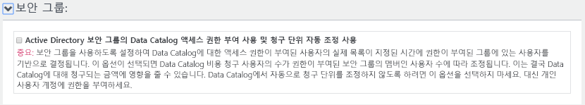
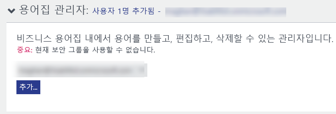
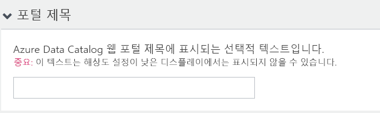

# 빠른 시작: Azure Data Catalog 만들기

Azure Data Catalog는 기업 데이터 자산의 등록 시스템 및 검색 시스템 역할을 하는 완전히 관리되는 클라우드 서비스입니다. 자세한 개요는 [Azure Data Catalog란](overview.md)을 참조하세요.

이 빠른 시작은 Azure Data Catalog 만들기를 시작하는 데 도움이 됩니다.

Azure 구독이 아직 없는 경우 시작하기 전에 [무료 계정](https://azure.microsoft.com/free/?WT.mc_id=A261C142F) 을 만듭니다.

## 필수 조건

시작하려면 다음이 필요합니다.

* [Microsoft Azure](https://azure.microsoft.com/) 구독
* 고유한 [Azure Active Directory 테넌트](../active-directory/fundamentals/active-directory-access-create-new-tenant.md)가 있어야 합니다.

데이터 카탈로그를 설정하려면 Azure 구독의 소유자 또는 공동 소유자여야 합니다.

## 데이터 카탈로그 만들기

조직(Azure Active Directory 도메인)당 하나의 데이터 카탈로그만 제공할 수 있습니다. 따라서 이 Azure Active Directory 도메인에 속한 Azure 구독의 소유자 또는 공동 소유자가 이미 카탈로그를 만든 경우 사용자는 여러 Azure 구독이 있어도 카탈로그를 다시 만들 수 없습니다. Azure Active Directory 도메인에서 사용자가 데이터 카탈로그를 만들었는지 여부를 테스트하려면 [Azure Data Catalog 홈 페이지](http://azuredatacatalog.com) 로 이동하여 카탈로그가 표시되는지 확인합니다. 카탈로그가 이미 생성된 경우 다음 절차를 건너뛰고 다음 섹션으로 이동합니다.

1. [Azure Portal](https://portal.azure.com) > **리소스 만들기**로 이동하고 **Data Catalog**를 선택합니다.

    

2. 데이터 카탈로그의 **이름**, 사용하려는 **구독** 및 카탈로그의 **위치**, **가격 책정 계층**을 지정합니다. 그런 다음 **만들기**를 선택합니다.

3. [Azure Data Catalog 홈 페이지](http://azuredatacatalog.com) 로 이동하고 **데이터 게시**를 클릭합니다.

   

   또한 **시작**을 선택하여 [Data Catalog 서비스 페이지](https://azure.microsoft.com/services/data-catalog)에서 Data Catalog 홈페이지로 이동할 수 있습니다.

   

4. **설정** 페이지로 이동합니다.

    

5. **가격 책정**을 확장하고 Azure Data Catalog **버전**(무료 또는 Standard)을 확인합니다.

    

6. *Standard* 버전을 가격 책정 계층으로 선택할 경우 **보안 그룹**을 확장하고, Active Directory 보안 그룹의 Data Catalog 액세스 권한 부여를 사용하고 청구 단위 자동 조정을 사용할 수 있습니다.

    

7. **카탈로그 사용자**를 확장하고 **추가**를 클릭하여 데이터 카탈로그의 사용자를 추가합니다. 그러면 자동으로 이 그룹에 추가됩니다.

    

8. *Standard* 버전을 가격 책정 계층으로 선택할 경우 **용어집 관리자**를 확장하고 **추가**를 클릭하여 용어집 관리자 사용자를 추가할 수 있습니다. 그러면 자동으로 이 그룹에 추가됩니다.

    

9. **카탈로그 관리자**를 확장하고 **추가**를 클릭하여 데이터 카탈로그에 추가 관리자를 추가합니다. 그러면 자동으로 이 그룹에 추가됩니다.

    

10. **포털 제목**을 확장하고 포털 제목에 표시될 텍스트를 추가합니다.

    

11. **설정** 페이지를 완성했으면 **게시** 페이지로 이동합니다.

    

## Azure 포털에서 데이터 카탈로그 찾기

1. 웹 브라우저의 별도 탭 또는 별도 웹 브라우저 창에서 [Azure Portal](https://portal.azure.com) 로 이동하고 이전 단계에서 데이터 카탈로그를 만드는 데 사용한 동일한 계정으로 로그인합니다.

2. **모든 서비스**를 선택한 다음, **Data Catalog**를 클릭합니다.

    

     만든 데이터 카탈로그가 표시됩니다.

    

3. 만든 카탈로그를 클릭합니다. 포털에서 **Data Catalog** 블레이드가 표시됩니다.

   

4. 데이터 카탈로그의 속성을 보고 업데이트할 수 있습니다. 예를 들어 **가격 책정 계층** 을 클릭하고 버전을 변경합니다.

    

## 다음 단계

이 빠른 시작에서는 조직을 위한 Azure Data Catalog를 만드는 방법을 알아보았습니다. 이제 데이터 카탈로그에서 데이터 원본을 등록할 수 있습니다.

> [!div class="nextstepaction"]
> [Azure Data Catalog에서 데이터 원본 등록](data-catalog-how-to-register.md)
