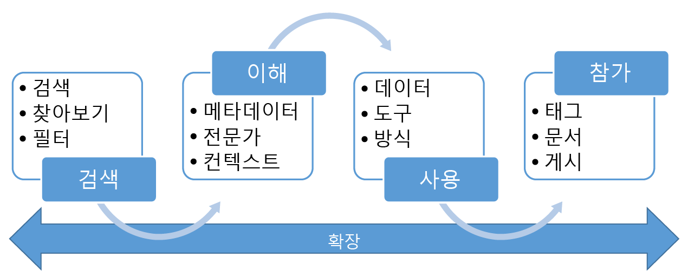

# Azure 데이터 카탈로그란?

Azure Data Catalog는 완전 관리형 클라우드 서비스입니다. 사용자는 필요한 데이터 원본을 검색하고 찾은 데이터 원본을 이해할 수 있습니다. 이와 동시에, 데이터 카탈로그를 통해 조직은 기존 투자에서 더 많은 가치를 창출할 수 있습니다.

데이터 카탈로그를 통해 모든 사용자(분석가, 데이터 과학자 또는 개발자)는 데이터 원본을 검색, 파악 및 사용할 수 있습니다. 데이터 카탈로그에는 메타데이터 및 주석의 크라우드소싱 모델이 포함됩니다. 조직의 모든 사용자가 자신의 지식을 기부하고 데이터의 커뮤니티 및 문화권을 만들 수 있는 단일 중앙 위치입니다.

## 데이터 소비자에 대한 검색 과제

일반적으로 엔터프라이즈 데이터 원본을 검색하는 일은 기초 지식에 기반한 유기적인 프로세스였습니다. 자사의 정보 자산에서 최고의 가치를 얻고자 하는 회사의 경우 이 방법은 수많은 과제를 안겨 줍니다.

* 사용자는 다른 프로세스의 일부로 데이터 원본에 연결되지 않는 한 데이터 원본이 존재한다는 사실을 모를 수도 있습니다. 데이터 원본이 등록되는 중앙 위치가 없습니다.
* 사용자가 데이터 원본의 위치를 모른다면 클라이언트 애플리케이션을 사용하여 데이터에 연결할 수 없습니다. 데이터 사용 환경에서는 사용자가 연결 문자열이나 경로를 알고 있어야 합니다.
* 사용자가 데이터 원본 설명서의 위치를 모른다면 데이터의 의도된 용도를 이해할 수 없습니다. 데이터 원본과 설명서는 다양한 위치에 있으며 다양한 환경을 통해 사용될 수 있습니다.
* 사용자는 정보 자산에 대한 질문이 있으면 해당 데이터를 담당하는 전문가나 팀을 찾아 오프라인으로 참가하도록 해야 합니다. 데이터와 사용법에 대한 견해가 있는 전문가 사이에 명시적 연결은 없습니다.
* 사용자가 데이터 원본에 대한 액세스 권한을 요청하는 프로세스를 이해하지 않는 한, 데이터 원본 및 해당 설명서를 검색해도 필요한 데이터에 액세스할 수 없습니다.

## 데이터 생산자에 대한 검색 과제

데이터 소비자가 이전에 언급한 과제에 직면하고 있지만, 정보 자산의 생성 및 유지 관리를 책임지는 사용자는 자신만의 과제에 직면하고 있습니다.

* 데이터 원본에 설명이 포함된 메타데이터로 주석을 추가하는 것은 종종 시간 낭비입니다. 클라이언트 애플리케이션은 일반적으로 데이터 원본에 저장된 설명을 무시합니다.
* 데이터 원본에 대한 설명서를 만드는 것은 종종 시간 낭비입니다. 문서를 데이터 소스와 동기화된 상태로 유지하는 것은 지속적인 업무입니다. 오래된 것으로 인식되는 문서에 대해서는 사용자의 신뢰가 부족할 수 있습니다.
* 데이터 원본에 대한 설명서 생성 및 유지 관리는 복잡하고 시간 소모적입니다. 이 설명서를 데이터 원본을 사용하는 모든 이가 사용할 수 있도록 만드는 것은 이보다 더 복잡하고 시간 소모적입니다.
* 데이터 원본에 대한 액세스를 제한하고 데이터 소비자에게 액세스를 요청하는 방법을 알고 있는지 확인하는 것이 지속적인 문제입니다.

이 모든 과제가 합쳐지면 엔터프라이즈 데이터의 사용과 이해를 독려 및 홍보하고자 하는 회사에게 큰 장애물이 됩니다.

## Azure Data Catalog는 다음 과제에 도움이 될 수 있습니다.

데이터 카탈로그는 이러한 문제를 해결하고 기업이 기존 정보 자산으로부터 최고의 가치를 얻어낼 수 있도록 설계되었습니다. 데이터 카탈로그는 데이터를 관리하는 사용자가 데이터 원본을 쉽게 검색하고 이해할 수 있게 해줍니다.

데이터 카탈로그는 데이터 원본을 등록할 수 있는 클라우드 기반 서비스를 제공합니다. 데이터는 기존 위치에 그대로 있지만 메타데이터의 복사본과 데이터 원본 위치에 대한 참조가 데이터 카탈로그에 추가됩니다. 메타데이터는 또한 인덱싱되므로 각 데이터 원본의 검색을 통해 쉽게 찾을 수 있으며 검색한 사용자가 이해할 수 있습니다.

데이터 원본이 등록되면 메타데이터를 보강할 수 있습니다. 메타데이터는 메타데이터를 등록한 사용자나 엔터프라이즈의 다른 사용자가 추가할 수 있습니다. 모든 사용자는 설명, 태그 또는 설명서와 데이터 원본 액세스 요청과 같은 기타 메타데이터를 제공하여 데이터 원본에 주석을 달 수 있습니다. 이 설명이 포함된 메타데이터는 데이터 원본으로부터 등록된 구조적 메타데이터(예: 열 이름과 데이터 형식)를 보완합니다.

데이터 원본과 데이터 원본의 용도를 찾고 이해하는 것이 원본을 등록하는 주요 목적입니다. 엔터프라이즈 사용자에게는 비즈니스 인텔리전스, 애플리케이션 개발, 데이터 과학 또는 적절한 데이터를 필요로 하는 기타 모든 작업에 대해 데이터가 필요할 수 있습니다. 데이터 카탈로그 검색 환경을 사용하여 요구에 맞는 데이터를 신속하게 찾고 데이터를 파악하여 용도의 적합성을 평가하고 원하는 도구에서 데이터 원본을 열어 데이터를 사용할 수 있습니다. 

이와 동시에, 사용자는 이미 등록된 데이터 원본에 태그를 지정하고 관련 문서를 작성하며 주석을 추가하여 카탈로그에 기여할 수 있습니다. 또한 새 데이터 원본을 등록하여 카탈로그 사용자 커뮤니티에서 검색, 이해, 사용할 수 있도록 할 수도 있습니다.

## 데이터 카탈로그에 대한 자세한 정보

데이터 카탈로그의 기능에 대한 자세한 내용은 다음을 참조하세요.

* [데이터 원본을 등록하는 방법](data-catalog-how-to-register.md)
* [데이터 원본을 검색하는 방법](data-catalog-how-to-discover.md)
* [데이터 원본에 주석을 추가하는 방법](data-catalog-how-to-annotate.md)
* [데이터 원본을 문서화하는 방법](data-catalog-how-to-documentation.md)
* [데이터 원본에 연결하는 방법](data-catalog-how-to-connect.md)
* [빅 데이터로 작업하는 방법](data-catalog-how-to-big-data.md)
* [데이터 자산을 관리하는 방법](data-catalog-how-to-manage.md)
* [비즈니스 용어집을 설정하는 방법](data-catalog-how-to-business-glossary.md)
* [질문과 대답](data-catalog-frequently-asked-questions.md)

## 다음 단계

Data Catalog 시작:

* [빠른 시작: Azure Data Catalog 만들기](data-catalog-get-started.md)
* [Azure Data Catalog 열기](https://www.azuredatacatalog.com)