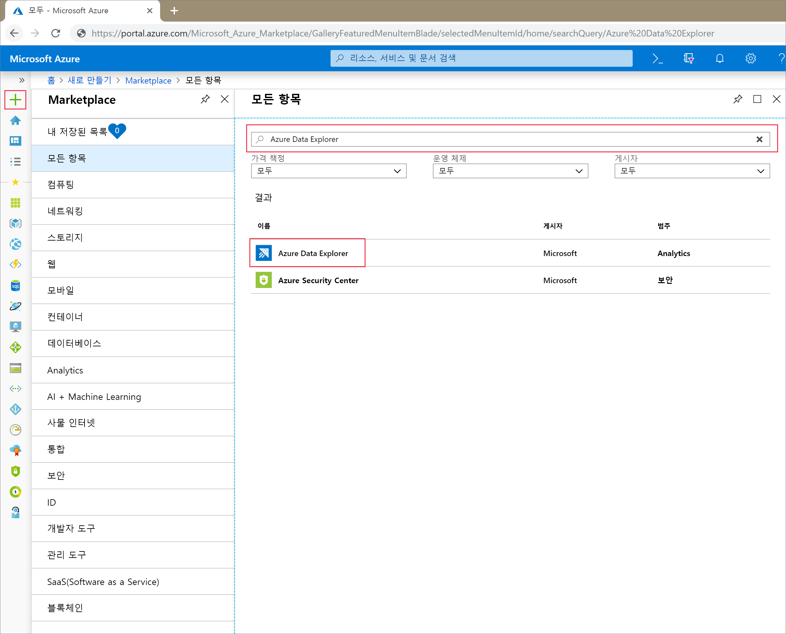
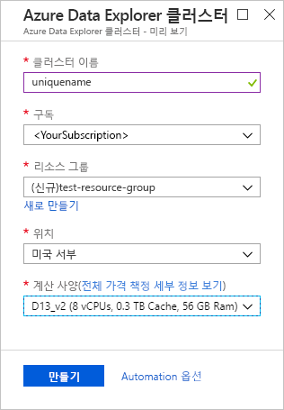
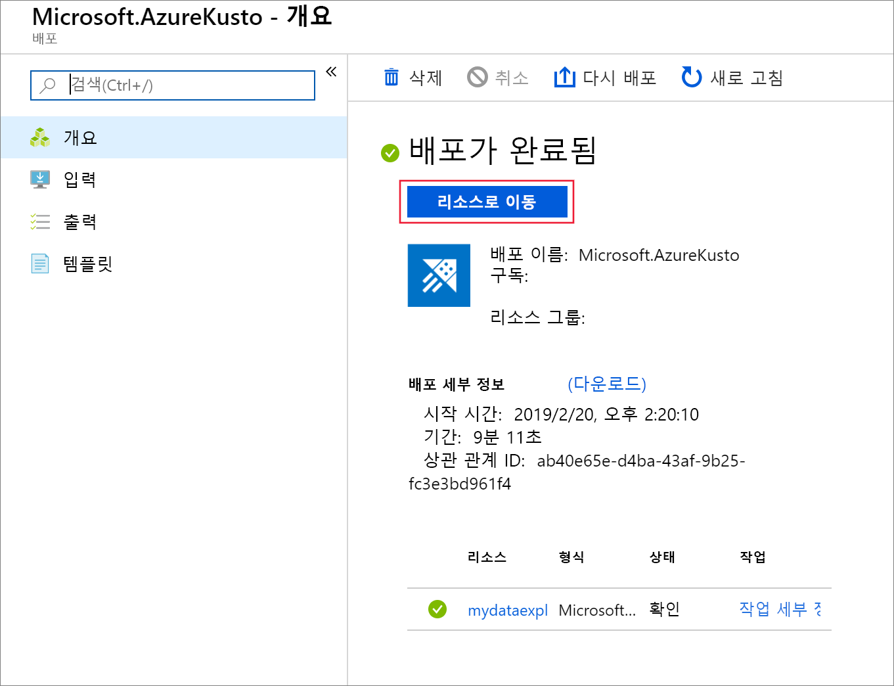
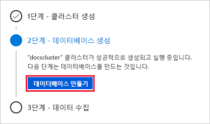
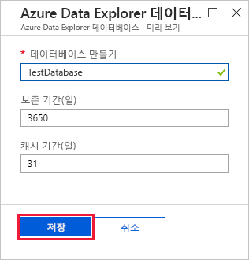
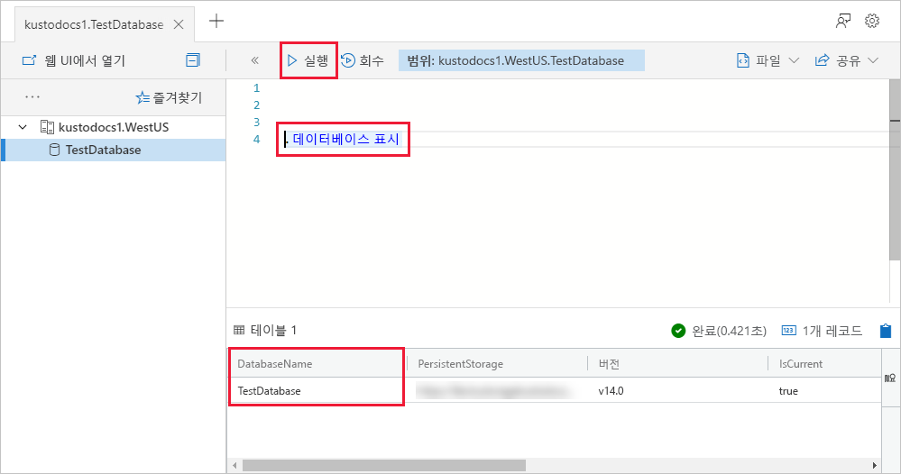

# 빠른 시작: Azure Data Explorer 클러스터 및 데이터베이스 만들기

> [!div class="op_single_selector"]
> * [포털](create-cluster-database-portal.md)
> * [CLI](create-cluster-database-cli.md)
> * [PowerShell](create-cluster-database-powershell.md)
> * [C#](create-cluster-database-csharp.md)
> * [Python](create-cluster-database-python.md)
>  

Azure 데이터 탐색기는 로그 및 원격 분석 데이터에 사용 가능한 빠르고 확장성이 우수한 데이터 탐색 서비스입니다. Azure Data Explorer를 사용하려면 먼저 클러스터를 만들고 이 클러스터에 데이터베이스를 하나 이상 만듭니다. 그런 다음, 데이터베이스에 대해 쿼리를 실행할 수 있도록 데이터베이스에 데이터를 수집(로드)합니다. 이 빠른 시작에서는 클러스터와 데이터베이스를 만듭니다.

Azure 구독이 아직 없는 경우 시작하기 전에 [Azure 체험 계정](https://azure.microsoft.com/free/)을 만듭니다.

## Azure Portal에 로그인

[Azure Portal](https://portal.azure.com/)에 로그인합니다.

## 클러스터 만들기

Azure 리소스 그룹에 컴퓨팅 및 스토리지 리소스 집합이 정의된 Azure Data Explorer 클러스터를 만듭니다.

1. 포털의 왼쪽 상단 모서리에서 **리소스 만들기** 단추(+)를 선택합니다.

1. *Azure 데이터 탐색기*를 검색합니다.

   

1. 화면 하단의 **Azure 데이터 탐색기**에서 **만들기**를 선택합니다.

1. 기본 클러스터 세부 정보를 다음 정보로 작성합니다.

   

    **설정** | **제안 값** | **필드 설명**
    |---|---|---|
    | 구독 | 사용자의 구독 | 클러스터에 사용할 Azure 구독을 선택합니다.|
    | 리소스 그룹 | *test-resource-group* | 기존 리소스 그룹을 사용하거나 새 리소스 그룹을 만듭니다. |
    | 클러스터 이름 | 고유한 클러스터 이름 | 클러스터를 식별하는 고유한 이름을 선택합니다. 예를 들어 *mydataexplorercluster*입니다. 입력한 클러스터 이름에 도메인 이름 *[region].kusto.windows.net*이 추가됩니다. 이름에는 소문자와 숫자만 포함할 수 있습니다. 3~22자를 포함해야 합니다.
    | 위치 | *미국 서부* | 이 빠른 시작에서는 *미국 서부*를 선택합니다. 프로덕션 시스템의 경우 요구에 가장 적합한 지역을 선택합니다.
    | 컴퓨팅 사양 | *D13_v2* | 이 빠른 시작에 가장 낮은 가격 사양을 선택합니다. 프로덕션 시스템의 경우 요구에 가장 적합한 사양을 선택합니다.
    | | |

1. **검토 + 만들기**를 선택하여 클러스터 세부 정보를 검토하고 **만들기**를 선택하여 클러스터를 프로비저닝합니다. 프로비저닝에는 약 10분이 소요됩니다.

1. 배포가 완료되면 **리소스로 이동**을 선택합니다.

    

## 데이터베이스 만들기

이제 프로세스의 두 번째 단계: 데이터 만들기에 대한 준비가 되었습니다.

1. **개요** 탭에서 **데이터베이스 만들기**를 선택합니다.

    

1. 다음 정보로 양식을 작성합니다.

    

    **설정** | **제안 값** | **필드 설명**
    |---|---|---|
    | 데이터베이스 이름 | *TestDatabase* | 데이터베이스 이름은 클러스터 내에서 고유해야 합니다.
    | 보존 기간 | *3650* | 데이터를 쿼리에 사용할 수 있도록 보장되는 시간 범위(일)입니다. 시간 범위는 데이터가 수집된 시간부터 측정됩니다.
    | 캐시 기간 | *31* | 자주 쿼리되는 데이터를 장기 스토리지가 아닌 SSD 스토리지 또는 RAM에 보관할 수 있는 시간 범위(일)입니다.
    | | | |

1. **만들기**를 선택하여 데이터베이스를 만듭니다. 만들기에는 일반적으로 채 1분이 소요되지 않습니다. 프로세스가 완료되면 클러스터 **개요** 탭으로 되돌아갑니다.

## 데이터베이스에 기본 명령 실행

클러스터와 데이터베이스가 있으면 쿼리와 명령을 실행할 수 있습니다. 데이터베이스에 아직 데이터가 없지만 도구가 어떻게 작동하는지는 볼 수 있습니다.

1. 클러스터 아래에서 **쿼리**를 선택합니다. `.show databases` 명령을 쿼리 창에 붙여넣은 다음, **실행**을 선택합니다.

    

    결과 집합에 클러스터의 유일한 데이터베이스인 **TestDatabase**가 표시됩니다.

1. `.show tables` 명령을 쿼리 창에 붙여넣고 **실행**을 선택합니다.

    이 명령은 빈 결과 집합을 반환합니다. 아직 테이블이 없기 때문입니다. 테이블은 이 시리즈의 다음 문서에서 추가합니다.

## 클러스터 중지 및 다시 시작

비즈니스 요구에 따라 클러스터를 중지했다가 다시 시작할 수 있습니다.

1. 클러스터를 중지하려면 **개요** 탭의 맨 위에서 **중지**를 선택합니다.

    클러스터가 중지되면 쿼리에 데이터를 사용할 수 없고 새 데이터를 수집할 수 없습니다.

1. 클러스터를 다시 시작하려면 **개요** 탭의 맨 위에서 **시작**을 선택합니다.

    클러스터가 다시 시작되면 사용할 수 있게 되기까지(원래 프로비저닝된 시점과 같음) 약 10분이 걸립니다. 핫 캐시에 데이터를 로드하는 데 추가 시간이 필요합니다.  

## 리소스 정리

다른 빠른 시작 및 자습서를 진행하려는 경우 만든 리소스를 그대로 둡니다. 그렇지 않은 경우 비용이 발생하지 않도록 리소스 그룹을 정리합니다.

1. Azure Portal에서 맨 왼쪽에 있는 **리소스 그룹**을 선택한 다음, Data Explorer 클러스터가 포함된 리소스 그룹을 선택합니다.  

1. **리소스 그룹 삭제**를 선택하여 전체 리소스 그룹을 삭제합니다. 기존 리소스 그룹을 사용하는 경우 Data Explorer 클러스터만 삭제하도록 선택할 수 있습니다.

## 다음 단계

> [!div class="nextstepaction"]
> [빠른 시작: 이벤트 허브에서 Azure Data Explorer로 데이터 수집](ingest-data-event-hub.md)

