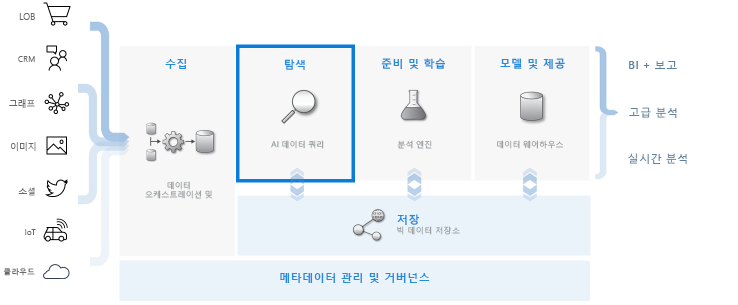
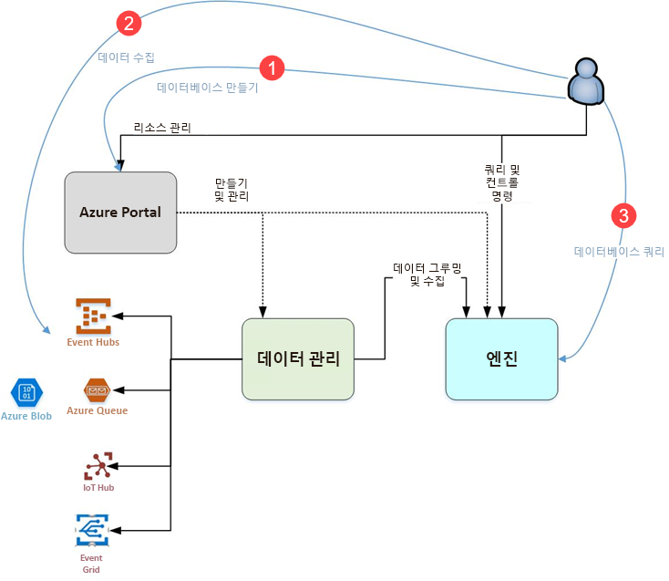

# Azure 데이터 탐색기란?

Azure 데이터 탐색기는 로그 및 원격 분석 데이터에 사용 가능한 빠르고 확장성이 우수한 데이터 탐색 서비스입니다. 최신 소프트웨어에서 생성되는 많은 데이터 스트림을 처리할 수 있으므로 데이터를 수집, 저장 및 분석할 수 있습니다. Azure 데이터 탐색기는 웹 사이트, 애플리케이션, IoT 장치 등과 같은 데이터 원본의 다양한 대규모 데이터를 분석하는 데 적합합니다. 이 데이터는 진단, 모니터링, 보고, 기계 학습 및 추가 분석 기능에 사용됩니다. Azure Data Explorer를 사용하면 이 데이터를 쉽게 수집할 수 있고 데이터에 대한 복잡한 임시 쿼리를 몇 초 안에 수행할 수 있습니다.

## Azure 데이터 탐색기의 특성은 무엇인가요?

- 몇 테라바이트의 데이터까지 신속하게 확장되므로 데이터 탐색을 빠르게 반복하여 관련 통찰력을 검색할 수 있습니다.

- 고성능 데이터 분석에 최적화된 혁신적인 쿼리 언어를 제공합니다.

- 대규모 다른 유형의 데이터(구조적 및 비구조적)에 대한 분석을 지원합니다.

- 포괄적이고 강력한 대화형 데이터 분석 솔루션을 제공하기 위해 다른 서비스와 결합하여 필요한 항목을 정확하게 빌드 및 배포하는 기능을 제공합니다.

## 데이터 웨어하우징 워크플로

Azure 데이터 탐색기는 다른 주요 서비스와 통합되어 데이터 수집, 수집, 저장, 인덱싱, 쿼리 및 시각화를 포함하는 엔드투엔드 솔루션을 제공합니다. 몇 테라바이트의 다양한 원시 데이터에서 흐름의 **EXPLORE** 단계를 실행하여 데이터 웨어하우징 흐름에서 중심 역할을 수행합니다.

Azure 데이터 탐색기는 Event Hub 같은 일반 서비스에 대한 커넥터, SDK(예: .NET 및 Python)를 사용한 프로그래밍 방식 수집 및 탐색을 위한 엔진 직접 액세스를 비롯하여 여러 가지 수집 방법을 지원합니다. Azure 데이터 탐색기는 데이터의 추가 분석 및 시각화를 위해 분석 및 모델링 서비스와 통합됩니다.

## Azure 데이터 탐색기 흐름

다음 다이어그램은 Azure 데이터 탐색기 작업의 다양한 측면을 보여 줍니다.

Azure 데이터 탐색기의 작업은 일반적으로 다음 패턴을 따릅니다.

1. **데이터베이스 만들기:** ‘클러스터’를 만들고 해당 클러스터에서 하나 이상의 ‘데이터베이스’를 만듭니다.   [빠른 시작: Azure Data Explorer 클러스터 및 데이터베이스 만들기](create-cluster-database-portal.md)

1. **데이터 수집:** 쿼리를 실행할 수 있도록 데이터를 데이터베이스 테이블에 로드합니다. [빠른 시작: 이벤트 허브에서 Azure Data Explorer로 데이터 수집](ingest-data-event-hub.md)

1. **데이터베이스 쿼리:** 웹 애플리케이션을 사용하여 쿼리를 실행하고 결과를 검토 및 공유합니다. Azure Portal에서 사용하거나 독립 실행형 애플리케이션으로 사용할 수 있습니다. 또한 쿼리를 프로그래밍 방식으로(SDK 사용) 또는 REST API 엔드포인트로 보낼 수 있습니다. [빠른 시작: Azure Data Explorer에서 데이터 쿼리](web-query-data.md)

## 쿼리 환경

Azure 데이터 탐색기의 쿼리는 데이터나 메타데이터를 수정하지 않고도 데이터를 처리하고 이 처리 결과를 반환하는 읽기 전용 요청입니다. 분석을 완료할 때까지 쿼리를 계속 구체화합니다. Azure Data Explorer를 사용하면 매우 빠른 임시 쿼리 환경 덕분에 이 프로세스가 간편해집니다.

Azure 데이터 탐색기는 대용량의 구조적, 반구조적(JSON 같은 중첩 형식) 및 비구조적(자유 텍스트) 데이터를 동일하게 처리합니다. 이를 통해 특정 텍스트 용어를 검색하고, 특정 이벤트를 찾고, 구조적 데이터에서 메트릭 스타일 계산을 수행할 수 있습니다. Azure 데이터 탐색기는 런타임에 자유 형식 텍스트 필드에서 값을 추출하여 비구조적 텍스트 로그 및 구조적 숫자와 차원으로 이루어진 환경을 연결합니다. 빠른 텍스트 인덱싱, 열 저장소 및 시계열 작업을 결합하여 데이터 탐색을 단순화합니다.

Azure Data Explorer 기능은 [Azure Monitor 로그](/azure/log-analytics/), [Application Insights](/azure/application-insights/), [Time Series Insights](/azure/time-series-insights/) 및 [Windows Defender Advanced Threat Protection](/windows/security/threat-protection/windows-defender-atp/windows-defender-advanced-threat-protection/)을 비롯한 강력한 쿼리 언어를 기반으로 빌드된 다른 서비스에 의해 확장됩니다.

## 사용자 의견

Azure 데이터 탐색기 및 해당 쿼리 언어에 대한 사용자 의견을 보내 주세요.

- 질문하기
  - [스택 오버플로](https://stackoverflow.com/questions/tagged/azure-data-explorer)
  - [Microsoft 기술 커뮤니티](https://techcommunity.microsoft.com/t5/Azure-Data-Explorer/bd-p/Kusto)
  - [MSDN](https://social.msdn.microsoft.com/Forums/en-US/home?forum=AzureKusto)
- [사용자 의견을 통해 제품 제안하기](https://aka.ms/AzureDataExplorer.UserVoice)

## 다음 단계

[빠른 시작: Azure Data Explorer 클러스터 및 데이터베이스 만들기](create-cluster-database-portal.md)

[빠른 시작: 이벤트 허브에서 Azure Data Explorer로 데이터 수집](ingest-data-event-hub.md)

[빠른 시작: Azure Data Explorer에서 데이터 쿼리](web-query-data.md)
