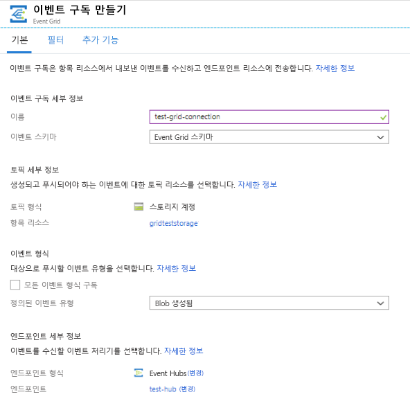
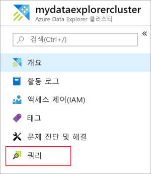
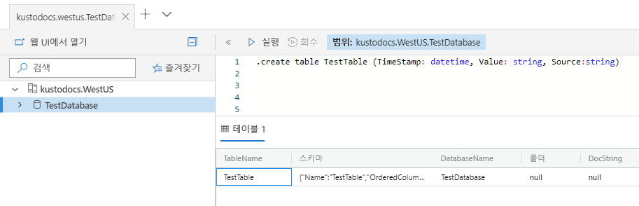
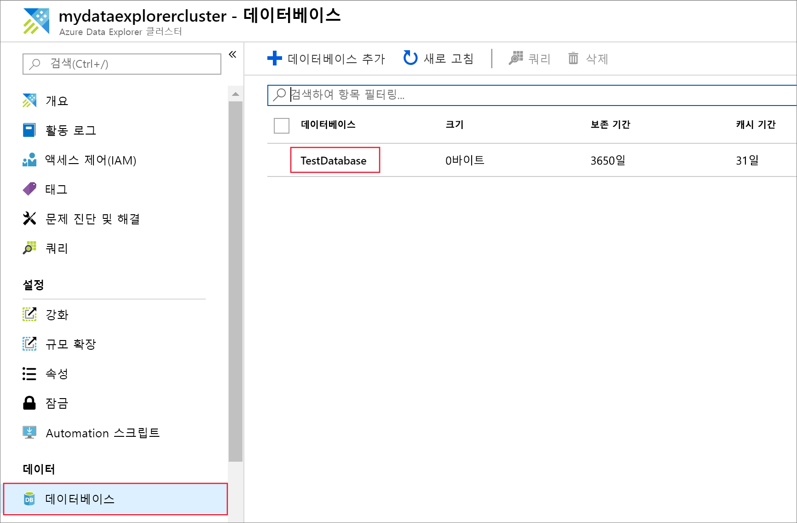
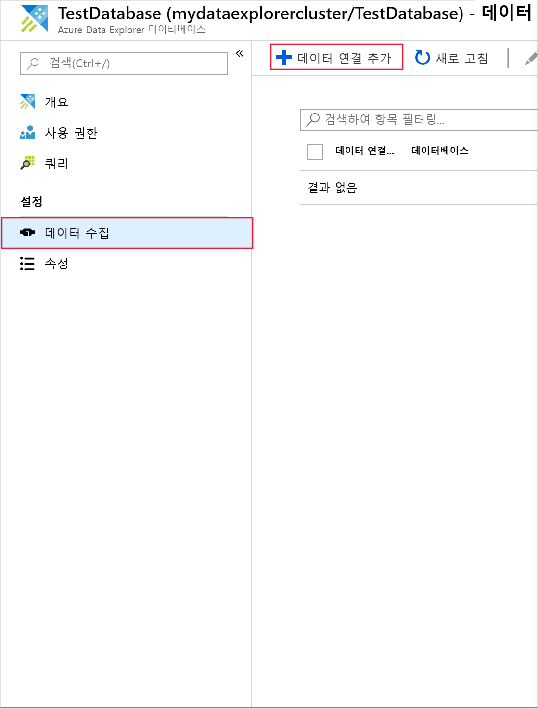
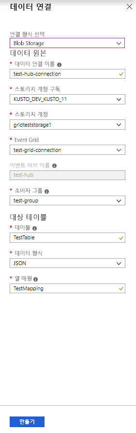
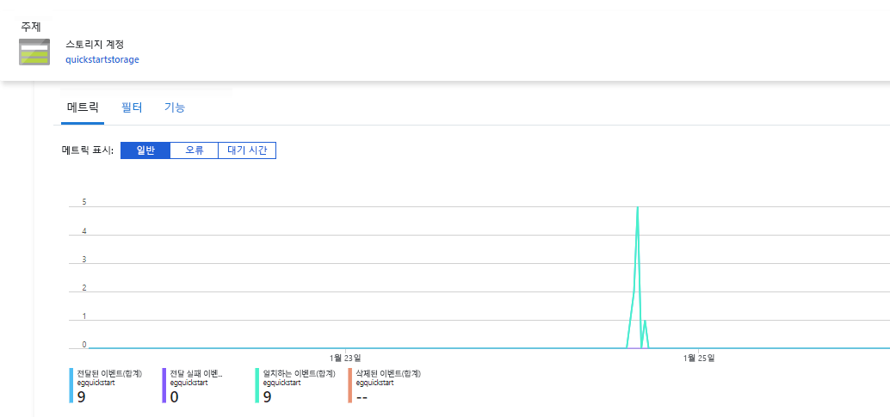
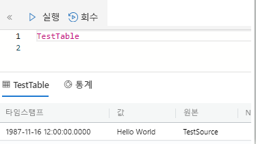
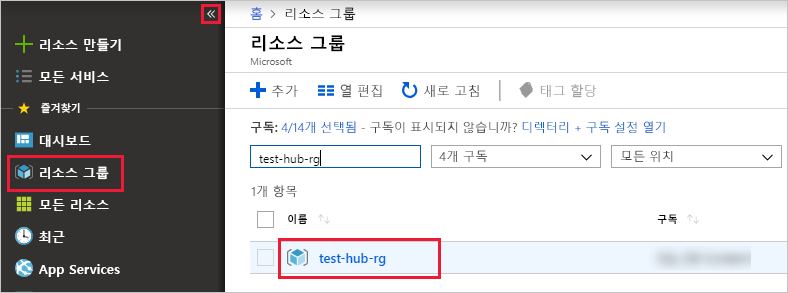

# <a name="ingest-blobs-into-azure-data-explorer-by-subscribing-to-event-grid-notifications"></a>Event Grid 알림을 구독하여 Azure Data Explorer에 Blob 수집

Azure Data Explorer는 로그 및 원격 분석 데이터에 사용 가능한 빠르고 확장이 가능한 데이터 탐색 서비스로서, Blob 컨테이너에 기록된 Blob에서 지속적인 수집(데이터 로딩)을 제공합니다. 

이 문서에서는 설정 하는 방법을 알아봅니다는 [Azure Event Grid](/azure/event-grid/overview) 구독 및 이벤트 허브를 통해 Azure 데이터 탐색기로 경로 이벤트입니다. 시작하려면 Azure Event Hubs로 알림을 전송하는 이벤트 구독이 있는 스토리지 계정이 있어야 합니다. 그런 다음, Event Grid 데이터 연결을 만들어서 시스템 전반의 데이터 흐름을 볼 수 있습니다.

## <a name="prerequisites"></a>필수 조건

* Azure 구독. [평가판 Azure 계정](https://azure.microsoft.com/free/)을 만듭니다.
* [클러스터 및 데이터베이스](create-cluster-database-portal.md)
* [스토리지 계정](https://docs.microsoft.com/azure/storage/common/storage-quickstart-create-account?tabs=azure-portal)
* [이벤트 허브](https://docs.microsoft.com/azure/event-hubs/event-hubs-create)

## <a name="create-an-event-grid-subscription-in-your-storage-account"></a>스토리지 계정에 Event Grid 구독 만들기

1. Azure Portal에서 스토리지 계정을 찾습니다.
1. **이벤트** > **이벤트 구독**을 선택합니다.

    

1. **기본** 탭의 **이벤트 구독 만들기** 창에 다음 값을 제공합니다.

    **설정** | **제안 값** | **필드 설명**
    |---|---|---|
    | 이름 | *test-grid-connection* | 만들려는 Event Grid의 이름입니다.|
    | 이벤트 스키마 | *Event Grid 스키마* | Event Grid에 사용해야 하는 스키마입니다. |
    | 항목 종류 | *저장소 계정* | Event Grid 항목의 종류입니다. |
    | 항목 리소스 | *gridteststorage* | 사용자 스토리지 계정의 이름입니다. |
    | 모든 이벤트 형식 구독 | *clear* | 모든 이벤트에 대한 알림을 받지 않습니다. |
    | 정의된 이벤트 유형 | *만든 Blob* | 알림을 받을 특정 이벤트 |
    | 엔드포인트 유형 | *Event Hubs* | 이벤트를 보낼 엔드포인트 유형 |
    | 엔드포인트 | *test-hub* | 앞에서 만든 이벤트 허브입니다. |
    | | |

1. 특정 컨테이너의 파일을 추적하려면 **추가 기능** 탭을 선택합니다. 알림에 대한 필터를 다음과 같이 설정합니다.
    * **제목 시작 문자** 필드는 Blob 컨테이너의 *리터럴* 접두사입니다. 적용된 패턴이 *startswith*이므로, 여러 컨테이너를 포함할 수 있습니다. 와일드카드는 허용되지 않습니다.
     다음과 같이 *설정해야 합니다*. *`/blobServices/default/containers/`* [컨테이너 접두사]
    * **제목 종료 문자** 필드는 Blob의 *리터럴* 접미사입니다. 와일드카드는 허용되지 않습니다.

## <a name="create-a-target-table-in-azure-data-explorer"></a>Azure 데이터 탐색기에서 대상 테이블 만들기

Azure Data Explorer에서 Event Hubs가 데이터를 보낼 테이블을 만듭니다. 필수 구성 요소에서 준비한 클러스터와 데이터베이스에서 테이블을 만듭니다.

1. Azure Portal의 클러스터 아래에서 **쿼리**를 선택합니다.

    

1. 다음 명령을 창에 복사하고, **실행**을 선택하여 수집된 데이터를 받을 테이블(TestTable)을 만듭니다.

    ```Kusto
    .create table TestTable (TimeStamp: datetime, Value: string, Source:string)
    ```

    

1. 다음 명령을 창에 복사하고, **실행**을 선택하여 들어오는 JSON 데이터를 테이블(TestTable)의 열 이름과 데이터 형식에 매핑합니다.

    ```Kusto
    .create table TestTable ingestion json mapping 'TestMapping' '[{"column":"TimeStamp","path":"$.TimeStamp"},{"column":"Value","path":"$.Value"},{"column":"Source","path":"$.Source"}]'
    ```

## <a name="create-an-event-grid-data-connection-in-azure-data-explorer"></a>Azure Event Grid에서 Event Grid 데이터 연결 만들기

이제 Azure Data Explorer에서 Event Grid에 연결합니다. 그러면 Blob 컨테이너로 유입되는 데이터가 테스트 테이블로 스트리밍됩니다.

1. 도구 모음에서 **알림**을 선택하여 이벤트 허브 배포가 정상적으로 완료되었는지 확인합니다.

1. 앞에서 만든 클러스터 아래에서 **데이터베이스** > **TestDatabase**를 차례로 선택합니다.

    

1. **데이터 수집** > **데이터 연결 추가**를 선택합니다.

    

1.  연결 형식을 선택합니다. **Blob Storage**

1. 다음 정보로 양식을 작성하고 **만들기**를 선택합니다.

    

     데이터 원본:

    **설정** | **제안 값** | **필드 설명**
    |---|---|---|
    | 데이터 연결 이름 | *test-hub-connection* | Azure Data Explorer에서 만들 연결의 이름입니다.|
    | 스토리지 계정 구독 | 구독 ID | 스토리지 계정이 있는 구독 ID입니다.|
    | Storage 계정 | *gridteststorage* | 이전에 만든 스토리지 계정의 이름입니다.|
    | Event Grid | *test-grid-connection* | 만든 Event Grid의 이름입니다. |
    | 이벤트 허브 이름 | *test-hub* | 만든 이벤트 허브입니다. 이 필드는 Event Grid를 선택하며 자동으로 채워집니다. |
    | 소비자 그룹 | *test-group* | 만든 이벤트 허브에 정의된 소비자 그룹입니다. |
    | | |

    대상 테이블:

     **설정** | **제안 값** | **필드 설명**
    |---|---|---|
    | 테이블 | *TestTable* | **TestDatabase**에 만든 테이블입니다. |
    | 데이터 형식 | *JSON* | 지원되는 형식은 Avro, CSV, JSON, MULTILINE JSON, PSV, SOH, SCSV, TSV 및 TXT입니다. |
    | 열 매핑 | *TestMapping* | **TestDatabase**에서 생성된 것으로, 들어오는 JSON 데이터를 **TestTable**의 열 이름 및 데이터 형식에 매핑.|
    | | |

## <a name="generate-sample-data"></a>샘플 데이터 생성

Azure Data Explorer와 스토리지 계정이 연결되었으면 샘플 데이터를 만들어서 Blob Storage에 업로드할 수 있습니다.

Azure Storage 리소스와 상호 작용하는 몇 가지 기본 Azure CLI 명령을 발급하는 작은 셸 스크립트를 사용합니다. 이 스크립트는 스토리지 계정에 새 컨테이너를 만들고, 해당 컨테이너에 기존 파일(Blob)을 업로드한 다음, 컨테이너의 Blob을 나열합니다. [Azure Cloud Shell](https://docs.microsoft.com/azure/cloud-shell/overview)을 사용하여 포털에서 직접 스크립트를 실행할 수 있습니다.

파일에 데이터를 저장하고 이 스크립트를 사용하여 업로드합니다.

```Json
{"TimeStamp": "1987-11-16 12:00","Value": "Hello World","Source": "TestSource"}
```

```bash
#!/bin/bash
### A simple Azure Storage example script

    export AZURE_STORAGE_ACCOUNT=<storage_account_name>
    export AZURE_STORAGE_KEY=<storage_account_key>

    export container_name=<container_name>
    export blob_name=<blob_name>
    export file_to_upload=<file_to_upload>
    export destination_file=<destination_file>

    echo "Creating the container..."
    az storage container create --name $container_name

    echo "Uploading the file..."
    az storage blob upload --container-name $container_name --file $file_to_upload --name $blob_name

    echo "Listing the blobs..."
    az storage blob list --container-name $container_name --output table

    echo "Done"
```

## <a name="review-the-data-flow"></a>데이터 흐름 검토

> [!NOTE]
> Azure Data Explorer에는 데이터 수집을 위한 집계(일괄 처리) 정책이 있으며, 이는 수집 프로세스를 최적화하도록 설계되었습니다.
기본적으로 정책은 5 분으로 구성됩니다.
정책은 나중에 필요에 따라 변경할 수 있습니다. 이 문서는 몇 분 정도 대기 시간을 예상할 수 있습니다.

1. Azure Portal의 Event Grid에서 앱이 실행되는 동안 작업이 급증하는 것을 볼 수 있습니다.

    

1. 현재까지 데이터베이스로 전송된 메시지의 수를 확인하려면 테스트 데이터베이스에서 다음 쿼리를 실행합니다.

    ```Kusto
    TestTable
    | count
    ```

1. 메시지 내용을 확인하려면 테스트 데이터베이스에서 다음 쿼리를 실행합니다.

    ```Kusto
    TestTable
    ```

    결과 집합은 다음과 같이 표시됩니다.

    

## <a name="clean-up-resources"></a>리소스 정리

Event Grid를 다시 사용하지 않으려는 경우, 비용이 발생하지 않도록 **test-hub-rg**를 정리합니다.

1. Azure Portal에서 맨 왼쪽에 있는 **리소스 그룹**을 선택한 다음, 만든 리소스 그룹을 선택합니다.  

    왼쪽 메뉴가 접혀 있으면 ![[확장] 단추를](media/ingest-data-event-grid/expand.png) 클릭하여 펼칩니다.

   

1. **test-resource-group** 아래에서 **리소스 그룹 삭제**를 선택합니다.

1. 새 창에서 삭제할 리소스 그룹의 이름(*test-hub-rg*)을 입력하고 **삭제**를 선택합니다.

## <a name="next-steps"></a>다음 단계

* [Azure 데이터 탐색기에서 데이터를 쿼리 합니다.](web-query-data.md)
