# <a name="ingest-data-from-event-hub-into-azure-data-explorer"></a>Event Hub에서 Azure Data Explorer로 데이터 수집

Azure 데이터 탐색기는 로그 및 원격 분석 데이터에 사용 가능한 빠르고 확장성이 우수한 데이터 탐색 서비스입니다. Azure 데이터 탐색기에서는 빅 데이스트리터 밍 플랫폼이자 이벤트 수집 서비스인 이벤트 허브에서 데이터를 수집(로드)하는 기능을 제공합니다. [Event Hubs](/azure/event-hubs/event-hubs-about)에서는 초당 수백만 개의 이벤트를 거의 실시간으로 처리할 수 있습니다. 이 문서에서는 이벤트 허브 만들기, Azure Data Explorer 및 시스템을 통해 참조 데이터 흐름에서 연결 합니다.

## <a name="prerequisites"></a>필수 조건

* Azure 구독이 아직 없는 경우 시작하기 전에 [Azure 체험 계정](https://azure.microsoft.com/free/)을 만듭니다.

* [테스트 클러스터 및 데이터베이스](create-cluster-database-portal.md).

* 데이터를 생성하고 이벤트 허브로 보내는 [샘플 앱](https://github.com/Azure-Samples/event-hubs-dotnet-ingest)이 있어야 합니다. 샘플 앱을 시스템에 다운로드하세요.

* 샘플 앱을 실행하기 위한 [Visual Studio 2019](https://visualstudio.microsoft.com/vs/).

## <a name="sign-in-to-the-azure-portal"></a>Azure Portal에 로그인

[Azure Portal](https://portal.azure.com/)에 로그인합니다.

## <a name="create-an-event-hub"></a>이벤트 허브 만들기

이 문서에서는 샘플 데이터를 생성 하 고 이벤트 허브로 전송 합니다. 첫 단계에서는 이벤트 허브를 만듭니다. 이렇게 하려면 Azure Portal에서 Azure Resource Manager 템플릿을 사용합니다.

1. 이벤트 허브를 만들려면 다음 단추를 사용하여 배포를 시작합니다. 마우스 오른쪽 단추로 클릭하고 **새 창에서 열기**를 선택하면 이 문서의 나머지 단계를 수행할 수 있습니다.

    [](https://portal.azure.com/#create/Microsoft.Template/uri/https%3A%2F%2Fraw.githubusercontent.com%2FAzure%2Fazure-quickstarts-templates%2Fmaster%2F201-event-hubs-create-event-hub-and-consumer-group%2Fazuredeploy.json)

    **Azure에 배포** 단추를 선택하면 Azure Portal에서 배포 양식을 작성할 수 있는 페이지로 이동하게 됩니다.

    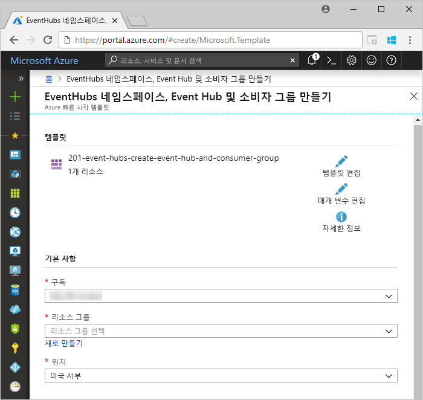

1. 이벤트 허브를 만들려는 구독을 선택하고 이름이 *test-hub-rg*인 리소스 그룹을 만듭니다.

    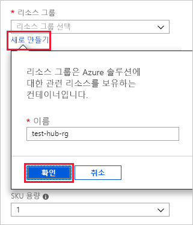

1. 다음 정보로 양식을 작성합니다.

    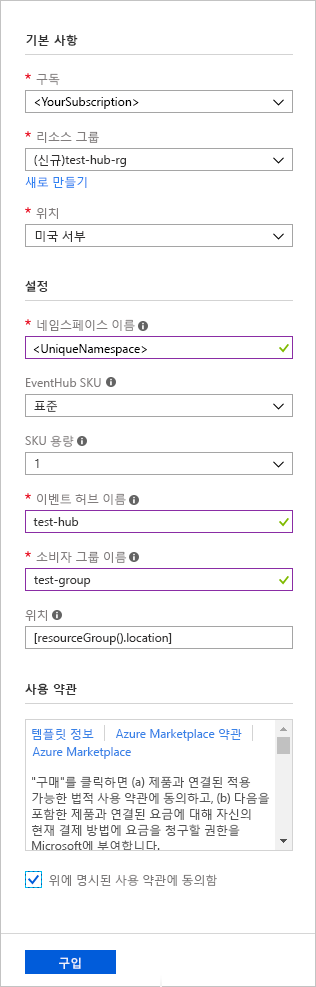

    다음 표에 나와 있지 않은 모든 설정에는 기본값을 사용하세요.

    **설정** | **제안 값** | **필드 설명**
    |---|---|---|
    | 구독 | 사용자의 구독 | 이벤트 허브에 사용할 Azure 구독을 선택합니다.|
    | 리소스 그룹 | *test-hub-rg* | 새 리소스 그룹을 만듭니다. |
    | 위치 | *미국 서부* | 선택 *미국 서 부* 이 문서에 대 한 합니다. 프로덕션 시스템의 경우 요구에 가장 적합한 지역을 선택합니다. 최상의 성능을 위해 Kusto 클러스터와 동일한 위치에 Event Hub 네임스페이스를 만듭니다(처리량이 높은 Event Hub 네임스페이스에 가장 중요).
    | 네임스페이스 이름 | 고유한 네임스페이스 이름 | 네임스페이스를 식별하는 고유한 이름을 선택합니다. 예를 들어 *mytestnamespace*를 선택합니다. 입력한 이름에 도메인 이름 *servicebus.windows.net*이 추가됩니다. 이 이름에는 문자, 숫자 및 하이픈만 포함할 수 있습니다. 이름은 문자로 시작하고 문자나 숫자로 끝나야 합니다. 값의 길이는 6자에서 50자 사이여야 합니다.
    | 이벤트 허브 이름 | *test-hub* | 이벤트 허브는 고유한 범위 지정 컨테이너 역할을 하는 네임스페이스 아래에 배치됩니다. 이벤트 허브 이름은 네임스페이스 내에서 고유해야 합니다. |
    | 소비자 그룹 이름 | *test-group* | 소비자 그룹을 사용하면 각기 별도의 이벤트 스트림 보기가 표시되는 여러 애플리케이션을 사용할 수 있습니다. |
    | | |

1. **구매**를 선택하면 구독에서 리소스 만들기를 승인하게 됩니다.

1. 프로비전 프로세스를 모니터링하려면 도구 모음에서 **알림**을 선택합니다. 배포가 정상적으로 완료되려면 몇 분 정도 걸릴 수 있지만 이제 다음 단계를 진행해도 됩니다.

    

## <a name="create-a-target-table-in-azure-data-explorer"></a>Azure 데이터 탐색기에서 대상 테이블 만들기

이제 Azure 데이터 탐색기에서 테이블을 만듭니다. 이벤트 허브는 이 테이블로 데이터를 보냅니다. **필수 구성 요소**에서 프로비전했던 클러스터와 데이터베이스에서 테이블을 만듭니다.

1. Azure Portal에서 클러스터로 이동한 후 **쿼리**를 선택합니다.

    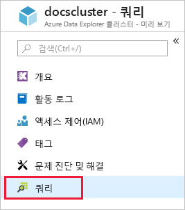

1. 다음 명령을 창에 복사하고, **실행**을 선택하여 수집된 데이터를 받을 테이블(TestTable)을 만듭니다.

    ```Kusto
    .create table TestTable (TimeStamp: datetime, Name: string, Metric: int, Source:string)
    ```

    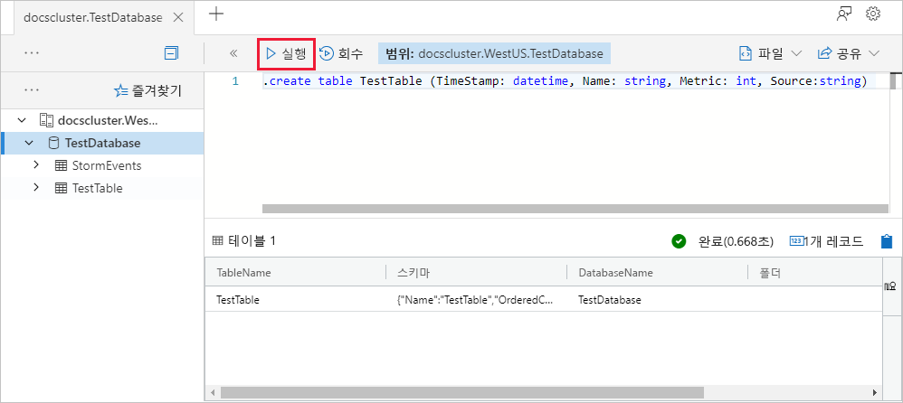

1. 다음 명령을 창에 복사하고, **실행**을 선택하여 들어오는 JSON 데이터를 테이블(TestTable)의 열 이름과 데이터 형식에 매핑합니다.

    ```Kusto
    .create table TestTable ingestion json mapping 'TestMapping' '[{"column":"TimeStamp","path":"$.timeStamp","datatype":"datetime"},{"column":"Name","path":"$.name","datatype":"string"},{"column":"Metric","path":"$.metric","datatype":"int"},{"column":"Source","path":"$.source","datatype":"string"}]'
    ```

## <a name="connect-to-the-event-hub"></a>이벤트 허브에 연결

이제 Azure Data Explorer에서 이벤트 허브에 연결합니다. 이 연결이 설정되면 이벤트 허브로 들어오는 데이터가 이 문서의 앞 부분에서 만든 테스트 테이블로 스트리밍됩니다.

1. 도구 모음에서 **알림**을 선택하여 이벤트 허브 배포가 정상적으로 완료되었는지 확인합니다.

1. 앞에서 만든 클러스터 아래에서 **데이터베이스**, **TestDatabase**를 차례로 선택합니다.

    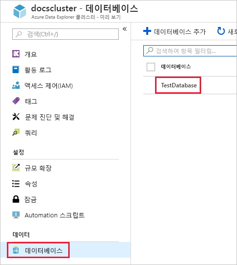

1. **데이터 수집** 및 **데이터 연결 추가**를 선택합니다. 그런 다음, 다음 정보로 양식을 작성합니다. 작업을 마쳤으면 **만들기**를 선택합니다.

    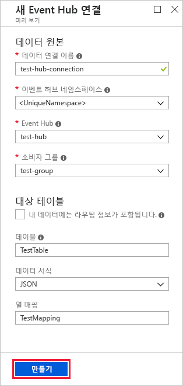

    데이터 원본:

    **설정** | **제안 값** | **필드 설명**
    |---|---|---|
    | 데이터 연결 이름 | *test-hub-connection* | Azure 데이터 탐색기에서 만들 연결의 이름입니다.|
    | 이벤트 허브 네임스페이스 | 고유한 네임스페이스 이름 | 앞에서 선택한 네임스페이스를 식별하는 이름입니다. |
    | 이벤트 허브 | *test-hub* | 앞에서 만든 이벤트 허브입니다. |
    | 소비자 그룹 | *test-group* | 앞에서 만든 이벤트 허브에 정의된 소비자 그룹입니다. |
    | | |

    대상 테이블:

    수집된 데이터를 라우팅하기 위한 옵션으로는 *고정* 라우팅과 *동적* 라우팅이라는 두 가지 옵션이 있습니다. 
    이 문서에서는 고정 라우팅을 사용합니다. 이 경우 테이블 이름, 데이터 형식 및 매핑을 직접 지정합니다. 따라서 **내 데이터에 라우팅 정보 포함**을 선택 취소한 상태로 둡니다.

     **설정** | **제안 값** | **필드 설명**
    |---|---|---|
    | 테이블 | *TestTable* | **TestDatabase**에 만든 테이블입니다. |
    | 데이터 형식 | *JSON* | 지원되는 형식은 Avro, CSV, JSON, MULTILINE JSON, PSV, SOH, SCSV, TSV 및 TXT입니다. |
    | 열 매핑 | *TestMapping* | **TestDatabase**에서 생성된 것으로, 들어오는 JSON 데이터를 **TestTable**의 열 이름 및 데이터 형식에 매핑. JSON, MULTILINE JSON 또는 AVRO 및 다른 형식에 대한 선택 사항이 필요합니다.|
    | | |

    > [!NOTE]
    > 동적 라우팅을 사용하려면 **라우팅 정보를 포함하는 내 데이터**를 선택합니다. [샘플 앱](https://github.com/Azure-Samples/event-hubs-dotnet-ingest) 주석에서 볼 수 있듯이 데이터에는 필수 라우팅 정보가 포함됩니다. 정적 및 동적 속성을 모두 설정하는 경우 동적 속성은 정적 속성을 재정의합니다. 

## <a name="copy-the-connection-string"></a>연결 문자열 복사

필수 구성 요소에 나열된 [샘플 앱](https://github.com/Azure-Samples/event-hubs-dotnet-ingest)을 실행할 때는 이벤트 허브 네임스페이스의 연결 문자열이 필요합니다.

1. 앞에서 만든 이벤트 허브 네임스페이스 아래에서 **공유 액세스 정책**, **RootManageSharedAccessKey**를 차례로 선택합니다.

    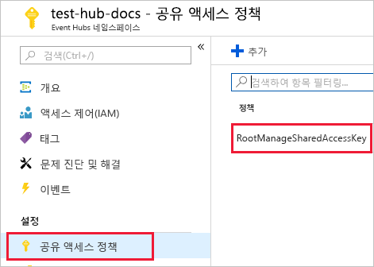

1. **연결 문자열 - 기본 키**를 복사합니다. 다음 섹션에 붙여넣습니다.

    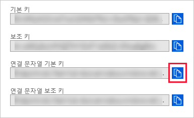

## <a name="generate-sample-data"></a>샘플 데이터 생성

다운로드한 [샘플 앱](https://github.com/Azure-Samples/event-hubs-dotnet-ingest)을 사용하여 데이터를 생성합니다.

1. Visual Studio에서 샘플 앱 솔루션을 엽니다.

1. *program.cs* 파일에서 `connectionString` 상수를 이벤트 허브 네임스페이스에서 복사한 연결 문자열로 업데이트합니다.

    ```csharp
    const string eventHubName = "test-hub";
    // Copy the connection string ("Connection string-primary key") from your Event Hub namespace.
    const string connectionString = @"<YourConnectionString>";
    ```

1. 앱을 빌드 및 실행합니다. 앱이 이벤트 허브로 메시지를 전송하고 10초마다 상태를 출력합니다.

1. 앱이 메시지를 몇 개 전송하고 나면 다음 단계(이벤트 허브와 테스트 테이블로의 데이터 흐름 검토)를 진행합니다.

## <a name="review-the-data-flow"></a>데이터 흐름 검토

이제 앱 생성 데이터를 사용하여 이벤트 허브에서 클러스터의 테이블로의 데이터 흐름을 볼 수 있습니다.

1. 앱이 실행되는 동안에는 Azure Portal의 이벤트 허브 아래에 활동량이 급증하는 것으로 표시됩니다.

    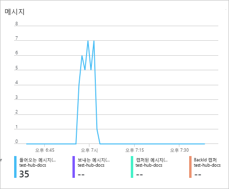

1. 현재까지 데이터베이스로 전송된 메시지의 수를 확인하려면 테스트 데이터베이스에서 다음 쿼리를 실행합니다.

    ```Kusto
    TestTable
    | count
    ```

1. 메시지 내용을 확인하려면 다음 쿼리를 실행합니다.

    ```Kusto
    TestTable
    ```

    결과 세트는 다음과 같이 표시됩니다.

    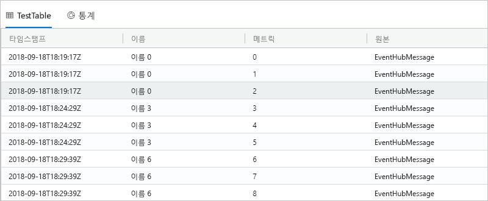

    > [!NOTE]
    > Azure Data Explorer에는 데이터 수집을 위한 집계(일괄 처리) 정책이 있으며, 이는 수집 프로세스를 최적화하도록 설계되었습니다. 정책이 5분으로 구성되어 있으므로 대기 시간이 발생할 수 있습니다.

## <a name="clean-up-resources"></a>리소스 정리

이벤트 허브를 다시 사용하지 않으려는 경우비용이 발생하지 않도록 **test-hub-rg**를 정리합니다.

1. Azure Portal에서 맨 왼쪽에 있는 **리소스 그룹**을 선택한 다음, 만든 리소스 그룹을 선택합니다.  

    왼쪽 메뉴가 접혀 있으면 ![[확장] 단추를](media/ingest-data-event-hub/expand.png) 클릭하여 펼칩니다.

   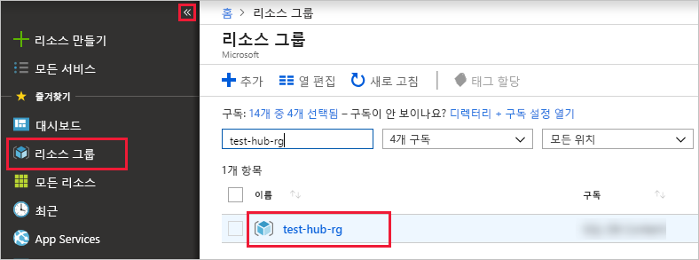

1. **test-resource-group** 아래에서 **리소스 그룹 삭제**를 선택합니다.

1. 새 창에서 삭제할 리소스 그룹의 이름(*test-hub-rg*)을 입력하고 **삭제**를 선택합니다.

## <a name="next-steps"></a>다음 단계

* [Azure 데이터 탐색기에서 데이터를 쿼리 합니다.](web-query-data.md)
