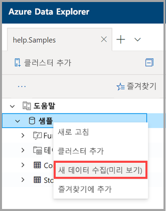

# 단일 클릭 수집을 사용 하 여 데이터를 Azure 데이터 탐색기 수집 합니다.

이 문서에서는 단일 클릭 수집을 사용 하 여 저장소에서 Azure 데이터 탐색기로 json 또는 csv 형식의 새 테이블을 신속 하 게 수집 하는 방법을 보여 줍니다. 데이터가 수집 되 면 테이블을 편집 하 고 웹 UI를 사용 하 여 쿼리를 실행할 수 있습니다.

## 필수 조건

* Azure 구독이 아직 없는 경우 시작하기 전에 [Azure 체험 계정](https://azure.microsoft.com/free/)을 만듭니다.
* [애플리케이션](https://dataexplorer.azure.com/)에 로그인합니다.
* [Azure 데이터 탐색기 클러스터 및 데이터베이스](create-cluster-database-portal.md) 만들기
* [웹 UI](https://dataexplorer.azure.com/) 에 로그인 하 고 [클러스터에 연결을 추가](/azure/data-explorer/web-query-data#add-clusters) 합니다.
* Azure Storage의 데이터 원본입니다.

## 새 데이터 수집

1. 웹 UI의 왼쪽 메뉴에서 *데이터베이스* 또는 *테이블* 행을 마우스 오른쪽 단추로 클릭 하 고 **새 데이터 수집 (미리 보기)** 을 선택 합니다.

       
 
1. **새 데이터 수집 (미리 보기)** 창의 **원본** 탭에서 **프로젝트 세부 정보**를 완료 합니다.

    * **테이블**: 드롭다운에서 기존 테이블 이름을 선택 하거나 **새로 만들기** 를 선택 하 여 새 테이블을 만듭니다.
    * 저장소 또는 **파일**에서 수집 **유형** > **를** 선택 합니다.
        * **저장소에서**를 선택한 경우 저장소 **에 대 한 링크** 를 입력 하 여 저장소에 url을 추가 합니다. 개인 저장소 계정에는 [BLOB SAS URL](/azure/vs-azure-tools-storage-explorer-blobs#get-the-sas-for-a-blob-container) 을 사용 합니다. 
        * **파일에서**를 선택한 경우 **찾아보기** 를 선택 하 고 파일을 상자로 끌어 놓습니다.
    * 테이블 열 구성을 보고 편집 하려면 **스키마 편집** 을 선택 합니다.
 
     

    > [!TIP]
    > *테이블* 행에 **새 데이터 수집 (미리 보기)** 을 선택 하면 **프로젝트 세부 정보**에 선택한 테이블 이름이 표시 됩니다.

1. 기존 테이블을 선택한 경우 원본 데이터 열을 대상 테이블 열에 매핑하기 위해 **맵 열** 창이 열립니다. 
    * **생략 열** 을 사용 하 여 테이블에서 대상 열을 제거 합니다. 
    * **새 열** 을 사용 하 여 테이블에 새 열을 추가 합니다. 

    

1. **스키마** 탭에서 다음을 수행 합니다.

    * 압축 안 함 드롭다운 > 압축 되지 **않음** 또는 **GZip**에서 **압축 유형** 을 선택 합니다.
    * 드롭다운에서 **JSON**, **CSV**, **TSV**, **SCSV**, **SOHSV**, **tsve**또는 **psv**> **데이터 형식을** 선택 합니다. 
        * **Json** 형식을 선택 하는 경우 **json 수준**: 1-10를 선택 합니다. 수준은 테이블 열 데이터 표현에 영향을 줍니다. 
        * JSON 이외의 형식을 선택 하는 경우 파일의 머리글 행을 무시 하려면 **열 이름 포함** 확인란을 선택 합니다.    
    * **매핑 이름은** 자동으로 설정 되지만 편집할 수 있습니다.
    * 기존 테이블을 선택한 경우 **지도 열** 단추를 선택 하 여 **맵 열** 창을 열 수 있습니다.

    

1. **편집기**에서 오른쪽의 **V** 를 선택 하 여 편집기를 엽니다. 편집기에서 사용자 입력 으로부터 생성 된 자동 쿼리를 보고 복사할 수 있습니다. 

1.  테이블: 
    * 새 열 머리글을 마우스 오른쪽 단추로 클릭 하 여 **데이터 형식 변경**, **열 이름 바꾸기**, **열 삭제**, **오름차순 정렬**또는 **내림차순 정렬**을 클릭 합니다. 기존 열에는 데이터 정렬만 사용할 수 있습니다. 
    * 편집할 새 열 이름을 두 번 클릭 합니다.

1. 수집 **시작** 을 선택 하 여 테이블 만들기, 매핑 만들기 및 데이터 수집을 선택 합니다.

     
 
## 쿼리 데이터

1. 데이터 수집 **완료** 창에서 데이터 수집이 성공적으로 완료 되 면 세 단계 모두 녹색 표시 표시로 표시 됩니다. 
 
    

1. 쿼리를 열려면 **V** 를 선택 합니다. 웹 UI에 복사 하 여 쿼리를 편집 합니다.

1. 오른쪽의 메뉴에는 **빠른 쿼리** 및 **도구가**포함 되어 있습니다. 

    * **빠른 쿼리** 는 예제 쿼리를 사용 하는 웹 UI에 대 한 링크를 포함 합니다.
    * **도구** 에는 관련 `.drop` 명령을 실행 하 여 문제를 해결할 수 있게 해 주는 **Drop 명령이** 포함 된 웹 UI에 대 한 링크가 포함 되어 있습니다.

    > [!TIP]
    > `.drop` 명령을 사용 하 여 데이터가 손실 될 수 있습니다. 신중 하 게 사용 합니다.

## 다음 단계

* [Azure 데이터 탐색기 웹 UI에서 데이터 쿼리](web-query-data.md)
* [Kusto 쿼리 언어를 사용 하 여 Azure 데이터 탐색기에 대 한 쿼리 작성](write-queries.md)
