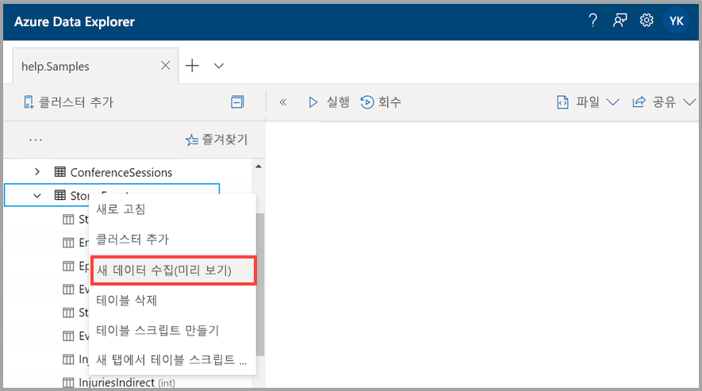
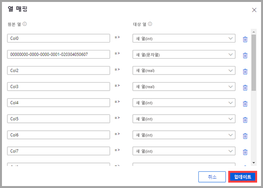
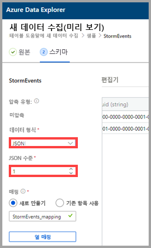
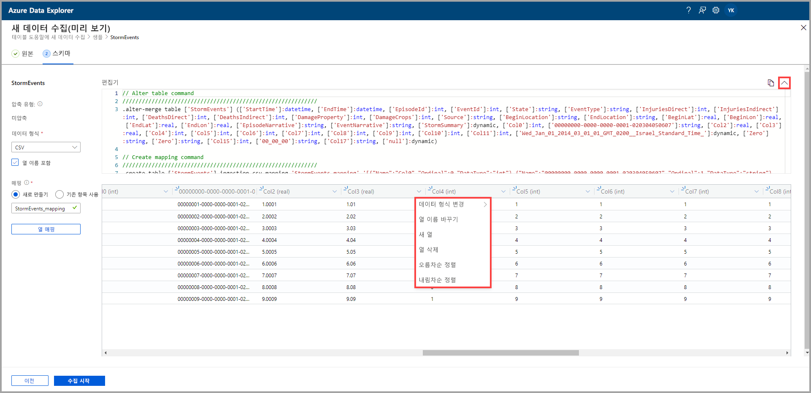
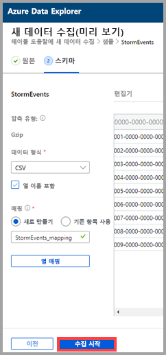
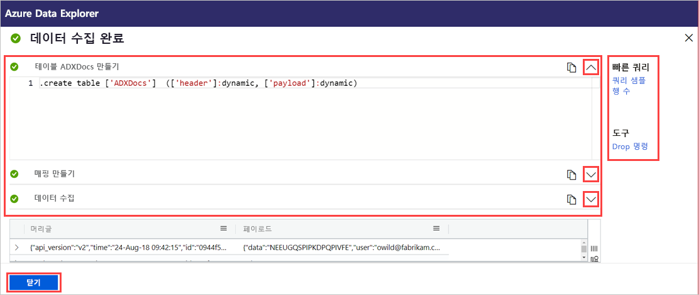

# 원클릭 수집을 사용하여 Azure Data Explorer의 기존 테이블에 데이터 수집

원클릭 수집을 사용하면 JSON, CSV 및 기타 형식의 데이터를 신속하게 테이블로 수집할 수 있습니다. Azure Data Explorer 웹 UI를 사용하여 스토리지, 로컬 파일 또는 컨테이너의 데이터를 수집할 수 있습니다. 

이 문서에서는 직관적인 원클릭 마법사를 사용하여 파일의 JSON 데이터를 기존 테이블에 수집하는 방법을 설명합니다. 그런 다음, Azure Data Explorer 웹 UI를 사용하여 테이블을 편집하고 쿼리를 실행할 수 있습니다.

원클릭 수집은 데이터를 처음으로 수집하거나 데이터의 스키마가 익숙하지 않은 경우에 특히 유용합니다. 

원클릭 수집의 개요와 필수 조건 목록은 [원클릭 수집](ingest-data-one-click.md)을 참조하세요.
Azure Data Explorer의 새 테이블에 데이터를 수집하는 방법에 대한 자세한 내용은 [새 테이블로 원클릭 수집](one-click-ingestion-new-table.md)을 참조하세요.

## 새 데이터 수집

1. 웹 UI의 왼쪽 메뉴에서 *데이터베이스* 또는 *테이블*을 마우스 오른쪽 단추로 클릭하고 **새 데이터 수집(미리 보기)** 을 선택합니다.

       
 
1. **새 데이터 수집(미리 보기)** 창에서 **원본** 탭이 자동으로 선택됩니다.

1. **테이블** 필드가 자동으로 채워지지 않으면 드롭다운 메뉴에서 기존 테이블 이름을 선택합니다.
    > [!TIP]
    > *테이블* 행에서 **새 데이터 수집(미리 보기)** 을 선택하면 선택한 테이블 이름이 **프로젝트 세부 정보**에 표시됩니다.

[!INCLUDE [data-explorer-one-click-ingestion-types](../../includes/data-explorer-one-click-ingestion-types.md)]
    
**스키마 편집**을 선택하여 테이블 열 구성을 살펴보고 편집합니다.

## 스키마 편집

1. 원본 데이터 열을 대상 테이블 열에 매핑할 수 있는 **열 매핑** 대화 상자가 열립니다. 
    * **원본 열** 필드에 **대상 열**로 매핑할 열 이름을 입력합니다.
    * 매핑을 삭제하려면 휴지통 아이콘을 선택합니다.

    

1. **업데이트**를 선택합니다.
1. **스키마** 탭에서 다음을 수행합니다.
    1. **압축 형식**을 선택한 다음, **미압축** 또는 **GZip**을 선택합니다.

        [!INCLUDE [data-explorer-one-click-ingestion-edit-schema](../../includes/data-explorer-one-click-ingestion-edit-schema.md)]
        
    1. **JSON**을 선택하는 경우 **JSON 수준**을 1~10 사이에서 선택해야 합니다. 이 수준은 테이블 열 데이터 표현에 영향을 줍니다.

    

    * JSON 이외의 형식을 선택하는 경우 **열 이름 포함** 확인란을 선택하여 파일의 제목 행을 무시할 수 있습니다.
        
    ![[열 이름 포함] 선택](media/one-click-ingestion-existing-table/non-json-format.png)

    > [!Note]
    > 테이블 형식은 Azure Data Explorer 테이블의 한 열에만 열 데이터를 수집할 수 있습니다. 

    * 새 매핑은 자동으로 설정되지만, 기존 매핑을 사용하도록 변경할 수 있습니다. 
    * **열 매핑**을 선택하여 **열 매핑** 창을 열 수 있습니다.

## 쿼리 복사 및 붙여넣기

1. **편집기** 창 위에서 **v** 단추를 선택하여 편집기를 엽니다. 편집기에서는 사용자 입력으로부터 생성된 자동 명령을 살펴보고 복사할 수 있습니다. 
1. 테이블에서 다음을 수행합니다. 
    * 새 열 헤더를 선택하여 **새 열**, **열 삭제**, **오름차순 정렬** 또는 **내림차순 정렬**을 추가합니다. 기존 열에서는 데이터 정렬만 사용할 수 있습니다.

    > [!Note]
    > * 기존 테이블의 이름 및 데이터 형식을 업데이트할 수 없습니다.
    > * 드롭 명령은 이 수집 흐름(새 익스텐트 및 열)에서 변경된 내용만 되돌립니다. 그 외에는 삭제되지 않습니다.

 

## 수집 시작

**수집 시작**을 선택하여 테이블 및 매핑을 만들고 데이터 수집을 시작합니다.

## 데이터 수집 완료

데이터 수집이 성공적으로 완료되면 **데이터 수집 완료** 창에서 세 단계 모두 녹색 확인 표시가 나타납니다.
 

[!INCLUDE [data-explorer-one-click-ingestion-query-data](../../includes/data-explorer-one-click-ingestion-query-data.md)]

## 다음 단계

* [Azure Data Explorer 웹 UI에서 데이터 쿼리](/azure/data-explorer/web-query-data)
* [Kusto 쿼리 언어를 사용하여 Azure Data Explorer에 대한 쿼리 작성](/azure/data-explorer/write-queries)
