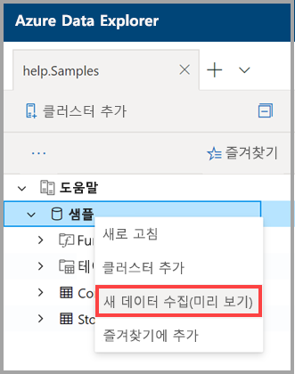
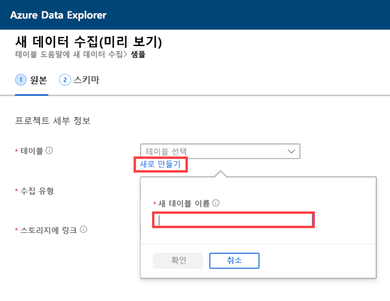
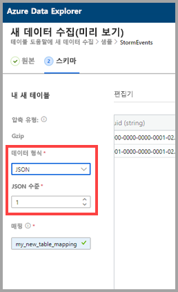
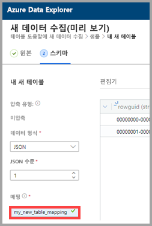
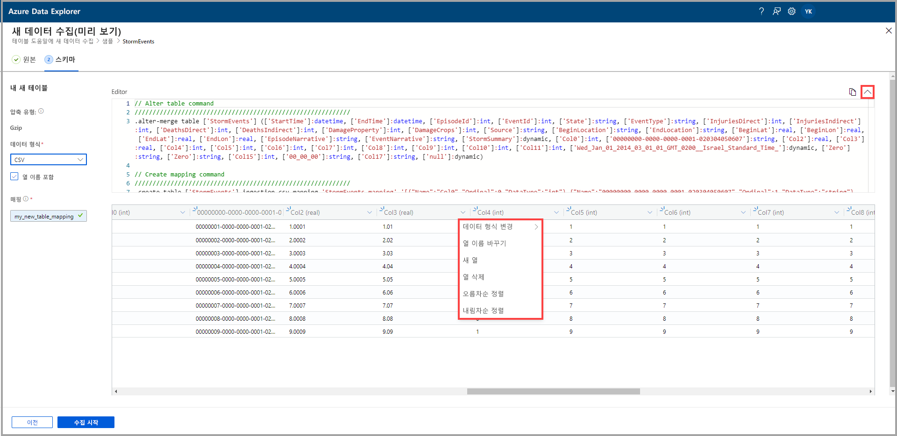
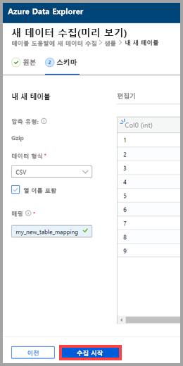
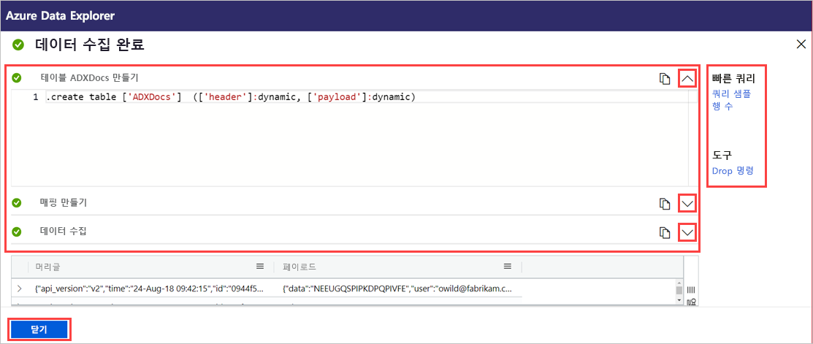

# 원클릭 수집을 사용하여 Azure Data Explorer의 새 테이블에 데이터 수집

원클릭 수집을 사용하면 JSON, CSV 및 기타 형식의 데이터를 신속하게 테이블로 수집할 수 있습니다. Azure Data Explorer 웹 UI를 사용하여 스토리지, 로컬 파일 또는 컨테이너의 데이터를 수집할 수 있습니다. 

이 문서에서는 직관적인 원클릭 마법사를 사용하여 컨테이너의 CSV 데이터를 새 테이블에 수집하는 방법을 설명합니다. 그런 다음, Azure Data Explorer 웹 UI를 사용하여 테이블을 편집하고 쿼리를 실행할 수 있습니다. 원본 데이터가 업데이트될 때 자동으로 데이터를 테이블에 수집하도록 연속 수집을 설정할 수도 있습니다.

원클릭 수집은 데이터를 처음으로 수집하거나 데이터의 스키마가 익숙하지 않은 경우에 특히 유용합니다. 

원클릭 수집의 개요와 필수 조건 목록은 [원클릭 수집](ingest-data-one-click.md)을 참조하세요.
Azure Data Explorer의 기존 테이블에 데이터를 수집하는 방법에 대한 자세한 내용은 [기존 테이블로 원클릭 수집](one-click-ingestion-existing-table.md)을 참조하세요.

## 새 데이터 수집

1. 웹 UI의 왼쪽 메뉴에서 *데이터베이스*를 마우스 오른쪽 단추로 클릭하고 **새 데이터 수집(미리 보기)** 을 선택합니다.

       
 
1. **새 데이터 수집(미리 보기)** 창에서 **원본** 탭이 자동으로 선택됩니다. 

1. **새 테이블 만들기**를 선택하고 새 테이블의 이름을 입력합니다. 영숫자, 하이픈 및 밑줄을 사용할 수 있습니다. 특수 문자는 지원되지 않습니다.

 

[!INCLUDE [data-explorer-one-click-ingestion-types](../../includes/data-explorer-one-click-ingestion-types.md)]

**스키마 편집**을 선택하여 테이블 열 구성을 살펴보고 편집합니다. 시스템에서 BLOB 중 하나를 임의로 선택합니다. 그러면 해당 BLOB에 따라 스키마가 생성됩니다. 원본 이름을 살펴보면 원본의 압축 여부를 서비스가 자동으로 식별합니다.

## 스키마 편집

1. **스키마** 탭에서 다음을 수행합니다.

    1. **데이터 형식**을 선택합니다.

        [!INCLUDE [data-explorer-one-click-ingestion-edit-schema](../../includes/data-explorer-one-click-ingestion-edit-schema.md)]

    1. **JSON**을 선택하는 경우 **JSON 수준**을 1~10 사이에서 선택해야 합니다. 이 수준은 테이블 열 데이터 표현에 영향을 줍니다. 

    

    * JSON 이외의 형식을 선택하는 경우 **열 이름 포함** 확인란을 선택하여 파일의 제목 행을 무시할 수 있습니다.

        ![[열 이름 포함] 선택](media/one-click-ingestion-new-table/non-json-format.png)
        
1. **매핑 이름** 필드에 매핑 이름을 입력합니다. 영숫자 및 밑줄을 사용할 수 있습니다. 공백, 특수 문자 및 하이픈은 지원되지 않습니다.
    
    

## 쿼리 복사 및 붙여넣기

1. **편집기** 창 위에서 **v** 단추를 선택하여 편집기를 엽니다. 편집기에서는 사용자 입력으로부터 생성된 자동 쿼리를 살펴보고 복사할 수 있습니다. 
1. 테이블에서 다음을 수행합니다. 
    * 편집할 새 열 이름을 두 번 클릭합니다.
    * 새 열 헤더를 선택하고 다음 중 하나를 수행합니다.
    
|작업         |Description                                  |
|-----------------|-------------------------------------------|
|데이터 형식 변경 |데이터 형식을 서비스에서 자동으로 선택한 형식에서 [지원되는 다른 데이터 형식](#edit-the-schema) 중 하나로 변경합니다.|
|열 이름 바꾸기    |열 이름 변경 |
|새 열       |새 열 추가|
|열 삭제    |선택한 열 삭제|
|오름차순 정렬   |선택한 열을 기준으로 테이블을 오름차순으로 정렬(기존 열만 해당)|
|내림차순 정렬  |선택한 열을 기준으로 테이블을 내림차순으로 정렬(기존 열만 해당) |

> [!Note]
> 테이블 형식의 경우 각 열을 Azure Data Explorer의 한 열에 수집할 수 있습니다.
> 다른 JSON 수준에서 새 열을 만들 수 있습니다.

 

## 수집 시작

**수집 시작**을 선택하여 테이블 및 매핑을 만들고 데이터 수집을 시작합니다.

## 데이터 수집 완료

데이터 수집이 성공적으로 완료되면 **데이터 수집 완료** 창에서 세 단계 모두 녹색 확인 표시가 나타납니다.
 

[!INCLUDE [data-explorer-one-click-ingestion-query-data](../../includes/data-explorer-one-click-ingestion-query-data.md)]

**연속 수집**

연속 수집을 사용하면 원본 컨테이너를 수신 대기하는 이벤트 그리드를 만들 수 있습니다. 미리 정의된 매개 변수 조건(접두사, 접미사 등)을 충족하는 모든 새 BLOB이 자동으로 대상 테이블에 수집됩니다.

> [!Note]
> 연속 수집은 컨테이너에서 수집하는 경우에만 관련이 있습니다.

1. **연속 수집**을 선택하여 Azure Portal을 엽니다. 데이터 연결 페이지가 열립니다. 이벤트 그리드 데이터 커넥터가 열리고 원본 및 대상 매개 변수(원본 컨테이너, 테이블 및 매핑)가 이미 입력되어 있습니다.

1. **만들기**를 선택하여 해당 컨테이너의 변경 내용을 수신 대기하는 데이터 연결을 만듭니다. 

## 다음 단계

* [Azure Data Explorer 웹 UI에서 데이터 쿼리](/azure/data-explorer/web-query-data)
* [Kusto 쿼리 언어를 사용하여 Azure Data Explorer에 대한 쿼리 작성](/azure/data-explorer/write-queries)
